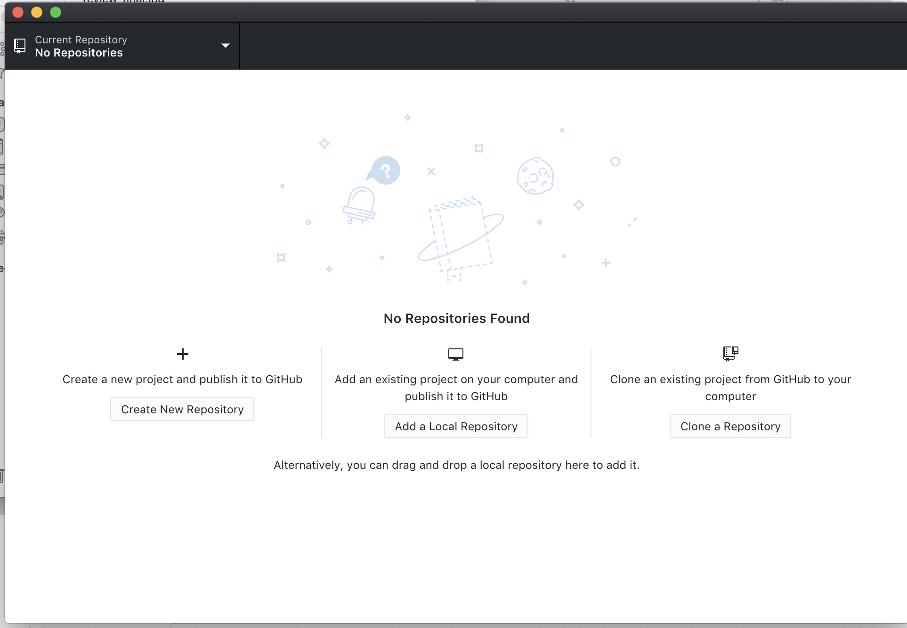
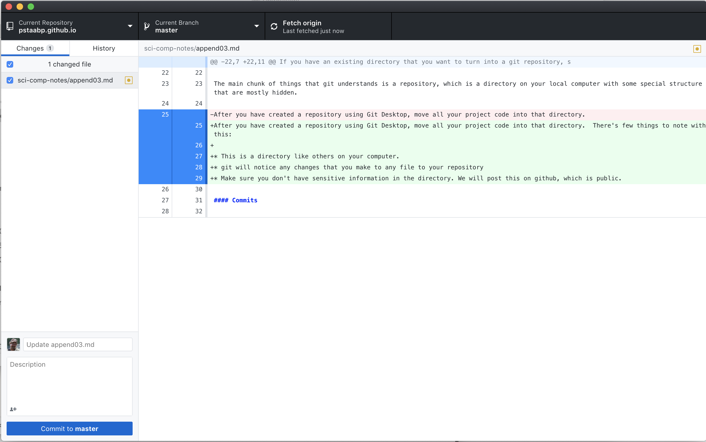

# Appendix 3: Working with Github

As mentioned earlier, I would recommend using Github to collaborate on your project.  This briefly discusses how to use this effectively.

### Software

you will need some software that speaks git.  There are command line utilities that will handle all of these things, but there are also a number of GUI programs will do this and [here](https://git-scm.com/downloads) is a page with links that have a number of listings.  They mostly all do similar thing. I will discuss [Git Desktop](https://desktop.github.com) here, so go grab a copy and open it.

Also, if you don't have a [github](https://github.com) account, go sign up.

Open Git Desktop and you should sign into your git account. You should see:

You should select the first option. Then select any directory to create it. that contains your project, give it a name (no spaces!) and a description.   which will create a new directory under the repository name in the selected directory.

If you have an existing directory that you want to turn into a git repository, select the first option.  

#### Repositories

The main chunk of things that git understands is a repository, which is a directory on your local computer with some special structure that are mostly hidden.

After you have created a repository using Git Desktop, move all your project code into that directory.  There's few things to note with this:

* This is a directory like others on your computer.
* git will notice any changes that you make to any file to your repository
* Make sure you don't have sensitive information in the directory. We will post this on github, which is public.  

#### Commits

Once you have reached a point in your code that you want to mark, you will commit the code.  The way you do this with a GUI varies, but here is how it goes in GitHub Desktop.  The following picture shows the repository when something has changed and you want to commit your changes:

### Cloning a respository

To effectively work together on a project using git, one of you will clone the repository of the other.  This is most-easily done at github.  

#### merging branches

### Collaborating with git

We can use git to do collaboration and it keeps revision history.  
