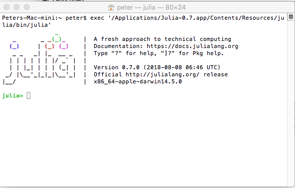
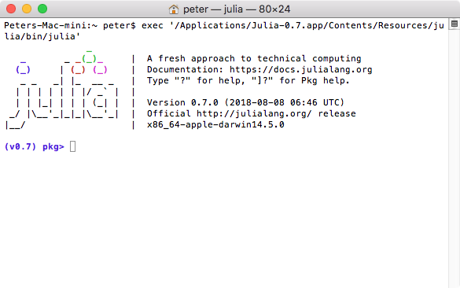

Chapter 8: Packages
========

[Return to all notes](index.html)

A package is an extra set of commands or functions.  For example, the `Primes` package has a few additional commands to help with finding prime numbers.  To load the package, type
```
using Primes
```

Now, there are additional functions.  For example,
```
isprime(17)
```

returns true.  This is a nondeterministic function that determines if a number is true.  The documentation for this can be found by first going to [The Julia Packages Directory]([http://pkg.julialang.org/) and then finding the package name.

The documentation for the Primes package is at  [https://github.com/JuliaMath/Primes.jl](https://github.com/JuliaMath/Primes.jl) and demonstrates 4 commands including `isprime` and `factor` which returns all prime factors (and the order), similar to what we tried to do with the `allfactors` function.


[The Julia Packages Directory]([http://pkg.julialang.org/) lists all of the official packages for Julia.  A few that we have seen or will see:

* IJulia -- provides the browser interface to Julia
* Plots -- A plotting packages
* PyPlot -- A plotting package with an interface like pythons.
* Gadfly -- A relatively simple plotting package.

Later we will learn how to create our own package.


The `Pkg` Manager
------

If you are reading about julia packages and the package manager, please make sure you are looking at the latest document.  The official documentation is found [here](https://docs.julialang.org/en/stable/stdlib/Pkg/).  The rest of this chapter talks about how to use the package manger to (ahem... ) Manage Packages.

First, to get to the manager, open the julia app (either from the commandline or the app that you downloaded).  You will get a terminal window (also called the REPL), that will look similar to



Next, inside this, type `]` and the green `julia>` prompt will turn to a blue `(v0.7) pkg>` prompt that looks like:



and if you have a different julia version, it will show that version number instead.
