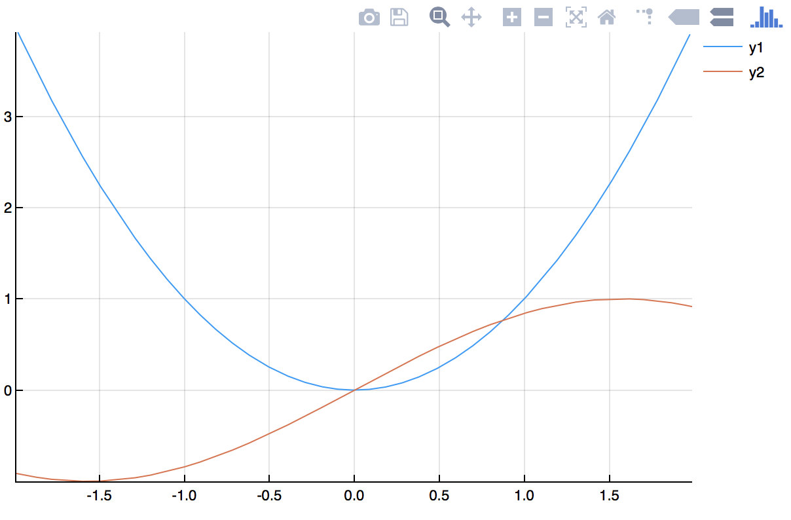
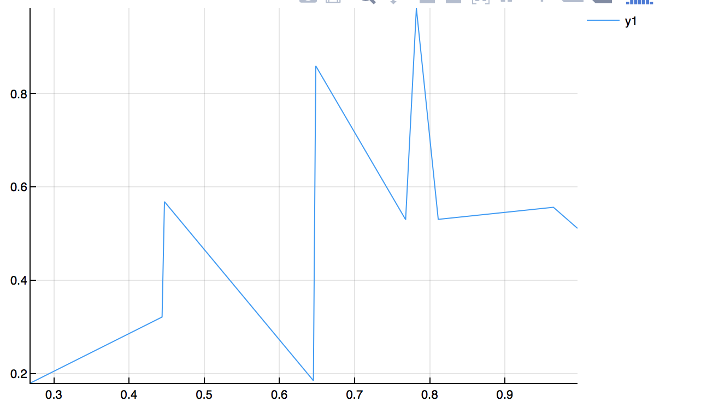
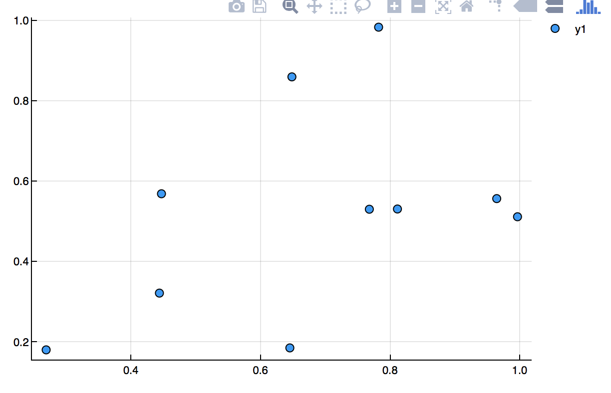

Chapter 11: Plotting Data and Functions
========

[Return to all notes](index.html)

Plotting is crucial to understanding functions and visualizing data.  There are many ways to do some plots using various packages.  We will investigate two in this chapter.  

### The Plots Package

There is a relatively simple, but powerful plotting package called `Plots`
```
Pkg.add("Plots")
```

and there are a few other packages it depends on.  The full documentation is at [the Plots.jl website](http://docs.juliaplots.org/latest/). Recall that once the package is added, to use it type
```
using Plots
```

and then there needs to be a backend that actually does the plotting. For most of this, I will use `GR`, which needs also to be added with `Pkg.add("GR")`.  After this is loaded, type:

```
gr()
```
### Plotting nearly anything

The Plots package tries to unify the syntax for plotting anything.  The basic command for plotting data or functions in 2D is the `plot` command.  The next few examples shows this.

#### Plotting Functions

You can plot a function with Plots with the `plot` command.  For example,
```
plot(x->x^2,-2,2)
```

produces the following plot:


If we want to plot 2 functions on the same axes.

```
plot([x->x^2,sin],-2,2)
```

produces the following:



#### Plotting Data

First, let's start with some random data.  Let
```
x=sort(rand(10))
```

```
y=rand(10)
```

then `plot(x,y)` will produce a scatter plot of the data, like



and note that since these are just random points, you're plot will look different, but the style should be the same.

If we want to connect all of the points with points instead, type
```
plot(x,y,seriestype=:scatter)
```
and the plot will look like:



Or just `scatter(x,y)`

and if you want both, then type
```
plot(x,y,seriestype=[:scatter,:line])
```


## Backends of the Plots package

The `Plots.jl` package actually doesn't do the plotting.  It leaves the details to other packages.  Above, we used the `GR` backend with an exception of the two function plot directly above.  There are a number of backends that you may want to try.  The standard ones are:

* PyPlot (matplotlib): Slow but dependable
* GR: Feature-rich and fast, but new
* Plotly/PlotlyJS: Interactive and good for web
* PGFPlots: Native LaTeX rendering
* PyPlot: a python-based plotting library
* UnicodePlots: Plots to unicode for situations without graphics capabilities.

To switch the backend, you type the backend name with a set of ().  Note: you may be required to install additional packages.  Usually, there is an error with helpful information.  Here's an example:

```
gr()
plot(x->x^2,-2,2)
```

which gives:


and then

```
plotlyjs()
plot(x->x^2,-2,2)
```

results in:


and then

```
pgfplots()
plot(x->x^2,-2,2)
```

results in:


and finally

```
pyplot()
plot(x->x^2,-2,2)
```

results in:


For additional information on the supported backends, visit [the Plots.jl backend documentation](http://docs.juliaplots.org/latest/backends/)


### Changing the attributes of the plot

Let's return back to the function plots above (although this works for point/line plots as well) and change many attributes of the curve.  As an example:
```
plot([x->x^2,sin],-2,2,title="Two Curves",label=["x^2","sin(x)"],xlabel="x",ylabel="y",lw=3)
```

results in


The format is fairly clear for the changing of the attributes.  Note: in this example:

* the `title` changes the title of the plot
* the `label` changes the legend.
* the `xlabel` and `ylabel` changes the axes labels.
* the `lw` is the line weight.  


To avoid duplicating tons of documentation, visit [the Plots.jl page on attributes](http://docs.juliaplots.org/latest/attributes/) to find all of the information to get the plot the way you want.  As always, here's some practice plots.


#### Exercise

* Take the scatterplot above (with the random dots) and change the color of the dots to darkgreen, change the markers to diamonds and the size to fairly large.  
* Try changing the width and style of the lines in a line plot.

## Other plots

### Parametric Plots

To do a parametric plot, like the circle defined by $x(t)=\cos t$, $y(t)=\sin t$), then
```
plot(t->cos(t),t->sin(t),0,2*pi)
```

gives


but notice that this should be a circle, but it looks like an ellipse due to the aspect ratio. If one instead adds the `aspect_ratio=:equal` option, the result is:


### Bar plots

A bar plot can be made with the `bar` command.  For example:

```
bar(1:10,y)
```

results in


### Surface Plots

If we have a function of 2 variables, a surface plot is nice to use.  For example, if we have the function $f(x,y)=0.1e^{x^2+y^2}$ and we want to plot it from -3 to 3 in both directions, if we define
```
f(x,y)=exp(-0.1*(x^2+y^2))
x = y = range(-5, stop = 5, length = 40)
```
and then plot with
```
plot(x,y, f, st = :surface)
```


### Heat maps

Similar to above, we can make a heat map with
```
plot(x,y, f, st=:heatmap)
```

which produces


### Animation

Another nice type of plot under Plots.jl is that of an animation, however you will need to have `ffmpeg` installed on your machine.  If you then do

```
@gif for a in range(0.5,stop=2,length=16)
  plot(t->cos(2t),t->sin(a*t),0,2pi)
end
```

which saves to a gif that the output will describe this results in:


### Other Plots and subplots

This just is the tip of the iceberg for plotting.  Take a look at the [Plots.jl documentation](http://docs.juliaplots.org/latest/) or do some google-foo with the phrase 'Plots.jl' and what you're looking for and good spot for Q&A is [a julialang.org discourse site](https://discourse.julialang.org/c/domain/viz)
