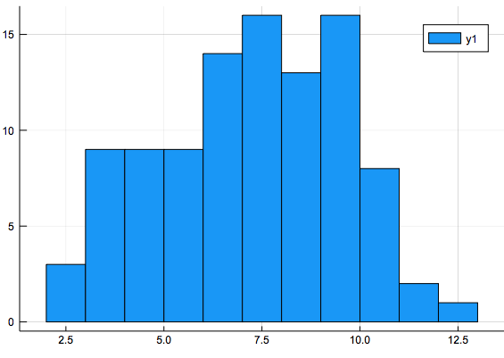

Chapter 12: Random Numbers and Monte Carlo Simulations
=============

[Return to all notes](../index.html)

Monte Carlo Simulations
-------

One big part of scientific computation is the subject of Monte Carlo simulations in which random numbers are used to model some situation.  We'll spend the next part of this course covering this subject.  


Probability
---------

To fully understand how to use random numbers and how Monte Carlo simulations work, we need some basic probability.  When understanding probability there are two types continuous and discrete, which for what we need will come down to using floating point or integers.

###Discrete Probability

We'll first discuss discrete probability.  A _discrete probability distribution_ is a finite set (often will be a subset of integers.)  For example, let's use the set

$$A=\{1,2,3,4,5,6\}$$

and an event, $X$ is subset of these numbers.  For example, let $X=\{1\}$, then the probability that this event occurs in the ratio of the number of elements in each set or
$$P(X)=\frac{N(X)}{N(A)}$$

In this case, $P(X)=1/6$ and that means that the probability that the number 1 comes up is 1/6.  Think about this in the case of rolling a die.  This says that the probability that 1 comes up is 1/6.  

###Continuous Probability

Another type of probability distribution is called a continuous distribution and in this case we'll only consider a type of continuous probability distribution called a uniform distribution.

Let's consider a set $A=\{x \; | \; 0 \leq x \leq 1\}$ or all real numbers between 0 and 1. Events are still subsets of the set $A$, however the probability that events occur is the fraction of the set.  

For example, if $X=\{x \; | \; 1/3 \leq x \leq 1/2\}$, then $P(X)$ is the fraction
$$P(X) = \frac{\frac{1}{2}-\frac{1}{3}}{1-0}=\frac{1}{6}$$

Pseudo Random Number Generator
----------------

[The Wikipedia Pseudo-random Number Generator page](https://en.wikipedia.org/wiki/Pseudorandom_number_generator) gives an overview of the subject and a lot of technical details.  In short, a truly random number on a computer is very difficult to generate and generally not necessary because a pseudorandom number is sufficient.  I also won't try to explain this in general term since you'd need a significant mathematical background.

A pseudo-random number generator is a function that produces a sequence of numbers that act like random numbers.  Let's examine what this means in terms of the discrete probability with set $A=\{1,2,3,4,5,6\}$.  

If a pseudo-random number generator produces a sequence from this set then the sequence should have the following property:

* If the event $X=\{i\}$ for any $i$ between 1 and 6, then $P(X)\approx 1/6$.  And by approximately, as the sequence gets larger, the approximation becomes closer to 1/6.  

Is this enough?  No, the sequence
$$\{1,2,3,4,5,6,1,2,3,4,5,6,\ldots\}$$

satisfies the above property, but I don't think anyone would consider this random.  Another property would be:

* If we know the sequence $\{a_1,a_2,a_3,\ldots,a_n\}$ then we can't predict the next number $a_{n+1}$.  

This is obviously violated in the sequence above.  

A little more technical definition of a sequence of pseudo-random numbers Let $(a_1,a_2,a_3, \ldots)$ be a random sequence.  Typically we mean the following properties need to hold:

1. any number in the range 1 to 6 is equally likely to occur.
2. Take N random numbers and let $s_n$ be the number of times the number $n$ occurs.  	The fraction $s_n/N$ should go to 1/6 in the limit as $n\rightarrow \infty$.
3. Knowing the sequence $s_1, s_2, \ldots, s_k$ does not allow us to predict $s_{k+1}$

If instead we use floating point numbers, there are a few different properties.  Assume that the floating point number is in the range $0 \lt x \lt 1$.  Then the  sequence   $(a_1,a_2,a_3, \ldots)$ is random if

3. Let $s_{[c,d]}(a_1,a_2,a_3, \ldots)$ be the total of the numbers that satisfy $c \lt a_k \lt d$.  Then as the number of random numbers approach infinity $s_{[c,d]}=d-c$


Using Julia to simulate the rolling of a die
------

First, the main commands that are built-in to Julia are listed in the [Julia Manual for Random Numbers](http://docs.julialang.org/en/release-0.5/stdlib/base/?highlight=findfirst#random-numbers).  We can generate 100 random numbers between 1 and 6 using

```
S=rand(1:6,100)
```

and notice that if you rerun the command, you'll get a different sequence of random numbers.  We can check that this is doing what we expect by checking the probability that we get a 1 (or any other number).

To check the count of the number 1 that appears, try

```
count(a->a==1,S)
```

###Exercise

Convert this to a probability.  Is it close to what you expect? Try changing the number of random numbers used to larger numbers.  Does your answer get closer to what you expect?  


Floating Point random numbers
-------

Let's look a floating point random numbers between 0 and 1.  To generate a sequence (array) of such numbers, type
```
S=rand(100)
```

and we can check the number of values less than 0.1 with the command:
```
count(a->a<0.1,S)
```

and if we want the number of values between 0.4 and 0.7 then type
```
count(a->0.4<a<0.7,S)
```

###Exercise

Change the number of random numbers used to much larger set and return the above commands.  What are the results?  Is this what you expect?

How to do find the fraction of number that are less that 0.25 and greater than 0.75?

The `mapslices` commands
------

Below we will encounter another nice function that we can use with arrays.  If we have the following array:
```
A = [1 2 3; 4 5 6; 7 8 9]
```

and we wish to sum the rows.  For any given row, this isn't difficult.  If we want to do all of the rows and return a 1D array (vector), we can use the `mapslices` function.   See [the julia documentatation on mapslices](http://docs.julialang.org/en/release-0.5/stdlib/arrays/#Base.mapslices).

```
mapslices(sum,A; dims = [2])
```

returns the column vector `[6,15,24]` which are the row sums and
```
mapslices(sum,A; dims = [1])
```

returns the row vector `[12,15,18]` or the column sums.  

### Exercise

For the matrix above, find the result if you multiply the rows together.  Do the same for the columns.  


Other Examples
-------

### Rolling 2 dice

How do we handle the rolling of two dice?  Here's an array with each row having 2 dice.
```
S=rand(1:6,100,2)
```

and then to find the sum of the dice:
```
dicesum = mapslices(sum,S;dims=[2])
```

which sums along the rows.  This is  100 rolls of 2 dice with the sum recorded.  First, to get an idea of the distribution of the dice sums, let's plot the results using `Plots`.  So first, load it in
```
using Plots
gr()
```

or use your favorite backend.

and then to plot the sum
```
histogram(dicesum,nbins=11)
```

where `nbins` is the number of bins and in this case, since it runs from 2 to 12, there's a total of 11.

generates the following plot:




We could find the number of 2's 3's, etc. using the `mapslices` function as above, however there is a nice way to do this use the `StatsBase` package.  You may need to add the package and then load it with
```
using StatsBase
```

and then the `counts` function ( [Read the online documentation](http://juliastats.github.io/StatsBase.jl/latest/counts.html#StatsBase.counts)) can be used:

```
counts(dicesum,2:12)
```

returns a vector of how many of the dice sum fall into each number.  

###Exercise

Change the code above to use 1000 dice rolls. Estimate the probability that you

* roll a 7.   
* roll a 10 or greater.   
* roll an even number.

Plot a the histogram using 1000 dice rolls.  

Calculating $\pi$ using pseudo random numbers
-----------------

* [Buffon's Needle Experiment (18th C.)](https://en.wikipedia.org/wiki/Buffon%27s_needle)
* Circle in the Square.  

	Consider the square $\{ (x,y)\; | \; 0\leq x\leq 1, 0 \leq y \leq 1\}$ and the quarter circle that falls within $x^{2}+y^{2} \leq 1$.  The area within the circle is the fraction of the cirle in the square or $\pi/4$.

	We can use this to estimate a value of $\pi$.  

	1. Randomly choose points $x$ and $y$ in the range [0,1].  
	2. Count all points that fall within the circle.
	3. Find the fraction of the points in the circle.
	4. Since this fraction should be $\pi/4$, multiply by 4 to estimate $\pi$.


	This can be done in julia using
	1. `S1=rand(100,2)`
	2. `S2 = mapslices(x->x[1]^2+x[2]^2,S1; dims=[2])`
	3. `S3 = count(a->a<1,S2)`
	3. `fr=S2/100`
	4. `est=4*fr`

	or combine all of these into one command:

	```
	4*count(a->a<1,mapslices(x->x[1]^2+x[2]^2,rand(100,2); dims=[2]))
	```

### Exercises

* Write a function that take a positive integer $n$, in and performs the approximate-$\pi$ calculation described above using $n$ points.  It should return the approximate value of $\pi$.

* Test it will high values of $n$ and time it.

* for $N=10^5$, $N=10^6$ and $N=10^7$ find the relative error of the estimate using your function and using the built-in value `pi`. 
