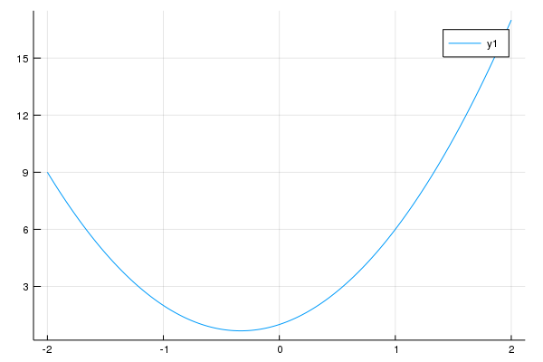
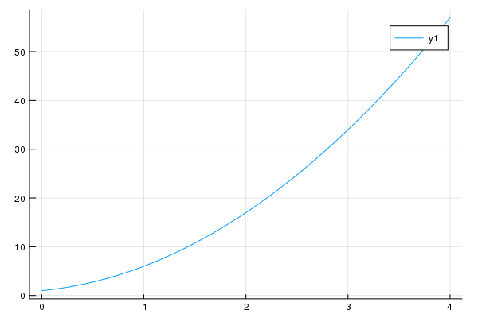
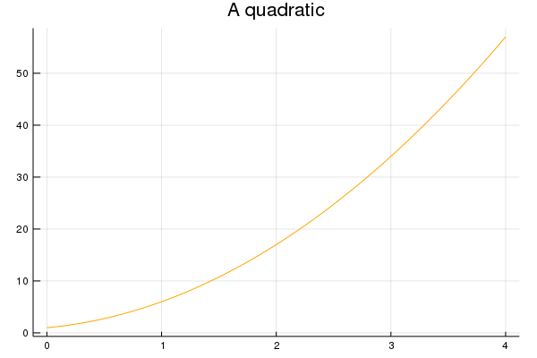
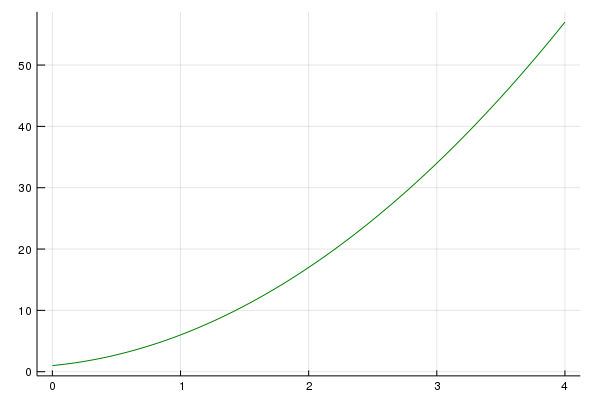

Chapter 13: Creating New Data Types in Julia
=====

[Return to all notes](../index.html)


We will start to look at playing cards (poker) probabilities below.  Before that, let's look at a different datatype in Julia that allows us to store more that one variable together.  This is often called a composite type or a struct (from C) and similar to an object however you can't have a function as a member of the type.

###Card datatype

For our playing card example, a card has a rank (1 to 13 corresponding to Ace, 2, through 10, J, Q, K) and a suit (1 to 4 corresponding to the suits  "spades", "diamonds", "hearts", "clubs"), which we define

```
ranks = ["A","2","3","4","5","6","7","8","9","T","J","Q","K"];
suits = ["\u2660","\u2661","\u2662","\u2663"]
```

where the suits are the unicode characters for the suits.   See [the julia documentation on unicode](http://docs.julialang.org/en/latest/manual/unicode-input/).

We can define this using a Julia [composite type.](http://docs.julialang.org/en/latest/manual/types/#composite-types).

```
mutable struct Card
    rank::Integer
    suit::Integer
end
```

and if we type
```
c = Card(3,2)
```

this will create a card of rank 3 and suit 2 (spades). To access the fields of the type, we use dot notation.  For example `c.rank` will return 3 and `c.suit` will return 2.

The *mutable* keyword in front of the `struct` allows the struct to be altered later.  Generally, this is not desireable, but while testing a struct, this is the right way to go and often after testing is done, one can remove that.

Although it's not very interesting to have the card `c` just give the rank and suit, so we will make the output much more interesting.  To do this we will define Base.show for our type.  To do this, we
```
Base.show(io::IO, c::Card) =  print(io, string(ranks[c.rank],suits[c.suit]))
```

where the arguments of `Base.show` should be of type `IO` and then a print should be called as above.  Note: this is different than just a println within a function, which is highly discouraged.  This function is called whenever a card type is displayed.  So if one types `c`, you should now get `3♡`.


When we evaluate `Card(3,2)` we  call a special function called a constructor, which creates an instance of the type.  Although Julia creates the basic constructor--that is the one that fills the fields of the type, we may want another constructor that will take an integer between 1 and 52 and returns the appropriate card.  The following example will do this.

```
mutable struct Card
    rank::Int
    suit::Int
    Card(r::Int,s::Int)=new(r,s)
    Card(i::Int) = i<1||i>52 ? throw(ArgumentError("The argument must be an integer between 1 and 52"))     
        : i%13==0 ? new(13,div(i,13)) : new(i%13,div(i,13)+1)
end
```

Notice that there is a function `new` that is called.  The first constructor is the default constructor.  If a second one is made (as is in this example), you need to explicitly create it.  See [additional information about constructors in the Julia Documentation](https://docs.julialang.org/en/latest/manual/constructors/#man-constructors-1).

You will need to restart the kernel and replace the previous struct with this one because structs are non-mutable.  

The second constructor will create a card from a number between 1 and 52 (and throw an error if it is not in this range).  We can now create a card from an integer.  For example:
```
c1=Card(45)
```


Since a Hand is also helpful in playing card games, we will define a hand in the following way:
```
struct Hand
    cards::Array{Card,1}
end
```

which is just an array of cards.  (Note: there is nothing here that specifies that the Hand has to be 5 cards, but that could be included by doing some error checking in the constructor)


Let's create a Hand by typing
```
h=Hand([Card(2,3),Card(12,1),Card(10,1),Card(10,4),Card(5,2)])
```

and again, since this looks a bit ugly, we can define a Base.show method for a hand:
```
Base.show(io::IO,h::Hand) = print(io, string("[",join(h.cards,", "),"]"))
```
returns "[2♢,Q♠,T♠,T♣,5♡]"

We now have some nice additional types, however, we now want to do something interesting with them.


###Find Probabilities of Poker Hands

Let's actually look at determining if a hand is a particular poker hand.  Some of them are fairly difficult to test for. Let's first try a full house, which is a hand of 5 cards, 2 of which have the same rank and 3 of which have the same rank.  The two ranks are not the same. For more information about poker hands, see the [Wikipedia page on Poker Hands](https://en.wikipedia.org/wiki/List_of_poker_hands).

A template for the `is_full_house` function is as follows.  

```
function is_full_house(h::Hand)

end
```

Once we have the function written, we should test it on a few known and unknown full house hands.  Try testing:

```
fh1= Hand(Card[Card(4,1),Card(4,3),Card(4,4),Card(7,1),Card(7,2)])
```

```
fh2=Hand([Card(4,1),Card(4,3),Card(7,4),Card(7,1),Card(7,2)])
```

and

```
fh3=Hand([Card(2,1),Card(4,3),Card(4,4),Card(7,1),Card(7,2)])
```

And note that the first 2 are full house hands and the last is not.

#### Running a Simulation

Now, let's perform a Monte Carlo simulation on a large number of poker hands and test if this gives the result we want:

```
deck=collect(1:52) # creates the array [1,2,3,...,52]
numhands=0
trials = 100_000
for i=1:trials
    shuffle!(deck)
    h = Hand(map(Card,deck[1:5]))  # creates a hand back on the first five cards of the deck
    if(is_full_house(h))
        numhands+=1
    end
end
numhands/trials
```

will create 100,000 poker hands and test how many are full house.  It would be helpful to put this in a function.  We will do this and put all of these in a package together in the next chapter.


### Parametric Types

Let’s say that we wish to create a function that does basically the same thing for different types of arguments. Let's look at an example.  Consider the basic type of Polynomial.  

```
mutable struct Polynomial{T <: Number}
  coeffs::Vector{T}
end
```

This definition allows us to create a polynomial with coefficient of any type:

```
poly1=Polynomial([1,2,3])
poly2=Polynomial([1.0,2.0,3.0])
poly3=Polynomial([2//3,3//4,5//8])
poly4=Polynomial([im,2+0im,3-2im,-im])
```
and the result of the last will be `Polynomial{Complex{Int64}}(Complex{Int64}[0+1im, 2+0im, 3-2im, 0-1im])`.  The first `Polynomial{Complex{Int64}}` is the type of the Polynomial.  The `Complex{Int64}` inside the parentheses is the type of the Array.  Each of the results will be a different type. Try `typeof` all the other ones to see the type.  

It would be nice if the result looked like a polynomial.  In this case, we can use the `show` command.  

```
function Base.show(io::IO, p::Polynomial)
  str = ""
  for i = 1:length(p.coeffs)
      str = string(str,p.coeffs[i],"x^",i-1,i<length(p.coeffs)?"+":"")
  end
  print(io, str)
end
```

and another nice thing that we'd like to do is an add command.  However, if we do:
```
function +(p1::Polynomial{T},p2::Polynomial{S}) where {T <: Number, S <: Number}
  Polynomial(p1.coeffs+p2.coeffs)
end
```

we get the error:
```
error in method definition: function Base.+ must be explicitly imported to be extended
```

so we need to do:
```
import Base.+
```

and then we can rerun the function above.  


which will allow us to add two polynomials and the information after the where says that the types of polynomials should be subsets of `Number` and not for example a string.   

then `poly1+poly2` returns:
```
2.0x^0+4.0x^1+6.0x^2
```

Note that this now a polynomial with Floating Point coeffs.  

### Evaluating the polynomial

Another helpful function is to actually evaluate the polynomial.  The basic way to do this is to sum the squares of the variable.  

```
function eval(poly::Polynomial{T},x::S) where {S <: Number ,T<: Number}
  sum=zero(T)
  for i=1:length(poly.coeffs)
    sum += poly.coeffs[i]*x^(i-1)
  end
  sum
end
```

(talk about Horner's form of a polynomial)

### Plotting new datatypes

Since all datatypes are based on previous ones, we can always plot them, however, it may be nice to plot them by calling `plot` (from the `Plots` package) and a package associated with it called `RecipesBase`, so the material here will require `using RecipesBase`, which includes the macro `@recipe` and although the documentation is sparse, [this page](https://github.com/JuliaPlots/RecipesBase.jl) is helpful in the background.

We will create a recipe for a `Polynomial` which will tell julia how to plot a particular object.  In general a plot recipe has the form:
```
@recipe f(t::TheType,...)

end
```

and it needs to either return some number of  vectors of points (depending on if it is 1D, 2D or a 3D plot) and `TheType` is a user-defined type. All other arguments afterwards are parameters needed for the    For the `Polynomial`:

```
@recipe function f(poly::Polynomial,xmin::Number=-2,xmax::Number=2)
  xpts = LinRange(xmin,xmax,200)
  ypts = map(x->eval(poly,x),xpts)
  xpts,ypts
end
```

and we can now use this to plot a polynomial and we will need to `using Plots` to:
```
plot(poly1)
```

and since we defaulted the plot range from -2 to 2, we get the following plot:


and if we want to specify the plotting range:
```
plot(poly1,0,4)
```

we get



#### Changing other parameters

But wait... There's more...  One of the fantastic things about this is that we can still use all of the other parameters associated with plot as we normally would.  For example:

```
plot(poly1,0,4,linecolor=:orange,title="A quadratic", leg=false)
```

produces the plot:




#### Setting Default parameters

Recipes also allow to set default parameters.  Let's say that if we want to always plot a polynomial green without a legend that we can put these default
parameters in the recipe:

```
@recipe function f(poly::Polynomial,xmin::Number=-2,xmax::Number=2)
  leg --> false
  linecolor --> :green
  xpts = LinRange(xmin,xmax,200)
  ypts = map(x->eval(poly,x),xpts)
  xpts,ypts
end
```

If we have this definition then
```
plot(poly1,0,4)
```

produces the following plot:


