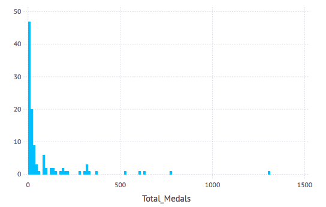
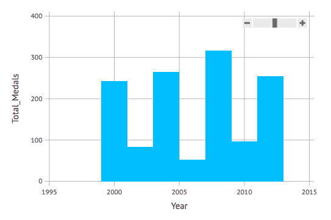

Chapter 16: Data, Data everywhere
=========

Data is ubiquitous these days and it is often crucial to analyze or plot the data.  We've seen some basic plots in julia and now we work with some other datasets.  We will mainly work with `DataArrays` and `DataFrames` in this section, which are part of the `DataFrames` package.  

### Load the DataFrames Package

As before,
```
using DataFrames
```

and then let's create a `DataArray` using the `@data` macro

```
data=@data([1,2,3,4])
```

and we can find the mean for example, using `mean(data)` just like a regular array and we get:

One of the huge advantages to the `DataArray` type is the ability to include an `NA` for a missing number.   To explain, what this does, try `NA+1`, `3*NA` etc.  Note that you always get `NA` because doing arithmetic with a missing number results something unclear.

If we have
```
data2=@data([1,2,3,4,NA])
```

and try to find the mean results in `NA`. If you want to ignore the `NA`, you can

```
mean(dropna(data2))
```

and the result will be the man without the `NA` values.  

### Data Frames

A data frame is a way to store 2D data such that each column is a DataArray.  To create one, try
```
df = DataFrame(A = 1:4, B = ["M", "F", "F", "M"])
```

which is printed out nicely like:
```
A	B
1	1	M
2	2	F
3	3	F
4	4	M
```


###Getting data from a file

Download the file [Gaz_ua_national.txt](Gaz_ua_national.txt) and save it somewhere that you can access it from Julia. This file has a lot of census data that we will try to find answers.  

###Load in the data

The data is a CSV file with tab delimeters and information about the data is [on the census website](http://www.census.gov/geo/maps-data/data/gazetteer2010.html)  To load it in type:
```
census_data=readtable("Gaz_ua_national.txt",separator='\t')
```

and readtable returns a dataframe, but doesn't print it out.  It is often helpful to see the top few lines using
```
head(census_data)
```


Here's a few questions we may want to know:

1. What are the top 10 areas in population
1. Give a histogram plot in terms of population?  (What are good bin sizes?)
2. What is the total population of all areas?
2. What the top 10 area in housing units?
2. What is the total number of housing units?
2. What is the average number of people per housing units for all areas?
2. For the top 10 area in population, find the average number of people per housing unit?
2. What are the top 10 areas in land size?
3. What are the top 10 areas in water size?
4. What are the Massachusetts areas in the data?
5. What is the average population, median and standard deviation  of the areas?


###Getting the data into a reasonable form:

One of the great things about DataFrames and the `readtable` function is that it usually detects the datatype and converts it to a proper form.  

The only issue with this is the GEOID, which should be a string instead of an Int64.  We need to actually go back and reread in the data.  If we
```
census_data=readtable("Gaz_ua_national.txt",separator='\t',eltypes=[String,String,String,Int64,Int64,Int64,Int64,Float64,Float64,Float64,Float64])
```

then the GEOID is now a String.  Check it.

###Sorting Data Frames

We can sort the data frames with the `sort!` function.  For example, if we want to sort by the `POP10` column, we can
```
sort!(census_data,cols=[:POP10])
```

and the result is the first 30 rows of the census_data printed out.  We probably want the last 30 rows (or to sort in reverse), which we can get with:
```
sort!(census_data,cols=[:POP10],rev=true)
```

### Filtering the data

Let's try to find all of the location to the west of 120 degrees west longitude.  This is store in the column INTPTLONG.  We can find all of these by doing:

```
west = census_data[census_data[:INTPTLONG].<-120,:]
```

where you need to make sure to use `.<` as a vector version of less than.  We can see how many places there are by doing
```
size(west)
```

and getting `(279,11)` or 279 areas west of 120 degrees west.  

One of our questions in the list above is to find the areas in Massachusetts.  How can we do that?   We can use the `contains` function to determine if the `NAME` contains "MA".  The following will do just this:

```
census_data[map(a->contains(a,"MA"),census_data[:NAME]) .== true,:]
```

It's not quite as nice as the previous example due to the type needed to extract the rows of a data frame.  It's important that the array passed into the first slot of the array must be a Boolean Array.  

### Creating a new DataFrame

It is common that a calculation is done and the result is placed in a DataFrame.  This section explains that through an example.  

If we want to determine the housing density of the dataset, we need to do arithmetic on the dataframe.  In this case, to determine the number of people per housing unit, we just divide the appropriate columns.  

The following creates a new dataframe:
```
density=DataFrame(GEOID=census_data[:GEOID],NAME=census_data[:NAME],DENSITY=census_data[:POP10]./census_data[:HU10]);
```

with 3 columns: the first is the GEOID, the second is the name and the third is the population over the number of housing units.  

To determine the part of the country with the highest housing density, we sort by this:

```
sort!(density,cols=[:DENSITY],rev=true);
```

and then print out the top using
```
head(density)
```


###Olympic Athletes

Let's look at another data file.  

Download the file [OlympicAthletes_0.csv](OlympicAthletes_0.csv), which lists all olympic medals between 2000 and 2012 and save it somewhere that you can access it from Julia. It is a comma separated file  (CSV).  Load it as a dataframe.

Here's some questions to answer:

1. What is the total number of medals given in all Olympics in the dataset?
3. Who had the most olympic gold medals in the Summer 2000 games?  How many medals?
2. Collectively taking each olympics, give the top 10 athletes by number of medals.
4. Who has the most Olympic Silver medals in the data set (Collectively over multiple olympics)
5. Produce a new DataFrame that lists total number of medals by country.  Produce a histogram of the total number of medals.
6. Plot the number of medals that the U.S. collected over each olympic year.  
7. What is the age with the most number of total medals.  
8. Produce a new data set with total number of medals per sport per year.  What are the top five sports over the past 4 olympics.  

#### Loading the file

Since it it comma delimited, the following will load the file:
```
oly = readtable("OlympicAthletes_0.csv",separator=',');
```

and view the first few rows with
```
head(oly)
```


#### 1. What is the total number of medals given in all Olympics in the dataset?

This will be the sum of the `Total_Medals` column:

```
sum(oly[:Total_Medals])
```

which returns 9529

#### 2. Who had the most olympic gold medals in the Summer 2000 games?  How many medals?

In this case, we will get a subset of the DataFrame and sort by Total Medals or
```
sort!(oly[oly[:Year] .== 2000,:],cols=[:Total_Medals],rev=true)
```

and this shows that Aleksey Nemov of Russia had the most with 6 medals.

#### 3. Collectively taking each olympics, give the top 10 athletes by number of medals.

We need to do a bit of work for this one.  Since over all olympics for each athlete we need to add up all of the medals.  Fortunately, in the `DataFrames` package, there is a function that does this, the `by` function and go check it out in the [DataFrames documentation](http://juliastats.github.io/DataFrames.jl/stable/man/split_apply_combine/).

First, we group the data by Athlete's name (in the Athlete column)  To see what happens with this, do
```
groupby(oly,:Athlete)
```

and you will see 6956 groups of Athletes and julia will print out the first and last one.  Since we would like to just total up the number of medals, we want want to sum within each subgroup.  The following will do this:
```
total = by(oly,:Athlete) do df
    DataFrame(Total_Medals=sum(df[:Total_Medals]))
end
```

The `by` function create the subgroups and then creates a new DataFrame with a new column that is the sum of the Total_Medals.  And then we sort:
```
sort!(total,cols=[:Total_Medals],rev=true)
```

#### 4. Who has the most Olympic Silver medals in the data set (Collectively over multiple olympics)

This is very similar to that above except that the Silver Medals are examined instead.   I will leave it up to you to figure this out.

#### 5. Produce a new DataFrame that lists total number of medals by country.  Produce a histogram of the total number of medals.

This is similar to the total numbers by athletes:

```
medals= by(oly, :Country) do df
    DataFrame(Total_Medals = sum(df[:Total_Medals]))
end;
```

and then use Gadfly, we do a histogram plot:

```
plot(medals,x="Total_Medals",Geom.histogram)
```

which results in




#### 6. Plot the number of medals that the U.S. collected over each olympic year.

In this case, we need to just get a subset of the U.S. medals:

```
us_medals = oly[oly[:Country] .== "United States",:]
```

and then subgroup by year:

```
us_by_year = by(us_medals,:Year) do df
    DataFrame(Total_Medals=sum(df[:Total_Medals]))
end
```

and the following gives a decent plot:

```
plot(us_by_year,x="Year",y="Total_Medals",Geom.bar)
```




#### 7. What is the age with the most number of total medals?

In this case, we group by age and sum total medals:

```
medals_by_age = by(oly,:Age) do df
    DataFrame(Total_Medals=sum(df[:Total_Medals]))
end;
```

and then sort
```
sort!(medals_by_age,cols=[:Total_Medals],rev=true)
```

show that age 24 has the most medals.  

#### 8. Produce a new data set with total number of medals per sport per year.  What are the top five sports in medals for 2002, 2012?  

In this case, we need to subgroup by both year and sport:
```
medals_by_year = by(oly,[:Year,:Sport]) do df
    DataFrame(Total_Medals=sum(df[:Total_Medals]))
end
```
and then sort
```
sort!(medals_by_year[medals_by_year[:Year] .== 2002,:],cols=[:Total_Medals], rev=true)
```

results in Ice Hockey, Cross Country Skiing, Short-Track Speed Skating, Biathlon and Alpine Skiing.

And in 2012:

```
sort!(medals_by_year[medals_by_year[:Year] .== 2012,:],cols=[:Total_Medals], rev=true)
```

This shows the top 5 are Swimming, Athletics (Track and Field), Rowing, Football (Soccer) and Hockey (probably field hockey).  
