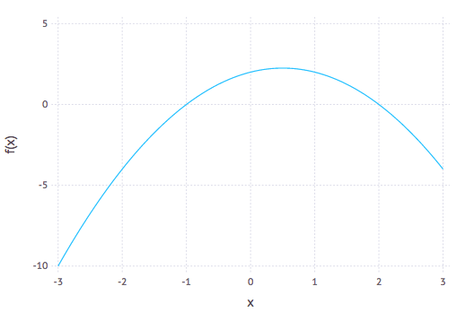

  Chapter 17: Optimizing Functions
=====

In this chapter, we explore how to minimize or maximize a function $f(x)$ on some interval.  Let's start with a simple function that we already know the answer to.  Let's minimize $f(x)=(x-1)^{2}$, which is a parabola with a minimum at $x=1$ as seen in the following plot:


From Calculus we know that a minimum (as well as a maximum) occurs at a critical point, which is where the derivative is 0 or undefined.  In this section, we will look only at functions that a differentiable, so they always have a derivative.  What we want to do is solve: $f'(x)=0$ for $x$.  

One very effective way to do this is to use Newton's method on $f'(x)$.  If we recall from Chapters [8](ch08.html) and [9](ch09.html) and developed the function:
```
function newton(f::Function, x0::Number,tol=1e-6,max_steps=10)
  local x1 = x0
  local xstep = f(x1)/ForwardDiff.derivative(f,x1)
  local steps = 0
  while abs(xstep)>tol && steps<max_steps
    x1 = x1- xstep
    xstep = f(x1)/ForwardDiff.derivative(f,x1)
    steps += 1
  end
  x1
```

Now to solve $f'(x)$, we can define the derivative by `using ForwardDiff` in the following way:

```
D(f) = x-> ForwardDiff.derivative(f,x)
f(x) = (x-1)^2
```

and then
```
newton(D(f),2)
```

returns 1.0.  Now that didn't look like a hard problem because it was just a parabola.  Let's try to find the maximum of $x \cos x$ on $[0,\pi/2]$, which is a bit harder and doesn't have a closed solution, but that's okay.  Looking at the plot:


it should have a max at about $x=0.9$.  If we define $g(x)=x \cos x$, then
```
newton(D(g),1)
```

returns `0.8603335890288378` which looks pretty good.

### Writing a Proper optimize functions

Also using Newton does a nice job with these two functions, it would be nice if we could get some confidence that we have a min or a max.  For example, if we run the same example as above with $f(x)=x^3$, Newton's method will return 0.0, but that is neither a min or a max.  

For this section, we explore writing an `Optimize` module that will have some new types (`struct`s) to allow us to understand what the results are a little bit better.  First, here is a new `Optimum` struct:

```
struct Optimum
  opt_type::String # store the value as an integer
  x_opt::Float64
  num_steps::Int
  x_eps::Float64
  f_val::Float64

  function Optimum(the_type::String,x::Float64,steps::Int,eps::Float64,fval::Float64)
    local opt_types = ["minimum", "maximum", "neither"]
    if ! (the_type in opt_types)
      throw(ArgumentError("The value of Optimum must be "*join(opt_types," ")))
    end
    new(the_type,x,steps,eps,fval)
  end
end
```

which allows the optimize method (that will appear below) to return not only the optimal value, but whether or not is is a max/min or neither.  In additional information about the number of steps it takes as well as how close it is can be recorded as we will see.  To make the results print out nicely, we will create the following `show` function:
```
function Base.show(io::IO, opt::Optimum)
  print(io,string(opt.opt_type," at x = ", opt.x_opt))
end
```

Additionally, we will create an `optimize` function that will use Newton's method to find the results:

```
function optimize(f::Function,x0::Number,eps::Number=1e-6,max_steps=25)
  local D(f) = x -> ForwardDiff.derivative(f,x)
  local D2(f) = D(D(f))
  local steps = 0
  local x = x0
  local dx = 0
  while true
    dx = D(f)(x)/(D2(f)(x))
    if abs(dx)<eps || steps >= max_steps
       break
    end
    x -= dx
    steps += 1
  end


  # check if it is a min or max
  local f2 = D2(f)(x)
  if abs(f2)> 1e-4 && f2>0
    return Optimum("minimum",x,steps,abs(dx),abs(f(x))) ## this is the 2nd derivative test for min
  elseif abs(f2)> 1e-4 && f2<0
    return Optimum("maximum",x,steps,abs(dx),abs(f(x)))  ## this is the 2nd derivative test for max
  elseif D(f)(x-0.1)*D(f)(x+0.1) < 0 && D(f)(x-0.1) >0
    return Optimum("maximum",x,steps,abs(dx),abs(f(x)))  ## this is the 1st derivative test for max
  elseif D(f)(x-0.1)*D(f)(x+0.1) < 0 && D(f)(x+0.1) >0
    return Optimum("minimum",x,steps,abs(dx),abs(f(x)))  ## this is the 1st derivative test for max
  else
    return Optimum("neither",x,steps,abs(dx),abs(f(x)))  ## this is because it is not a min/max
  end
end
```

A few things to note:

1. The function to optimize is passed in and the the first and 2nd derivatives are found.
2. The `while` loop is our newton steps and can be broken out if the optimum value is found or the number of steps is exceeded.
3. The bottom half of the function uses the [second- and first-derivative tests](https://en.wikipedia.org/wiki/Derivative_test) to check if it is a min or a max (or if both fail it is neither. )


## Optimization with JuMP (a julia package)

In this example, we will show how to optimize functions using `JuMP`, Julia for Mathematical Optimization, a nice package with tons of flexibility.  Make sure you add it if you need to.  We will also use the `Ipopt` package to do the minimization.  Before running any of the code in this section, make sure you are `using JuMP, Ipopt`

First, we will reproduce the above examples using `JuMP`.  The idea behind this package is to create a model that we will wish to optimize and you should go take a look at [the documentation](http://www.juliaopt.org/JuMP.jl/dev/)  Here's a few things that are helpful to know and the simple example is shown:

* first, a model is needed with the optimizer.  You do this as follows:
  ```
  model = Model(with_optimizer(Ipopt.Optimizer))
  ```

  and this just returns `a JuMP Model`.

* All of the variables needed in the model should be added.  
  ```
  @variable(model, x, start=0.0)
  ```

  the starting value is given, which is similar to that of the initial condition for Newton's method above.  

* Specify the objective function.  Since our objective is nonlinear, we will use the `@NLObjective` macro.  A linear function would use the `@objective` macro.
  ```
  @NLObjective(model,Min, (x-1)^2)
  ```

  And note that the output of this is pretty ugly, but stress not.

* To solve it, we use the `optimize` function:
  ```
  JuMP.optimize!(model)
  ```

  and with standard option, you get a lot of information:
  ```
  This is Ipopt version 3.12.8, running with linear solver mumps.
  NOTE: Other linear solvers might be more efficient (see Ipopt documentation).

  Number of nonzeros in equality constraint Jacobian...:        0
  Number of nonzeros in inequality constraint Jacobian.:        0
  Number of nonzeros in Lagrangian Hessian.............:        1

  Total number of variables............................:        2
                       variables with only lower bounds:        0
                  variables with lower and upper bounds:        0
                       variables with only upper bounds:        0
  Total number of equality constraints.................:        0
  Total number of inequality constraints...............:        0
          inequality constraints with only lower bounds:        0
     inequality constraints with lower and upper bounds:        0
          inequality constraints with only upper bounds:        0

  iter    objective    inf_pr   inf_du lg(mu)  ||d||  lg(rg) alpha_du alpha_pr  ls
   0  1.0000000e+00 0.00e+00 2.00e+00  -1.0 0.00e+00    -  0.00e+00 0.00e+00   0
   1  2.4997500e-09 0.00e+00 1.00e-04  -1.0 1.00e+00  -4.0 1.00e+00 1.00e+00f  1
   2  6.9435186e-19 0.00e+00 1.67e-09  -5.7 5.00e-05  -4.5 1.00e+00 1.00e+00f  1

  Number of Iterations....: 2

                                   (scaled)                 (unscaled)
  Objective...............:   6.9435185882523080e-19    6.9435185882523080e-19
  Dual infeasibility......:   1.6665555602202176e-09    1.6665555602202176e-09
  Constraint violation....:   0.0000000000000000e+00    0.0000000000000000e+00
  Complementarity.........:   0.0000000000000000e+00    0.0000000000000000e+00
  Overall NLP error.......:   1.6665555602202176e-09    1.6665555602202176e-09


  Number of objective function evaluations             = 3
  Number of objective gradient evaluations             = 3
  Number of equality constraint evaluations            = 0
  Number of inequality constraint evaluations          = 0
  Number of equality constraint Jacobian evaluations   = 0
  Number of inequality constraint Jacobian evaluations = 0
  Number of Lagrangian Hessian evaluations             = 2
  Total CPU secs in IPOPT (w/o function evaluations)   =      0.001
  Total CPU secs in NLP function evaluations           =      0.000

  EXIT: Optimal Solution Found.
  ```

  and the important part of this says on the last line that the optimal solution is found.

* print out the result.  You would think that doing the previous command tells use the information we want, and the objective value is there (perhaps buried), but the value of $x$ that produces the result is not.
  ```
  JuMP.value(x)
  ```

  returns `0.9999999991667222` and
  ```
  JuMP.objective_value(model)
  ```

  returns `6.943518588252308e-19`.


### Another example:

The following find the maximum of $f(x)=x \cos x$ over the interval $[0,1]$ and much of the output is ignored:

```
model = Model(with_optimizer(Ipopt.Optimizer))
@variable(model, 0<=x<=1)
@NLobjective(model, Max, x*cos(x))
JuMP.optimize!(model)
println("The function reaches a maximum of ", JuMP.objective_value(model), " when x = ", JuMP.value(x))
```

and again, there is a lot of output from the optimizer, but the last line returns:
```
The function reaches a maximum of 0.561096338191045 when x = 0.8603335851374684
```

Notice that the variable line included an interval on which the function was maximized.  This was something we were not able to do with Newton's method--although there are other techniques that allow us to do this, but we are not able to go into these.  

### Optimizing Functions with more than one variables

When real-world problems are posed the generally don't fit into the one-variable situation, but have more than one variable.  Most robust solvers can handle such situations.  We will first start with a simple function:
$$ f(x,y) = x^{2} +\sin^{2} y$$

which has a minimum at the point $(0,0)$.  A contour plot of this (using the `Plots` package) can be generated with
```
contour(-1:0.01:1,-1:0.01:1,(x,y)->x^2+sin(y)^2)
```

which give the following result:


and note that the colors on the plot reveal the height of the contours and shows that the minimum appears to be in the center of the plot.

To generate the minimum solution to this using `JuMP`:
```
model = Model(with_optimizer(Ipopt.Optimizer))
@variable(model, y,start=1.0)
@variable(model,x,start=1.0)
@NLobjective(model, Min, x^2+sin(y)^2)
JuMP.optimize!(model)
```

and then to print out the result:
```
println("The function reaches a maximum of ", JuMP.objective_value(model), " when x = ", JuMP.value(x), " and y=", JuMP.value(y))
```

which shows the result The function reaches a maximum of 7.30053706886019e-22 when x = 0.0 and y=2.7019506044449054e-11


### Example that fits data to a curve.

We next look at a how to use `JuMP` to fit data to a curve.   First, we will get some data from the `RDatasets` package:

```
using RDatasets
trees = RDatasets.dataset("datasets","trees")
```

and just as an example, let's plot it with the `StatPlots`:
```
using StatPlots
@df trees scatter(:Girth,:Height)
```

which gives the following plot:


and although not exactly linear, we can fit a linear model to it.  One standard way to find a best fit to a set of data is to minimize
$$ F(m,b) = \sum_{i=1}^{N} (y_i-(mx_i+b))^{2}$$

and other functions can be used instead of lines.  To fit the data to a line using `JuMP` we do the following:
```
model = Model(with_optimizer(Ipopt.Optimizer))
@variable(model,m)
@variable(model,b)
@NLobjective(model,Min,sum((y[i]-(m*x[i]+b))^2 for i=1:length(x)))
JuMP.optimize!(model)
```

and the result is:
```
line(x)=JuMP.value(m)*x+JuMP.value(b)
```

To plot this with the previous plot:
```
plot!(line,8,22)
```

where the `plot!` command combines the current plot (of the line) with the previous plot:


