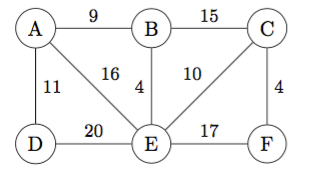
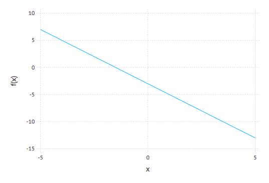

Chapter 18: Optimizing Functions
=====

In this chapter, we explore how to minimize or maximize a function $f(x)$ on some interval.  Let's start with a simple function that we already know the answer to.  Let's minimize $f(x)=(x-1)^2$, which is a parabola with a minimum at $x=1$ as seen in the following plot:


From Calculus we know that a minimum (as well as a maximum) occurs at a critical point, which is where the derivative is 0 or undefined.  In this section, we will look only at functions that a differentiable, so they always have a derivative.  What we want to do is solve: $f'(x)=0$ for $x$.  

One very effective way to do this is to use Newton's method on $f'(x)$.  If we recall from Chapters [8](ch08.html) and [9](ch09.html) and developed the function:
```
function newton(f::Function, x0::Number,tol=1e-6,max_steps=10)
  local x1 = x0
  local xstep = f(x1)/ForwardDiff.derivative(f,x1)
  local steps = 0
  while abs(xstep)>tol && steps<max_steps
    x1 = x1- xstep
    xstep = f(x1)/ForwardDiff.derivative(f,x1)
    steps += 1
  end
  x1
```

Now to solve $f'(x)$, we can define the derivative by `using ForwardDiff` in the following way:

```
D(f) = x-> ForwardDiff.derivative(f,x)
f(x) = (x-1)^2
```

and then
```
newton(D(f),2)
```

returns 1.0.  Now that didn't look like a hard problem because it was just a parabola.  Let's try to find the maximum of $x \cos x$ on $[0,\pi/2]$, which is a bit harder and doesn't have a closed solution, but that's okay.  Looking at the plot:


it should have a max at about $x=0.9$.  If we define $g(x)=x*cos(x)$, then
```
newton(D(g),1)
```

returns `0.8603335890288378` which looks pretty good.

### Writing a Proper optimize functions

Also using Newton does a nice job with these two functions, it would be nice if we could get some confidence that we have a min or a max.  For example, if we run the same example as above with $f(x)=x^3$, Newton's method will return 0.0, but that is neither a min or a max.  

For this section, we explore writing an `Optimize` module that will have some new types (`struct`s) to allow us to understand what the results are a little bit better.  First, here is a new `Optimum` struct:

```
struct Optimum
  opt_type::String # store the value as an integer
  x_opt::Float64
  num_steps::Int
  x_eps::Float64
  f_val::Float64

  function Optimum(the_type::String,x::Float64,steps::Int,eps::Float64,fval::Float64)
    local opt_types = ["minimum", "maximum", "neither"]
    if ! (the_type in opt_types)
      throw(ArgumentError("The value of Optimum must be "*join(opt_types," ")))
    end
    new(the_type,x,steps,eps,fval)
  end
end
```

which allows the optimize method (that will appear below) to return not only the optimal value, but whether or not is is a max/min or neither.  In additional information about the number of steps it takes as well as how close it is can be recorded as we will see.  To make the results print out nicely, we will create the following `show` function:
```
function Base.show(io::IO, opt::Optimum)
  print(io,string(opt.opt_type," at x = ", opt.x_opt))
end
```

Additionally, we will create an `optimize` function that will use Newton's method to find the results:

```
function optimize(f::Function,x0::Number,eps::Number=1e-6,max_steps=25)
function optimize(f::Function,x0::Number,eps::Number=1e-6,max_steps=25)
  local D(f) = x -> ForwardDiff.derivative(f,x)
  local D2(f) = D(D(f))
  local steps = 0
  local x = x0
  local dx = 0
  while true
    dx = D(f)(x)/(D2(f)(x))
    if abs(dx)<eps || steps >= max_steps
       break
    end
    x -= dx
    steps += 1
  end


  # check if it is a min or max
  local f2 = D2(f)(x)
  if abs(f2)> 1e-4 && f2>0
    return Optimum("minimum",x,steps,abs(dx),abs(f(x))) ## this is the 2nd derivative test for min
  elseif abs(f2)> 1e-4 && f2<0
    return Optimum("maximum",x,steps,abs(dx),abs(f(x)))  ## this is the 2nd derivative test for max
  elseif D(f)(x-0.1)*D(f)(x+0.1) < 0 && D(f)(x-0.1) >0
    return Optimum("maximum",x,steps,abs(dx),abs(f(x)))  ## this is the 1st derivative test for max
  elseif D(f)(x-0.1)*D(f)(x+0.1) < 0 && D(f)(x+0.1) >0
    return Optimum("minimum",x,steps,abs(dx),abs(f(x)))  ## this is the 1st derivative test for max
  else
    return Optimum("neither",x,steps,abs(dx),abs(f(x)))  ## this is because it is not a min/max
  end
end
```

A few things to note:

1. The function to optimize is passed in and the the first and 2nd derivatives are found.
2. The `while` loop is our newton steps and can be broken out if the optimum value is found or the number of steps is exceeded.
3. The bottom half of the function uses the [second- and first-derivative tests](https://en.wikipedia.org/wiki/Derivative_test) to check if it is a min or a max (or if both fail it is neither. )
