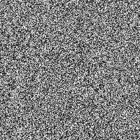
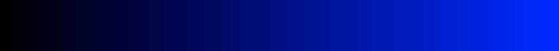
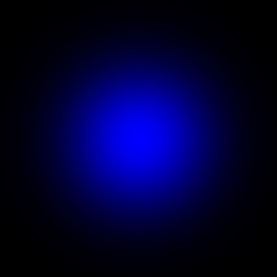

Week 4 Notes
=============

These are the notes for week 3 of Math 3001. [Return to all notes](../index.html)

Images
------

This is a discussion on how images are stored in general as well as in julia.  First, to get a sense of a few images, let's load a few packages

```
Pkg.add("Images")
Pkg.add("Color")
Pkg.add("ImageView")
Pkg.add("FixedPointNumbers")
Pkg.add("TestImages")
```

You will probably not need to install all of these since some are dependent on others. 

Next, let's load a black and white image

```
using TestImages, Images, Color, FixedPointNumbers, ImageView
cam=testimage("cameraman")
```

If you are running this inside iJulia, then you should see the image right away.  A B/W image is just an array of grayscale values as you can see if you type:

```
convert(Array,cam)
```
You will see this
```
512x512 Array{Gray{UfixedBase{Uint8,8}},2}:
 Gray{Ufixed8}(0.612)  Gray{Ufixed8}(0.616)  …  Gray{Ufixed8}(0.596)
```

as the first couple of lines.  The first says that it is a 512 by 512 array (pixel size of the image) consisting of grayscale (the Gray) stored as Uint8  (which has the only values 0,1,2,...,255).  This is known as an 8-bit image.  Also, the ,2 means that the array has 2 dimensions.  (Note: a video would be ,3)

The 2nd line is the actual gray scale values (between 0 and 1) of each pixel.  

Creating an image from scratch
------


Let's now create an image from scratch.  Typically we'll need numbers in the range 0 to 255 (we'll use Uint8).  An easy way to do this is
```
nums=rand(Uint8,200,200)
```

will make an array of random Uint8 numbers with the array sized 200 by 200.  To convert this to gray scale 
```
grays = map(Gray{Ufixed8},nums)
```

and then create an image out of this array:
```
convert(Image,grays)
```

and you should see an image with black/white/gray dots randomly dispersed. 




A nonrandom image
-------

Now, we'll fill in the values of the array with non random numbers. For example, we'll create a image with the values of a function.  In this case,
\\[ f(x,y) = e^{-x^{2}-y^{2}}\\]
which is a two dimensional version of the bell curve (or normal curve).  We do this by first creating x and y as vectors
```
xPts=[-2:0.1:2];
yPts=[-2:0.1:2];
```
then apply the function and fill as an array:

```
z=[exp(-x.^2-y.^2) for x=xPts, y=yPts];
```

(recall that the semicolon at the end of the line suppressed output).  The values of the array z are between 0 and 1 and we want to convert them Uint8 (8-bit unsigned integers) and then convert to grays, then finally convert to an image. This can be done in one line as
```
convert(Image,map(Gray{Ufixed8},uint8(255*z)))
```

and you should see the following.  

</img>


Color Images
-----

Now we typically don't use black and white images much anymore and one way to improve the legibility of images is to include some color. In the case of the bell curve above, let's apply a color to each pixel instead of a shade of gray.  One way to do this is to create a colormap.  

A colormap is an array of colors that will be used to map a value from 1 to 256 to a color.  An easy way to do this is the following which will create a map that goes from black to blue. 

```
cm=[linspace(RGB(0,0,0),RGB(0,0,1),256)]
```

and with this you will see:

</img>

which shows you the color range that will be mapped to the grayscale image.  This can then be done using
```
ImageCmap(uint8(254*z+1),cm)
```

Note:  the `254*z+1` is needed because the smallest value of the array cm is 1 and you need the largest to be 255, so since z is from 0 to 1, then `254*z+1` will be between 1 and 255.  And the result is


</img>


### Exercise

Play with the RGB values in the colormap (the line with `cm=` above) and rerun the ImageCmap command. 

Newton's Method in the Complex Plane
------

For this section make sure that you have 
```
using Images, Color, FixedPointNumbers, ImageView
```

since those packages are needed.  

We are going to run Newton's method on complex numbers.  You should have the function that we have written earlier and load it with the command:
```
require("newton.jl")
```

or a path to where the file is.  Again to check it, type
```
newton(x->x^2-4,x->2x,1)
```

and you should get 2.0 (to within roundoff). 

Next create an array of complex numbers.  We can do this via

```
Z=[x+y*im for x=-1:0.2:1, y=-1:0.2:1]
```

and the run newton's method for the function \\(f(x)=x^{3}-1\\) on each point:
```
roots=map(a->newton(x->x^3-1,x->3x^2,a),Z)
```

this array will be the location of the root starting at each point in Z.  For example, the point `-1-im` (in the first row/column of Z) will go to `-0.5-0.866025im`.  And if you look, you'll see that there are 3 possible places (because there are 3 roots of this function in the complex plane)

Our goal will be to plot each root a different color.  Let's see how we can do that. 


Here's a shortened version of what I'll do in class:
```
angles = round((360+(180/pi*map(angle,roots)))%360.0)/120.0
```

and then some fixes:
```
angles[find(isnan,angles)]=0.0;angles[find(a->a<0.5,angles)]=3.0
```

and if we use the colormap
```
cm=[RGB(0,0,1),RGB(0,1,0),RGB(1,0,0)]
```

then 
```
newtonImg = ImageCmap(values,S)
```

will generate a small version of what we're looking for.  


