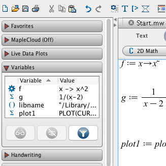

Chapter 3: More to Maple than meets the eye
==========

[Return to all notes](index.html)

So far, we have been using Maple for doing mathematical operations and showing plots.  We've been simplify expressions, solving equations and producing plots.  In this chapter, we go beyond the basics of Maple a bit deeper to show that Maple is a powerful computing environment and you need to know some deeper computing concepts to take advantage of this.

We take a step back from doing mathematics with Maple and explore some of the details of how Maple works and look at the structure of Maple commands.  


Variables and the Variable Browser
-----

As we saw earlier, we can store anything in a variable using the `varname:=obj` syntax where `varname` is any variable name (it can't start with a number) and `obj` is any Maple object (expression, function, plot, etc.).

You can think of variables as on a grid on a white board with a column for the name and a column for the object.  For example, let's say you have `f:=x^2`.  Anytime you type in `f` in an expression, Maple will look up the value of the variable.

If later in your Maple document, you type `f:=x^3`, then the previous object stored in `f` is erased and `x^3` is put in its place.  This won't change anything you've done previously, but anytime `f` is evaluated later.  

Other things of interest about variables:

* There is a variable browser on the left sidepane of Maple.  

    
    The browser lists all of the variables that Maple currently knows as well as the value of the variable.  You can

    1. view the value of the variable by clicking the eyeglasses button
    2. hide the variable with the cross through the eyeball button (this does not erase the variable)
    3. erase the variable, by right-clicking on the variable and selecting *unassign*.  

* to view the value of a variable you can just type the name of the variable and hit return.  If the variable has not been defined yet, the variable is just returned.

* Another way to remove the value of a variable is using the `unassign` command.  For example if `f:=x^2`, then `f` has the value $x^{2}$.  To remove it,
    ```
    unassign(`f`)
    ```    
    where backticks are used around the `f`.  The backtick key is in the upper left corner of the keyboard.


The kernel
---------

Generally for any CAS, the place you type commands into is just an interface to the piece of software that does the hard computing work.  This software is called the kernel.  In fact, it doesn't start up until you first begin entering something into a document.  

When mentioned that Maple stores variables, in fact, it is the kernel that stores the variables.  It is the kernel that runs all of the commands and sends the result back to the interface.  

Each tab in Maple is a separate document and thus has a separate kernel.  So the Variable Browser explained above is for a specific document and removing (unassigning) the variable also only pertains to that kernel.  

###How the Kernel works

The kernel in many ways is very simple.  You feed it a command, it does something and returns the result. It has some memory of things entered before it and obviously all of the variables that you store.  It doesn't really know about the spatial location of things in a Maple document.   The spatial importance of commands are discussed in the next section.

###Restarting the kernel

Sometimes if you are having trouble because of variables defined that may take a lot of effort to remove all of them, it is convenient to restart the kernel.  There are two ways to do this:

* Click the loop with arrows button (rightmost one in the image below) on the Maple toolbar:


* Type `restart` anywhere in Maple.  

In either case, you will see that all of the variables are removed and if you have loaded any libraries, all commands in the libraries are removed as well.  


Maple Documents and Order of Entry
------

At the beginning of this course, we saw that the primary way to use Maple was using a Maple Document.  In short a Maple document is a mixture of Maple commands and text with often output from plots.  

As you enter mathematics and commands in Maple, any entry that results in expression or similar output will be given a number.  Recall that to use that output, you can do *Insert->Label* (or CTRL(CMD)-L), type in the number and voila, you have that output without assigning it to a variable.  This is useful in not having to retype much.  

As we discussed above, the kernel processes commands and returns output from the command in a sequential way  (the way you enter them.)  It does not matter the spatial location of command except for the fact that often you need to often do things in a certain order.  For example, you need to first define a variable before using it.  Such ordered commands should be done in the Maple document from top to bottom.  

This is because if you select a number of lines of Maple code, you can run all of the commands at once with the ! button on the right side of the toolbar (shown below):


If instead, you want to run the entire document, click the !!! button.  In either case, the top-most command is run first, then sequential from top to bottom.  


## Sections in Maple Documents

Another way to organize your Maple document is to use sections and subsection.  To create a section, go to *Insert->Section* and you can give the section a name.  If this is named "Section One", it will look like the following:


You can collapse and open sections by clicking on the section name.  

### Subsections

You can also make subsections that lie inside of sections (or other subsections) by going to *Insert->Subsection*.


What is a command?
------

As mentioned above, many things that you do in Maple is a command. The commands that we've seen so far include

* expand
* simplify
* plot

Recall that a command has the form:

```
name(arg1,arg2,...,opt1=value1,opt2=value2,...)
```
and an explanation of the following is:

* `name` is the name of the command.
* Immediately after the name is a `(` and don't put a space before it or you will try to multiply things.   
* The things `arg1,arg2,...` are called the arguments (or parameters) of the function.  For example, if plotting `arg1` is the expression that you wish to plot.
* the rest of it are called options.  The are separated by commas and have the form `opt=value`, where `opt` is the name of the option and `value` is the value of it.   For example, in a plot command, we saw the option `style=line`, which creates a line plot.  


Reading the Help in Maple
-----

Reading the help pages will get you a long ways in Maple.  Most help pages (Maple included) are pretty dull reading, if you can get a sense of how to read them, it will benefit you in the long-term.  

To open the help pages, go to *Help->Help Manual* in Maple (or type CONTROL(CMD)-F1 ) and you will see:


The easiest way to use the help manual is to search on a term.  Let's look at the help page of something that we have seen already, the `expand` command.  Search for this in the Help page and you should see:


First of all, this help page is similar to many standard Maple Help pages.  They include:

* **Name**: this gives the name and whether it is in a library.  If the name is in the form **XXX[yyyy]** then the name of the command is yyyy and it is in library XXX.  We will cover this later.
* **Calling Sequence**: this explains briefly what to type into the command to get it to run.
* **Parameters**: the arguments and options that can go into the command (briefly)
* **Description**: this describes the command in detail.  It often will contain links to other help pages and subpages.  There is often a lot of this that you may not understand.  Roll with it or ask your instructor.  
* **Examples**: this is a list of examples.  Generally, you can type the example in directly (or copy-paste them)

###Exercises

Look up the expand command in the help browser and answer the following questions:
1.  What does the expand command do?
2. How many required arguments are needed?  Describe all of the required arguments.
3. What are the options of the command.  Describe what they do.
4. Expand the expression: $$\cos(x+y)$$
5. How would you expand the expression $$(x+y)^{2} + \sin(a-b)$$ to get $$x^{2}+2xy+y^{2}+\sin(a-b)?$$


Lists in Maple
-----

Often we want to do something to a number of numbers or expressions.  The best example that we have seen so far is that of plotting multiple expressions on the same axes.  Recall that we may want to plot $x, x^{2}, x^{3}$ on the same axes.  If we enter
```
plot([x,x^2,x^3],x=-2..2,legend=[x,x^2,x^3])
```
then we get such a plot.

The three functions are entered as a list: `[x,x^2,x^3]`, which is just a matching pair of square brackets `[]` which each object separated by a  comma.

Another example would be to have the first 10 counting numbers:
```
[1,2,3,4,5,6,7,8,9,10]
```
or you can mix numbers and expression like
```
[3/4,x^2,sin(x),-100.34,5!,pi]
```

###The seq command

If there is a nice pattern in your list, the `seq` command will usually be better to use than typing out the list directly.  The `seq` command will apply a function to subset of integers.  For example,
```
seq(i,i=1..10)
```
will produce the list `[1,2,3,4,5,6,7,8,9,10]`.  Notice that there is no `i` in the result, so it doesn't matter what variable you use in the `seq` command.  If you typed `seq(n,n=1..10)`, you would get the same result.  

To find the first 10, even numbers, try
```
seq(2n,n=1..10)
```


###Exercise

1. Take a look at the `seq` command in the help browser.
2. Create the list `[1,4,7,10,13,16,19,...,52]`
3. Use the seq command to create the list `[x,x^2,x^3,x^4,x^5]`.
4. Use the seq command to find 0! through 10!

The Map command
-----

If you need to repeat the same function applied to a number of parameters, often the `map` function is what you need to use.  In general, the `map` command takes a function and a list and returns a list in which the function is applied to each element of the list. Here are a number of examples.

If
```
nums:=seq(i,i=1..10)
```
and `f:=x->x^2` (the square function), then
```
map(f,nums)
```
will return the square of each integer.  

Notice that in the command above, we had to define `f` before typing `map(f,nums)`, however, if we insert the function inside the map command, it will save a step. Try
```
map(x->x^2,nums)
```


Recall that earlier, you were asked to expand the binomial $(x+1)^{n}$ for various values of $n$. (I think, $n=2,3,4,5$ and 10).  Here's a short way to do that
```
map(n->expand((x+1)^n),[2,3,4,5,10])
```


###Exercise

1. Start with the `nums` list as shown above, find the cube of each number in nums.
2. Consider the first 10 primes: [2,3,5,7,11,13,17,19,23,29].  Take each of these, subtract 1 and divide the result by 2.  Your output should be a list.  


Loading a Library
------

Many software packages today have so much functionality that not everything can be preloaded (or built-in) when opening the software.  Maple is such an example.  There is a lot of functionality that exists in what are called libraries or packages.  Maple has a few hundred of these and to get a scope of things if you open the Help Browser in Maple and click open the "Mathematics" section, then "Packages", you'll see quite a few related only to mathematics.  

For example, consider the **ScientificConstants** package.  This has a list of a number of important scientific constants that one might need.  To load the package type
```
with(ScientificConstants)
```

and you will see a list of commands that have been loaded with the package.  Often, you don't care about seeing the list, so you can add a : to the end of the list to suppress the output.

Notice that one of the commands is called `GetConstant`.  

###Exercise

1. Read the help page about `GetConstant`
2. Type `GetConstant(g)`.   What does it tell you?
3. Find the constant that has the mass of the earth.  What is it and what are its units?

We will often use a Maple library in this course and typically as you go further in mathematics, if you use Maple, the necessary commands will be in a library.  You can also define your own library, which will have information later in these notes how to do this.

Floating Point Numbers
-----

We have avoided decimals in Maple, because they are a bit complicated.  Here's a brief description of them.  Because a computer is a finite thing (they have a finite amount of memory), decimals have to be finite, so we can only store some number of digits.  In a standard computer language, the number of digits is fixed, Maple has some flexibility in doing this.  For example, if we type
```
4.0/7.0
```

then Maple returns `0.5714285714` or 10 digits.  The way that computers store decimals is called a [floating point number](https://en.wikipedia.org/wiki/Floating_point) and the details are covered [here.](appendix-B.html)

We can change the number of digits that Maple keeps by using a constant `Digits`.  To change to 20 decimals, type
```
Digits:=20
```

and if you evaluate `4.0/7.0` you should see `0.57142857142857142857`, which is 20 digits.  Maple will accept any positive integer within reason, but changing this constant isn't the only way to get decimal approximation as you will see.  


Getting a decimal approximation for a number
-----

One of the great things about a CAS is that numbers are stored in the proper way.  If a number is an integer or a rational (fraction) or square root, then it is saved in an exact way.  However, many times you may want to know a decimal approximation for $\frac{4}{7}$ or $\sqrt{17}$.  How do you do that?

Consider we have the number $\frac{4}{7}$ stored in the variable x, like
```
x:=4/7
```
Maple will return just $\frac{4}{7}$ meaning that it is the fraction and not any decimal approximation.  To find the approximation, you can type
```
evalf(x)
```
where the f in `evalf` stands for floating point.  Maple will return `0.5714285714` the same as we saw above for `4.0/7.0`.  If we want 20 digits, instead of changing the number of Digits that Maple store in general, we can type
```
evalf(x,20)
```
and you will get 20 digits of the fraction $\frac{4}{7}$.  

###Exercise

Try finding the decimal approximation of $\pi$ or ${\rm e}$ to 20, 100 or  1000 digits.


The `assume` and `assuming` command
-------

Remember that if you use a variable that Maple doesn't know, it assumes nothing about it.  We can tell Maple additional information about it however.  Here's a few examples.  

If we just type $\sin(n\cdot\pi)$, then Maple will return it because it doesn't know anything about $n$.  What if we say $n$ is an integer, by typing `assume(n,integer)`, then evaluating $\sin(n\cdot\pi)$, we get 0.  

Often, you simplify $\sqrt{a^{2}}$ to be $a$.  This is actually only true when $a>0$ and Maple knows this.  If you type

`simplify(`$\sqrt{a^{2}}$)

then you get `csgn(a) a`.  (Take a look at what the `csgn` function is in the Help Browser).  If you assume that $a$ is positive, then typing:

`simplify(`$\sqrt{a^{2}}$)

results in $a$.  Maple says $a$~ with the tilde (~) is an assumed version of a.  

We can get ourselves in trouble if we use the `assume` command because whatever we assumed holds for that variable throughout the Maple session.  If we forget that we made $a$ a positive number and we don't want that assumption any more, we need to strip the assumption.  (Read the help page on how to do this).  

A better way to do this is to use `assuming`.  For example, we'll simplify $\sqrt{a^{2}}$ by the following:

```
simplify(sqrt(a^2)) assuming a>0
```

and you will get the result of $a$.  This doesn't change anything about $a$, which is generally good, but if you have a number of commands for this, then maybe `assume` is the way to go.  
