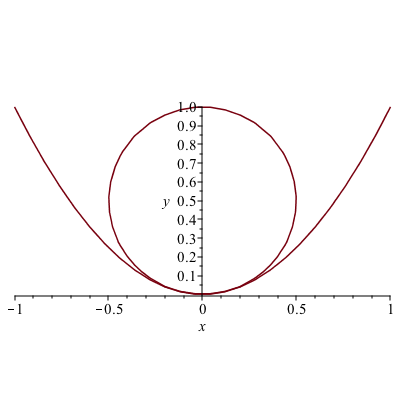
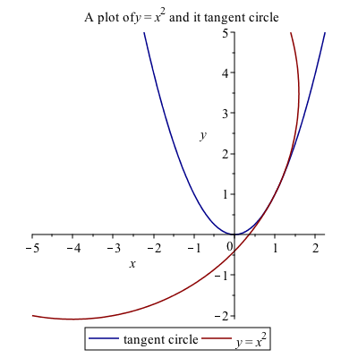
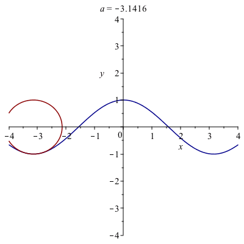

Chapter 13: Curvature of Plane curves
=======

[Return to all notes](index.html)

An interesting topic related to derivatives is that of the curvature of a curve at a point, called $\kappa$, the greek letter kappa, which is
$$
\kappa = \frac{|f^{\prime\prime}(a)|}{(1+f'(a)^{2})^{3/2}}
$$

Geometrically, the curvature is
$$ \kappa = \frac{1}{R}$$
where $R$ is the radius of the circle that is tangent to the curve at the point $(a,f(a))$

As an example, let's take $f(x)=x^{2}$ and find the curvature at $x=0$.  Plugging into Maple, we get: $\kappa = 2$.  Thus the radius of the circle that is tangent to this is $R=1/2$ and since $x=0$, then the circle is $x^{2}+(y-1/2)^{2} =(1/2)^{2}$.  A plot of this is



### Example

Find the tangent circle to the curve $y=x^{2}$ at $x=1$.  Plot the curve and the circle.  

The curvature in this case is $\kappa = 2\sqrt{5}/25$.  To find the circle, it is a bit more challenging since it is not clear where the center of the circle is. The center of the circle will be on the line that is perpendicular to the curve at the point.  Since $f'(a)=2a$, the perpendicular line is
$$ y=-\frac{1}{2}(x-1)+1 $$

To find the center of the circle, we seek the intersection of the this line and the circle $(x-1)^{2}+(y-1)^{2} = (25/(2\sqrt{5})^{2}$, since the distance along the line is $1/\kappa$.  If we let $a=1$, then
```
solve([y = -1/(f'(a))*(x-a)+f(a), (x-a)^2+(y-f(a))^2 = 1/kappa(a)^2])
```

returns
```
{x = 6, y = -3/2}, {x = -4, y = 7/2}
```

We seek the point above and left of the point.  Plotting the curve $y=x^{2}$ and the circle with the center $(-4,7/2)$ is



### Exercise

Find the curvature of $y=\cos x$ at $x=0$.  Find the tangent circle and plot both the function and the circle.  

Repeat for $x=\pi/4$.  

### A very cool animation of curvature

The following in an animation of the circle.  



Note: to create this, a procedure was written to find the equation of the circle for a given function and point.  Then the animate function of the plots package was used.  The exact code isn't presented, because that would overly simplify the homework. 
