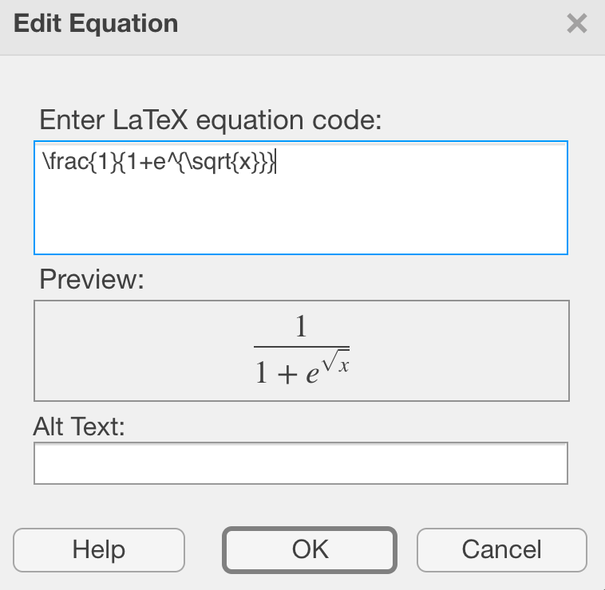

[Previous Chapter](ch17.html) | [Return to all notes](index.html) | [Next chapter](appendix-B.html)

## Adding Mathematics to Matlab Live Scripts

A Matlab live script can toggle between matlab code and text mode easily and this is one reason Matlab is quite powerful.  Additionally, the text mode will automatically handle mathematics using LaTeX, a mathematics formatting language.

All LaTeX goes inside of dollar signs \$ ... \$.  For example, typing `$x^2$` results in $x^2$. Matlab will format as soon as you type the second dollar sign.

### Formatting mathematics

For mathematical symbols, search "latex math symbols" produces many many links on the web.  [Here's](https://oeis.org/wiki/List_of_LaTeX_mathematical_symbols) one example.  A few things that are helpful:

- regular letters are typed as you see them.
- greek letters are proceeded with a backslash.  For example, `\alpha` generates $\alpha$.
- A fraction is created with `\frac{top}{bottom}`.  For example, `\frac{x+1}{x^2+3}` generates $\frac{x+1}{x^2+3}$.
- you can nest formulas.  `\frac{1}{1+e^{\sqrt{x}}}` generates $\frac{1}{1+e^{\sqrt{x}}}$

### Editing formulas

There are a couple of ways to edit a formula in Matlab once you have typed it in.  You can go the end of the formula and backspace until the formula shows back up.

Secondly, you can double-click on the formula and a small window pops open like:

You can edit the equation code and live the preview shows the result.