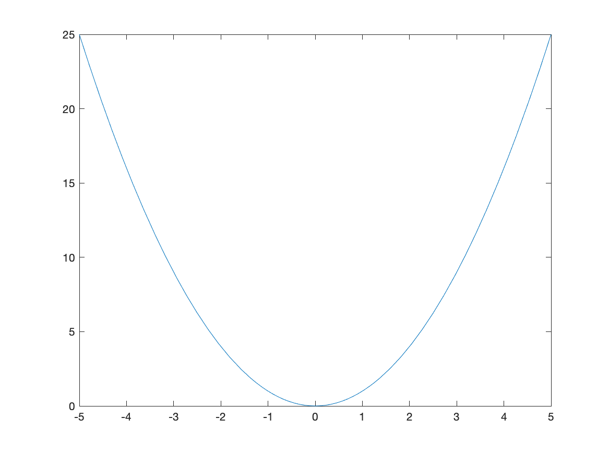
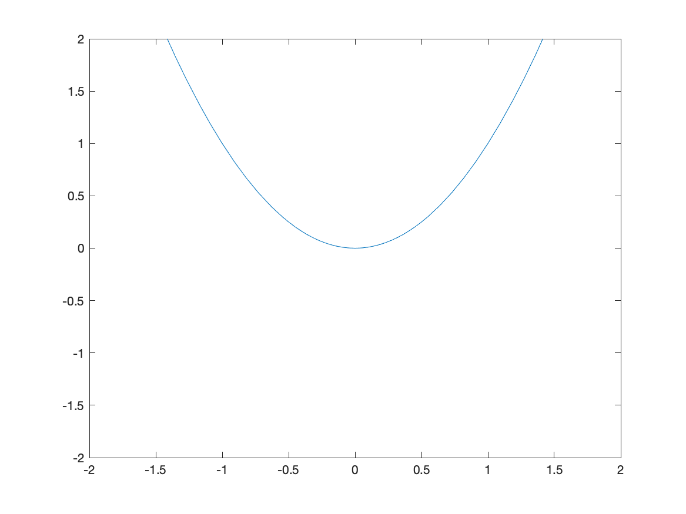
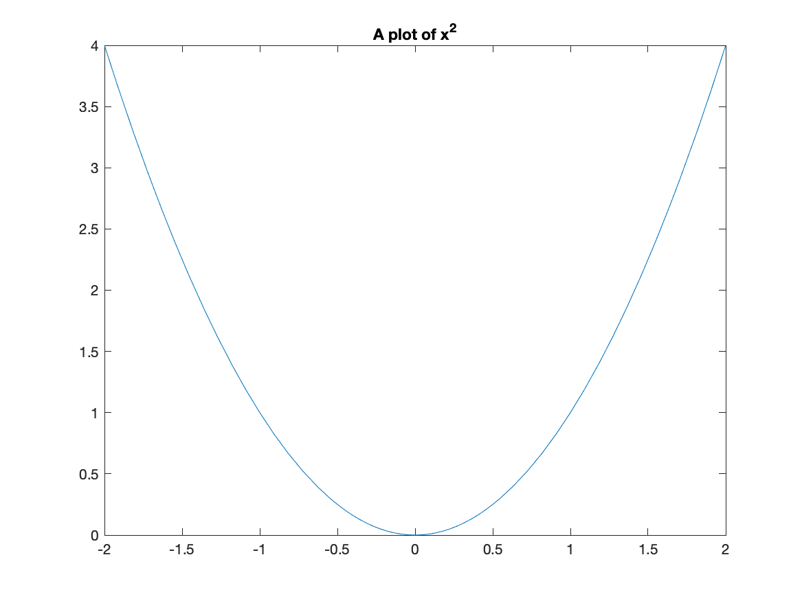
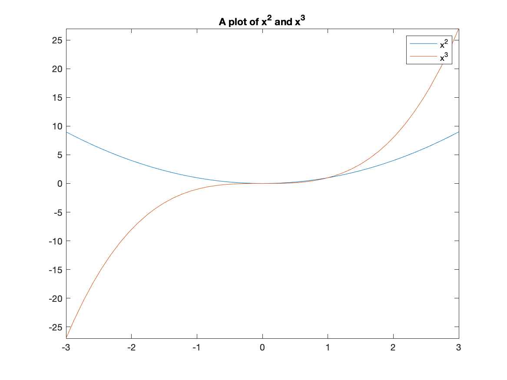
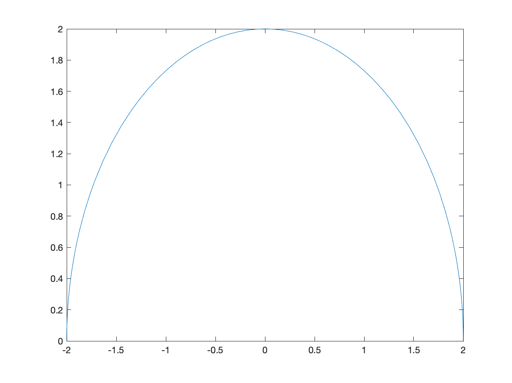
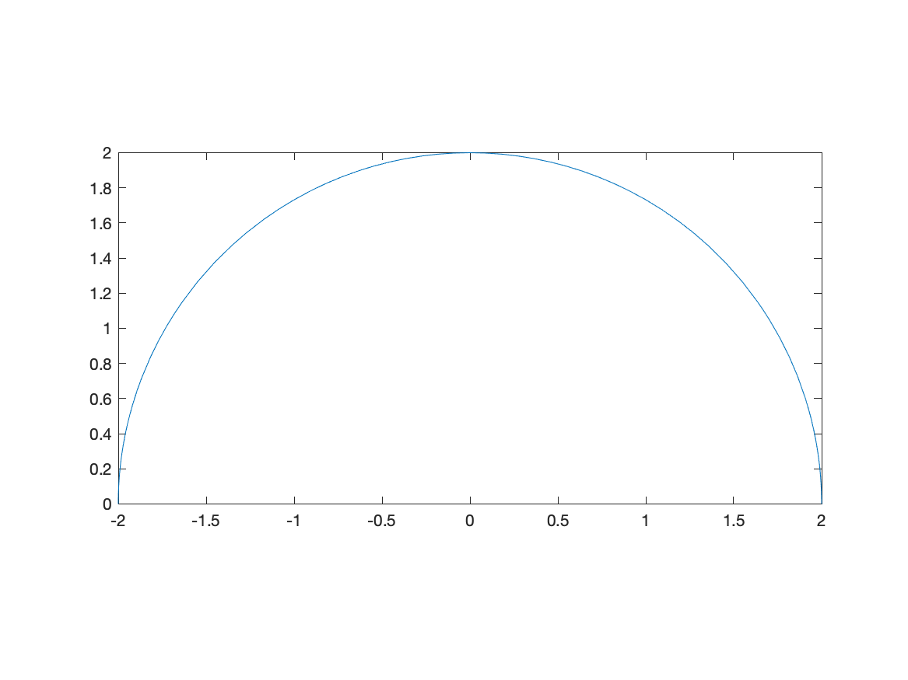

[Previous Chapter](ch-01.html) | [Return to all notes](index.html) | [Next chapter](ch-03.html)

This chapter explain some plotting basics.  We will see how to plot functions and change aspects of the plot, then we will plot some data as scatter plots and finally show how the two types can be blended. Before starting on plots, however, we will discuss how to save objects (numbers, expressions) in Matlab.

## Storing Numbers and Expressions

Below we will be plotting $x^{2}$ with many different options.  In the case of $x^{2}$ it is short enough to type out each time, but if we have a complicated function, we probably don't want to.  In such a case, we will store the expression as a name.  To do this, we'll use `=`.  For example

```matlab
f=x^2
```

will give the expression $x^{2}$ a name (or a variable in the computer science sense) called `f`.  Note: if you get an error, like `x not defined`, don't forget to tell Matlab that $x$ is a symbolic variable with `syms x`.

 By "doing" something to `f`, we are in fact doing that to $x^{2}$.  A better example is if we type

```matlab
g=(x+2)^2
```

and the we can expand it by

```matlab
expand(g)
```

which returns $x^{2}+4x+4$.

### Anything can be stored

We can store numbers, equations, expressions (and other things) using the same syntax.  For example

```matlab
eqn=x^2==9
```

and then `solve(eqn)` returns
$$
\left(\begin{array}{c}-3 \\ 3\end{array}\right)
$$
which means that both 3 and -3 are the two solutions to the equation $x^{2}=9$.

### Rules for names

The rules for giving something a name is that it contain a digit, a letter (upper- or lower-case) or an _ (underscore).   It must also start with a letter.

## Plotting

Most CAS systems will produce very nice plots and Matlab is among these.   The standard plot will be that of a function, but we will see that plotting multiple functions and points is also possible.  Matlab is very flexible in creating plots.

### Plotting Functions

In order to plot the expression $x^{2}$, try typing `fplot(x^2)`. You should see a plot similar to



### Changing the Plotting Window of a plot

Typically, the easiest way to change the plotting window of the plot is to use an option in the plot command. For example, if we want a plot on the interval $[-2,2]$, then typing `fplot(x^2,[-2 2])` will produce the plot:

![Plot of $x^{2}$ on $[-2,2]$](images/ch02/plot02.png)

If you want to make sure that the axes include other y values, you can adjust the limits after the fact.  After you have the plot, try `ylim([-2 2])` which will generate:



If you’d like a title on your plot, you can add the title option. For example, try

```matlab
fplot(x^2,[-2 2])
title("A plot of x^2")
```

and you will see



Notice that matlab does some fancy formatting in that it formats `x^2` as a power.  You can put latex commands in the title (we will see what latex is later in the course.)

### Exercise

Plot $f(x) = \sin x$ on the domain $[−6.25, 6.25]$. Give the plot a title that includes the function.

### Changing the tick marks

I'm sure you noticed (since you are quite astute) that the tick marks are in decimals and it would be nice to see the function plot in fractions of $\pi$ instead.  We can change this with the `xticks` and `xticklabels` functions.  Here is a cosine plot with some nicer ticks:

```matlab
fplot(cos(x),[-2*pi 2*pi])
S =  sym(-2*pi:pi/2:2*pi);
xticks(double(S))
xticklabels(arrayfun(@texlabel,S,'UniformOutput',false))
```

and the result is:

![Plot of $\cos(x)$ on $[-2\pi,2\pi]$](images/ch02/plot05.png)

Before just plowing on, let's go through those last statements in detail.  The line:

```matlab
S =  sym(-2*pi:pi/2:2*pi);
```

creates an array of symbolic values from $-2\pi$ to $2\pi$ by steps of $\pi/2$.  (Take the semicolon off the end of the line and rerun to see). The line

```matlab
xticks(double(S))
```

sets the xticks to the numerical values (that's what the `double` function does) to the numbers in `S`.  Then

```matlab
xticklabels(arrayfun(@texlabel,S,'UniformOutput',false))
```

set's the tick labels on the x-axis to the values in `S`.  We'll see the `arrayfun` later and the `@texlabel` function is a way to ensure that the latex command is used to make things look better.  Again, we'll talk about latex later in the course.

Make a mental note that this allows us to change the x-ticks to multiples of $\pi$ is a much nicer way.  You'll need this later.

### Plotting multiple functions

Often, we would like to include more that one function on a single set of axes. Here is how to plot both $x^2$ and $x^3$.

```matlab
fplot([x^2, x^3],[-3,3])
```

The result is:


### Adding a Legend

A legend is important for any plot containing more than one function. This allows you to distinguish between the curves. There is a legend option to the plot function. For example, to add a legend and a title to the plot of $x^{2}$ and $x^{3}$ type:

```matlab
fplot([x^2 x^3], [-3,3])
title("A plot of x^2 and x^3")
legend("x^2","x^3")
```

and you will see:


### Exercise: Graphing functions

Graph the functions $\sin x, \sin 2x,$ and $2 \sin x$ on the same coordinate axis. Label your graphs using the legend, and change your plot range to $−2\pi \leq x \leq 2\pi$ and $−2.5 \leq y \leq 2.5$.

Hint: see above on getting multiples of $\pi/2$ for you $x$ tick marks.

## Changing the Aspect Ratio of a Plot

Recall that the function $f(x)=\sqrt{4-x^2}$ is the top half of a circle.  If we plot this with

```matlab
fplot(sqrt(4-x^2),[-2 2])
```

we'll get the following plot:


and this just doesn't look like a circle.  This is because the aspect ratio isn't 1--this means that 1 unit in the x-direction and 1 unit in the y-direction are not equal.

We can do that in Matlab with the following:

```matlab
fplot(sqrt(4-x^2),[-2 2])
daspect([1 1 1])
```

and the result is:


Note: there are three numbers here because we will see 3D plots need can have different aspects as well.  Matlab does this in general by ensuring that it know the relative sizes of all three axes.

### Exercise: Plotting with Aspect Ratio of 1

Plot the functions $f(x)=2x+3$ and $g(x)=-\frac{1}{2}x+1$ and make the plot ratio 1:1. Do the lines look perpendicular?  Should they? if so, why?

## Plotting a function with a parameter

Matlab is also helpful in understanding how a parameter (a variable that just takes on certain values) affects a plot.  For example, if we plot $y=x^2+C$ for $C=-2,-1,0,1,2$ and we want to see what happens to the plot.

To make this easier, we first define the functions:

```matlab
curves=[x^2-2,x^2-1,x^2,x^2+1,x^2+2]
```

then plot the results and add a legend:

```matlab
curves=[x^2-2,x^2-1,x^2,x^2+1,x^2+2]
fplot(curves)
title("The family of curves x^2+C")
legend("C=-2","C=-1","C=0","C=1","C=2")
```

the result will be:


And from this you can see that the parameter C shifts the lines vertically.

## Piecewise Functions

Another common plot is that of a piecewise function, consider
$$f(x) = \begin{cases} x & x<0 \\ 3-x^{2} & x \geq 0 \end{cases}$$

Recall that a piecewise function is a function $f$ takes on the values of $x$ when $x<0$ and when $x \geq 0$, then it has the functional form $3-x^2$.  We wil plot this by creating a plot with two different curves on it.

The way to enter this in is the following:

```matlab
f = piecewise(x<0,x,x>=0,3-x^2)
fplot(f, [-3 3])
```

and this results in the following plot:


The vertical line connecting (0,0) with (0,3) is not part of the plot.  Matlab simply just connects a bunch of points.  Sometimes it seems that it can figure out that it's not part of the plot. Unfortunately, if it doesn't automatically remove the line, you need to do something different, like the following:

```matlab
fplot(f,[0,3])
hold on
fplot(f,[-3,-0.0001])
hold off
```

which first plots the function on the interval $[0,3]$, then holds the plot which means that we can add additional graphs on the plot.  Then we plot the function on $[-3,-0.0001]$, which is just an approximation of 0--if you put in 0, you get the same results as above. Lastly, `hold off` switches the plot back to normal (meaning don't add additional graphs).

The result is


which is better but it looks like two different curves becaues the two pieces are different colors.  We can set them both to be the same color with:

```matlab
fplot(f,[0,3],'blue')
hold on
fplot(f,[-3,-0.0001],'blue')
hold off
```

and the result is


### Exercise: Plotting a Piecwise Function

Plot the piecewise function:

$$
    f(x) = \begin{cases}
    1-(x-\pi/2)^2 & x > \frac{\pi}{2} \\
    1 & -\frac{\pi}{2} \leq x \leq \frac{\pi}{2} \\
    \sin x & x < -\frac{\pi}{2} \\
    \end{cases}
$$

## Plotting Functions with discontinuities

Although Matlab doesn't often pick up on jump discontinuities from piecewise functions, it seems to do well with infinite discontinuities.  Consider:

```matlab
fplot(1/(x-1),[-3,3])
```

which has the result:


The vertical dashed line is a vertical asymptote in this case.

### Exercise: Plotting Functions with Discontinuities

Plot $f(x) = \tan(x)$ on $[-3\pi,3\pi]$ and use multiples of $\pi/2$ for the horizontal labels.  Hint: see above to do this.  Does Matlab correctly pick up the vertical asymptotes in this case?

## Scatter Plots

A scatter plot is a set of points plotted in the $xy$-plane.  Consider the points $(0,1),(1,0),(2,1),(3,0)$.  We will see how to plot this.

For this, we create a vectors of the x points and y points:

```matlab
x=[0,1,2,3]
y=[1,0,1,0]
```

and the call the function `scatter`:

```matlab
scatter(x,y)
```

resulting in


Notice that the points by default are open circles, which are hard to see. The next exercise goes through how to change the type and size.

### Exercise: Plotting a Scatter Plot

1. Search for `scatter` in the help documentation.  There is a number of ways to change the size, shaped and color of the dots.
2. Create a plot that looks like:


At the bottom of the `scatter` documentation has all of the options.

## Combining Scatter and Function Plots

We can combine a scatter and function plots  using the `hold` command. Let's say we have the points: (0,10),(2,9),(3,7),(5,6),(7,4),(8,2) and we wish to plot a best fit line as well.  First, let's define the points

```matlab
x = [0,2,3,5,7,8];
y = [10,9,7,6,4,2];
```

The best-fit line can be found to be $y=10.8665-0.9680x$ and we will show how to do this later.

```matlab
scatter(x,y,100,'blue','filled');
hold on
fplot(@(x) 10.8665-0.9680*x,[-0.5,9])
hold off
```

Note: above, we have generally done `fplot(10.8665-0.9680*x,[0.5,9])` to plot the line.  However, becase we defined `x` to be an array of points, this won't work.  Try it!! The `@(x)` is way to redeclare `x` as a different variable.  We'll see this more later.

This will produce a plot that looks like:


[Previous Chapter](ch-01.html) | [Return to all notes](index.html) | [Next chapter](ch-03.html)
