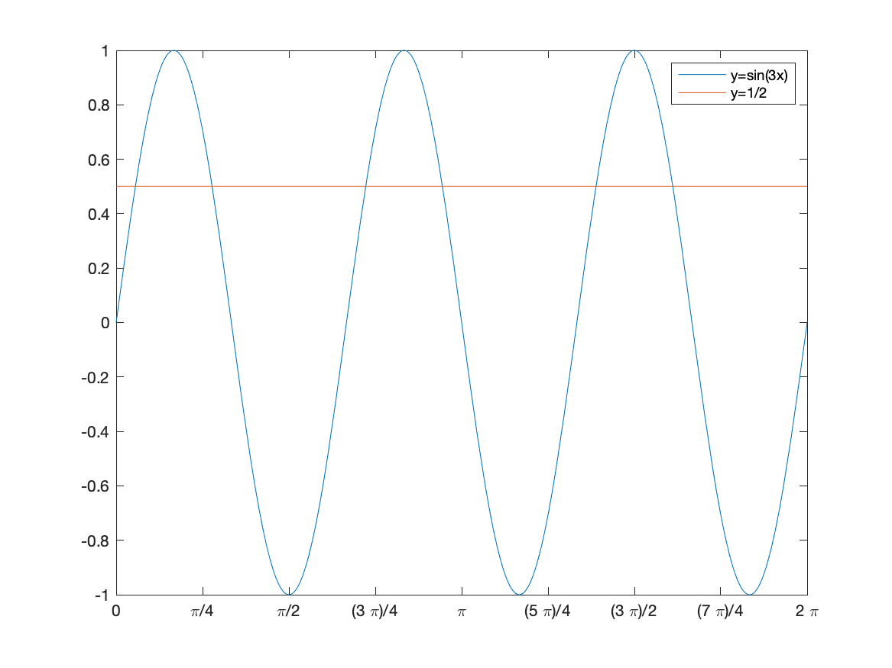
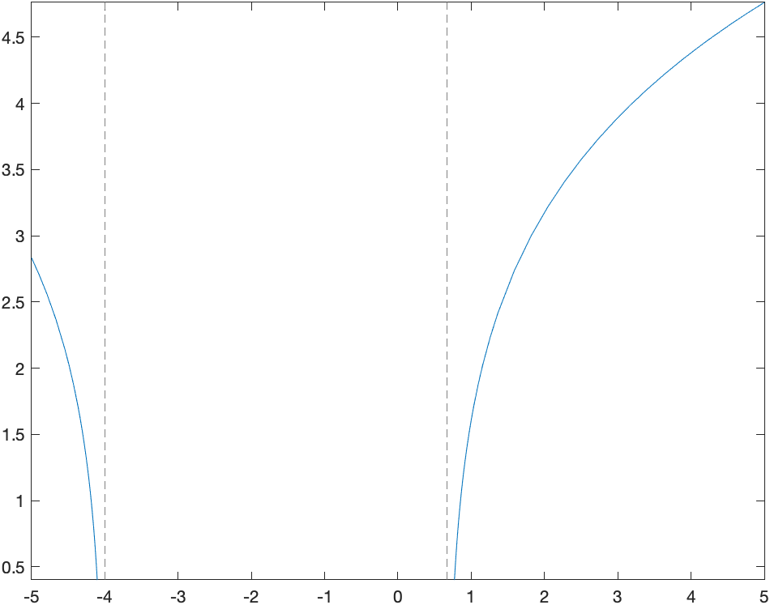
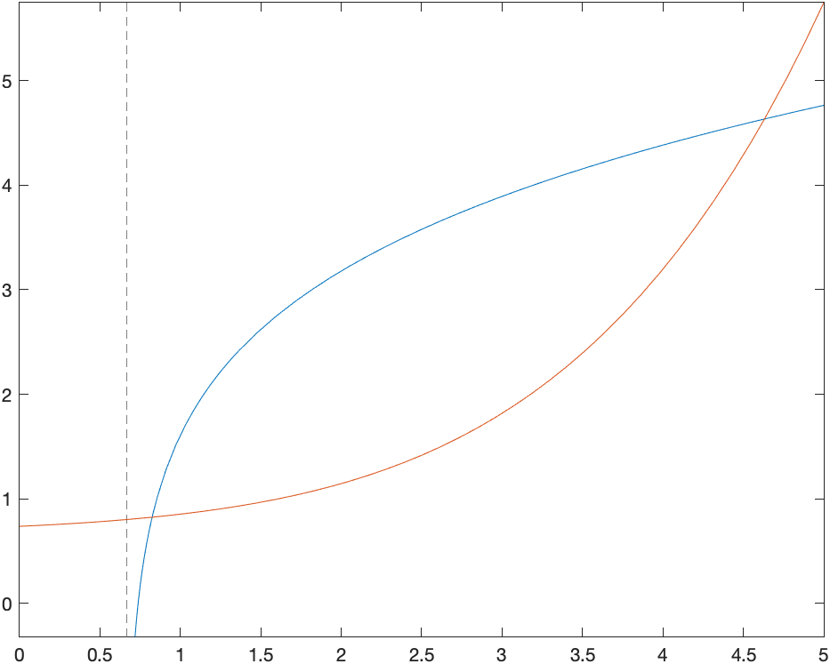

[Previous Chapter](ch-02.htm) | [Return to all notes](index.html) | [Next chapter](ch-04.html)


Mathematical Functions and Expressions
---

In the previous chapter, we plotted the function $x^2$ as an example with 
```
syms x
fplot(x^2,[-2 2])
```

However, from the point of view of a CAS, $x^2$ is simply an expression.  Let's say that we wish to evaluate this at $x=3$, we can use the `subs` commands as
```
subs(x^2,x,3)
```
which returns 9.  This will be quite handy if we have a more complex expression (or a other objects) 
```
syms x0 y0 r y
circle = (x-x0)^2 + (y-y0)^2 == r^2
```
and then we want to substitute $x=1,y=-2$, $r=3$ and we can with:
```
subs(circle,[x0,y0,r],[1,-2,3])
```
and then the result is the equation:
$$
{{\left(x-1\right)}}^2 +{{\left(y+2\right)}}^2 =9
$$

### Mathematical Functions

Above, we substituted the value $x=3$ into the expression $x^2$.  Instead, we could make a mathematical function with
```
f(x)=x^2
```
and then `f(3)` will return 9.  

This also allows us to do composition.  For example, if we
```
syms h
```
then the difference quotient
```
(f(x+h)-f(x))/h
```
returns:
$$\frac{{{\left(h+x\right)}}^2 -x^2 }{h}$$
or if we simplify this with:
```
simplify((f(x+h)-f(x))/h)
```
returns $2x+h$ and we will see this with derivatives in [Chapter 5](ch-05.html).

Additionally, we can do formal composition.  For example if
```
f(x) = x^3+x
g(x) = 1/(x+2)
```
Then `f(g(x))` returns 
$$
\frac{1}{x+2}+\frac{1}{{{\left(x+2\right)}}^3 }
$$
and `g(f(x))` returns
$$
\frac{1}{x^3 +x+2}
$$

#### Exercise

Let $g(x) = \sqrt{x^2+1}$ and $h(x) = e^x$, find

* $g(h(x))$
* $h(g(x))$
* $h(h(x))$
* $g(g(x))$


Expressions versus Functions
-----

Now that we see both expressions and functions, what's the difference?  When should I use one versus the other?  

In short, if you think of an expression as a function itself, probably use function notation.  Especially if you need to take a derivative.  Also, as we will see, if you want a number of values substituted into an expression quickly, a function should be used.  Otherwise, either is often fine and I often don't know when I start solving a problem the best thing to use.  


Solving Equations
---

You probably recall from throughout your mathematical career that solving an equation can be difficult.[^solve]  Matlab can often solve equations effortlessly. For example if we type
```
syms x
solve(x^2-3*x-4==0)
```
where we need to use the double equals `==` for an equation.  Remember that a single equal sign `=` is the assignment operator (set the left hand side to the variable on the right). 

If you enter this, Matlab returns:

$$
\left( \begin{array}{c}-1 \\4 \end{array}\right)
$$
meaning that both 4 and -1 are solutions to the equation.  

[^solve]: Solving equations are difficult for many reasons.  One is that they require you to categorize the equation to determine the type (linear, quadratic, exponential, etc) and they to know (or be creative) to go through steps that result in the solution (or solutions).  Another reason solving is difficult is that many equations do no have an solution that results from performing algebraic steps.

Quadratics are fairly straightforward to get solutions for both us (mathematicians) and computers.  There is factoring or the quadratic formula.  


#### Exercise

Solve the following quadratic equations. 

1. $x^2-x-30=0$
2. $x^2+4x+4=0$
3. $x^2+2x=120$. 
4. $x^2+4=0$. 

Note that in #3 that you can put the equation in as is (remembering the `==` though), you don't need to put all terms on the same side. 

## Solving cubics

Matlab can handle some cubics as well.  Consider
```
solve(x^3+6*x^2+5*x-12)
```
then Matlab returns: 
$$\left(\begin{array}{c} -4 \\-3\\1\end{array}\right)$$

Showing that $1,-3,-4$ are all solutions.  

Some cubics though don't readily have nice solutions.  Consider:

```
solve(x^3+3*x^2-11*x-10)
```
which returns
$$\left(\begin{array}{c} 
root(z^3+4z^2-3z+11,z,1) \\
root(z^3+4z^2-3z+11,z,2) \\
root(z^3+4z^2-3z+11,z,3) \\
\end{array}\right)
$$

which is Matlab's way of saying that the roots of the cubic are the roots of the cubic. (Super helpful, Matlab!)  Below, we will learn how to find both the exact answer and approximations to this. 

Solving Trigonometric Equations
------

You should have seen how to solve trigonometric equations (an equation containing trigonometric functions) in Precalculus.  In general these are quite difficult to solve, however Maple can handle many kinds of Trigonometric equations.  Try solving $$\sin 3x = \frac{1}{2}.$$
with
```
eqn = sin(3*x)==1/2
solve(eqn,x)
```

Matlab returns $$\left(
\begin{array}{c}
\frac{\pi}{18} \\[5pt]
\frac{5\pi}{18}
\end{array}\right)
$$
which are indeed solutions to the equation.  However, it isn't the only solution.  Recall that the solution(s) of an equation is(are) the point(s) of intersection of the graphs of the functions on either side of the equation.  If we  type:
```
fplot([sin(3*x),1/2],[0,2*pi])
S =  sym(0:pi/4:2*pi);
xticks(double(S))
xticklabels(arrayfun(@texlabel,S,'UniformOutput',false))
```
where the last three lines gives nicer tick marks (See [Chapter 2](ch-02.html)). The result is a plot the functions $f(x)=\sin 3x$ and $g(x)=1/2$ on the interval $0\leq x\leq 2\pi$:



On the interval that we plotted, there are 6 intersection points, but if we changed the plotting interval, that would change.  There are actually an infinite number of intersection points.

Notice that the solutions found are the smallest intersection points in the plot above.  The next couple of sections will show how to find all solutions and then solutions on a given interval.

### Finding all solutions to a trigonometric equation

We now find out how Matlab can find all of the solutions above.  If we enter:
```
[solx,parameters,conditions] = solve(eqn,x,'ReturnConditions',true)
```
Matlab returns 3 things:

$$ 
\text{solx} = \left(
 \begin{array}{c}
\frac{\pi}{18} + \frac{2\pi k}{3} \\[5pt]
\frac{5\pi}{18} + \frac{2\pi k}{3}
\end{array}\right)
$$
$$ \text{parameters} = k$$
$$ \text{conditions} = \left(\begin{array}{c}
 k \in \mathbb{Z} \\
  k \in \mathbb{Z} 
  \end{array} \right)$$

The three are named what they are because we called them those in the `solve` command above.  

* The `solx` is the all solutions.  There are in pairs and you can think of them as paired from the plot above along each hump of the sine curve. 

* The `parameters` variable lists the parameters (note the $k$ in the `solx`). 

* The `conditions` lists what values the parameters can take on.  In this case, $k$ can take on any integer.  

If we are looking for all solutions to the solution, then the information in `solx` is the result or
$$\frac{\pi}{18} + \frac{2\pi k}{3}, \frac{5\pi}{18} + \frac{2\pi k}{3}
\qquad \text{for $k \in \mathbb{Z}$}$$


#### Exercise

Find all solutions to $\tan 2x = 1$. 

#### Finding solutions to equations on an interval

In this section, we will find the solutions to $\sin 3x=1/2$ on the interval $0 \leq x \leq 2\pi$.  The following command will do this
```
assume(conditions)
restriction = [solx > 0, solx < 2*pi];
solk = solve(restriction,parameters)
valx = subs(solx,parameters,solk)
```

There's a lot to unpacck here and we'll walk through what's going on:

* `assume(conditions)` says that we will assume the symbolic variables in the `conditions` variable.  That is that $k$ is an integer.
* The line `restriction = ...` puts the interval that we wish to solve and stores it in a variable. 
* The line `solk = ...` solves for the parameters $k$ that give the restriction.  The results are 0,1,2. 
* The line `valx = ...` then finds the values of $x$ for these values of $k$. The result is

$$
\left(
 \begin{array}{c}
\frac{\pi}{18}\\[5pt]
\frac{13\pi}{18}\\[5pt]
\frac{25\pi}{18}\\[5pt]
\frac{5\pi}{18}\\[5pt]
\frac{17\pi}{18}\\[5pt]
\frac{29\pi}{18}\\[5pt]
\end{array}\right)
$$

#### Exercise

Find all the solutions for $2\cos 4x =\sqrt{2}$ on $[0,\pi]$. 

Exact versus approximate solutions
------

Above, we solved, 
$$x^{3}+3x^{2}-11x-10=0$$
and got an array of something called `root`, but wasn't helpful.  If we add:
```
eqn = x^3+3*x^2-11*x-10==0
solve(eqn, x, 'MaxDegree', 3)
```
which says to solve this up to a maximum degree of 3.  The result is:

$$
\left(\begin{array}{c}
\frac{14}{3 \sigma_2} + \sigma_2 -1 \\[5pt]
-\frac{7}{3\sigma_2}-\frac{\sigma_2}{2}-1 - \sigma_1 \\[5pt]
-\frac{7}{3\sigma_2}-\frac{\sigma_2}{2}-1 + \sigma_1 \\
\end{array}
\right)
$$

where
$$
\sigma_1 = \frac{\sqrt{3}\left(\frac{14}{3\sigma_2}-\sigma_2\right)i}{2} 
$$
$$
\sigma_2 = \left(-\frac{3}{2}+\frac{\sqrt{108}\sqrt{10733}i}{108}\right)
$$

in short, this seems like a crazy answer.  This is exact however and comes from a cubic formula that is much more complicated than the quadratic formula.  The $i$ is the imaginary unit $\sqrt{-1}$, however, we will see these solutions are all real.  Matlab just isn't good at making clean answers. 

In this case, I think numerical approximations are more insightful. The command `vpasolve` will do this for us:
```
vpasolve(eqn)
```
returns
$$
\left(\begin{array}{c} -4.8445196774478780056996095605694\\ -0.78500444582226096325038188120832\\ 2.6295241232701389689499914417777 \end{array}\right) 
$$

The `vpa` stands for variable-precision arithmetic, which basially means that this can be solved for any precision.  


Solving Inequalities
----

Another important mathematical technique that a CAS is generally good at is solving inequalities, like $4x+3>5x-7$.  However, if we enter
```
solve(4*x+3>5*x-7)
```
Matlab returns 9.  Huh?  (Seriously, I can't figure out what this is doing).  We need to add some options to the `solve` command.  
```
[xsol,params,cond] = solve(4*x+3>5*x-7,x,'ReturnConditions',true)
```
returns $x$, $x$ and then for the third (the `cond` variable)
$$ x<10$$
which is what we're looking for.   If we change the `>` to `>=` for $\geq$, then note that the solutions will switch to $x\leq 10$. 

If we enter
```
[xsol,params,cond] = solve(x^2-9>=0,x,'ReturnConditions',true)
```
the important part returns the array
$$
\left(\begin{array}{c} x \leq -3 \\ 3 \leq x \end{array}\right)$$

which is the union of the two intervals or 
$$ (-\infty,-3) \cup (3, \infty)$$

Notice that if we switch the inequality sign and enter
```
[xsol,params,cond] = solve(x^2-9<=0,x,'ReturnConditions',true)
```
The result for `cond` is
$$
\left(\begin{array}{c}
-3<x\wedge x<3\\
y\in \mathbb{R}
\end{array}\right)
$$
and this can translate to the interval $[-3,3]$. 


Finding the domain of a function
-----

Maple can be helpful for finding the domain of functions, however, we need to recall some basics of functions.  Recall that the domain of $\sqrt{x}$ is $[0,\infty)$, or the inside must be greater than or equal to zero.  We can then use Matlab to help find say the domain of $\sqrt{4x-x^{2}-4}$, by solving
```
[xsol,params,cond] = solve(5*x-x^2-4>=0,x,'ReturnConditions',true)
```
and the interesting part of the solution is the `cond` variable, which  returns
$$
\left(\begin{array}{c} 1\leq x\wedge x\leq 4\\ y\in \mathbb{R} \end{array}\right)
$$
which is Matlab's nonstandard way of saying that this is the interval $[1,4]$, so this is the domain of $\sqrt{4x-x^{2}-4}$.

#### Exercise

Find the domain of each of the following
1. $\dfrac{1}{x^{2}-16}$
2. $\ln(5x+7)$
3. $\sin^{-1}(3x^{3}+5)$

Hint: 
1. it's easier to solve the bottom equal to 0, then exclude it. 
2. recall that the natural log in Matlab is `log` and you'll need to recall the domain of it, then restrict the inside, just like the square root above. 
3. what is the domain of the inverse sine? 


Inverse Functions
-----

Recall that the inverse of a function $f(x)$ is a function $g(x)$ if $f(g(x))=x$ and $g(f(x))=x$.  For example if
$$ 
f(x) = \frac{3x+2}{x-1} \qquad g(x)=\frac{x+2}{x-3}
$$
then
```
f(g(x))
```

returns:

$$\frac{\frac{3\,\left(x+2\right)}{x-3}+2}{\frac{x+2}{x-3}-1}
$$

but that doesn't look like $x$, so simplify it and you will get $x$.  Simiarly
```
simplify(f(g(x)))
```

returns $x$.  

### Finding inverse functions

Maple is also very helpful in finding inverse function.  Let's say we have the function
$$ f(x) = \frac{7x+4}{3x-2} $$

we can find the inverse by solving
```
syms y
solve(f(y)==x,y)
```

and Matlab returns
$$\frac {2x+4}{3x-7}$$


If you set `g(x)` equal to this, then you can show the inverse relationship like we did above. 


### The inverse and domain and range

This shows how we can use the domain of a function and get an inverse of the restricted part of it.  This is a more complex function than is typically seen in a Precalculus class, but Matlab allows us to do harder problems because much of the difficult algebra is done for us. 

Let's consider the function
$$
f(x) = \ln\left(3\,x^2 +10\,x-8\right)
$$
remembering that Matlab using `log` for natural log. 

1. _Plot the function._

    You should see the following:

    

2. _Find the domain of $f$._

    We find the domain by solving the inside greater than zero:

    ```
    [xsol,params,cond] = solve(3*x^2+10*x-8>0,x,'ReturnConditions',true)
    ```
    and this results in the interval $(-\infty,4)\cup(2/3,\infty)$.  You can see in the plot that the only parts of the graph of the function are on these intervals, and it isn't clear from the plot, but now it there are two vertical asymptotes of $x=-4$ and $x=2/3$. 

3. _Restrict the function $f$ to $x>2/3$ and find the inverse of this._


    We find the inverse of it by `invf = solve(f(y)==x,y)`. There is a warning and two solutions, this is because inside the log, there is a quadratic.   Looking carefully at the results, the first solution is always negative and the second solution is always positive.  The one we are looking for is the 2nd one.  
    ```
    g(x) = invf(2)
    ```

    The (2) means to take the second element of the array. (Note: we will explain this in the next chapter)


4. _Graph the function and its inverse._  What relationship do you notice.  


    If we graph the two, for example
    ```
    plot([f(x),g(x)],x=-1..10,y=-1..10)
    ```

    then you get:

    

    and you should note that they look like inverses because they are symmetric across the line $y=x$.  


Odd and Even functions
-----

Recall that an **odd** function satisfies $f(-x)=-f(x)$ for all $x$ on its domain and an **even** function satisfies $f(-x)=f(x)$ for all $x$ on its domain.  Here's a nice way to show these are satisfied in Maple.

Show $f(x)=x^{3}$ is an odd function.  It seems logical to show in Maple `f(-x)=-f(x)`.  In this simple case, both sides are the same, so it seems it is an odd function.  Let's look at a more complex function,
$$f(x)=\frac{4x^{3}+2x}{x^{2}+5}$$
and in Matlab, we do `f(-x)=-f(x)`, then Maple returns
$$
-\frac{4\,x^3 +2\,x}{x^2 +5}=-\frac{4\,x^3 +2\,x}{x^2 +5}
$$
which shows that the function is odd.  However, this doesn't always work, however, we can rewrite $f(-x)=-f(x)$ by adding $f(x)$ to both sides to get $f(-x)+f(x)=0$.   If we type `f(-x)+f(x)` into Matlab, we get 0, however if you don't get a zero, try doing `simplify(f(-x)+f(x))`. 


#### Exercise

1.  Show that $g(x)={\rm e}^{x^{2}}$ is an even function.
2. Is $h(x)=\sqrt{3x+4}$ even, odd or neither.  


Numerators and Denominators
----

Recall that a rational function is a a polynomial over another polynomial.  Examples include
$$\frac{1}{x}, \frac{x^{3}-3x}{x^{2}+1}, \frac{15x^{5}+3x^{2}}{4x^{2}+2}$$

And recall that we need to examine the individual numerator and denomiator to find $x$-intercepts and vertical asymptotes.  To get these, we can use the `numden` command. For example, if
$$g(x) = \frac{4x^{3}-16x}{x^{2}-9}.$$
then both the numerator and denominator are returned with
```
[num,den] = numden(g(x))
```

which returns the top and bottom of the fraction.  Now that we have these, let's

1. Find the domain of $g$
2. find the $x$-intercepts of $g$
2. Find the vertical asymptotes.  

Since, we can't divide by 0, we need to know where the  denominator is 0 or
```
solve(den==0)
```

resultng in $-3$, and $3$.  Therefore, the domain is $(-\infty,-3)\bigcup(-3,3)\bigcup(3,\infty)$.

For the answer to 2, we need to find the zeros (roots) of the top and
```
solve(num==0)
```
will return 0,-2,2.  And the answer to the 3, is the zeros of the denominator or
```
solve(den==0)
```
which returns -3,3.  Recall that this means the asymptotes, which are lines, are $x=3$ and $x=-3$.  

Partial Fractions
-------

The technique of partial fractions come up in many areas in mathematics including the integration of rational functions and finding inverse Laplace Transforms (in differential equations).  An example is if we have the following rational function:
$$R(x)=\frac{2x-2}{x^{2}+4x+3}$$
and if we wish to write it as the sum of two simpler forms:
$$\frac{4}{x+3}-\frac{2}{x+1}$$

The technique of going from a general rational function to a sum of simpler rational functions is called *partial fractions*.  To do this, we recognize that if we factor the denomiator of $R$ or $(x+3)(x+1)$ so we hope to write:
$$\frac{2x-2}{x^{2}+4x+3} =\frac{A}{x+3}+\frac{B}{x+1}$$
or finding $A$ and $B$.  Multiplying through by the denominator of $R$ results in
$$2x-2 = A(x+1)+B(x+3)$$
or
$$2x-2=Ax+Bx+A+3B$$

at this point we *equate coefficients*  by finding the coefficients of the $x$ term and the constant term on either side of the equation. This results in two equations:
$$\begin{array}{rl}2&=A+B\newline -2&=A+3B\end{array}$$

subtracting these, results in $4=-2B$ or $B=-2$ and then you can find $A=4$.  This shows that

$$\frac{2x-2}{x^{2}+4x+3}=\frac{4}{x+3}-\frac{2}{x+1}$$

###Using Maple to help us find partial fractions

We start again with
```
R(x) = (2*x-2)/(x^2+4*x+3)
```
and get the numerator and denominator:
```
[num,den] = numden(R(x))
```
and we factor the denominator:

```
factor(den)
```

returns $(x+3)(x+1)$, so we write the equation:
$$\frac{2x-2}{x^{2}+4x+3}=\frac{A}{x+3}+\frac{B}{x+1}$$
by typing:
```
syms A B
eqn = R(x) == A/(x+3) + B/(x+1)
```
remembering to define $A$ and $B$ as symbolic variables.  Then we multiply through by the denominator of $R$. Then 
```
simplify((eqn*den)
```
returns
$$2\,x=A+3\,B+A\,x+B\,x+2$$
and oddly, it moved the 2 to the right hand side.  We now need to equate the coefficients.  

First, let's get the coefficients on both sides:

```
leqn = coeffs(lhs(eqn2),x,'All')
reqn = coeffs(rhs(eqn2),x,'All')
```
where the `'All'` is needed to ensure that both the coefficient of x as well as the constant is included.  Also, the order of the cofficients in the resulting array is important.  

We set up the equations:
```
leqn(1)==reqn(1)
leqn(2)==reqn(2)
```
which returns the equations:
$$
\begin{array}{rl}
2 & = A + B \\
0 & = A+ 3B+2 
\end{array}
$$

and then we solve these with the following:
```
[a,b]=solve([leqn(1)==reqn(1),leqn(2)==reqn(2)],[A,B])
```
and the answer is $A=4, b=-2$, so then 
```
subs(eqn,[A,B],[a,b])
```
results in
$$\frac{2x-2}{x^{2}+4x+3}=\frac{4}{x+3}-\frac{2}{x+1}$$

###Converting an expanded form back.  

How do you reverse the partial fraction?  If you are doing it by hand, it is simply finding a common denominator and combining terms.  In Matlab,
```
simplifyFraction(rhs(eq5))
```

returns $$\frac{2(x-1)}{x^{2}+4x+3}.$$

which is what we started with. 

###Exercise

Find the partial fraction form of
$$\frac{9x^{2}+8x-4}{x^{3}-4x}$$
using the steps above. Check your answer by reversing the partial fraction form.  


###Using the built-in method

Of course, Matlab can do all of these steps at once.  If we use the $R$ from above, typing
```
partfrac(R(x))
```

returns $$\frac{4}{x+3}-\frac{2}{x+1}.$$
which of course is much easier, but note that the steps above remind us how this is actually done.  


###Exercise

Find the partial fraction form of $${\frac {4\,x^{6}+15\,x^{5}+34\,x^{4}+66\,x^{3}+94\,x^{2}+56\,x+40}{x^{4}+2\,x^{3}+5\,x^{2}+8\,x+4}}$$
using the built-in method.

Long Division of Polynomials
-------

Another common technique needed to do is long division of polynomials.  

For example, from [Purple Math's long division page](http://www.purplemath.com/modules/polydiv2.htm), if we want to do $(x^{2}-9x-10)\div (x+1)$, the result is $x-10$.  

Maple will do this using `simplify`.  That is, if
$$R(x)=\frac{x^{2}-9x-10}{x+1}$$
and then performing
```
simplify(R)
```

returns $x-10$.  However, (from [another PM page](http://www.purplemath.com/modules/polydiv3.htm) ) consider if
$$Q(x)=\frac{3x^{3}-5x^{2}+10x-3}{3x+1}$$
then `simplify(Q)` returns $Q$ again.  But we may want to actually do the long division.  

The command `polynomialReduce` returns the quotient and remainder using polynomial long division. 
```
[r,q] = polynomialReduce(3*x^3-5*x^2+10*x-3,3*x+1)
```

returns $-7$ and  $x^{2}-2x+4$ for the remainder and quotient.  This means that we can write:
$$Q=\frac{3x^{3}-5x^{2}+10x-3}{3x+1}= x^{2}-2x+4+ \frac{-7}{3x+1}$$

and to determine that this worked, typing
```
simplifyFraction(x^2-2*x+4-7/(3*x+1))
```

returns the improper form of $Q$ as above.  


[Previous Chapter](ch-02.htm) | [Return to all notes](index.html) | [Next chapter](ch-04.html)
