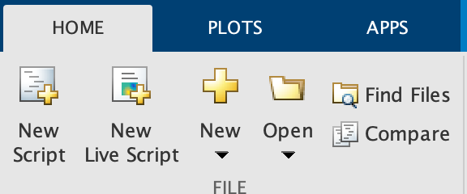
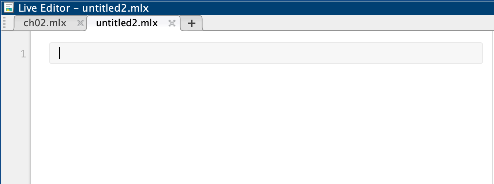
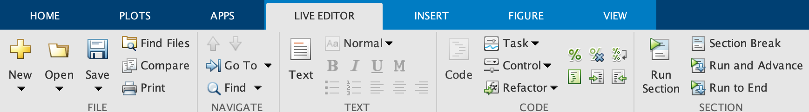
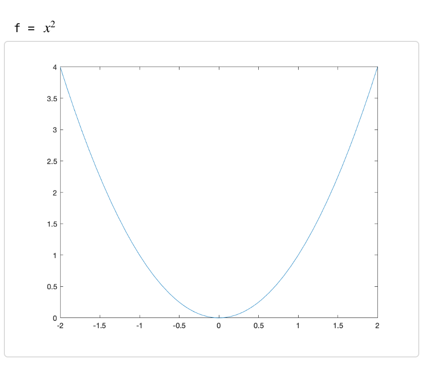
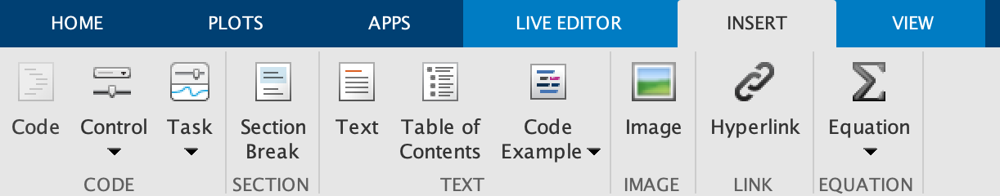
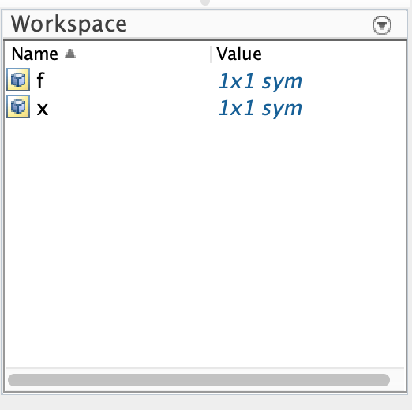
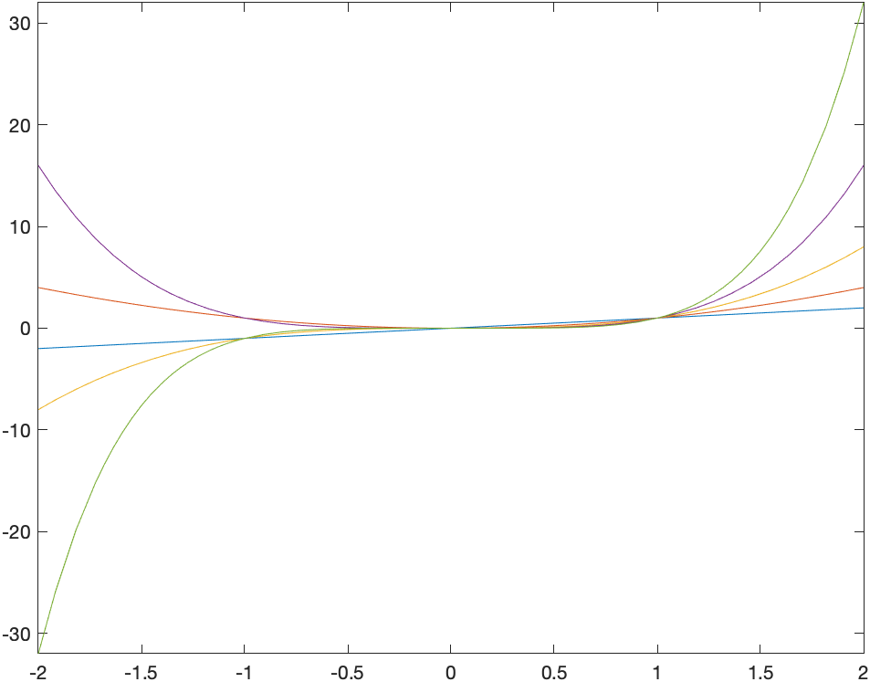

[Previous Chapter](ch-03.html) | [Return to all notes](index.html) | [Next Chapter](ch-05.html)

So far, we have been using Matlab for doing mathematical operations and showing plots.  We've been simplifying expressions, solving equations and producing plots.  In this chapter, we go beyond the basics of Matlab a bit deeper to show that it is a powerful computing environment and you need to know some deeper computing concepts to take advantage of this.

We take a step back from doing mathematics with Matlab and explore some of the details of how Matlab works and look at the structure of Matlab commands.  


Matlab's Live Editor Documents and Order of Entry
------

We started working with Live Script documents at the beginning of Matlab (although there are other ways to interact with Matlab).  This section discusses some more details about this. 

To get a new live Script, under the Home tab on the toolbar: 



click the _New Live Script_ button and you should see the main pane: 



You can enter commands in there.  For example, if we have
```
syms x
f = x^2
fplot(f,[-2 2])
```

And then run the run with either CTRL-ENTER (or CMD-ENTER on MacOS) or if you prefer using the mouse, on the _LIVE EDITOR_ tab of the toolbar:



click the _Run Section_ button and this will run all three commands and on the right edge of the Matlab window, you should see:



## Mixing Text and code in Matlab Live Editor Documents

Although by default, a document has just a single code block and you can enter as much in a code block as possible, it's easier to break up the document into sections and text as well. 

To enter text, place the cursor where you want text to appear and click the _Insert_ toolbar then the _Text_ button 




### Formatting Mathematics in a Matlab Live Document

We can format mathematics nicely in a live document using LaTeX


Variables and the Workspace Pane
-----

As we saw earlier, we can store anything in a variable using the `varname=obj` syntax where `varname` is any variable name (it can't start with a number) and `obj` is any Matlab object (expression, function, plot, etc.).

You can think of variables as on a grid on a white board with a column for the name and a column for the object.  For example, let's say you first define a symbolic variable `x` with `syms x` and then define a function with `f=x^2`.  Anytime you type in `f` in an expression, Maple will look up the value of the variable.

If later in your Maple document, you type `f=x^3`, then the previous object stored in `f` is erased and `x^3` is put in its place.  This won't change anything you've done previously, but anytime `f` is evaluated later it uses the updated value of `f`. 

Other things of interest about variables:

* In the lower right corner of Matlab, is called the Workspace: 

    
    The browser lists all of the variables that Matlab currently knows as well as the value of the variable.  You can

    1. view the value of the variable by clicking on the variable name.
    2. Edit/or delete the value by right-clicking and select how to edit. 

* to view the value of a variable you can just type the name of the variable and hit return.  If the variable has not been defined yet, there will be an error. 

* Another way to remove the value of a variable is using the `clearvars` command.  For example if `f=x^2`, then `f` has the value $x^{2}$.  To remove it,
    ```
    clearvars f
    ```    

* If you want to clear everything, you can click on the triangle in the upper right  of the Workspace Pane and select _Clear Workspace_ or inside a script `clear all`.  This can be helpful if you have a lot of variable defined and are getting confused what's going on. 


What is a command?
------

As mentioned above, many things that you do in Maple is a command. The commands that we've seen so far include

* `expand`
* `simplify`
* `fplot`

Recall that a command has the form:

```
name(arg1,arg2,...,opt1=value1,opt2=value2,...)
```
and an explanation of the following is:

* `name` is the name of the command.
* Immediately after the name is a `(` and don't put a space before it or you will try to multiply things.   
* The things `arg1,arg2,...` are called the arguments (or parameters) of the function.  For example, if plotting `arg1` is the expression that you wish to plot.
* the rest of it are called options.  The are separated by commas and can be anything (numbers, strings, etc.) that affect the command.  One example is plotting when you can change the style of the plot with various options.  We saw this in [ch-02.html](Chapter 2). 


Reading the Help in Maple
-----

Reading the help pages will get you a long ways in Maple.  Most help pages (Maple included) are pretty dull reading, if you can get a sense of how to read them, it will benefit you in the long-term.  

To open the help pages, go to *Help->Help Manual* in Maple (or type CONTROL(CMD)-F1 ) and you will see:


The easiest way to use the help manual is to search on a term.  Let's look at the help page of something that we have seen already, the `expand` command.  Search for this in the Help page and you should see:


First of all, this help page is similar to many standard Maple Help pages.  They include:

* **Name**: this gives the name and whether it is in a library.  If the name is in the form **XXX[yyyy]** then the name of the command is yyyy and it is in library XXX.  We will cover this later.
* **Calling Sequence**: this explains briefly what to type into the command to get it to run.
* **Parameters**: the arguments and options that can go into the command (briefly)
* **Description**: this describes the command in detail.  It often will contain links to other help pages and subpages.  There is often a lot of this that you may not understand.  Roll with it or ask your instructor.  
* **Examples**: this is a list of examples.  Generally, you can type the example in directly (or copy-paste them)

#### Exercises

Look up the expand command in the help browser and answer the following questions:
1.  What does the expand command do?
2. How many required arguments are needed?  Describe all of the required arguments.
3. What are the options of the command.  Describe what they do.
4. Expand the expression: $$\cos(x+y)$$
5. How would you expand the expression $$(x+y)^{2} + \sin(a-b)$$ to get $$x^{2}+2xy+y^{2}+\sin(a-b)?$$


Everything in Matlab is an Array
-----

We will often do something to a bunch of things (expressions, numbers).  In most cases, it will be easier to put all of the things in a common place.  We generally will use an array for this.  In fact we saw this in Chapter 2 when we plotted two functions on the same axes, such as
```
syms x
fplot([x^2 x^3], [-2 2])
```

Another example is
```
[1,2,3,4,5,6,7,8,9,10]
```

If we mix expressions and numbers, like
```
[4, x^2, sin(x), pi]
```
we get a symbolic array, that is the 4 and $\pi$ gets interpreted in a symbolic way. 


### Array of a formula sequence

Although it wasn't too tedious to type out the first 10 nonnegative integers, if we need, say the first 100 integers as an array, uggh!! Matlab fortunately has a nice way to do this
```
arr = 1:10
```
will return the same numeric array as above.   We can also, to similar patterns.  For example,
```
2:2:20
```
will return the even numbers from 2 to 20. 


#### Exercise

1. Search `colon` in the help browser and read up on this. 
2. Create the list `[1,4,7,10,13,16,19,...,52]`
3. Create the list `[25,20,15,10,5,0,-5,-10,-15,-20,-25]`.

Mapping an array to another array
-----

You can't make the array `[1,4,9,16,25,36,49,64]` using the colon syntax because the numbers aren't equally spaced (a requirement for the colon operator).  Instead we will do this with array operations.  

To generate the array of squares enter:
```
nums = (1:8).^2
```

If we want the reciprocals of the first 10 nonnegative integers: 
```
1./(1:10)
```
and the output is the decimal array: $[1.000\;0.5000\;0.3333\;0.2500\; 0.2000.\ldots]$.  Try removing the parentheses and see what happens.  

We can get the symbolic recipocals with the `sym` command and we will do much more of this in the next Chapter.  The result of

```
sym(1)./(1:10)
```
is
$$ \left[
    \begin{array}{cccccccccc}
    1 & \frac{1}{2} & \frac{1}{3} & \frac{1}{3} & \frac{1}{4} & \frac{1}{5} & \frac{1}{6} & \frac{1}{7} & \frac{1}{8} & \frac{1}{9} & \frac{1}{10}
    \end{array}
\right]$$


We can use this with symbolic variables too.  Enetering:
```
x.^(1:5)
```

returns the array $[x\; x^2\; x^3\; x^4\; x^5]$ and 
```
fplot(x.^(1:5),[-2 2])
```
produces the plot:



###Exercise

1. Start with the `nums` list as shown above, find the cube of each number in nums.
2. Consider the first 10 primes: [2,3,5,7,11,13,17,19,23,29].  Take each of these, subtract 1 and divide the result by 2.  Your output should be an array.  

## Numbers In a CAS

One of the powerful aspects of a CAS (Computer Algebra System) is the ability to handle different number types.  This differs from typically calculators in which there is only decimal number (what are called floating-points) and although many exact calculators to be performed as we will see.  Let's recall some mathematics of number types. 

* Integers: whole numbers and their negatives.  $\ldots, -3,-2,-1,0,1,2,3, \ldots$
* Rational Numbers: also called fractions like $-\frac{1}{2}, \frac{11}{6}$
* Decimals: fractions with powers of ten in the denominator.  These may be finite or not.  Examples: $3.\bar{3}$, $-1.25$, $3.1415926\ldots$. 
* Reals: the set of integers, rationals and decmials.
* imaginary: recall that $i$ stands for the number such that $i^2=-1$.  Examples are $7i, -\frac{5i}{3}$.
* complex: has the form $a+bi$ where $a$ and $b$ are real. Examples are $3+4i$ and $e + i\pi$. 

### Storing numbers in Computers

Matlab as the ability to store some of each of these numbers and it's important to know a little bit about how computers store numbers.  These fundamentally divide into two types: integers and floating-point numbers.  In short, a certain amount of memory is associated with each number and so there are limits.  

* _Computer-Based Integers_: typically an integer is stored with 64-bits and has a smallest and largest integer, and these values are about $-2^{63}\approx -9 \times 10^{18}$ to $2^{63}\approx 9 \times 10^{18}$. 

* _Floating-Point Numbers_: some decimals numbers can be stored as floating-point numbers and again there is a largest and smallest value.  Typically with a 64-bit number part of the number is used for the exponent and part for the abscissa, which gives the amount of precision (decimals places) used for a number. 

In many cases, you don't need to think about details of how the software you are using stores your number.  Actually, Matlab uses floating-point numbers for everything, which makes things easy to deal with, however, there a limitations with this.  


### Numbers in Matlab

As just mentioned, all numbers just typed in are floating-points and on most computer systems, these are called _double_ (short for double precision, which is 64-bit floating points). You can test the type of a number (or other things with the `class` function) such as 

`class(3.0)`


returns `'double'` but as does `class(3)`, so Matlab doesn't distinguish between these, whereas many programming languages and other software treats them differently.  One thing that you will need to determine is when this might matter and can be challenging. 

If you need to store an integer as an integer as we will see later, one way to do this is to force matlab to use as specific type.  For example if we want to store 3 in the variable named `n` as a integer, then we'll use

`n=int64(3)`

and if we enter `class(n)`, the we will see that it has the type `int64`, so a 64-bit integer. 

It seems like anytime that you have an integer that you should use `int64`, however, again, this needs some thought.  If we enter `n+3.6`, then the result is 7.  This is because the result is added to get 6.6 then rounded to the nearest integer.  Again, not generally what would initially be thought of or expected. 

### Symbolic Operations in Matlab

If you are looking for a way to do standard arithmetic operations much like we do mathematically, then you should consider doing symbolic operations.  Consider
\[ \frac{2^8-1}{11}\]
If you put in `(2^8-1)/11` into Matlab, the decimal 23.1818 is returned.  From a mathematical point of view, this makes me cringe a bit.  The result should be a fraction, so can't Matlab do that?

It can, in fact if we use the `sym` function.  For example: `x = sym((2^8-1)/11)` returns $\frac{255}{11}$, much more satisfying.  That is, we started with a rational number and the result is a rational.  And note that if we check the type of the number with `class(x)`, we get `sym`, saying that we get a symbolic type. 

Actually, if any part of the expression is a symbolic the entire expression is symbolic.  The result of `(2^8-sym(1))/11` also returns the same thing. 

### When to use what type?

We've seen three basic types of numbers in Matlab, doubles, integers (typically `int64`) and symbolic.  When should I use which type?

The answer is actually complicated.  It really depends.  Under most situations staying with the standard `double` type is fine and almost everything we do in this class with stay with this type. However, in some cases one of the other is better.  We'll see some example doing number theory in that we need to use either `int64` or symbolic.  

```

```

[Previous Chapter](ch-03.html) | [Return to all notes](index.html) | [Next chapter](ch-05.html)


