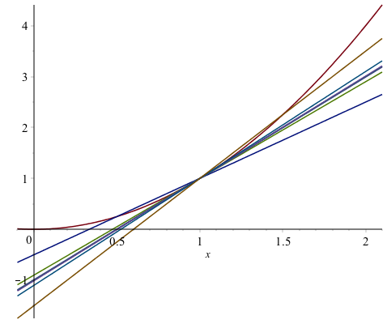
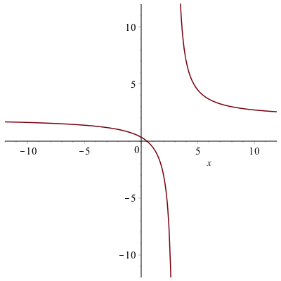
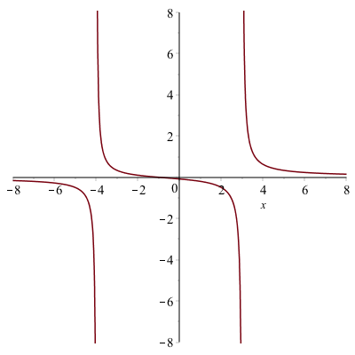
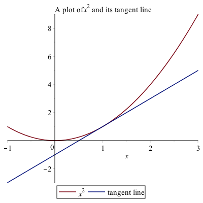
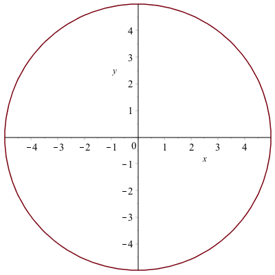

Differential Calculus Problems in Maple
========

This chapter covers how to perform many mathematics that arises from Calculus using a CAS like Maple.  As we will see, a CAS will often do limits and derivatives quite easily, allowing us to investigate the geometry of the derivative using a plot or a table of values, which are often helpful for gaining intuition about limits and derivatives.

Limits
-----

You may need to review the basics of a limit from Calculus.  If we say
$$L = \lim_{x \rightarrow 2} x^{2}$$
then $L$ is the value of the function $x^{2}$ as $x$ approaches 1 (from either side), but not at exactly 1.  We can examine this using a plot of the function:


And from the plot it appears that the limit is 1, however, you can never say precisely with a plot, but this can help verify a result.  

Another way to attack this is with a table.  Let's find the value of the function $f(x)=x^{2}$, at the points $x=0.9,0.99,0.999,1.001,1.01,1.1$.  We can do this easily with the `map` function.  If

```
f:=x->x^{2}
xvals := [.9, .99, .999, 1.001, 1.01, 1.1]
map(f,xvals)
```
will produce the function values of all of the $x$ values given or
```
[.81, .9801, .998001, 1.002001, 1.0201, 1.21]
```

It would be really nice to have a table formatted nicer.  If instead we typed
```
map(x->[x,f(x)],xvals)
```
then we get the following:
```
[[.9, .81], [.99, .9801], [.999, .998001], [1.001, 1.002001], [1.01, 1.0201], [1.1, 1.21]]
```
which still doesn't look nice, but if we wrap the function in `Matrix` as in:
```
Matrix(map(x->[x,f(x)],xvals))
```
it will look like: $$\left[ \begin {array}{cc}  0.9& 0.81\newline
0.99&0.9801\newline
0.999& 0.998001\newline
 1.001& 1.002001\newline
 1.01& 1.0201\newline
 1.1& 1.21\end {array} \right]
$$

and then the only other addition might be to label the columns, which can be done in the following way.  If we redo `xvals` to include a term $x$ at the front or:
```
xvals := [x,.9, .99, .999, 1.001, 1.01, 1.1]
```
then rerunning:
```
Matrix(map(x->[x,f(x)],xvals))
```
will result in the matrix $$\left[\begin{array}{cc} x &  x^{2}\newline
0.9 & 0.81 \newline
0.99&0.9801\newline
0.999& 0.998001\newline
 1.001& 1.002001\newline
 1.01& 1.0201\newline
 1.1& 1.21
\end{array}\right]$$

As you can now see from the table above, as $x$ gets closer to 1, $x^{2}$ gets closer to 1.  You're thinking, duh, $1^{2}=1$, which is true, but we often use a limit when you can't just evaluate a function at the point $a$.  

### Exercise
Reproduce the table above using $$f(x)= \frac{x^{2}-4}{x-2}$$
when $a=2$.  Use an appropriate set of points that are both less than and greater than 2.  Guess a value of the limit.  


### Using Maple's built-in Limit function.


Now, of course, Maple (and any CAS) will do the limit for us.  If you type out `limit`, hit the ESC key, select the first item, you will see:
$$\lim_{x\rightarrow a} f$$

and you can fill in $a$ and $f$ (and change $x$ if it's a different variable).  So doing this for the limit above results in:
$$\lim_{x \rightarrow 1}x^{2}$$

and Maple will return 1.  

###Exercise
Try evaluating the following limits:

1. \\[  \lim_{x \rightarrow 2} \frac{x^{2}-4}{x-2}\\]

2. \\[ \lim_{t \rightarrow 0} \frac{\sin t}{t}\\]

3. \\[ \lim_{x \rightarrow 1} \frac{\ln x}{x-1}\\]

Secant and Tangent Lines
------

Recall that a secant line through a function is the line that passes through the function at two points.  For example, consider the secant line through the function $f(x)=x^{2}$ that passes through the function when $x=1$ and $x=2$.  A plot of this is:


and you can see from the plot that indeed the line passes through the given points.  Also, recall to find the slope of the secant line, we'll need to evaluate the function at the $x$ values.  
```
f:=x->x^{2}
m:=(f(2)-f(1))/(2-1)
```
which is 3 in this case.  We can then use the point-slope form of the line with either the point $(1,1)$ or $(2,4)$.  

The reason that we discuss secant lines in Calculus, is that we want to know the tangent line, which is the line that just touches at a single point.  We can't find a line given only one point, but if we find a number of secant lines that pass through (1,1), we hopefully can find a trend that leads to the tangent line.  Then we will use calculus to do this precisely.  

If instead of defining the slope of the line through $(1,1)$ and $(2,4)$, instead, let's make a function that is the slope of the line that passes through $(1,1)$ and $(x,x^{2})$.

```
m:=x->(f(x)-f(1))/(x-1)
```

Now this will allow us to find the slope of the secant line for any point $x$.  We can also build a table like above.  
```
xvals := [1.5,1.9, 1.99, 1.999, 2.001, 2.01, 2.1,2.5]
Matrix(map)
```

And you will see $$\left[ \begin {array}{cc}  
0.5 & 1.500000000 \newline
0.9& 1.900000000\newline
0.99 & 1.990000000\newline
0.999& 1.999000000\newline
1.001& 2.001000000\newline
1.01& 2.010000000\newline
1.1& 2.100000000\newline
1.5& 2.500000000
\end {array}\right]$$

We can use this to estimate the tangent line of $m=2$ which we will verify below.


Visually, we can plot the secant lines and function as well.   If we type
```
lines:=map(t->m(t)*(x-1)+1,xvals)
```
we will get a list of lines out.  We can plot these together with the function by typing:
```
plot([x^2,op(lines)],x=-0.5..2.5
```
you will get the following plot:




This plot is awfully busy and hard to see.  However, we can animate the line by the following:
```
plots[animate](plot, [[x^2, m(t)*(x-1)+1], x = -.1 .. 2.1], t = xvals)
```

(or loading in the `plots` library first).  We will cover this in detail in the next chapter.  After this runs, you can play it sequentially with the play button or go through the frames one by one or loop it.  See the help page on `plots[animate]` for more details.  

###The tangent line

The actual tangent line to the curve $y=x^{2}$ can be found by taking the limit of the slopes of the secant lines or
```
limit(m(x),x=1)
```
will do the limit
$$\lim_{x \rightarrow 1} \frac{x^{2}-1}{x-1}$$
and return 2. Therefore the tangent line is
```
tanLine:=2*(x-1)+1
```
and a plot of the function with its tangent line at $x=1$ is given as


Asymptotes
------

In precalculus you were introduced to asymptotes of functions.  In generally, an asympote of a function is a line that the function approaches far from the origin.  In calculus, there is a more specific definition.  

###Horizontal Asymptotes

The line $y=L$ is a **horizontal asymptote** of a function $f(x)$ if
$$
\lim_{x \rightarrow \infty} f(x) = L
$$

or

$$
\lim_{x \rightarrow -\infty} f(x) = L
$$
and visually, you can see a horizontal asymptote by looking at a function and determining it is approaching a horizontal line as $x \rightarrow \infty$ or $x \rightarrow -\infty$.  

For example, consider the function
$$
f(x) = \frac{2x-1}{x-3}$$

A plot of this is



and (it's bit hard to see), but there is a horizontal asymptote which is about $y=2$.  (Recall that an asymptote is a line, so you should write it as such)

Since this is hard to see, we can use the definition above to find the limit.  Doing
$$
\lim_{x \rightarrow \infty} \frac{2x-1}{x-3}
$$

and

$$
\lim_{x \rightarrow \infty} \frac{2x-1}{x-3}
$$

returns 2 in both cases.  Therefore $y=2$ is the only horizontal asymptote.  

###Vertical Asymptotes

The definition of a vertical asymptote is a bit more complicated.  The line $x=a$ is a vertical asymptote of the function $f(x)$ if at least one of the following is true

* $\lim_{x \rightarrow a} f(x)=\infty$
* $\lim_{x \rightarrow a^{+}} f(x) = \infty $
* $\lim_{x \rightarrow a^{-}} f(x) = \infty $
* $\lim_{x \rightarrow a} f(x)=-\infty$
* $\lim_{x \rightarrow a^{+}} f(x) = -\infty $
* $\lim_{x \rightarrow a^{-}} f(x) = -\infty $

In other words, the limit (one-sided or both-sided) is infinite.

For the function seen above, the line $x=3$ is a vertical asympote because
$$\lim_{x \rightarrow 3^{+}} \frac{2x-1}{x-3}=\infty$$

Now this provides a way to prove that a vertical line is a vertical asymptote, but not how to find them.  If you have a rational function (polynomial over a polynomial), then possible vertical asympotes are where the denominator is 0.    For example, let's look at the function
$$R(x)=\frac{x^{2}-1}{x^{3}-13x+12}$$


We can find the possible vertical asymptotes by finding the zeros of the denominator or
```
solve(denom(R(x)))
```
which returns 1,3,-4.

If you check if each zero above is a vertical asymptotes, you will notice that the limit at $x=1$ is $-\frac{1}{5}$, and not infinite.  The left- and right-handed limits at $x=3$ and $x=-4$ are infinite, so those are vertical asympotes.  This is also consistent with the plot of the function:



###Using the built-in Asymptotes function

Maple also has the ability to find all of the asympototes using a built-in function.  First, let's load the `Student[Calculus1]` package:
```
with(Student[Calculus1]):
```
and recall to suppress the output of all of the commands that are imported, put a colon (:) at the end of the line.  Then type
```
Asymptotes(R(x))
```
returns `[y = 0, x = -4, x = 3]`, which saves a lot of work, but you should know how to find and show each is indeed an asymptote.  

Plots of functions with their asymptotes

We have seen that remove the artificial asymptotes, we use the `discont=true` option of the plot command, we make want to put them back on the plot in a better way.  Consider the function $$R(x) = \frac{4x^{2}-20x+16}{x^{2}+2x-15}$$

There is one horizontal asymptote of $y=4$ and two vertical asymptotes, $x=-5$ and $x=3$.  And we'd like to plot all of those on the same axes.  The line $y=5$ is easy to plot because it is just the function $5$, however the two vertical lines are not since they are not functions.  One way to do this is to find a pair of points on each line and plot the points.

```
va1:=[[-5,-10],[-5,10]]
```
are points on the line $x=-5$ and
```
va2:=[[3,-10],[3,10]]
```

It would appear that if we typed:
```
plot([R(x),5,va1,va2],discont=true)
```
then we would get the desired result.  However, we get the following error:
```
Error, (in plot) unable to determine the discontinuities
```
because of the two discontinuities.  Alternatively, here's how to take care of that:
```
plot1:=plot(R(x),discont=true)
plot2:=plot([5,va1,va2])
```
and then put the results together as
```
plots[display](plot1,plot2)
```

After adding legends to the plot (not the `plots[display]` command) and adjusting the plotting windows, the result is:


Derivatives
------

Since Maple can handle limits and a derivative is a limit, it should come at no surprise that Maple can handle derivatives.  For example, recall that the definition of the derivative of $f(x)=x^{2}$ is
$$ f'(x) = \lim_{h \rightarrow 0} \frac{(x+h)^{2}-x^{2}}{h} $$


If you enter in the limit into Maple, then you will get $2x$.  

Of course, Maple can do the derivative directly without the use of the limit.  There are two formats for the derivative (and a few ways to enter them).  First, if you have a  function defined, like `f(x):=x^2`, typing
```
f'(x)
```
returns $2x$.  This is also a nice format in that if we want the derivative at a point, say $x=2$, we can type `f'(2)`.  

Alternatively, we can use the $\frac{d}{dx}$ notation.  To get this, if you type `diff`, and hit ESC, the first menu item will be the $\frac{d}{dx}$ notation.  Type a function you will get a derivative.  For example,
$$\frac{d}{dx}x^{2}$$
returns $2x$.   (Note: you can also get this via the palette)

This notation and format is great if you have an expression (and not a function) already or don't want to create a function.  Note: if you use this and have more that one term separated by + or -, you need to put ( ) around the term.  For example, if you type
$$\frac{d}{dx}x^{3}+2x$$

maple will return $3x^{2}+2x$  (not the expected $3x^{2}+2$)  This is because the derivative of $2x$ is not performed.  To do this correctly, type

$$\frac{d}{dx}(x^{3}+2x)$$

which will return $3x^{2}+2$.  

###Higher Derivatives

Maple can also do 2nd-order and higher derivatives quite easily.  Here's an example.  Consider the function
```
g:=x->sin(pi*x)
```
then typing `g'(x), g''(x),g'''(x)` and so on will generate the first-, second- and third-derivative of $g$.  

To find higher-order derivatives with the alternative notation
$$\frac{d^{2}}{dx^{2}}g(x)$$

$$\frac{d^{3}}{dx^{3}}g(x)$$

will give you $-\pi^{2} \sin(\pi x)$ and $-\pi^{3} \cos(\pi x)$ as well.


Plots of a function with its tangent line
----

Consider the function $f(x)=x^{2}$.  Above, we saw the details of finding the secant line through this function to approximate the tangent line.  Here, however, we will just plot a function and it's tangent line.

The tangent line to the function at $x=1$ can be written using the point-slope form as
```
tanLine:=f'(x)(x-1)+f(1)
```
and then plotting the two is
```
plot([f(x), tanLine], x = -1 .. 3, title = typeset("A plot of %1 and its tangent line", x^2), legend = [f(x), "tangent line"])
```
resulting in the following plot.




Implicit Differentiation
------

If we have a function, then taking the derivative is done by hand using the rules of differentiation and in Maple using one of the techniques above.  However, we don't always have a function to represent a curve.  The classic example is a circle.  Consider the circle with radius 5:
$$x^{2}+y^{2}=25$$
It isn't a function (why not?), so we can't differentiate it like we can with a function.  And we still would like to find out geometric information like a tangent line to the curve at a point.  

This is where implicit differentiation helps us out.  By hand, taking the derivative implicitly on both sides of the equation above, leads to
$$2x+2y\frac{dy}{dx}=0$$
and solving for $dy/dx$ leads to
$$\frac{dy}{dx}=-\frac{x}{y}$$

To do this in Maple, there's only one important difference.  We need to tell Maple that the variable $y$ is actually a function of $x$, so whereever we see a $y$ in the equation, type $y(x)$.  

$$x^{2}+y(x)^{2}=1$$
and then take the derivative of this using the `diff` ESC version with the line number will result in
$$2x+\left(2y\frac{d}{dx}y(x)\right) = 0$$
and then we can use the `solve` command to find the result for the derivative.
```
solve((##),diff(y(x),x))
```

where \#\# is the line number of the equation above and you can leave `diff(y(x),x)` as is or ESC it to make it look nicer.  Either way, you will get:
$$-\frac{x}{y(x)}$$

Lastly, there is another way to do this.  Look at the `implicitdiff` command that is built-in to Maple.  See if you can find the derivative of $x^{2}+y^{2}=25$ using this command.

Let's say we want to find the tangent line to the curve at the point $(3,4)$.  If we plug the point into the derivative we will get $m=-3/4$ so the line will be $y=-\frac{3}{4} (x-3)+4$.  


Implicit Plots
-----

Maple can plot curves based on equations in an implicit manner.  The command `implicitplot` is a command in the `plots` package.
```
with(plots):
```
then we'll plot the circle $x^{2}+y^{2}=25$, then
```
implicitplot(x^2+y^2=25,x=-6..6,y=-6..6)
```
will give the following result.



If we also plot the tangent line to the curve using:
```
implicitplot([x^2+y^2=25,y=-3/4(x-3)+4],x=-6..6,y=-6..6,color=[red,blue],legend=[x^2+y^2=25,"tangent line"])
```


Note: if you are plotting curves with the `implicitplot` command, then all curves need to be as equations.  This is different than plotting with the `plot` command in that all curves must be expressions.  
