[Previous Chapter](ch-04.html) | [Return to all notes](index.html) | [Next Chapter](ch-06.html)

This chapter covers how to perform many mathematics that arises from Calculus using a CAS like Matlab.  As we will see, a CAS will often do limits and derivatives quite easily, allowing us to investigate the geometry of the derivative using a plot or a table of values, which are often helpful for gaining intuition about limits and derivatives.

## Limits

You may need to review the basics of a limit from Calculus.  If we say
$$L = \lim_{x \rightarrow 1} x^{2}$$
then $L$ is the value of the function $x^{2}$ as $x$ approaches 1 (from either side), but not at exactly 1.  We can examine this using a plot of the function:

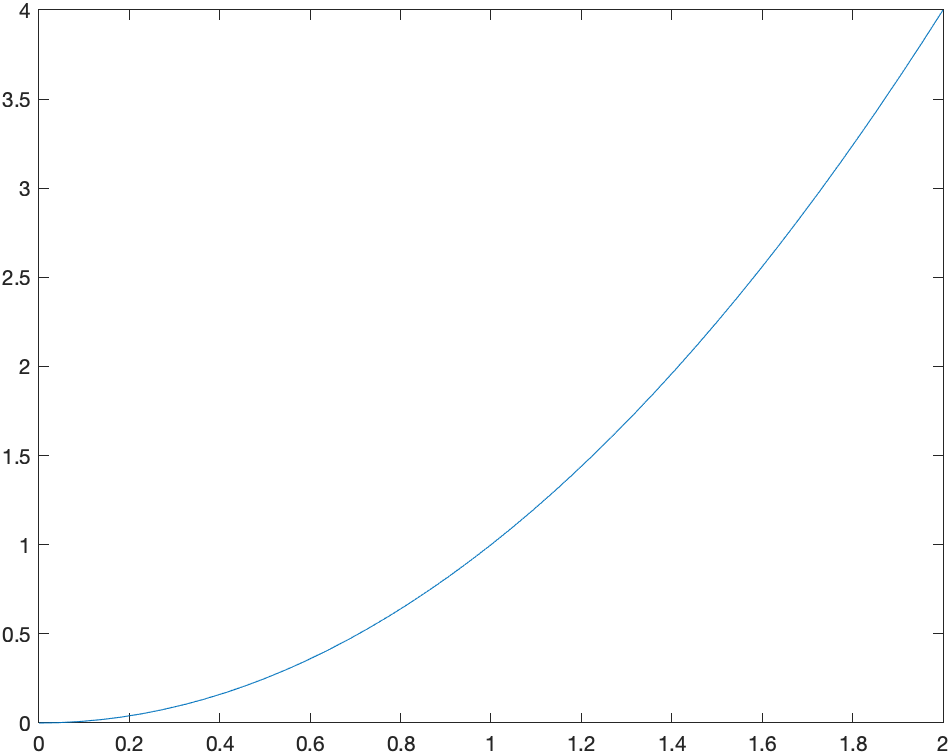

And from the plot it appears that the limit is 1, however, you can never say precisely with a plot, but this can help verify a result.

Another way to attack this is with a table.  Let's find the value of the function $f(x)=x^{2}$, at the points $x=0.9,0.99,0.999,1.001,1.01,1.1$.  We can do this easily with the `arrayfun` function.  If

```matlab
syms x
f(x) = x^2
xvals=[0.9,0.99,0.999,1.001,1.01,1.1]
yvals=double(arrayfun(@(x) f(x),xvals))
```

will produce the function values of all of the $x$ values given or

```matlab
[.81, .9801, .998001, 1.002001, 1.0201, 1.21]
```

Note: to find `yvals` must have a `double` as the outer function to switch back to floating point numbers.

We can make the this look a bit more like a table with

```matlab
transpose([xvals;yvals])
```

it will look like:

$$ \begin {array}{ll}
0.9& 0.81\\
0.99&0.9801\\
0.999& 0.998001\\
 1.001& 1.002001\\
 1.01& 1.0201\\
 1.1& 1.21\end{array}
$$

As you can now see from the table above, as $x$ gets closer to 1, $x^{2}$ gets closer to 1.  You're thinking, duh, $1^{2}=1$, which is true, but we often use a limit when you can't just evaluate a function at the point $a$.

### Exercise

Reproduce the table above using $$f(x)= \frac{x^{2}-4}{x-2}$$
when $a=2$.  Use an appropriate set of points that are both less than and greater than 2.  Guess a value of the limit.

### Using Matlab's built-in Limit function

Now, of course, Matlab (and any CAS) will do the limit for us.   If we enter

```matlab
limit(f(x),x,1)
```

then Matlab returns 1.

#### Exercise: Limits

Try evaluating the following limits:

1. $$ \lim_{x \rightarrow 2} \frac{x^{2}-4}{x-2}$$
2. $$\lim_{t \rightarrow 0} \frac{\sin t}{t}$$
3. $$\lim_{x \rightarrow 1} \frac{\ln x}{x-1}$$

## One-Sided Limits

Recall that a one-sided limit is a limit as $x \rightarrow a$, where only values either less than or greater than $a$.  As an example, let
$$
g(x) = \begin{cases}
1+x & x < 0 \\
x^2 & x \geq 0
\end{cases}
$$

and we can plot this (nicely) with

```matlab
fplot(x+1,[-3,0],'blue')
hold on
fplot(x^2,[0,3],'blue')
hold off
set(gca, 'XAxisLocation', 'origin', 'YAxisLocation', 'origin')
```

which results in:
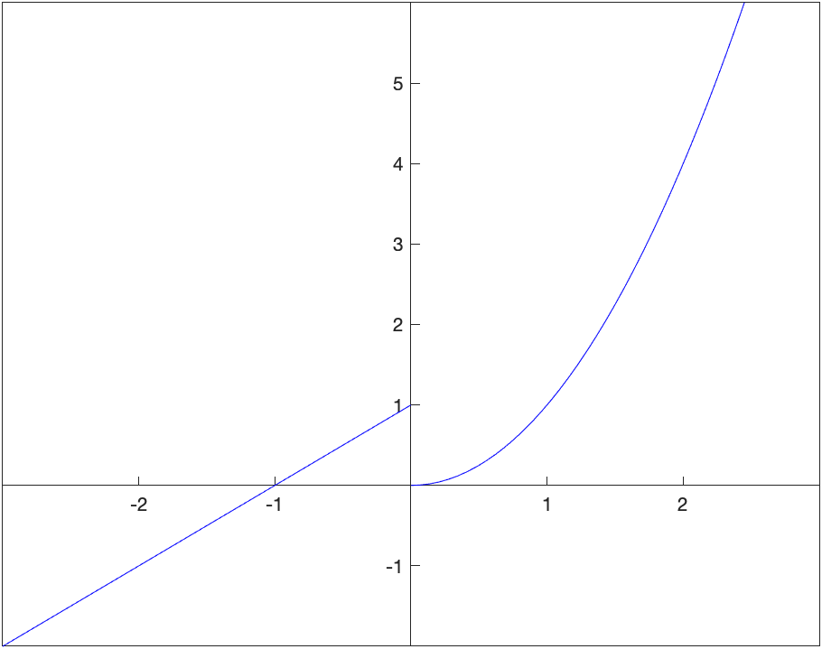

Looking at the plot, the left- and right-handed limits appear to be:
$$
\lim_{x \rightarrow 0^-} g(x) = 1 \qquad
\lim_{x \rightarrow 0^+} g(x) = 0
$$

and we can use Matlab to do this with

```matlab
limit(g(x),x,0,'left')
limit(g(x),x,0,'right')
```

returns 1 and 0 respectively.

### Exercise: One-sided Limits

Let
$$
h(x) = \begin{cases}
2x+3 & x < -2 \\
x^3 & -2 \leq x < 1 \\
\sin (\pi x) & x \geq 1
\end{cases}
$$

Find the following one-sided limits:

* $$\lim_{x \rightarrow -2^-} h(x) $$
* $$\lim_{x \rightarrow -2^+} h(x) $$
* $$\lim_{x \rightarrow 1^-} h(x) $$
* $$\lim_{x \rightarrow 1^+} h(x) $$

## Secant and Tangent Lines

Recall that a secant line through a function is the line that passes through the function at two points.  For example, consider the secant line through the function $f(x)=x^{2}$ that passes through the function when $x=1$ and $x=2$.  A plot of this is:

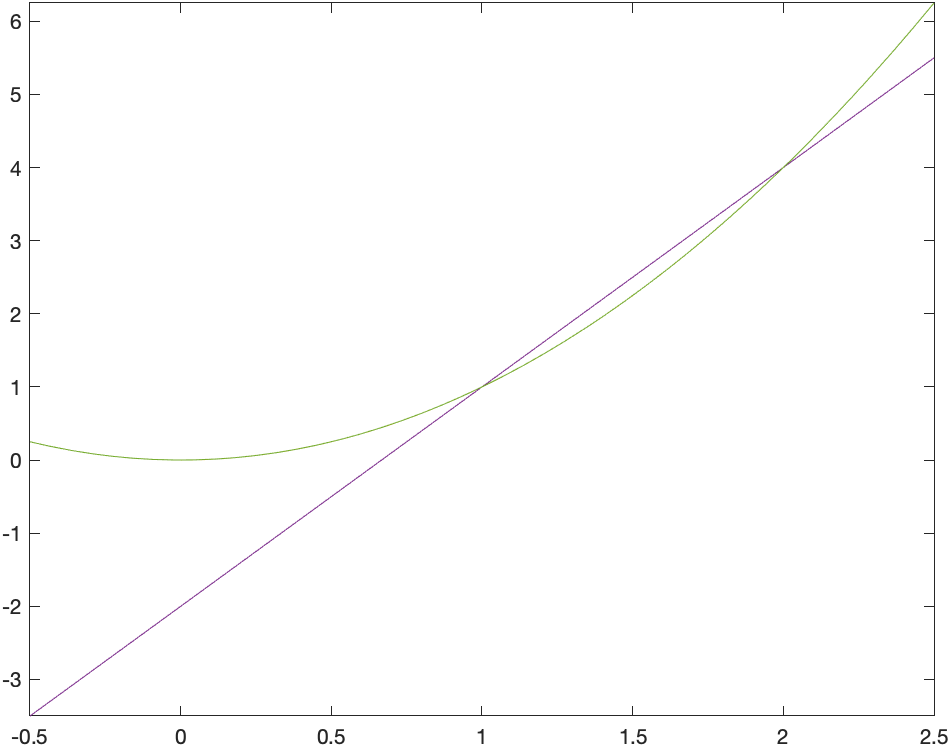

and you can see from the plot that indeed the line passes through the given points.  Also, recall to find the slope of the secant line, we'll need to evaluate the function at the $x$ values.

```matlab
f(x)=x^2
m = (f(2)-f(1))/(2-1)
```

which is 3 in this case.  We can then use the point-slope form of the line with either the point $(1,1)$ or $(2,4)$.

The reason that we discuss secant lines in Calculus, is that we want to know the tangent line, which is the line that just touches at a single point.  We can't find a line given only one point, but if we find a number of secant lines that pass through (1,1), we hopefully can find a trend that leads to the tangent line.  Then we will use calculus to do this precisely.

If instead of defining the slope of the line through $(1,1)$ and $(2,4)$, instead, let's make a function that is the slope of the line that passes through $(1,1)$ and $(t,t^{2})$.

```matlab
syms t
slope(t) = (f(t)-f(1))/(t-1)
```

Now this will allow us to find the slope of the secant line for any point $x$.  We can also build a table like above.

```matlab
xvals = [1.5,1.9, 1.99, 1.999, 2.001, 2.01, 2.1,2.5]
mvals = arrayfun(@(t) double(slope(t)),xvals)
transpose([xvals; mvals])
```

And you will see $$\begin {array}{ll}
1.5 & 3.500000000 \\
1.9& 3.900000000\\
1.99 & 3.990000000\\
1.999& 3.999000000\\
2.001& 4.001000000\\
2.01& 4.010000000\\
2.1& 4.100000000\\
2.5& 4.500000000
\end {array}$$

We can use this to estimate the tangent line of $m=4$ which we will verify below using the actual limit.

### The tangent line

Recall that the slope of the tangent line to a curve $f(x)$ at $x=c$ is given by
$$m = \lim_{x \rightarrow c} \frac{f(x)-f(c)}{x-c}$$

For the function $f(x) = x^2$, the slope is
$$m = \lim_{x \rightarrow 2} \frac{x^{2}-2^2}{x-2}$$
which can be done in Matlab with:

```matlab
limit((x^2-2^2)/(x-2),x,2)
```

and return 4. Therefore the tangent line is

```matlab
tanLine=4*(x-2)+2^2
```

and a plot of the function with its tangent line at $x=2$ is given as

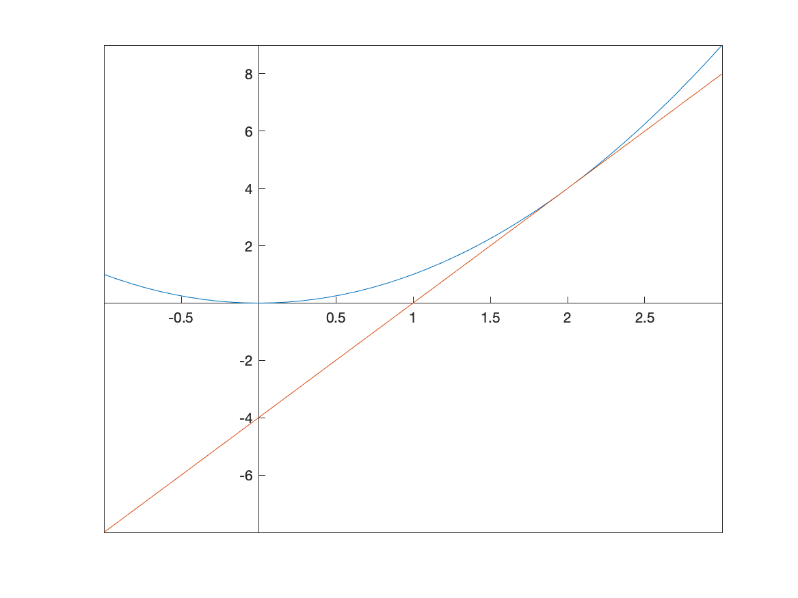

### Exercise: Tangent Line

Use the definition of the tangent line like above to find the tangent line to the curve
$$ y= \frac{1}{x+1}$$ at $x=1$. Plot the function and the tangent line on the same axes.

## Asymptotes

In precalculus you were introduced to asymptotes of functions.  In generally, an asympote of a function is a line that the function approaches far from the origin.  In calculus, there is a more specific definition.

### Horizontal Asymptotes

The line $y=L$ is a **horizontal asymptote** of a function $f(x)$ if
$$
\lim_{x \rightarrow \infty} f(x) = L
$$

or

$$
\lim_{x \rightarrow -\infty} f(x) = L
$$
and visually, you can see a horizontal asymptote by looking at a function and determining it is approaching a horizontal line as $x \rightarrow \infty$ or $x \rightarrow -\infty$.

For example, consider the function
$$
f(x) = \frac{2x-1}{x-3}$$

which we will

A plot of this is

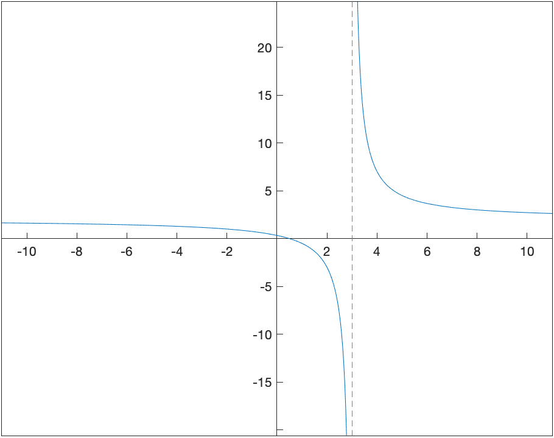

and (it's bit hard to see), but there is a horizontal asymptote which is about $y=2$.  (Recall that an asymptote is a line, so you should write it as such)

Since this is hard to see, we can use the definition above to find the limit.  Doing
$$
\lim_{x \rightarrow \infty} \frac{2x-1}{x-3}
$$

and

$$
\lim_{x \rightarrow -\infty} \frac{2x-1}{x-3}
$$

returns 2 in both cases.  Therefore $y=2$ is the only horizontal asymptote.

### Vertical Asymptotes

The definition of a vertical asymptote is a bit more complicated.  The line $x=a$ is a vertical asymptote of the function $f(x)$ if at least one of the following is true

* $\lim_{x \rightarrow a} f(x)=\infty$
* $\lim_{x \rightarrow a^{+}} f(x)=\infty$
* $\lim_{x \rightarrow a^{-}} f(x)=\infty$
* $\lim_{x \rightarrow a} f(x)=-\infty$
* $\lim_{x \rightarrow a^{+}} f(x)=-\infty$
* $\lim_{x \rightarrow a^{-}} f(x)=-\infty$

In other words, the limit (one-sided or both-sided) is infinite.

For the function seen above, the line $x=3$ is a vertical asympote because it appepars from the plot that
$$\lim_{x \rightarrow 3^{+}} \frac{2x-1}{x-3}=\infty$$

but we can use limits to do this with:

```matlab
f(x) = (2*x-1)/(x-3)
limit(f(x),x,3,'left')
limit(f(x),x,3,'right')
```

which returns $-\infty$ and $\infty$ respectively.

Now this provides a way to prove that a vertical line is a vertical asymptote, but not how to find them.  If you have a rational function (polynomial over a polynomial), then possible vertical asympotes are where the denominator is 0.    For example, let's look at the function
$$R(x)=\frac{x^{2}-1}{x^{3}-13x+12}$$

We can find the possible vertical asymptotes by finding the zeros of the denominator or

```matlab
R(x)=(x^2-1)/(x^3-13*x+12)
solve(x^3-13*x+12==0)
```

which returns 1,3,-4.

If you check if each zero above is a vertical asymptotes, you will notice that the limit at $x=1$ is $-\frac{1}{5}$, and not infinite.  The left- and right-handed limits at $x=3$ and $x=-4$ are infinite, so those are vertical asympotes.  This is also consistent with the plot of the function:

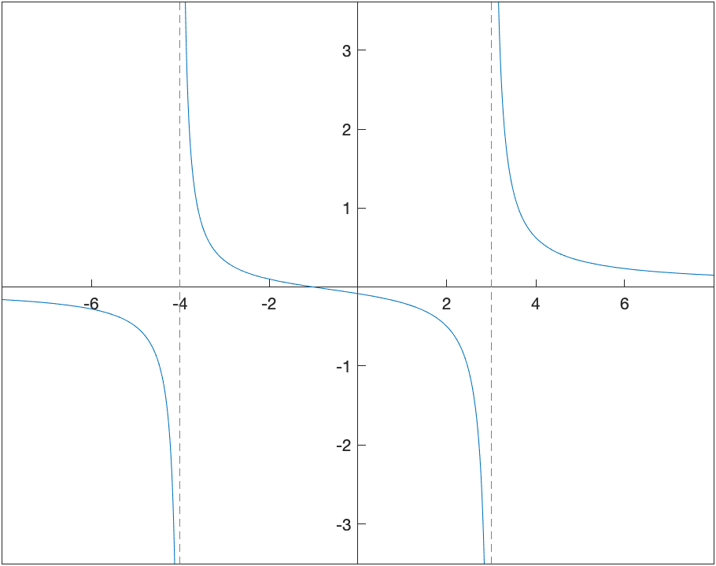

### Plots of functions with their asymptotes

 Consider the function $$R(x) = \frac{4x^{2}-20x+16}{x^{2}+2x-15}$$
which can be plotted with:

```matlab
Q(x) = (4*x^2-20*x+16)/(x^2+2*x-15)
fplot(Q(x),[-15,15])
set(gca, 'XAxisLocation', 'origin', 'YAxisLocation', 'origin')
```

and the result is:
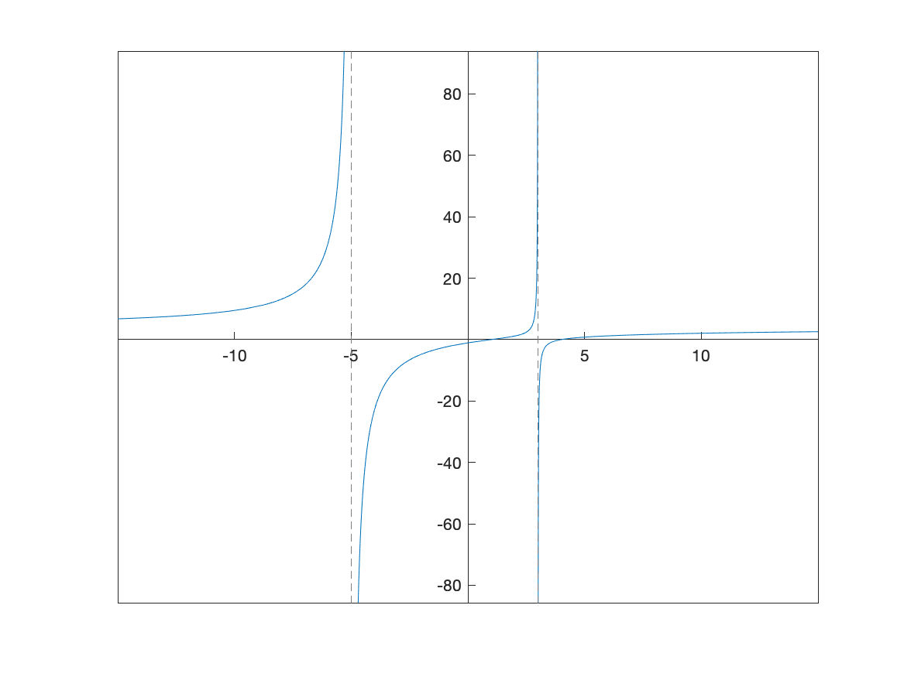

One can see the two vertical asymptotes, $x=-5$ and $x=3$ however, you can't see the horizontal asymptote.  Recall that if we do:

```matlab
limit(Q(x),x,inf)
limit(Q(x),x,-inf)
```

these both return 4, so the horizontal asymptote is $y=4$. Let's plot this above with:

```matlab
fplot(Q(x),[-15,15]);
hold on
fplot(4,[-15,15],'--')
hold off
set(gca, 'XAxisLocation', 'origin', 'YAxisLocation', 'origin')
```

resulting in
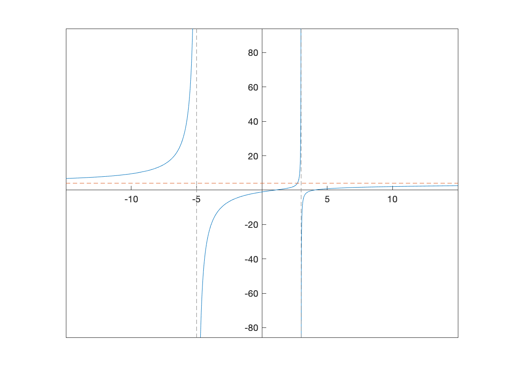

## Derivatives

Since Matlab can handle limits and a derivative is a limit, it should come at no surprise that Matlab can handle derivatives.  For example, recall that the definition of the derivative of $f(x)=x^{2}$ is
$$ f'(x) = \lim_{h \rightarrow 0} \frac{(x+h)^{2}-x^{2}}{h} $$

If you enter in the limit

```matlab
syms x h
limit(((x+h)^2-x^2)/h,h,0)
```

you get $2x$.

Of course, Matlab can do the derivative directly without the use of the limit using the `diff` command:

```matlab
diff(x^2,x)
```

returns $2x$.

### Exercise: Derivatives

Find the following derivatives:

* $\displaystyle y=\sin(2x)$
* $x^2 e^{-3x}$
* $\dfrac{\ln(x^2+1)}{\tan(x)}$

### Higher Derivatives

Matlab can also do 2nd-order and higher derivatives quite easily.  Here's an example.  Consider the function

```matlab
g(x)=sin(pi*x)
```

then one can find the first three derivatives or  $g'(x), g''(x),g'''(x)$ with

```matlab
diff(g(x),x)
diff(g(x),x,2)
diff(g(x),x,3)
```

## Plots of a function with its tangent line

Consider the function $f(x)=x \sin 2x$.  We will find and plot the tangent line at $x=\pi/6$ and $\pi/2$.

```matlab
f(x)=x*sin(2*x)
```

Above, we saw the details of finding the secant line through this function to approximate the tangent line.  Here, however, we will just plot a function and it's tangent line.

Of course, we need the derivative of the function, which we will define as a function:

```matlab
df(x) = diff(f(x),x)
```

then we can find the tangent lines using the slope-intercept form:

```matlab
tanLine1 = df(pi/6)*(x-pi/6)+f(pi/6)
tanLine2 = df(pi/2)*(x-pi/2)+f(pi/2)
```

and then plotting the function and the lines can be done with

```matlab
fplot([f(x),tanLine1,tanLine2],[0,pi])
legend("x sin(2x)","tangent line at \pi/6","tangent line at \pi/2")
S =  sym(0:pi/6:pi);
xticks(double(S))
xticklabels(arrayfun(@texlabel,S,'UniformOutput',false))
```

where the tick labels have been set to be multiples of $\pi/6$, which we saw in [Chapter 2](ch-02.html).  The result is the following plot.

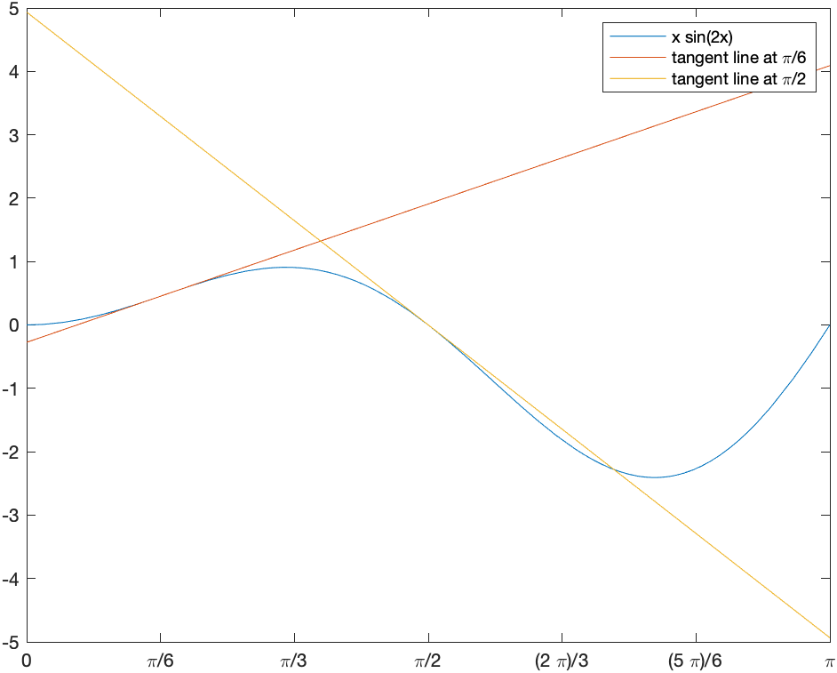

## Implicit Differentiation

If we have a function, then taking the derivative is done by hand using the rules of differentiation and in Matlab using one of the techniques above.  However, we don't always have a function to represent a curve.  The classic example is a circle.  Consider the circle with radius 5:
$$x^{2}+y^{2}=25$$
It isn't a function (why not?), so we can't differentiate it like we can with a function.  And we still would like to find out geometric information like a tangent line to the curve at a point.

This is where implicit differentiation helps us out.  By hand, taking the derivative implicitly on both sides of the equation above, leads to
$$2x+2y\frac{dy}{dx}=0$$
and solving for $dy/dx$ leads to
$$\frac{dy}{dx}=-\frac{x}{y}$$

To do this in Matlab, we can do the following.  First define the function like

```matlab
syms y(x)
circle = x^2+y(x)^2 ==25
```

where it is important to write any $y$ terms as `y(x)` and we have to tell Matlab that $y$ is a symbolic functino.  Now we can take the derivative:

```matlab
dcirc = diff(circle,x)
```

which returns:
$$2\,x+2\,y\left(x\right)\,\frac{\partial }{\partial x}\;y\left(x\right)=0$$
and matlab makes a curly 'd' which means partial derivative.  Don't worry about this.

Now unfortunately, Matlab doesn't have the ability to solve for the derivative (or substitute something else for the derivative), so we will retype this:

```matlab
syms dydx
solve(2*x+2*y*dydx==0,dydx)
```

which returns
$$-\frac{x}{y\left(x\right)}$$
the same result as above.

This is a little clunky.  We now show an alternative to this.

### Implicit Function Theorem

So technically this comes from Multivariate Calculus, but it's not too difficult.

_Implicit Function Theorem_: If we have an equation of the form $F(x,y)=c$, for any constant $c$, then the derivative is
$$\frac{dy}{dx} = -\frac{F_x}{F_y}$$
where
$$F_x = \frac{\partial F}{\partial x} \qquad F_y = \frac{\partial F}{\partial y}$$
The squiggly d is called  partial derivative meaning that you take the derivative with respect to that variable keeping the others constant.

We can do this in Matlab with

```matlab
syms x y
F(x,y) = x^2+y^2
dydx = -diff(F(x,y),x)/diff(F(x,y),y)
```

where we needed to tell Matlab now `y` is a symbolic variable (not a function, like it was defined above). The result is

$$
-\frac{x}{y}
$$
which is the same as above.

### Implicit Derivative Exercise

Find $dy/dx$ if $(x^2+y^2)\sin x = (x^2-y^2) \cos x$. Hint: rewrite the equation in the form $F(x,y)=0$ and use the implicit function theorem.

## Implicit Plots

We can plot the implicit equation $x^2+y^2=25$ using the `fimplicit` command as

```matlab
syms x y
fimplicit(x^2+y^2-25, [-6 6 -6 6])
daspect([1 1 1])
set(gca, 'XAxisLocation', 'origin', 'YAxisLocation', 'origin')
```

and results in
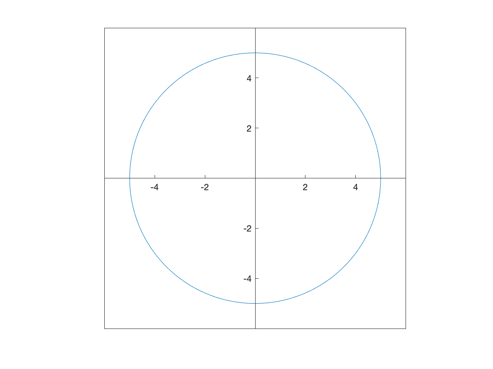

We'll see `fimplicit` a little later in the book.

### Finding and plotting the tangent line to an implicit curve

Now that we have an expression for the derivative, we can find the tangent line as we did above.  However, the main difference is that we need a point (both $x$ and $y$ coordinates) on the curve to evaluate the slope.

Consider finding the tangent line to the circle above at the point $(3,4)$.  The slope is the point plugged into the derivative that we stored in the variable `dydx` as

A plot of both the circle and the tangent line is

```matlab
fimplicit(x^2+y^2==25)
hold on
fplot(tanline)
hold off
xlim([-6 6])
ylim([-6,8])
daspect([1 1 1])
set(gca, 'XAxisLocation', 'origin', 'YAxisLocation', 'origin')
```

Note that the `xlim` and `ylim` lines are there to improve the plotting window, the `daspect` line sets the aspect ratio to 1 (so the circle looks like a circle) and the `set...` line makes the origin like we're used to it.

The result is

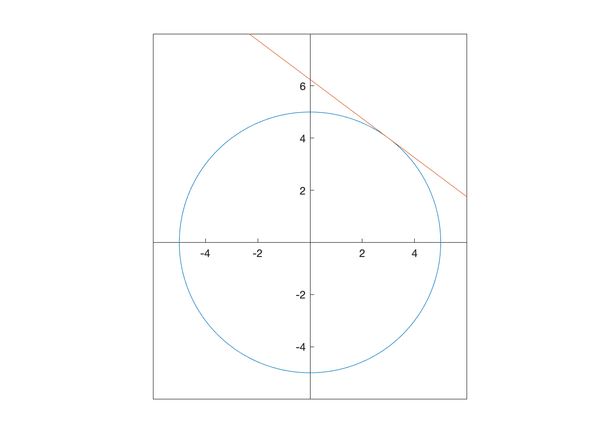

### Exercise: Tangent lines of implicit curves

There is a class of implicit curves called _elliptic curves_ that have the form
$$y^2=x^3+ax+b$$
we will plot the curve
$$y^2=x^3-4x+1$$

1. Plot the curve. You should see a connected loop as well as a part that looks similar to half a hyperbola.
2. Show that the point $(-1,2)$ is on the curve.  Hint: plug the point into the equation and check if satisfies it.
3. Find $\frac{dy}{dx}$ using the implicit function theorem shown above.  Define $F(x,y)$ such that the equation is $F(x,y)=c$.
4. Find the tangent line to the curve at $(-1,2)$.
5. Plot the curve and the tangent line.

## Finding $d^2y/dx^2$ implicitly

Add this section.

[Previous Chapter](ch-04.html) | [Return to all notes](index.html) | [Next chapter](ch-06.html)
