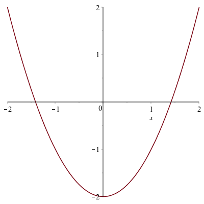

Plotting in Maple
======

We have already seen that Maple has some great plotting capabilities.  In this chapter, we will see a number of other plots that Maple (and most CAS programs) can handle. 

The plots library
------

Except for the function plots, the plots that we will see here are in the plots library which are loaded with the command:
```
with(plots):
```

Take a look at the help page (overview) of this library to see what is in it. 

Function Plots
------

We have seen a function plot in other places.  Here are some other details:


Implicit Plots
------

If a you have a function of $x$ and $y$ and would like to visualizes the set of points that satisfy the curve, then `implicitplot` is what you want to use.  


###Implicit Plot of one equation

```
implicitplot(x^2+y^2=25,x=-5..5,y=-5..5)
```

will give the following plot:



###Finding the derivative of an implicit curve

Recall that we can use the `implicitdiff` command to find the derivative of an implicit curve at a point.  For example, let's say that we wish to find the tangent line to the circle above at the point $(3,4)$.  

If we define the circle to be
```
circle:=x^2+y^2=25
```
then we can find the derivative by typing
```
implicitdiff(circle,y,x)
```
and Maple returns $$-\frac{y}{x}$$. and we can then use the `subs` command to evaluate this at a point. 
```
subs([x=3,y=4],(#))
```
where (#) is the line number of the derivative.  The result should be $-4/3$ and then you can find the tangent line using the point slope form:
```
tanLine:=-4/3*(x-3)+4
```

###Implicit Plot of more than one equation


```
implicitplot([x^2+y^2=25,y=-3/4*(x-3)+4],x=-1..2,y=-1..2,color=[red,blue])
```


###Exercise 

1. Plot the cardiod given by $x^2+y^2 = (2x^2+2y^2-x)^2$
2. Find the tangent line to the curve at $P(0,-1/2)$.  


Parametric Plots
------

A parametric graph or parametric curve is one in which the $x$ and $y$ coordinates depend on another variable, often $t$.  For example
$$x=5\cos t \qquad y=5\sin t$$
is another way to write a circle with center at the origin and radius of 5. 

This is because if we plug these functions into the equation $x^2+y^2=25$, then 
$$
(5 \cos t)^2+(5\sin t)^2=25
$$
or
$$25\cos^2 t+25\sin^2 t=25$$
which is true for all $t$ because $\cos^2 t + \sin^2 t =1$.  

To plot this in Maple, we use the `plot` command with a different syntax. 
```
plot([5*cos(t),5*sin(t),t=0..2pi])
```
will produce the following circle. 


which is the same plot as the implicit one above.  

###Tangent line to a parametric curve

To make some things easier, let&#8217;s define
```
x:=t->5*cos(t)
y:=t->5*sin(t)
```

We can also find the tangent line to a parametric curve in the following way.  The derivative $\frac{dy}{dx}$ to a curve can be written:
$$
\frac{dy}{dx} = \frac{\frac{dy}{dt}}{\frac{dx}{dy}}
$$

To find the deriavative to the circle above at the point $(3,4)$, we need to find the $t$ value at the point.  We can do this by solving for $t$ by setting $x=3$ and $t=4$.  (It's recommended to use the `Roots` command on the interval `0..`$\pi/2$ because the point is in the first quadrant.)

```
Roots(x(t)=3, t = 0 .. (1/2)*Pi)
```
returns  $[\arccos(3/5)]$
and
```
Roots(y(t)=4, t = 0 .. (1/2)*Pi)
```
returns  $[\arcsin(4/5)]$.  They seem to given different answer, but they are equivalent. 

If we substitute either of these into the derivative above:
```
subs(t=arccos(3/5),y'(t)/x'(t))
```
and then simplify it.  The result is $-3/4$, the same answer as above using implicit differentiation.  


The tangent line then is the curve
```
tanLine:=-3/4(x-3)+4
```
again, the same as above.  


Polar Plots
------

It is often that one will use polar coordinates to perform a plot.  We will see a few examples where this is helpful.  If a function is written in polar coordinates, then it is written in the form $r=f(\theta)$, 

Common Options
------

* `view` which changes the viewing window.  Note: you should change the plotting domain as well with this. 
* `legend` which adds a legend. 
* `color` which changes the color.


Multiple plot types and the `display` command
------


Scatter Plots
------

animated plots
------

Three Dimensional Plots
------