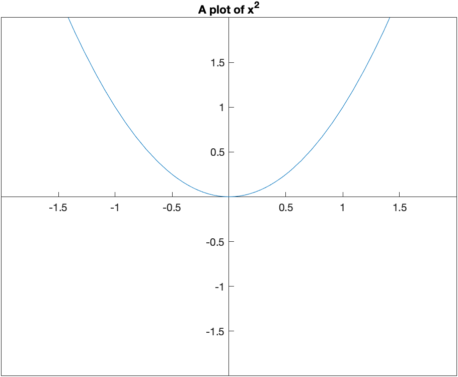

Applications of Derivatives
=======

Increasing and Decreasing Functions
-----------

Recall that a function is increasing at the point $x$ if $f'(x)>0$ and it is decreasing if $f'(x) \lt 0$.  Maple can help us understand functions and where they are increasing and decreasing using a combination of solving inequalities and taking the derivative.

Here&#8217;s an example.  Find the intervals where $f(x)=x^3-15x^2+27x-4$ is increasing the intervals were the function is decreasing. To solve this we will defined the function:
```
f:=x->x^3-15x^2+27x-4
```
and then we can find where the function is increasing
```
solve(f'(x)>0,x)
```
and the result is shown as `RealRange(-`$\infty$`, Open(1)), RealRange(Open(9),`$\infty$`)`, which can be written in the standard way as $(-\infty,1)\cup(9,\infty)$.

The inteval of decrease is found with `solve(f'(x)<0)` resulting in `(Open(1),Open(9))` which is the standard interval $(1,9)$. 

We can see this using the following plot of the function:



and looking carefully, the function is increase from $-\infty$ to 1 and then also from 9 to $\infty$.  It is decreasing on the interval $(1,9)$.  

Mean Value Theorem
-------

Recall that the Mean Value Theorem is as follows:

Let $f$ be a function that is continuous on $[a,b]$ and differentiable on $(a,b)$.  There exists a value $c$ in $(a,b)$ such that
$$f'(c)=\frac{f(b)-f(a)}{b-a}$$

In short, the MVT says that for nice functions, there is a tangent line that is parallel to the secant line.  This is nicely visualized using a CAS like Maple.   Let&#8217;s consider the function $f(x)=x^2+x$ on the interval $[0,2]$.  Since this function is continuous and differentiable everywhere, it satisfies the Mean Value Theorem, and therefore there is a $c$ such that 
$$
f'(c) = \frac{f(2)-f(0)}{2-0} = \frac{6-0}{2} = 3
$$
and then we can find the $c$ by solving $f'(c)=2c+1=3$ or $c=1$.  Next, we plot both the function and the secant line:


and as can be seen, the tangent line appears to be parallel to the secant line.  Whenever the conditions of the Mean Value Theorem are satisified, this has to be true. 

Critical value and Relative Maxima
-----

A critical value of a function $f$ is a number $x$ in the domain of the function such that $f'(x)=0$ of $f'(x)$ does not exist. 

Find all of the critical points of the function: $f(x)=x^3-15x^2+27x-4$

In this case, we solve where the derivative is 0.
```
solve(f'(x)=0,x)
```
and maple returns $1,9$.  Both of the these points are critical points.  Since this is a polynomial, the derivative is defined everywhere so there are no places where the derivative is undefined.  So the only cricial points are at $1$ and $9$.   

###Example

Find all of the critical points of the function $g(x) = |x^2-4|$.  

If we define:
```g:=x->|x^2-4|```
and then 
```
solve(g'(x)=0,x)
```

returns 0.  Is this the only critical points?  Let's take a look at a plot of this:


Looking at the plot, there is indeed a critical point at $x=0$ because $f'(0)=0$, but it also appears that there are critical points where the derivative is undefined at $x=-2$ and $x=2$.  Let's see how Maple can help find these.

If we differentiate $g$, the we get `2x*abs(1,x^2-4)`.  In short, `abs(1,x^2-4)` means the derivative of the absolute value.  It basically translates to the sign of the function.  Check out the help page on abs for more information. 

To find the critical poins of this, we need to find where the function $x^2-4$ is zero or `solve(x^2-4=0,x)`, which returns $-2,2$.  Thus there are three critical points of this function, $-2, 0,2$.  

###Relative Extrema

A *relative minimum* of $f$ is a number $f(c)$, such that $f(x) ≥ f(c)$ for all $x$ near $c$.  A *relative maximum* of $f$ is a number $f(c)$, such that $f(x) \leq f(c)$ for all $x$ near $c$.  The term *relative extrema* is either a relative minimum or maximum. 

As an example, let&#8217;s return to the function $f(x)=x^3-15x^2+27x-4$.  From the plot reproduced here:


There appears to be a relative minimum of $f(9)=-239$ and a relative maximum of $f(1)=17$.  As always it&#8217;s very difficulty to tell exactly the location(s) of relative extrema.  

**Theorem** A number $f(c)$ is an *relative minimum* if $c$ is a critical value and $f'(x) \lt 0$ for $x \lt c$ and $f'(x) \gt 0$ for $x \gt c$.  A number $f(c)$ is a *relative maximum* if $c$ is a critical value and $f'(x) \gt 0$ for $x \lt c$ and $f'(x) \lt 0$ for $x \gt c$.

In short, if $c$ is a critical value and $if'$ switches sign from positive to negative, then $f(c)$ is a relative maximum.  If $f'$ switches sign from negative to positive, then $f(c)$ is a relative minimum.  Also, 

Often, we can build a chart of the value of the derivative and let's let Maple help us do this. 

First, recall that we found the critical values of the function to be $1,9$.  If we pick a value to the left of 1, between 1 and 9 and to the right of 9 and evaluate the derivative, we can determine that in fact, we have relative minima and maxima.

```
xValues:=[x,0,1,5,9,12]
```

then the following will evaluate the derivative at these points:

```
Matrix(map(a->[a,f'(a)],xValues))
```

which returns the matrix:
$$\begin{array}{cc}
x&f'(x)\newline
0&27\newline 
1&0\newline 
5&-48\newline
9&0\newline 
12&99\end{array}
$$

So the derivative goes from positive to negative across $x=1$, so that is a location of a relative maximum.  And the derivative goes from negative to positive across $x=9$, so that is a relative minimum.  

###Example

Find all relative extrema of $g(x)=|x^2-4|$.  

From above, the critical point are $-2,0,2$. And if we repeat the steps above:
```
xValues:=[-3,-2,-1,0,1,2,3]
```

```
Matrix(map(a->[a,g'(a)],xValues))
```
returns an error:  *Error, (in simpl/abs) abs is not differentiable at 0* because at $-2$ and $2$, the derivative is not defined.  Let's throw those points out:

```
xValues:=[-3,-1,0,1,3]
```

```
Matrix(map(a->[a,g'(a)],xValues))
```
$$\begin{array}{cc}
x&g'(x)\newline
-3 & -6 \newline
-1 & 2 \newline
0 & 0 \newline
1 & -2 \newline
3 & 6 \end{array}
$$
and remembering that the function is undefined at $x=-2$ and $x=2$, then the derivative switches sign from negative to positive at $x=-2$, so it is relative min, the derivative switches sign from positive to negative at $x=0$, so it is a relative max and the derivative switches sign from negative to positive at $x=2$, so it is a relative min.   

###Exercise

Find all relative extrema of $(x^3-4x)^{1/3}$.  Hint: use the `surd` command.  You should use a plot, but to show they are relative extrema, find all critical points as above and evaluate the derivate at points between critical points.  

###Relative Extrema and the Second Derivative

There is an alternative way to test for relative extrema by using the second derviative.  Generally, it's often easier to use if the second derivative exists. 

**Theorem**  If $f'(c)=0$ and $f''(c)>0$, then $f(c)$ is a relative minimum.  If $f'(c)=0$ and $f''(c)&lt 0$, then $f(c)$ is a relative maximum. 

###Example

Use the theorem above to find the relative extrema of $f(x)=x^3-15x^2+27x-4$.  

Again, if we find the $x$ values where the derivative is 0 (Note: we did this above), using:
```
solve(f'(x)=0,x)
```
we get $1,9$ again.  And since $f''(1)= -24$, $f(1)$ is a relative maximum and since $f''(9)=24$, then $f(9)$ is a relative minimum.  

###Example

Can we use the above theorem to find the relative extrema of $g(x)=|x^2-4|$?

We can for the critical value of $x=0$ and since $g''(0)=-2$, then $g(0)$ is a relative maxmium.  However, since the derivative (and therefore second derviative) is not defined at $x=-2$ and $x=2$, then we can't use this theorem for these critical points.  The theorem above about the swtiching signs of the derivative still holds.  

###Exercise

Use the above theorem to find the relative extrema of $f(x)=e^{-x}(x^2-6x-6)$

Absolute Maxima and Minima
-------


###Extrema Value Theorem

*If $f$ is continuous on a closed interval $[a,b]$, then $f$ attains an absolute maximum value $f(c)$ and an absolute minimum $f(d)$ at some numbers $c$ and $d$ in $[a,b]$.*


