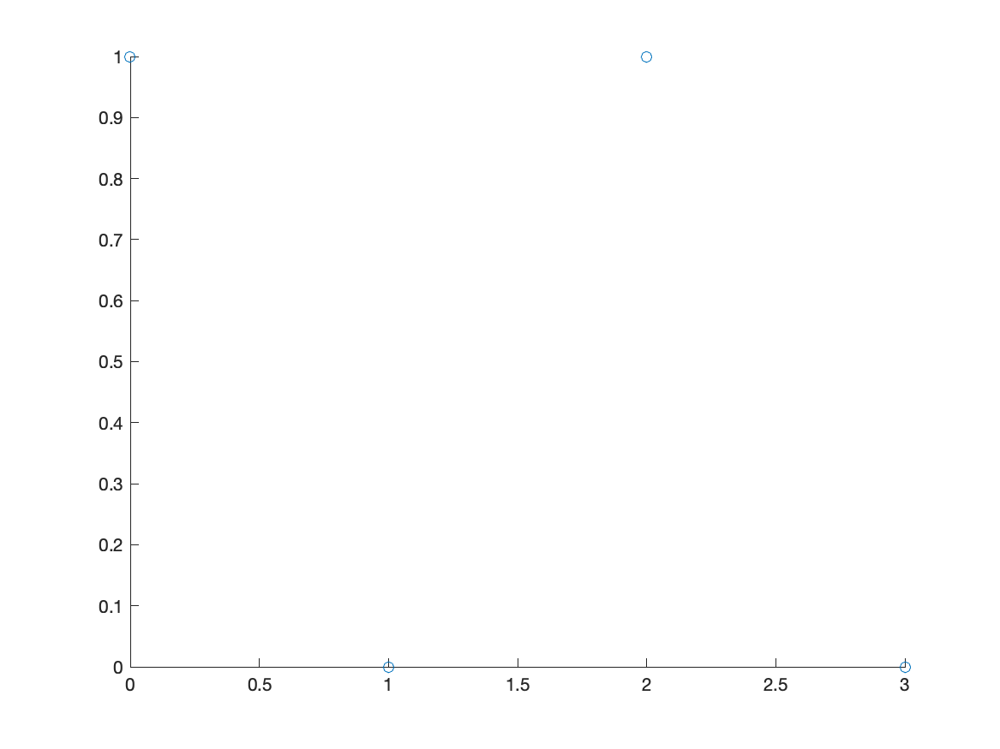
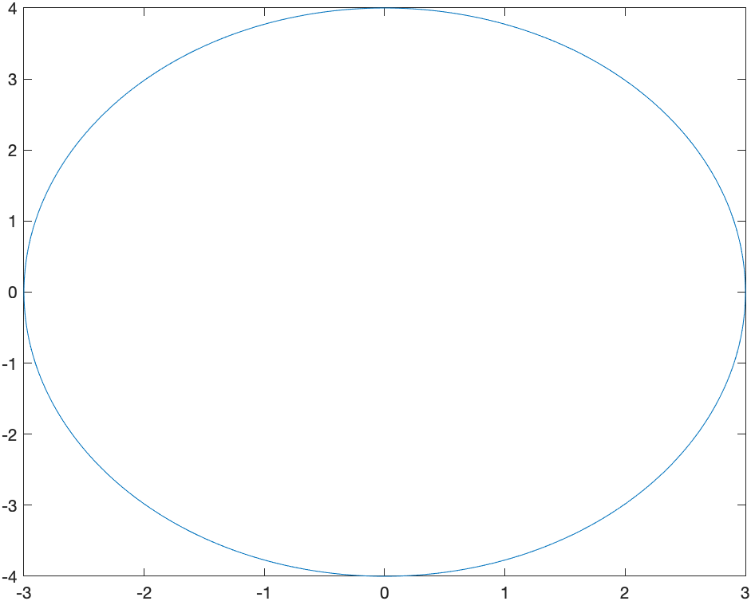
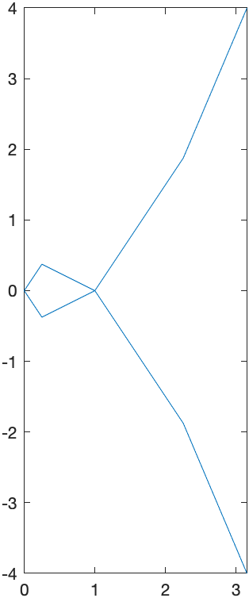
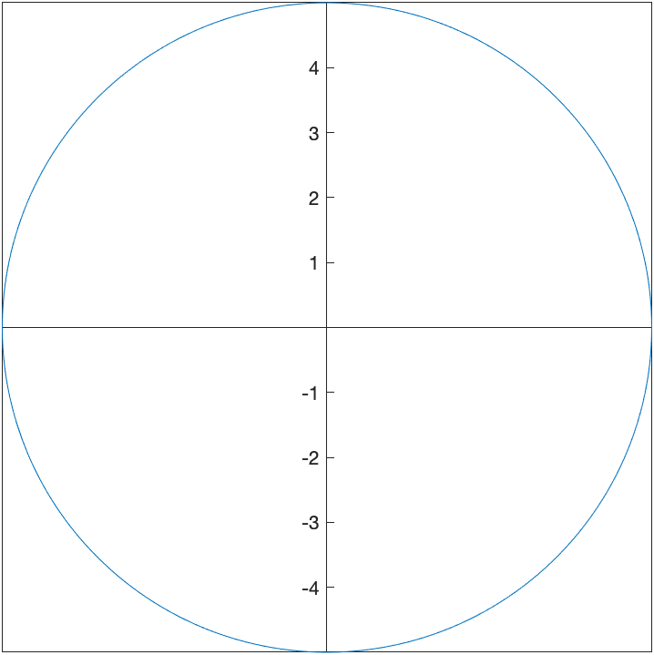
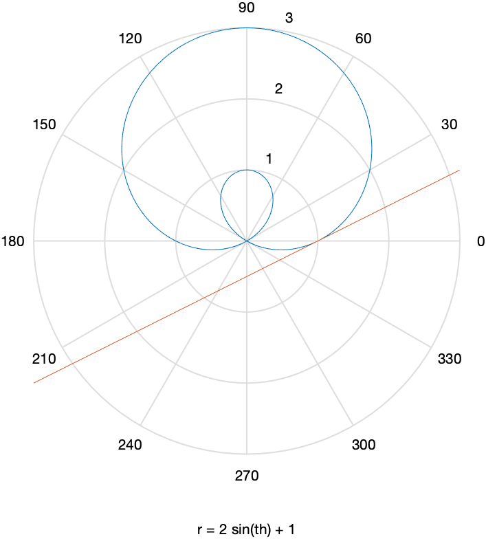

[Previous Chapter](ch-06.html) | [Return to all notes](index.html) | [Next chapter](ch-08.html)


We have already seen that Matlab has some great plotting capabilities.  In this chapter, we will see a number of other plots that Matlab (and most CAS programs) can produce. Note: we covered many of these in [Chapter 2](ch-02.html), but are repeated here so everything is in one chapter. 


### Plotting Functions

In order to plot the expression $x^{2}$, try typing `fplot(x^2)`. You should see a plot similar to


### Changing the Plotting Window of a plot

Typically, the easiest way to change the plotting window of the plot is to use an option in the plot command. For example, if we want a plot on the interval $[-2,2]$, then typing `fplot(x^2,[-2 2])` will produce the plot:

![Plot of $x^{2}$ on $[-2,2]$](images/ch02/plot02.png)

If you want to make sure that the axes include other y values, you can adjust the limits after the fact.  After you have the plot, try
```
fplot(x^2,[-2 2])
ylim([-2 2])
```
which will generate: 


If you’d like a title on your plot, you can add the title option. For example, try
```
fplot(x^2,[-2 2])
title("A plot of x^2")
```
and you will see


Notice that matlab does some fancy formatting in that it formats `x^2` as a power.  You can put latex commands in the title (we will see what latex is later in the course.)

### Using Coordinate Axes

The standard way that Matlab plots functions is to use a box style with the tick marks on the bottom and left of the box.  If instead, you desire the standard coordinate axes, you can apply: 
```
set(gca, 'XAxisLocation', 'origin', 'YAxisLocation', 'origin')
```
after any plot. 
For example, the plot above with the plotting window adjusted as:
```
fplot(x^2,[-2 2])
ylim([-2 2])
title("A plot of x^2")
set(gca, 'XAxisLocation', 'origin', 'YAxisLocation', 'origin')
```
will produce:


### Changing the tick marks

A plot of $\cos x$ on $[-2\pi,2\pi]$, can be generated with:
```
fplot(cos(x),[-2*pi 2*pi])
```
and  looks like:


and I'm sure you noticed (since you are quite astute) that the tick marks are in integers and it would be nice to see the function plot in fractions of $\pi$ instead.  We can change this with the `xticks` and `xticklabels` functions.  Here is a cosine plot with some nicer ticks:
```
fplot(cos(x),[-2*pi 2*pi])
S =  sym(-2*pi:pi/2:2*pi);
xticks(double(S))
xticklabels(arrayfun(@texlabel,S,'UniformOutput',false))
```

and the result is:

![Plot of $\cos(x)$ on $[-2\pi,2\pi]$](images/ch02/plot05.png)

Before just plowing on, let's go through those last statements in detail.  The line:
```
S =  sym(-2*pi:pi/2:2*pi);
```
creates an array of symbolic values from $-2\pi$ to $2\pi$ by steps of $\pi/2$.  (Take the semicolon off the end of the line and rerun to see). The line
```
xticks(double(S))
```
sets the xticks to the numerical values (that's what the `double` function does) to the numbers in `S`.  Then 
```
xticklabels(arrayfun(@texlabel,S,'UniformOutput',false))
```
set's the tick labels on the x-axis to the values in `S`.  We'll see the `arrayfun` later and the `@texlabel` function is a way to ensure that the latex command is used to make things look better.  Again, we'll talk about latex later in the course. 

Make a mental note that this allows us to change the x-ticks to multiples of $\pi$ is a much nicer way.  You'll need this later.  

### Plotting multiple functions

Often, we would like to include more that one function on a single set of axes. Here is how to plot both $x^2$ and $x^3$. 
```
fplot([x^2, x^3],[-3,3])
```

The result is:


### Adding a Legend

A legend is important for any plot containing more than one function. This allows you to distinguish between the curves. There is a legend option to the plot function. For example, to add a legend and a title to the plot of $x^{2}$ and $x^{3}$ type:

```
fplot([x^2 x^3], [-3,3])
title("A plot of x^2 and x^3")
legend("x^2","x^3")
```
and you will see:


## Changing the Aspect Ratio of a Plot

Recall that the function $f(x)=\sqrt{4-x^2}$ is the top half of a circle.  If we plot this with 
```
fplot(sqrt(4-x^2),[-2 2])
```
we'll get the following plot:


and this just doesn't look like a circle.  This is because the aspect ratio isn't 1--this means that 1 unit in the x-direction and 1 unit in the y-direction are not equal.  

We can do that in Matlab with the following:

```
fplot(sqrt(4-x^2),[-2 2])
daspect([1 1 1])
```
and the result is:


Note: there are three numbers here because we will see 3D plots need can have different aspects as well.  Matlab does this in general by ensuring that it know the relative sizes of all three axes. 
 

Piecewise Functions
--------

Another common plot is that of a piecewise function, consider
$$f(x) = \begin{cases} x & x<0 \\ 3-x^{2} & x \geq 0 \end{cases}$$

Recall that a piecewise function is a function $f$ takes on the values of $x$ when $x<0$ and when $x \geq 0$, then it has the functional form $3-x^2$.  We wil plot this by creating a plot with two different curves on it. 


The way to enter this in is the following:
```
f = piecewise(x<0,x,x>=0,3-x^2)
fplot(f, [-3 3])
```
and this results in the following plot:


The vertical line connecting (0,0) with (0,3) is not part of the plot.  Matlab simply just connects a bunch of points.  Sometimes it seems that it can figure out that it's not part of the plot. Unfortunately, if it doesn't automatically remove the line, you need to do something different, like the following:

```
fplot(f,[0,3])
hold on
fplot(f,[-3,-0.0001])
hold off
```
which first plots the function on the interval $[0,3]$, then holds the plot which means that we can add additional graphs on the plot.  Then we plot the function on $[-3,-0.0001]$, which is just an approximation of 0--if you put in 0, you get the same results as above. Lastly, `hold off` switches the plot back to normal (meaning don't add additional graphs).  

The result is


which is better but it looks like two different curves becaues the two pieces are different colors.  We can set them both to be the same color with:
```
fplot(f,[0,3],'blue')
hold on
fplot(f,[-3,-0.0001],'blue')
hold off
```


#### Exercise 

Plot the piecewise function: 

$$
    f(x) = \begin{cases}
    1-(x-\pi/2)^2 & x > \frac{\pi}{2} \\
    1 & -\frac{\pi}{2} \leq x \leq \frac{\pi}{2} \\
    \sin x & x < -\frac{\pi}{2} \\
    \end{cases}
$$

Plotting Functions with discontinuities
------

Although Matlab doesn't often pick up on jump discontinuities from piecewise functions, it seems to do well with infinite discontinuities.  Consider:

```
fplot(1/(x-1),[-3,3])
```
which has the result: 


The vertical dashed line is a vertical asymptote in this case.  

#### Exercise

Plot $f(x) = \tan(x)$ on $[-3\pi,3\pi]$ and use multiples of $\pi/2$ for the horizontal labels.  Hint: see above to do this.  Does Matlab correctly pick up the vertical asymptotes in this case? 


Scatter Plots
----

A scatter plot is a set of points plotted in the $xy$-plane.  Consider the points $(0,1),(1,0),(2,1),(3,0)$.  We will see how to plot this. 

For this, we create a vectors of the x points and y points:
```
x=[0,1,2,3]
y=[1,0,1,0]
```
and the call the function `scatter`:

```
scatter(x,y)
```
resulting in



Notice that the points by default are open circles, which are hard to see. The next exercise goes through how to change the type and size. 

#### Exercise

1. Search for `scatter` in the help documentation.  There is a number of ways to change the size, shaped and color of the dots. 
2. Create a plot that looks like:


At the bottom of the `scatter` documentation has all of the options.

Combining Scatter and Function Plots
-----
We can combine a scatter and function plots  using the `hold` command. Let's say we have the points: (0,10),(2,9),(3,7),(5,6),(7,4),(8,2) and we wish to plot a best fit line as well.  First, let's define the points

```
x = [0,2,3,5,7,8];
y = [10,9,7,6,4,2];
```
The best-fit line can be found to be $y=10.8665-0.9680x$ and we will show how to do this later. 

```
scatter(x,y,100,'blue','filled');
hold on
fplot(@(x) 10.8665-0.9680*x,[-0.5,9])
hold off
```
Note: above, we have generally done `fplot(10.8665-0.9680*x,[0.5,9])` to plot the line.  However, becase we defined `x` to be an array of points, this won't work.  Try it!! The `@(x)` is way to redeclare `x` as a different variable.  We'll see this more later.  


This will produce a plot that looks like:


Implicit Plots
------

If a you have a function of $x$ and $y$ and would like to visualize the set of points that satisfy the curve, then `fimplicit` is what you want to use.  For example, the circle with center of the origin and radius 5 is 

```
syms x y
fimplicit(x^2+y^2==25)
daspect([1 1 1])
```

will give the following plot:


where the aspect ratio has been set to 1 to make the circle like a circle.  Another example where this is needed is:

```
fimplicit(x^2/9+y^2/16==1)
```
generates

and is an ellipse, but just doesn't look right without changing the plotting window and the aspect ratio. 

The commands:
```
fimplicit(x^2/9+y^2/16==1)
xlim([-5 5])
ylim([-5 5])
daspect([1 1 1])
set(gca, 'XAxisLocation', 'origin', 'YAxisLocation', 'origin')
```
results in 


### Multiple Implicit Curves

If we want to plot the circles $x^2+y^2=r^2$ for $r=1,2,3,4$, we could do 4 implicit curves.  This points out that an alterative is to write then differently.  We could write the circle of radius 1 as
$$x^2+y^2-1=0$$
instead and recall that this is the set of all points that make this equation 0.  If we combine that with the circle of radius 2 by
```
two_circles = (x^2+y^2-1)*(x^2+y^2-4)
```
then this is still all the points that make this equation zero, but it could be the set of points on the circle of radius 1 or radius 2. If we define:
```
circles = (x^2+y^2-1)*(x^2+y^2-4)*(x^2+y^2-9)*(x^2+y^2-16)
```
and plot the results with
```
fimplicit(circles)
daspect([1 1 1])
```

we get 


### Plotting an implicit curve and a tangent line.  

In [Chapter  5](ch-05.html), we found the tangent line to the elipitic curve
$$y^2=x^3-4x+1$$
at the point $(-1,2)$
with the following step.  First the plot is

```
syms x y
elliptic_curve = y^2==x^3-4*x+1
fimplicit(elliptic_curve)
daspect([1 1 1])
```
which is 


and we can find the tangent line with 
```
F(x,y) = lhs(elliptic_curve)-rhs(elliptic_curve)
dydx = -diff(F(x,y),x)/diff(F(x,y),y)
m = subs(dydx,[x y], [-1 2])
tanLine = m*(x+1)+2
```
which shows the tangent line is
$$ y = \frac{7}{4}-\frac{x}{4}$$
and although we could plot it implicitly with the curve by setting both equal to zero, instead we'll use the hold function

```
fimplicit(elliptic_curve)
hold on
fplot(tanLine)
hold off
title("Elliptic curve and the its tangent line")
legend("y^2=x^3-4x+1","tangent",'Location','northwest')
daspect([1 1 1])
```
which shows that 


###Exercise

1. Plot the cardiod given by $x^{2}+y^{2} = (2x^{2}+2y^{2}-x)^{2}$
2. Find the tangent line to the curve at $P(0,-1/2)$.  


Parametric Plots
------


A parametric graph or parametric curve is one in which the $x$ and $y$ coordinates depend on another variable, often $t$.  In general, we write
$$x=f(t) \qquad y=g(t)$$

A nice example is
$$x=t^{2} \qquad y=t^{3}-t$$

For a given set of values of $t$, the $x$ and $y$ values can be found by plugging into the functions $x(t)$ and $y(t)$.  

First define $x(t)$ and $y(t)$ in Matlab:
```
syms t
x(t) = t^2
y(t) = t^3-t
```
and then we can make a table with:
```
xvals = arrayfun(@(t) x(t),-2:0.5:2)
yvals = arrayfun(@(t) y(t),-2:0.5:2)
[-2:0.5:2; xvals; yvals]'
```

$$\begin{array}{c|c|c}
t & x & y &  \\ \hline
-2 & 4 & -6
-1.5 & 2.25 & -1.875 \\
-1 & 1 & 0 \\
-1/2 & 1/4 & -3/8 \\
0 & 0 & 0 \\
1/2 & 1/4 & 3/8 \\
1 & 1 & 0 \\
1.5 & 2.25 & 1.875 \\
2 & 4 & 6 
\end{array}$$

We can plot the points in Matlab with:
```
plot(xvals,yvals)
daspect([1 1 1])
```
and this leads to 



Of course Matlab also has the direct way of plotting a parametric curve with 
```
fplot(x(t),y(t),[-2 2])
```
which leads to 


### Another example

The parametric curve given by
$$x=\cos t \qquad y=\sin t$$
for $0\leq t \leq 2\pi$ is another way to write a circle with center at the origin and radius of 1.

This is because if we plug these functions into the equation $x^{2}+y^{2}=1$, then
$$
(\cos t)^{2}+(\sin t)^{2}=1
$$
which is true for all $t$ because $\cos^{2} t + \sin^{2} t =1$.  

We can plot this with
```
fplot(cos(t),sin(t),[0 2*pi])
set(gca, 'XAxisLocation', 'origin', 'YAxisLocation', 'origin')
daspect([1 1 1])
```
which results in


We can shift any curve horizontally and vertically in the following way, which we'll show using an example.  If we shift the circle above right 3 and up 2, we'll get the circle with center $(3,2)$.  This curve can be written:
$$x=3+\cos t \qquad y=2+\sin t$$
and plotting with a window that includes the origin is:


And we can make this an ellipse by multiplying the $\cos t$ and $\sin t$ terms by constants.  For example,

$$x=3+1.5\cos t \qquad y=2+0.8\sin t,$$ if we enter

```
fplot(1.5*cos(t)+3,0.8*sin(t)+2,[0 2*pi])
set(gca, 'XAxisLocation', 'origin', 'YAxisLocation', 'origin')
xlim([-1 5])
ylim([-1 5])
daspect([1 1 1])
```

where the scaling is constrained so that the ellipse looks like an ellipse.  


### Tangent line to a parametric curve

Here we reproduce the tangent line to the circle of radius 5 at the point $(3,4)$.  

The parametric curve given by
$$x=5\cos t \qquad y=5\sin t$$
for $0\leq t \leq 2\pi$ is another way to write a circle with center at the origin and radius of 5.

To plot this in Matlab, we use the `fplot` command with a different syntax.
```
syms t
fplot(5*cos(t),5*sin(t),[0,2*pi])
set(gca, 'XAxisLocation', 'origin', 'YAxisLocation', 'origin')
daspect([1 1 1])
```
will produce the following circle.



which is the same plot as the implicit one above.  


To make some things easier, let&#8217;s define
```
x(t)=5*cos(t)
y(t)=5*sin(t)
```

We can also find the tangent line to a parametric curve in the following way.  The derivative $\frac{dy}{dx}$ to a curve can be written:
$$
\frac{dy}{dx} = \frac{\frac{dy}{dt}}{\frac{dx}{dt}}
$$

To find the derivative to the circle above at the point $(3,4)$, we need to find the $t$ value at the point.  We can do this by solving for $t$ by setting $x=3$ and $y=4$. 

```
t1 = solve(x(t)==3)
t2 = solve(y(t)==4)
```
The first returns
$$\left(\begin{array}{c}
-\mathrm{acos}\left(\frac{3}{5}\right)\\
\mathrm{acos}\left(\frac{3}{5}\right)
\end{array}\right)$$
and the second returns
$$\left(\begin{array}{c}
\mathrm{asin}\left(\frac{4}{5}\right)\\
\pi -\mathrm{asin}\left(\frac{4}{5}\right)
\end{array}\right)$$

For each, there are two values (remember the way that solving trig functions work from Chapter ??? ).  Let's see which one is correct by plugging back into the functions $x$ and $y$. 
```
x(t1)
y(t1)
```
and the first returns:
$$\left(\begin{array}{c}
3\\
3
\end{array}\right)$$
with the second
$$\left(\begin{array}{c}
-4\\
4
\end{array}\right)$$
showing that the second value of `t1` is the correct value of t.  

Alternatively if we look at 
```
x(t2)
y(t2)
```
the first returns
$$\left(\begin{array}{c}
3\\
-3
\end{array}\right)$$
and the second returns
$$\left(\begin{array}{c}
4\\
4
\end{array}\right)$$
This shows that the first value of `t2` is correct.  

To find the derivative at a point, we use the following:
```
dydx(t) = diff(y(t),t)/diff(x(t),t)
```
which returns:
$$-\frac{\mathrm{cos}\left(t\right)}{\mathrm{sin}\left(t\right)}$$
And to find the slope, we need to plug in the value of $t$ found above.  It was the second element of `t1` so 
```
dydx(t1(2))
```
which return $-3/4$.  Alternatively, we can use the first element of `t2` or
```
dydx(t2(1))
```
which also returns $-3/4$. 

Note that if just type out the value of $t$, we get a bit of a mess:
```
dydx(acos(3/5))
```
the result is 
$$-\frac{\mathrm{cos}\left(\frac{522020799781813}{562949953421312}\right)}{\mathrm{sin}\left(\frac{522020799781813}{562949953421312}\right)}
$$
which isn't as nice as $-3/4$.  The reason this happened is because `acos(3/5)` gave a result of 0.9273... which is rounded off a bit and then Matlab using an exact version of that number as a fraction.  


The tangent line then is the curve
```
sym x
tanLine=-3/4(x-3)+4
```

```
fplot(5*cos(t),5*sin(t),[0,2*pi])
hold on
fplot(tanLine)
hold off
daspect([1 1 1])
xlim([-8 8])
legend("x^2+y^2==1","tangent line")
```


with give the following plot:


Polar Plots
------

It is often that one will use polar coordinates to create a plot.  Here are a few examples where this is helpful.  If a function is written in polar coordinates, then it is written in the form $r=f(\theta)$.

This is a specific form of a parametric curve with the form:
$$x=f(\theta) \cos \theta \qquad y=f(\theta)\sin \theta$$

For example, the cardioid that you plotted above can be written:
$$r=1+\cos(\theta)$$
and we can plot it using the `ezpolar` command
```
syms th
ezplot(1+cos(th))
```

The plot will look like:


### A tangent line to a polar plot.  

The curve $r=1+2\sin \theta$ passes through the origin.  We will find the tangent line to the curve at the point.


First, a plot of the curve is found by
```
ezpolar(1+2*sin(th))
```
resulting in


We now seek the tangent line to the curve at the point $P(1,0)$.  It's helpful to define the $x$ and $y$ coordinates parametrically using $x=r \cos \theta$ and $y=r \sin \theta$ for $r=1+2\sin \theta$:
```
x(th) = (1+2*sin(th))*cos(th)
y(th) = (1+2*sin(th))*sin(th)
```

And then to find the value of $\theta$ at the point $P(1,0)$, we set $x=1$ and $y=0$.
```
th1 = solve(x(th)==1,'Real',true)
```
which returns $$\left(\begin{array}{c}
2\,\mathrm{atan}\left(\frac{1}{9\,\left(\frac{\sqrt{27}\,\sqrt{29}}{27}+\frac{28}{27}\right)^{1/3} }+\left(\frac{\sqrt{27}\,\sqrt{29}}{27}+\frac{28}{27}\right)^{1/3} -\frac{2}{3}\right)\\
0
\end{array}\right)$$
which looks like a bit of a mess.  Note we have used the option `'Real',true` in the `solve` command to ensure we only get real (not complex) numbers for a solution. 

As we do before, we'd like to know if either of these are the right values for `th`, so we plug into `x(t)` and `y(t)` with
```
x(th1)
y(th1)
```
and we get a bit of a mess, but the second value gives $x=1$ and $y=0$, the point we want, so `th=0` is the right point. 

 The slope of the tangent line at the point $(1,0)$, where $\theta=0$ is
```
dydx(th) = diff(y(th),th)/diff(x(th),th)
m = dydx(0)
```

which is $\frac{1}{2}$.  Then using the point-slope formula for the tangent line, we get:
$$y=\frac{1}{2}(x-1)+0$$

To plot both, we'll use the parametric form (an alternative way will be presented below):
```
syms x
ezpolar(1+2*sin(th))
hold on
fplot(m*(x-1))
hold off
```

to get the plot:


### Exercise
Find the tangent line to the cardioid $r=1+\cos(\theta)$ at the point $(0,1)$.  Plot both on the same axes.  


Putting multiple plots together
------

There have a been a few examples earlier about putting multiple plots together and Matlab has a very robust way to do this.  This section explains it. 

In generally, command that produce plots, like `fplot`, `plot`,`ezpolar`,`scatter` other will simply just produce a new plot of what you requested. 

Instead, if you want to superimpose plots, then the `hold` command is necessary. Let's look at an example that we did earlier: 

```
fplot(5*cos(t),5*sin(t),[0,2*pi])
hold on
fplot(-3/4*(x-3)+4)
hold off
daspect([1 1 1])
xlim([-8 8])
legend("x^2+y^2==1","tangent line")
```

1. The first line plots a function parametrically.  
2. `hold on` tells Matlab that any subsequent plots will go on the same axes (superimpose) on this plot.
3. plots the tangent line
4. `hold off` says to go back to the orignal way of plotting in which subsequent plotting commands produces a new plot. 


Scatter Plots
------

A scatter plot or a point plot is a plot of set of points given as $(x,y)$ coordinates.  We saw this in Chapter 2, but here's a different example.  

If the number of points is small and easy to type in.  Let's consider the following: $(1,2), (2,3), (5,5), (8,6), (9,7), (12,9)$.  We can plot these by make a vector of the $x$-values and one of the $y$-values:

```
x=[1 2 5 8 9 12]
y=[2 3 5 6 7 9]
scatter(x,y)
```
results in 


### Changing the size, shape and other attributes of the points

Personally, I don't think open circles are very good visually even though this is the default in Matlab.  This section shows how to change attributes of the points.  

#### point size

Adding a number in the scatter changes the point size. For example:
```
scatter(x,y,50)
```
roughly doubles the size of the points. Try increasing or decreasing the point size.

#### Filled in Points

Add the option `'filled'` inside the `scatter` command to fill in the circles. 

```
scatter(x,y,'filled')
```
and you can using both the size and `'filled'` together. 

#### Change the marker

Here's a list of different types of markers for each of the points:
* `'o'` circle
* `'d'` diamond
* `'*'` asterisk (star)
* `'.'` point
* `'x'` cross

and there are others. See the help page for `scatter` for all of the options

#### Marker color

You can change the marker color by adding the following to the `scatter` plot:
* `'r'`  red
* `'g'`  green
* `'b'`  blue
* `'c'`  cyan
* `'m'`  magenta
* `'y'`  yellow
* `'k'`  black
* `'w'`  white

Also, you can put in a hexadecimal value with a `#`.  For example `'#A21142F'` is a dark red.  

#### Example


Animated Plots
------

Animated plot are often helpful to visualize if you have a parameter in a plot and you want to view what's happening to it.  Consider the following: How does the parameter $a$ affect the graph of $y=(x-a)^{2}$.  Examine $a$ from $-3$ to $3$.

Note: a standard plot cannot handle with because there is both a variable $x$ and one called $a$.  If you just try to plot $(x-a)^{2}$, you will get an error.  However, an animated one will help with this.

```
hplot = plot(NaN,NaN);
x=-3:0.1:3;

for t=0:50
    for a=-2:0.1:2
        y=(x-a).^2;
        set(hplot,'XData',x,'YData',y);
        xlim([-3 3]);
        ylim([-2 4]);
        drawnow
    end
    drawnow
end
```

The following animation is the result:


###A Parametric Example

Perhaps we want to see what happens to the parametric curve
$$
x=5\cos(t)\qquad y=b\sin t$$
for some $b$ values. We also use the animate with plot, but the 2nd parameter needs to be written in a different way:
```
animate(plot, [[5*cos(t), b*sin(t), t = 0 .. 2*Pi]], b = 1 .. 8)
```
where the 2nd parameter needs to be in 2 sets of square brackets because for a parametric plot the functions needs to be a list.

The animation, which is below, shows that the parameter $b$ is the height of the ellipse and you should set the plotting to be 1:1 for an accurate view of this.  


###An polar plot example

We can also make a animation based on a polar plot.  Take for example,
```
animate(polarplot, [1-a*sin(theta), theta = 0 .. 2*Pi], a = -4 .. 4)
```


###Exercise

The set of points defined by
$$y^{2} (y^{2}-a^{2})=x^{2}(x^{2}-b^{2})$$
are called the Devil's curve.  Let $b=1$, and let $a$ range from 0.1 to 2.1 in an animated plot.


Three Dimensional Plots
------

Maple also handles some plots in three dimensions.  This is just a few examples.  Take a look at the Help Browser for more information on these.

Notice after plotting each of these, you can use your mouse to spin the plot around getting a better perspective.  

### Three-D Function plot (Surface Plot)

This is plot of the function $z=x^{2}+y^{2}$.

```
syms x y
fsurf(x^2+y^2)
```


And if you click on the plot there is a cube with a rotating arrow button at the top.  Click that and you can rotate the plot. 

### Three-D parametric plot

This is a plot of a helix written parametrically:
$$x=\cos t \qquad y=\sin t \qquad z=t/10$$

```
syms t
fplot3(cos(t),sin(t),t,[0,4*pi])
```

which results in


###  Implicit plot in 3 variables

Here's a plot of the sphere
$$x^{2}+y^{2}+z^{2}=1$$

```
implicitplot3d(x^2+y^2+z^2 = 1, x = -1 .. 1, y = -1 .. 1, z = -1 .. 1)
```

which produces the plot:


And the following plots both an ellipsoid and a plane that cuts through it:
```
syms x y z
fimplicit3(x^2/4+y^2/9+z^2==1)
hold on
fimplicit3(x+2*y+3*z==1)
hold off
daspect([1 1 1])
view([-99.57 27.87])
exportgraphics(fig,"/Users/pstaab/code/pstaabp.github.io/sym-comp-notes/images/ch07/plot28.png")
```
where the `view([-99.57 27.87])` line was created when rotating and inserted.  The resulting plot is:


### Vector Field plots


A basic plot of the field $\textbf{F} = y \hat{i}-x \hat{j}$ is
```
[X,Y] = meshgrid(-2:0.25:2);
DX = Y;
DY = -X;
quiver(X,Y,DX,DY)
```

gives the plot:


and if you want a direction field (in that the length of the vectors are all the same)
```
[X,Y] = meshgrid(-2:0.25:2);
DX = Y;
DY = -X;
L = sqrt(DX.^2+DY.^2);
quiver(X,Y,DX./L,DY./L)
```

and the result is


If we want a 3D plot of a vector field, say
$$\vec{F}(x,y,z) = x \hat{i}+y \hat{j} + z \hat{k}$$

```
[X,Y,Z] = meshgrid(-2:0.5:2,-2:0.5:2,-2:0.5:2);
DX = X;
DY = Y;
DZ = Z;
quiver3(X,Y,Z,DX,DY,DZ)
```

produces


