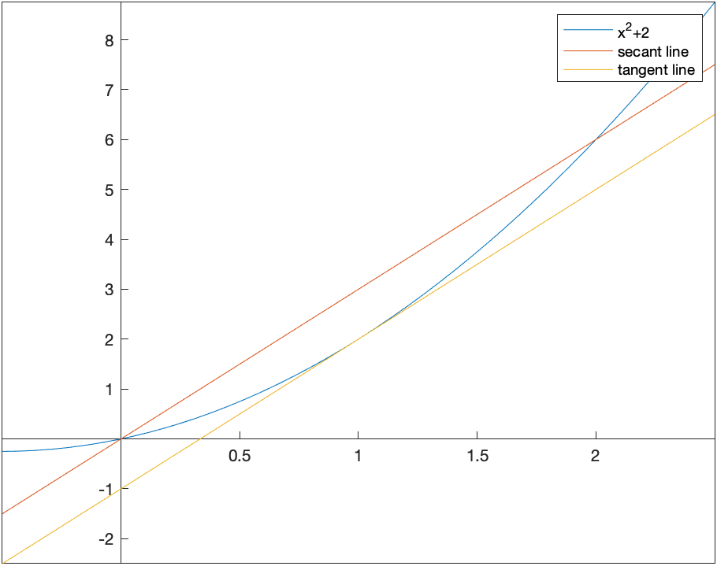

Antiderivatives and Definite Integrals
===========

Antiderivatives
-------

Naturally, Maple and most CAS find antiderviatives.  There are a few ways to do this.  If we want the antiderivative of a function like $x^2$, then we can type:
```
int(x^2,x)
```

which returns $$\frac{x^3}{3}$$.  And note that Maple does not return an integration constant.  

Additionally, we can make the command look like an integral, by typing `int`, then hitting escape and selecting the proper integration.  Lastly, you can use palette as well.  

Maple has many standard integration techniques (subsitution, trig substitution, by parts, among others).  For example, integrating:
$${\frac {x\cos \left( \sqrt {x^{2}+1} \right) }{\sqrt {x^{2}+1}}}$$
results in $sin(\sqrt{x^2+1})$  (where subsitution has been used).

Another example is the antiderivative of $x^7{\rm e}^{2x}$ which results in
$$\frac{1}{16} \left( 8\,{x}^{7}-28\,{x}^{6}+84\,{x}^{5}-210\,{x}^{4}+420\,{x}
^{3}-630\,{x}^{2}+630\,x-315 \right) { {\rm e}^{2\,x}}$$
in which the integration by parts formula has been applied 7 times.  

Other times, you might get strange results.  If we find the antiderivative of ${\rm e}^{-x^2}$, Maple returns
$$\frac{1}{2}\sqrt {\pi }\, {\rm erf}\left( x \right) $$

What is this erf?   Take a look in the Help Browser.

Quite amazingly, very few functions have a nice antiderivative, where nice means that you can write the result as a algebraic combination of functions that we know from Precalc and Calculus.  Instead, functions, like erfi (otherwise known as the error function), are defined as solutions to a differential equation or as an antiderivative.  Here's a list of a few

* $\displaystyle\int \frac{\sin x}{x} \, dx$
* $\displaystyle\int \cos(x^2)\, dx$
* $\displaystyle\int \frac{1}{\sqrt{1-\sin^2 \theta }} \, d\theta$

Definite Integrals
------

Maple will also find definite integrals and there are a few ways to enter those.  To enter $\displaystyle \int_0^1 x^2 \, dx$, type
```
int(x^2,x=0..1)
```

and it will return $\frac{1}{3}$.  You can also type `int`, hit ESC and select the definite integral (the one with the limits on the integral sign).

###Exercise

Try the following:

* $\displaystyle \int_0^{\pi/2} \sin x \, dx$
* $\displaystyle \int_{-1}^2 {\rm e}^{2x} \, dx$
* $\displaystyle \int_0^{1} \tan^{-1} x \, dx$.


###Definite Integrals with infinite bounds

You can also do definite integrals with infinite bounds.  For example
$$\int_0^{\infty} {\rm e}^{-x} \,dx$$
returns 1.  

Let's recall what this means.  If you have any integral with an infinite limit, and if $F(x)$ is an antiderivative of $f(x)$, then
$$\int_a^{\infty} f(x) \, dx = \lim_{b \rightarrow \infty} F(b)-F(a)$$

And we can let Maple help us understand this. For example using the example of $\int_0^{\infty} {\rm e}^{-x} \, dx$ above, the antiderivative of ${\rm e}^{-x}$ is $-{\rm e}^{-x}$ and let's define this to be $F$ using
```
F:=x->-e^(-x)
```

Then we take the limit of $F(b)-F(0)$
```
limit(F(b)-F(0), b = infinity)
```

returns 1.

###Exercise

Find the following:

* $\displaystyle \int_1^{\infty} \frac{1}{x} \, dx$
* $\displaystyle \int_{-\infty}^{\infty} {\rm e}^{-x^2} \, dx$


Reimann Sums
-------

When we first saw a definite integral in Calculus, we defined it in terms of a Reimann sum.  For example if we are looking for the area under the curve $f(x)=x^2+1$, and we use rectangles based on the left endpoint, the following plot is helpful:


We then define the definite integral in terms of a limit:
$$\int_a^b f(x) \,dx = \lim_{\Delta x \rightarrow 0} \sum_{i=1}^N f(x_i^{\star}) \Delta x$$
where $\Delta x=(b-a)/N$ and $x_i^{\star}$ is a number in the ith subinterval.  Generally, $x_i^{\star}$ can be the left endpoint, the right end point, the mid point or a value at the minimum or maximum of the function in the subinterval.

Maple allows us to visualize all of these.  If we load the `Student[Caclulus1]` package, then
```
RiemannSum(1+x^2,x=0..1,output=plot)
```

will return the following plot:


Take a look at the options for the `RiemannSum` command for other options.

###Exercises:

1. Find the Riemann sum for 15 subintervals for $f(x)=\sin x$ on $[0,1]$ using the left, right and midpoints.  

2. Find the exact answer for the area (using the definite integral.)


Numerical Integration
-------

As we have mentioned above often it is impossible to find the value of an integral or that a new function is defined to be the antiderivative (like the error function).  However, it's fairly clear that for many functions, that the area under the curve is well defined and we should be able to find an answer  or at least an approximate answer.  

For example, what if we want to find the area under $e^{-x^2}$ on the interval $[0,1]$.  From a plot:
![Plot of $e^{-x^2}$ on the interval $[0,1]$](images/ch08/plot03.png)
it appears to have an answer is probably between 0.5 and 1.  

One way to find an approximate answer would be to use the Riemann sum.  For example,
```
RiemannSum(e^(-x^2),x=0..1)
```

returns an algebraic expression and can be approximated using `evalf` to 0.74713  which is an approximation using midpoints and 10 subintervals.   

Recall that in the limit as the number of subintervals goes to $\infty$ that the approximation equals the actual area, so this method can lead to better approximation, however there are better techniques.  


###Trapezoid Method

Instead of approximating the area with rectangles, we can use trapezoids to do this.  A plot of the approximate integral of $\sin x$ on the interval $[0,\pi]$ is given by
![Plot of the trapezoid approximation of $\sin x$ on $[0,\pi]$](images/ch08/plot04.png)

The basic part of the trapezoid method is to use the area of a trapezoid on an interval with width $h$.  The area of one of the trapezoids is

$$A_i = \frac{1}{2}(f(x_i)+f(x_{i+1})) h$$

and then a full approximation will be the sum of these:
$$A=\sum_{i=1}^{n-1} \frac{1}{2} (f(x_i)+f(x_{i+1}))h$$

$$A=\frac{h}{2}\left(f(x_0)+f(x_1)+f(x_1)+f(x_2)+ \cdots + f(x_{n-1})+f(x_n)\right)$$
$$A=\frac{h}{2}\left( f(x_0) + 2\sum_{i=1}^{n-1} f(x_i) + f(x_n)\right)$$

As an example above, if we use 4 subintervals, the approximation is
$$A=\frac{h}{2}\left(f(0)+2f(\pi/4)+2f(\pi/2)+2f(3\pi/4)+f(\pi)\right)$$
where there are 2's in front of most of the $f$'s is that the interior ones are counted twice.  
$$A=\frac{\pi/4}{2}\left(0+2\frac{\sqrt{2}}{2} + 2(1) + 2\frac{\sqrt{2}}{2} + 0 \right)$$
$$A= \frac{\pi}{8}\left(2\sqrt{2}+2\right) \approx 1.896$$

We can do this in Maple using the `ApproximateInt` command which has numerous options.  The way to get the plot above is:
```
ApproximateInt(sin(x), x = 0 .. Pi, output = plot, method = trapezoid, partition = 4, boxoptions = [filled = [color = pink, transparency = .5]])
```

and it is helpful to get the approximate value by:
```
ApproximateInt(sin(x), x = 0 .. Pi, output = sum, method = trapezoid, partition = 4)
```

which returns:

$$\frac{\pi}{8} \left(\sum _{i=0}^{3}\sin \left( \frac{1}{4}\,i\pi  \right) +\sin \left(\frac{1}{4}\, \left( i+1 \right) \pi  \right)\right)$$

and if we want to evaluate this, type `value((#))` on the line number above to return:
$$\frac{\pi}{8}\left(2\sqrt{2}+2\right)$$
and recall use `evalf((#))` to get 1.896118.

If you just need the value of the integral using the trapezoid method, type
```
ApproximateInt(sin(x), x = 0 .. Pi, method = trapezoid, partition = 4)
```

and then use `evalf`.  

###Exercise

Find $\int_0^1 {\rm e}^{-x^2}\,dx$ using the trapezoid method for $4, 10$ and $20$ points.  


###Simpson's Rule

The trapezoid rule uses straight lines to approximate the function and then integrates the line (or finds the area of the trapezoid).  To find a better approximation if we use a quadratic function (parabola) to esimate the function.  

For example, if we use the function $f(x)=x {\rm e}^{-x}$, on the interval $0 \leq x \leq 2$, we find a quadratic of the form:
$$Q(x)=a + b x + c x^2$$
that passes through the points $(0,f(0))$, $(1,f(1))$, $(2,f(2))$.  A plot of the function and the points is:


We then find the quadratic (meaning we find the constants $a, b$ and $c$ of $Q(x)$) or
```
solve([Q(0) = f(0), Q(1) = f(1), Q(2) = f(2)])
```

returns $$\{a = 0, b = 2 {\rm e}^{-1} - {\rm e}^{-2}, c = -{\rm e}^{-1}+{\rm e}^{-2}\}$$

and then a plot of the quadratic that passes through these points is:


To estimate the integral $\int_0^2 f(x)\,dx$, we instead find
$$A=\int_0^2 Q(x)\,dx = \int_0^2 (a + b x + cx^2) \,dx$$
$$A= \left. ax+\frac{bx^2}{2} + \frac{cx^3}{3} \right|_0^2 =
a(2)+b\frac{4}{2} + c\frac{8}{3}$$
and substituting the values of $a, b, c$ in,
$$A = \frac{4}{3} {\rm e}^{-1} + \frac{2}{3} {\rm e}^{-2}\approx 0.58073$$

and in this case, the actual value of the integral $A^{\star}$ is
$$A^{\star}=\int_0^2 f(x) \,dx = 1-3{\rm e}^{-2} \approx 0.59399$$

###Exercise

Find $\int_0^1 {\rm e}^{-x^2} \,dx$ using Simpson's rule for $n=4, 10$ and 20 subintervals.  

###Simpson's Rule in Maple

The `ApproximateInt` command in Maple is similar to that using the trapezoid rule, by just using the `method=simpson` option.  For example,
```
ApproximateInt(f(x), x = 0 .. 2, output = plot, method = simpson, partition = 1, boxoptions = [filled = [color = pink, transparency = .5]])
```

does what we saw above and yields the plot:


and to find the value of the approximation, use
```
ApproximateInt(f(x), x = 0 .. 2, partition = 1, output = sum, method = simpson)
```

then `value((#))` of the line above and you will get:
$$\frac{4}{3}{\rm e}^{-1} + \frac{2}{3}{\rm e}^{-2}$$

###General Form of Simpson's Rule

The following is a derivation of Simpson's rule for $n$ subintervals.  First, we are going to going to consider just 1 subinterval.  Let the function we are trying to integrate be $f(x)$ on the interval $[a,b]$.  We are going to call $x_0$ and $x_2$ the endpoints of this interval and $x_1$, the midpoint or
$$x_1=\frac{a+b}{2}$$

Recall above that we sought a quadratic that passes through these points.  If we define:
```
Q:=x->c0+c1*x+c2*x^2
```

and then find the coefficients that have the function $Q$ satisfy the function $f$ at the points $a$, $(a+b)/2$ and $b$, then we can let Maple do the hard work and
```
coefs:=solve([f(a)=Q(a),f((a+b)/2)=Q((a+b)/2),f(b)=Q(b)],[c0,c1,c2])
```

where you need to say what Maple should solve for, since there are unknowns $a$ and $b$ in this as well.  Maple will return quite a mess, but hang in there.  Next, we want to integrate $Q$ from $[a,b]$
```
int(Q(x),x=a..b)
```

then substitution the values from the coeffs line above or
```
subs(coefs[1],(#))
```

where (#) is the line number of the integral and if you simplify the result will give:
$$-\frac{1}{6}\,af \left( b \right) +\frac{1}{6}\,bf \left( b \right) -\frac{2a}{3}\,f \left( \frac{a}{2}+\frac{b}{2}\right) +\frac{2b}{3}f \left(\frac{a}{2}+\frac{b}{2}\right) -\frac{a}{6}f \left( a
 \right) +\frac{b}{6}f \left( a \right)$$

and this is still a little bit of a mess because we have the relationship that $b=a+h$ and if we substitute this in
```
simplify(subs(b=a+h,(#)))
```

for the line number above, then the result can be written:
$$I = \frac{h}{6}\left(f(a)+4f\left(\frac{a+b}{2}\right)+f(b)\right)$$

###Simpson's Rule for $n$ subintervals:

If we break up the interval $[a,b]$ into $n$ subintervals, we can write:
$$x_i = a+\frac{ih}{2}\qquad\text{where}\qquad h=\frac{b-a}{n}$$
then
$$I = \frac{h}{6} \left(f(x_0) + 4 f(x_1) + f(x_2) + f(x_2) + 4 f(x_3) + f(x_4)+ \cdots + f(x_{2n-2})+4f(x_{2n-1})+f(x_{2n})\right)$$
or
$$I = \frac{h}{6} \left(f(x_0)+ f(x_{2n}) + 4 \sum_{k=1}^{n} f(x_{2k-1}) + 2\sum_{k=1}^{n+1} x_{2k} \right)$$


###Example

Use the formula above to approximate $\int_0^2 x{\rm e}^{-x}$ using $n=4$ subintervals.

In this case,
$$h=\frac{2-0}{4}=0.5\qquad\text{and}\qquad x_{i} = 0 + 0.25i$$

Then
$$I_4=\frac{0.5}{6}\left(f(0)+f(2)+ 4(f(0.25)+f(0.75)+f(1.25)+f(1.75))+2(f(0.5)+f(1)+f(1.5))\right) $$

$$I_4=\frac{1}{12}\left({{\rm e}^{-1/4}}+{{\rm e}^{-1/2}}+3\,{{\rm e}^{-3/4}}+2\,{{\rm e}^{-1}
}+5\,{{\rm e}^{-5/4}}+3\,{{\rm e}^{-3/2}}+7\,{{\rm e}^{-7/4}}+2\,{
{\rm e}^{-2}}
\right)\approx 0.59393$$


###Simpson&#8217;s 3/8-rule and Boole's Rule

If a cubic function is used to approximate the function, then the approximate method becomes Simpson&#8217;'s 3/8 rule and if a quartic is used is called Boole's Rule.

The following command
```
ApproximateInt(x*exp(-x), x = 0 .. 2, partition = 1, method = simpson[3/8], output = plot, boxoptions = [filled = [color = pink, transparency = .5]])
```

produces the following plot:


and as you can see above, the cubic approximation is quite good, even when only using 1 subinterval.  

The following command:
```
ApproximateInt(x*exp(-x), x = 0 .. 2, partition = 1, method = boole, output = plot, boxoptions = [filled = [color = pink, transparency = .5]])
```

produces the following plot:


which shows that the quartic approximation is very good for this function.  


###Example

Reproduce $\int_0^2 x {\rm e}^{-x} \,dx$ using 4 subintervals using Simpson&#8217;s 3/8-rule and Boole's Rule

```
evalf(ApproximateInt(x*e^(-x),x=0..2,partition=4,method=simpson[3/8]))
```

returns `0.5939668110`  and we can check the error by typing:
```
evalf(abs(int(x*exp(-x), x = 0 .. 2)-(#)))
```

where (#) is the line number of the approximation and the result is `0.0000273394`

and checking the approximation using Boole's rule:

```
evalf(ApproximateInt(x*e^(-x),x=0..2,partition=4,method=boole))
```

returns `0.5939941135` and we can check the error by typing:
```
evalf(abs(int(x*exp(-x), x = 0 .. 2)-(#)))
```

where (#) is the line number of the approximation and the result is `0.0000273394` returns
$$3.69\cdot 10^{-8}$$

So the approximation is nearly 8 digits.  

Numerical Integration
------

We saw above using specific techniques to find numerical solutions to definite integrals.  It is important to know how these techniques work and to understand what is going on when you need to do an integral numerically.  

However, there are times when you just want the answer to a definite integral, you want it accurate to some level and you aren&#8217;t that concerned with how Maple comes up with the answer.  

Let's return to the example $\int_0^1 {\rm e}^{-x} \, dx$, which is related to probabilities under the normal curve.  If we just want to find the integral of this and do it using some numerical technique, let's type:
```
int(exp(-x^2), x = 0 .. 1, numeric = true)
```

and the result is 0.7468241328.  If we want more digits of accuracy, we can type:
```
int(exp(-x^2), x = 0 .. 1, numeric = true, digits = 20)
```

which will return the answer to 20 digits.  (Pretty cool!!)


###Exercise

Evaluate $\int_0^2 \sqrt{4-x^2}\,dx$ to 20 digits.   Is that what you expected?  Why?
