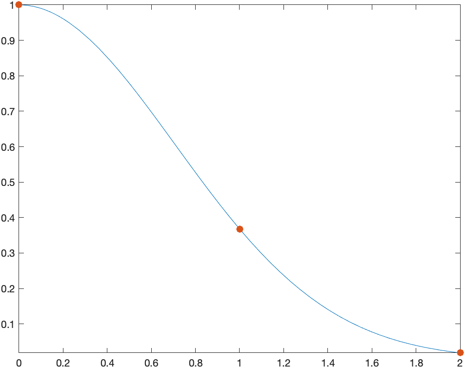

[Previous Chapter](ch-08.html) | [Return to all notes](index.html) | [Next chapter](ch-10.html)


Naturally, Matlab and most CAS find antiderviatives.  There are a few ways to do this.  If we want the antiderivative of a function like $x^{2}$, then we can type:
```
syms x
int(x^2,x)
```

which returns $\dfrac{x^{3}}{3}$  And note that there is no integration constant.


Matlab has many standard integration techniques (subsitution, trig substitution, by parts, among others).  For example, evaluating:
$$\int {\frac {x\cos \left( \sqrt {x^{2}+1} \right) }{\sqrt {x^{2}+1}}}\, dx$$
results in $\sin(\sqrt{x^{2}+1})$  (where subsitution has been used).

Another example is the antiderivative of $x^{7}{\rm e}^{2x}$ which results in
$$\frac{{\mathrm{e}}^{2\,x} \,{\left(128\,x^7 -448\,x^6 +1344\,x^5 -3360\,x^4 +6720\,x^3 -10080\,x^2 +10080\,x-5040\right)}}{256}$$
in which the integration by parts formula has been applied 7 times.  

Other times, you might get strange results.  If we find the antiderivative of ${\rm e}^{-x^{2}}$, Maple returns
$$\frac{\sqrt{\pi }\,\mathrm{erf}\left(x\right)}{2} $$

What is this erf?   Take a look in the Help Browser.

Quite amazingly, very few functions have a nice antiderivative, where nice means that you can write the result as a algebraic combination of functions that we know from Precalc and Calculus.  Instead, functions, like `erf` (otherwise known as the error function), are defined as solutions to a differential equation or as an antiderivative.  Here's a list of a few

* $\displaystyle\int \frac{\sin x}{x} \, dx$
* $\displaystyle\int \cos(x^{2})\, dx$
* $\displaystyle\int \frac{1}{\sqrt{1-\sin^{2} \theta }} \, d\theta$

Definite Integrals
------

You can find definite integrals also with the `int` command. To enter $\displaystyle \int_0^{1} x^{2} \, dx$, type
```
int(x^2,x,[0,1])
```

and it will return $\frac{1}{3}$.  

### Exercise

Try the following:

* $\displaystyle \int_0^{\pi/2} \sin x \, dx$
* $\displaystyle \int_{-1}^{2} {\rm e}^{2x} \, dx$
* $\displaystyle \int_0^{1} \tan^{-1} x \, dx$.


### Definite Integrals with infinite bounds

You can also do definite integrals with infinite bounds.  For example
$$\int_0^{\infty} {\rm e}^{-x} \,dx$$
is entered as
```
int(exp(-x),[0 inf])
```
and returns 1.  

Let's recall what this means.  If you have any integral with an infinite limit, and if $F(x)$ is an antiderivative of $f(x)$, then
$$\int_a^{\infty} f(x) \, dx = \lim_{b \rightarrow \infty} F(b)-F(a)$$

And we can let Matlab help us understand this. For example using the example of $\int_0^{\infty} {\rm e}^{-x} \, dx$ above, the antiderivative of ${\rm e}^{-x}$ is $-{\rm e}^{-x}$ and let's define this to be $F$ using
```
F(x) = int(exp(-x),x)
```

Then we take the limit of $F(b)-F(0)$
```
syms b
limit(F(b)-F(0),b,inf)
```

returns 1.

### Exercise

Find the following:

* $\displaystyle \int_1^{\infty} \frac{1}{x} \, dx$
* $\displaystyle \int_{-\infty}^{\infty} {\rm e}^{-x^{2}} \, dx$


Reimann Sums
-------

When we first saw a definite integral in Calculus, we defined it in terms of a Reimann sum.  For example if we are looking for the area under the curve $f(x)=x^{2}+1$, and we use rectangles based on the left endpoint, the following plot is helpful:


We then define the definite integral in terms of a limit:
$$
\int_a^{b} f(x) \,dx={\lim_{\Delta x \rightarrow 0}}\sum_{i=1}^{N} f(x_i^{\star}) \Delta x
$$

where $\Delta x=(b-a)/N$ and $x_i^{\star}$ is a number in the ith subinterval.  Generally, $x_i^{\star}$ can be the left endpoint, the right end point, the mid point or a value at the minimum or maximum of the function in the subinterval.

Matlab doesn't have this built-in, but here's a function that will plot the function and the rectangles:

```
function riemannSum(f,a,b,options)
    arguments
        f function_handle
        a (1,1) {mustBeNumeric}
        b (1,1) {mustBeNumeric}
        options.n (1,1) {mustBePositive,mustBeInteger} = 10
        options.style {mustBeMember(options.style,["left","midpoint","right"])} = "midpoint"
        options.output {mustBeMember(options.output,["value","plot"])} = "plot"
    end
  dx = (b-a)/options.n;
  if strcmp(options.style,'left')
    xval = linspace(a,b-dx,options.n);
    x = xval;
  elseif strcmp(options.style, 'right')
    xval = linspace(a+dx,b,options.n);
    x = xval-dx;
  else
    xval = linspace(a+0.5*dx,b-0.5*dx,options.n);
    x = xval-0.5*dx;
  end
  y =arrayfun(f,xval);
  
  if strcmp(options.output,'plot')
    g = bar(x,y,'histc'); % Moves labels to the left
    g.FaceColor = 'none';    % Changes the fill of bars
    g.EdgeColor = 'b';       % Changes edge color of bars
    hold on
    fplot(f,[a b]);
    hold off
  else
    dx*sum(y)
  end
end
```
and remember to put this at the bottom of your live script to use it.

The above plot was made with
```
riemannSum(@(x) 1+x^2,0,2,'style','left','n',10)
```
and if we want to use the right endpoints then:
```
riemannSum(@(x) 1+x^2,0,2,'style','right','n',10)
```
which returns:


and midpoints can be found using:
```
riemannSum(@(x) 1+x^2,0,2,'style','midpoint','n',10)
```

will return the following plot:


You can also get the value of the Riemann sum from the same function by use the 'output','value' options, like
```
riemannSum(@(x) 1+x^2,0,2,'style','left','n',10,'output','value')
```
which returns 4.2800, and this is the area of the rectangles for the left Riemann sum.  


### Exercises:

1. Find the Riemann sum for 15 subintervals for $f(x)=\sin x$ on $[0,1]$ using the left, right and midpoints.  

2. Find the exact answer for the area (using the definite integral.)


Numerical Integration
-------

As we have mentioned above often it is impossible to find the value of an integral or that a new function is defined to be the antiderivative (like the error function).  However, it's fairly clear that for many functions, that the area under the curve is well defined and we should be able to find an answer  or at least an approximate answer.  

For example, what if we want to find the area under $e^{-x^{2}}$ on the interval $[0,1]$.  From a plot:
![Plot of $e^{-x^{2}}$ on the interval $[0,1]$](images/ch09/plot04.png)
it appears to have an answer is probably between 0.5 and 1.  

One way to find an approximate answer would be to use the Riemann sum.  For example,
```
riemannSum(@(x) exp(x^2),0,1,'style','midpoint','n',10,'output','value')

```
and this returns 0.7471

Recall that in the limit as the number of subintervals goes to $\infty$ that the approximation equals the actual area, so this method can lead to better approximation, however there are better techniques.  


### Trapezoid Method

Instead of approximating the area with rectangles, we can use trapezoids to do this.  A plot of the approximate integral of $\sin x$ on the interval $[0,\pi]$ is given by
![Plot of the trapezoid approximation of $\sin x$ on $[0,\pi]$](images/ch09/plot05.png)

The basic part of the trapezoid method is to use the area of a trapezoid on an interval with width $h$.  The area of one of the trapezoids is

$$A_i = \frac{1}{2}(f(x_i)+f(x_{i+1})) h$$

and then a full approximation will be the sum of these:
$$A={\sum_{i=1}^{n-1}} \frac{h}{2}(f(x_i)+f(x\_{i+1}))$$

$$A=\frac{h}{2}\left(f(x_0)+f(x_1)+f(x_1)+f(x_2)+ \cdots + f(x_{n-1})+f(x_n)\right)$$

$$A=\frac{h}{2}\left( f(x_0) + 2\sum_{i=1}^{n-1} f(x_i) + f(x_n)\right)$$

As an example above, if we use 4 subintervals, the approximation is
$$A=\frac{h}{2}\left(f(0)+2f(\pi/4)+2f(\pi/2)+2f(3\pi/4)+f(\pi)\right)$$
where there are 2's in front of most of the $f$'s is that the interior ones are counted twice.  
$$A=\frac{\pi/4}{2}\left(0+2\frac{\sqrt{2}}{2} + 2(1) + 2\frac{\sqrt{2}}{2} + 0 \right)$$
$$A= \frac{\pi}{8}\left(2\sqrt{2}+2\right) \approx 1.896$$

We can do this in Matlab using the `trapezoid` function that we defined here:
```
function output = trapezoid(f,a,b,options)
    arguments
        f function_handle
        a (1,1) {mustBeNumeric}
        b (1,1) {mustBeNumeric}
        options.n (1,1) {mustBePositive,mustBeInteger} = 10
        options.output {mustBeMember(options.output,["value","plot"])} = "plot"
    end
  dx = (b-a)/options.n;
  xvals = linspace(a,b,options.n+1);
  fvals = arrayfun(@(x) f(x),xvals);
  if strcmp(options.output,'plot')
    fplot(f,[a b])
    hold on
    plot(xvals,fvals,'red')
    for i=1:length(xvals)
      plot([xvals(i) xvals(i)],[0 fvals(i)],'red')
    end
    hold off
  else
    output = 0.5*dx*(sum(fvals(1:options.n))+sum(fvals(2:options.n+1)));  
  end
end
```

The way to get the plot above is:
```
trapezoid(@(x) f(x),0,pi,'n',4)
```

and it is helpful to get the approximate value by:
```
val = trapezoid(@(x) f(x),0,pi,'n',4,'output','value')
```

which returns:

$$\frac{\pi \,{\left(2\,\sqrt{2}+2\right)}}{8}$$
the same as we did by hand above.  To get a decimal value of this:
```
double(val)
```
returns 1.8961.

### Exercise

Find $\int_0^{1} {\rm e}^{-x^{2}}\,dx$ using the trapezoid method for $4, 10$ and $20$ points.  


## Simpson's Rule

The trapezoid rule uses straight lines to approximate the function and then integrates the line (or finds the area of the trapezoid).  To find a better approximation if we use a quadratic function (parabola) to esimate the function.  

For example, if we use the function $f(x)=e^{-x^2}$, on the interval $0 \leq x \leq 2$, we find a quadratic of the form:
$$Q(x)=a + b x + c x^{2}$$
that passes through the points $(0,f(0))$, $(1,f(1))$, $(2,f(2))$.  A plot of the function and the points is:


We then find the quadratic (meaning we find the constants $a, b$ and $c$ of $Q(x)$) or
```
syms x a b c
Q(x) = a +b*x+c*x^2
f(x) = exp(-x^2)
s= solve([Q(0)==f(0),Q(1)==f(1),Q(2)==f(2)])
```
and the vales are stored in `s.a`, `s.b`, `s.c`. 

and returns $1$, 

$$2\,{\mathrm{e}}^{-1} -\frac{{\mathrm{e}}^{-4} }{2}-\frac{3}{2}$$
and
$$\frac{{\mathrm{e}}^{-4} }{2}-{\mathrm{e}}^{-1} +\frac{1}{2}
$$

and then a plot of the quadratic that passes through these points is:


To estimate the integral $\int_0^{2} f(x)\,dx$, we instead find
$$A=\int_0^{2} Q(x)\,dx = \int_0^{2} (a + b x + cx^{2}) \,dx$$
$$A= \left. ax+\frac{bx^{2}}{2} + \frac{cx^{3}}{3} \right|_0^{2} =
a(2)+b\frac{4}{2} + c\frac{8}{3}$$
and substituting the values of $a, b, c$ in,
$$A = \frac{4\,{\mathrm{e}}^{-1} }{3}+\frac{{\mathrm{e}}^{-4} }{3}+\frac{1}{3}\approx 0.8299$$


### Simpson's Rule in Matlab

Similar to above, we have the following function to plot and calculate simpson's rule:

```
function output = simpson(f,a,b,options)
    arguments
        f function_handle
        a (1,1) {mustBeNumeric}
        b (1,1) {mustBeNumeric}
        options.n (1,1) {mustBePositive,mustBeInteger} = 10
        options.output {mustBeMember(options.output,["value","plot"])} = "plot"
    end
  dx = (b-a)/options.n;
  m = options.n/2;
  xvals = linspace(a,b,options.n+1);
  fvals = arrayfun(@(x) f(x),xvals);
  if strcmp(options.output,'plot')
    fplot(f,[a b])
    syms x a b c
    Q(x) = a*x^2+b*x+c;
    hold on
    scatter(xvals,fvals,50,'red','filled')
    for k=0:m-1
      s=solve([Q(xvals(2*k+1))==f(xvals(2*k+1)),Q(xvals(2*k+2))==f(xvals(2*k+2)),Q(xvals(2*k+3))==f(xvals(2*k+3))]);
      fplot(subs(Q(x),[a b c],[s.a s.b s.c]),[xvals(2*k+1) xvals(2*k+3)],'green')
    end
    hold off
  else
    output = dx/3*(fvals(1)+4*sum(fvals(2:2:options.n))+2*sum(fvals(3:2:options.n-1))+fvals(options.n+1));  
  end
end
```

```
simpson(@(x) exp(-x.^2),0,2,'n',4)
```

returns the plot


There are two quadratics that are fit on the function.  There is one that fit the points $(0,f(0)), (1/2,f(1/2))$ and $(1,f(1))$.  The second one is on the points $(1,f(1)),(3/2,f(3/2)),(2,f(2))$.

and to find the value of the approximation, use
```
simpson(@(x) exp(-x.^2),0,2,'n',4,'output','value')
```
which returns 0.8818, which is similar to what we saw above.  This should be more accurate (but still an approximation) because the gap between the quadratic curves and the function smaller than that above. 

### General Form of Simpson's Rule

The following is a derivation of Simpson's rule for $n$ subintervals.  First, we are going to going to consider just 1 subinterval.  Let the function we are trying to integrate be $f(x)$ on the interval $[a,b]$.  We are going to call $x_0$ and $x_2$ the endpoints of this interval and $x_1$, the midpoint or
$$x_1=\frac{a+b}{2}$$

Recall above that we sought a quadratic that passes through these points.  If we define:
```
syms x c0 c1 c2 f(x)
Q(x)=c0+c1*x+c2*x^2
```

and then find the coefficients that have the function $Q$ satisfy the function $f$ at the points $a$, $(a+b)/2$ and $b$, then we can let Matlab do the hard work and
```
s=solve([Q(a)==f(a),Q((a+b)/2)==f((a+b)/2),Q(b)==f(b)],[c0,c1,c2])
```

You can look at the solution, but it's pretty ugly and we don't care what the coefficients of the quadratic is, we want to know what the integral is. 
```
int(subs(Q(x),[c0 c1 c2],[s.c0 s.c1 s.c2]),x, [a b])
```
where we first substitute in the coefficients into the quadratic formula and then integrate.  The result is
$$-\frac{{\left(a-b\right)}\,{\left(4\,f\left(\frac{a}{2}+\frac{b}{2}\right)+f\left(a\right)+f\left(b\right)\right)}}{6}
$$
which is pretty simple, however, we going to let $b=a+h$ and make this a bit cleaner.

$$\frac{h\,{\left(f\left(a+h\right)+f\left(a\right)+4\,f\left(a+\frac{h}{2}\right)\right)}}{6}$$


### Simpson's Rule for $n$ subintervals:

If we break up the interval $[a,b]$ into $n$ subintervals, we can write:
$$x_i = a+\frac{ih}{2}\qquad\text{where}\qquad h=\frac{b-a}{n}$$
then
$$I =\frac{h}{6}\left(f(x_0) + 4 f(x_1) + f(x_2) + f(x_2) + 4 f(x_3) + f(x_4)+ \cdots + f(x_{2n-2})+4f(x_{2n-1})+f(x_{2n})\right)$$
or
$$I = \frac{h}{6} \left(f(x_0)+ f(x_{2n}) + 4 \sum_{k=1}^{n} f(x_{2k-1}) + 2\sum_{k=1}^{n+1} x_{2k} \right)$$


### Example

Use the formula above to approximate $\int_0^{2} x{\rm e}^{-x}$ using $n=4$ subintervals.

In this case,
$$h=\frac{2-0}{4}=0.5\qquad\text{and}\qquad x_{i} = 0 + 0.25i$$

Then
$$I_4=\frac{0.5}{6}\left(f(0)+f(2)+ 4(f(0.25)+f(0.75)+f(1.25)+f(1.75))+2(f(0.5)+f(1)+f(1.5))\right) $$

$$I_4=\frac{1}{12}\left({ {\rm e}^{-1/4}}+{ {\rm e}^{-1/2}}+3\,{ {\rm e}^{-3/4}}+2\,{ {\rm e}^{-1}
}+5\,{ {\rm e}^{-5/4}}+3\,{ {\rm e}^{-3/2}}+7\,{ {\rm e}^{-7/4}}+2\,{
{\rm e}^{-2}}
\right)\approx 0.59393$$


Numerical Integration
------

We saw above using specific techniques to find numerical solutions to definite integrals.  It is important to know how these techniques work and to understand what is going on when you need to do an integral numerically.  

However, there are times when you just want the answer to a definite integral, you want it accurate to some level and you aren&#8217;t that concerned with how Matlab comes up with the answer.  

Let's return to the example $\int_0^{2} {\rm e}^{-x^{2}} \, dx$, which is related to probabilities under the normal curve.  If we just want to find the integral of this and do it using some numerical technique, let's type:
```
syms x
integral(@(x) exp(-x.^2),0,Inf)
```

and the result is 0.8862.  If we want more digits of accuracy, we can type:
```
vpaintegral(exp(-x^2),0,2,'RelTol',1e-20)
```
which will return the answer to 20 digits.  (Pretty cool!!)

Note: that there seems to be a difference in how the function is entered between `integral` and `vpaintegral`


### Exercise

Evaluate $\int_0^{2} \sqrt{4-x^{2}}\,dx$ to 20 digits.   Is that what you expected?  Why?


[Previous Chapter](ch-08.html) | [Return to all notes](index.html) | [Next chapter](ch-10.html)