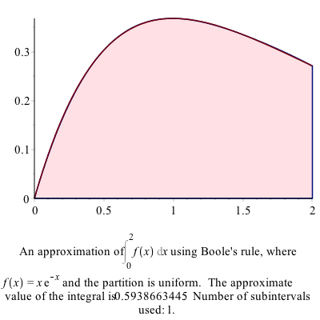

Applications of Definite Integrals
=========

###Area between curves

Find the area bounded by the curves $y=x^2$ and $y=4-x^2$.

First, a plot of these two curves is helpful.  Here's the following plot:


To help find the appropriate integral to use we can solve for the intersection points:
```
solve(x^2=4-x^2,x)
```

which returns $\sqrt{2},-\sqrt{2}$. So the area is the top curve in this interval ($4-x^2$) minus the other one on this interval:
$$\int_{-\sqrt{2}}^{\sqrt{2}} (4-x^2-x^2) \, dx$$
and Maple returns 
$$\frac{16}{3}\sqrt{2}$$
and if we use `evalf` to find the decimal approximation of about 7.54, which looks about right from the plot.  

###Another Example

Find the area bounded by the curves $x=y^2−1$ and $x=y+1$.

Notice in this case these need to be plotted implicitly and you get the following plot: 


Even though it seems clear from the plot of the intersection points, let's make sure 
```
solve([x=y^2-1,x=y+1])
```

returns `{x = 0, y = -1}, {x = 3, y = 2}` or the points $(0,-1)$ and $(3,2)$.  

If we slice in the vertical direction, it would be require that we write the integral in a couple of pieces.  Let $A_1$ be the area above that is bound by the curve $x=y^2-1$ and $x=0$.  Solving for $y$, we get $y=\pm\sqrt{x+1}$ and the area would be 
$$A_1 = 2 \int_{-1}^0 \sqrt{x+1} \, dx$$
which is $4/3$

and then the rest of the sought after area is 
$$A_2 = \int_0^3 (\sqrt{x+1} - (x-1)) \,dx$$
which is $19/6$.  The total area that we&#8217;re looking for is
$$A_1 +A_2 = \frac{9}{2}$$


An alternative way to tackle this is to slice this horizontally.  The area can then be written:
$$\int_{-1}^2 (y+1)-(y^2-1))\,dx$$
and the result is $9/2$, just as above and easier to do.  

###Exercises

* The area between the curves $y=x^3+7x^2+2x-37$ and $y=-2x^2-4x+19$
* The area between the line $x=1$, the curve $y={\rm e}^{-x}$ and the $x$-axis. 

###Volumes of Revolution

Another standard application of integration is finding volumes.  This will be a big topic in Multivariate Calculus, but in single variable Calculus, we can find volumes by revolving a curve $y=f(x)$ about an axis of revolution.  Maple has some nice visualization tools to help understand this. These are located in the `Student[Calculus1]` package, so make sure that you load it.
```
with(Student[Calculus1])
```

####Example

Find the volume formed by rotated the region bound by $y=(x-1)^2$, the $x$-axis and the $y$-axis,  and rotating the region around the $x$-axis.  

First plot the region in the $xy$-plane:


and this region will be rotated about the $x$-axis.  You can visualize this with the following command:
```
VolumeOfRevolution((x-1)^2, x = 0 .. 1, output = plot)
```

and the result is: 


For this situation, this is a disk method problem and the formula is
$$V = \int_a^b \pi r(x)^2 \,dx$$
or in this example
$$V=\int_0^1 \pi ((x-1)^2)^2\,dx$$
and using Maple, we get $\pi/5$. 

The command `VolumeOfRevolution` will also give the answer as well:
```
VolumeOfRevolution((x-1)^2,x=0..1)
```

evaluates the same integral above with the same answer. 

Another interesting option is `output=animate` which will show either disks, washers or cylinders in an animated way. Try
```
VolumeOfRevolution((x-1)^2, x=0..1,output=animate)
```

####Example that uses cylinders

Find the volume of the solid of revolution that by rotating the region bounded by $y=1-x$, $y=1-x^2$ in the first quadrant around the $y$-axis. 


This example is a cylinder method problem, with the height of each cylinder $h=(1-x^2)-(1-x)=x-x^2$ and radius $r=x$.  The volume is
$$V=\int_a^b 2\pi r h \, dx=\int_0^1 2\pi x (x-x^2) \,dx$$
which is $\pi/6$.  

We can visualize this with the following command
```
VolumeOfRevolution(-x^2+1, 1-x, x = 0 .. 1, axis = vertical, output = plot)
```

where both functions have been put in and the option `axis=vertical` is used because the function is rotated around the $y$-axis (which is the vertical axis).  The result is:


####Exercise

* Try to use the ouput=animation option on the example above.

* Find the volume formed by rotating the region bounded by $y=\sqrt{x}$ and $y=x$ about the line $x=2$.  (Hint: look at the `distancefromaxis` options)

Differential Equations
-------

Recall that a differential equation is an equation containing derivatives.  A simple example is 
$$\frac{dy}{dx} = y$$

The field of differential equations is extremely important and differential equations appears in all areas of mathematics as well as nearly every science and technology field.  

To solve the differential equation above we typically use the technique of *separation of variables* in that we write all of the $y$ terms on the left and the $x$ terms on the right.  We can rearrange the one above to the following:
$$\frac{1}{y} \, dy = dx \qquad \qquad (1)$$ 

and then we integrate.  Doing this (perhaps with Maple's help), we get
$$\ln(y) = x$$
and then often we want to solve for $y$, which (again with Maple's help) we get:
$$y = {\rm e}^x$$

and this makes sense because this function is its own derivative.  (which is how you can interpret $y'=y$). 

Now, we're missing some functions because we ignored the integration constant above.  To do a little better job, if we include the integration constant when integrating equation (1) above, then 
$$\int \frac{1}{y} \, dy = \int dx$$

will give
$$\ln(y) + C_1 = x + C_2$$
(again, we need to put in the constants since Maple won't do this for us).  We can combine the two constants on the right side and call these $C$ or 
$$\ln(y) = x + C$$
and solving for $y$ result in 
$$y= {\rm e}^{x+C}$$

We can do this all in one shot in Maple, by entering
```
solve(int(1/y,y)=int(1,x)+C,y)
```

###Solving a differential equation using `dsolve`

Lastly, we can let Maple solve the differential equation itself.  If we type
```
dsolve(y'(x)=y(x))
```

then Maple we return
$$y(x) = \_C1 {\rm e}^x$$

which is the same as above because ${\rm e}^{x+C}={\rm e}^x {\rm e}^C$ and then Maple using the constant $\_C1={\rm e}^C$.  

Note: when entering a differential equation, you need to explicitly put in the dependent variable.  So instead of writing $y'=y$, you need to say $y'(x)=y(x)$.  

###Exercise

Solve the following differential equation
$$y'=-\frac{x}{y}$$

1. First, by using separation of variables and going through all of the steps.  Make sure that you include the integration constant.

2. Using `dsolve`.

3. Next find the function that satisfies the differential equation with $y(3)=4$.  

Arc Length
----

It's quite nice to use a CAS to find arc length.  Most integrals that arise from arc length are difficult to do.  Even a relative simple function like $y=x^2$ results in an integral with a difficult antiderivative.  But that's okay--let Maple do the hard work. 

Consider that if we have a function $y=f(x)$ on the interval $a \leq x \leq b$, then we can consider that we find a few points on the curve, like the following plot:


We can estimate the length of the curve above by finding the length of the line segments or the following plot where we have used $N=4$ line segments:




The length of one of the line segments (say from $x_i$ to $x_{i+1}$) is
$$L_i = \sqrt{(x_{i+1}-x_i)^2+(f(x_{i+1})-f(x_i))^2}$$
where the distance formula has been used.  We can factor out $(x_{i+1}-x_i)^2$ 
$$L_i = \sqrt{\left(1 +\frac{(f(x_{i+1})-f(x_i))^2}{(x_{i+1}-x_i)^2}\right)(x_{i+1}-x_i)^2}$$
and pulling the $(x_{i+1}-x_i)^2$ term out of the square root, one gets:
$$L_i = \sqrt{1 +\frac{(f(x_{i+1})-f(x_i))^2}{(x_{i+1}-x_i)^2}}(x_{i+1}-x_i)$$
or
$$L_i = \sqrt{1 +\left(\frac{f(x_{i+1})-f(x_i)}{x_{i+1}-x_i}\right)^2}(x_{i+1}-x_i)$$


Next, we sum up $N$ of these line segments and take the limit as $N \rightarrow \infty$
$$L = \lim_{N \rightarrow \infty}\sum_{i=1}^N L_i$$
or
$$L=\lim_{N \rightarrow \infty}\sum_{i=1}^N L_i\sqrt{1 +\left(\frac{f(x_{i+1})-f(x_i)}{x_{i+1}-x_i}\right)^2}(x_{i+1}-x_i)$$
and as $N \rightarrow \infty$, then $x_{i+1}-x_i \rightarrow 0$, so the square term inside square root becomes $f'(x)$, so this can be written:
$$L=\int_a^b\sqrt{1+(f'(x))^2}\, dx$$

###Example

Find the arc length of $y=x^2$ on the interval $[0,1]$.  

This is
$$L=\int_0^1 \sqrt{1+(2x)^2} \, dx$$

and lettting Maple do this:
$$L=\frac{\sqrt{5}}{2}-\frac{1}{4}\ln(-2+\sqrt{5})$$

(and note that doing this antiderivative by hand requires trig substitution). 

There is also an `ArcLength` command in the `Student[Calculus1]` package.  If you enter
```
ArcLength(x^2,x=0..1)
```

then Maple will return the same result as above.  As with other commands like `ApproximateInt` and `RiemannSum`, therre are other output options.  Check out `integral` and `plot` for example. 

###Exercise

Find the circumference of a circle of radius 4 by 1) find the equation of the circle, 2) writing it as a function and 3) using the arc length formula or `ArcLength` command to find the result. 

Surface Area
------

Recall that if region in the plane is rotated about a line, it produces a volume and we can use the techniques explained above to find the volume it creates.  Similarly, we can do the same for the surface area. 

If a function $y=f(x)$ on the line segment $a \leq x \leq b$ is rotated about the line $y=0$ ($x$-axis) or the line $x=0$ (the $y$-axis), then the surface area is given by 
$$S=\int_a^b 2 \pi r \sqrt{1+(f'(x))^2} \, dx$$
where $r=x$ if rotating about the $y$-axis and $r=f(x)$ if rotating about the $x$-axis.  

###Example

Find the surface area found by taking the arc $y=x^2$ on $[0,1]$ about the $y$-axis. 

$$S=\int_0^1 2 \pi x \sqrt{1+(2x)^2} \, dx = \frac{\pi}{6} ( 5 \sqrt{5}-1)$$


You can also use the command `SurfaceOfRevolution` to produce plots and other helpful output forms.  For example, the surface of revolution above can be plotted as
```
SurfaceOfRevolution(x^2, x = 0 .. 1, axis = vertical, output = plot)
```

where the `axis=vertical` is needed to rotate about the $y$-axis.  (The default is to rotate about the $x$-axis.)

and the result is


###Exercise

Find the surface area of the sphere of radius 4 (see the above exercise) to get the function.  


