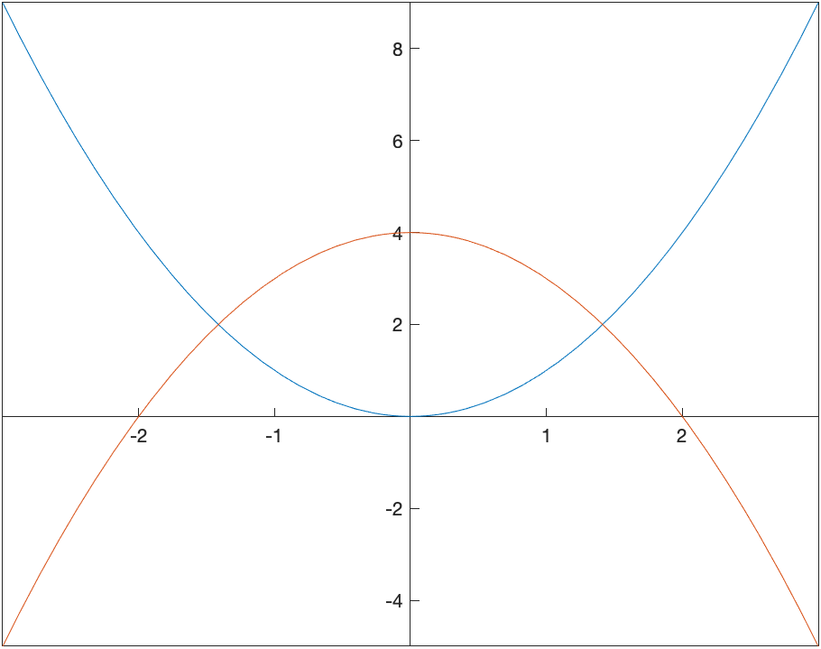
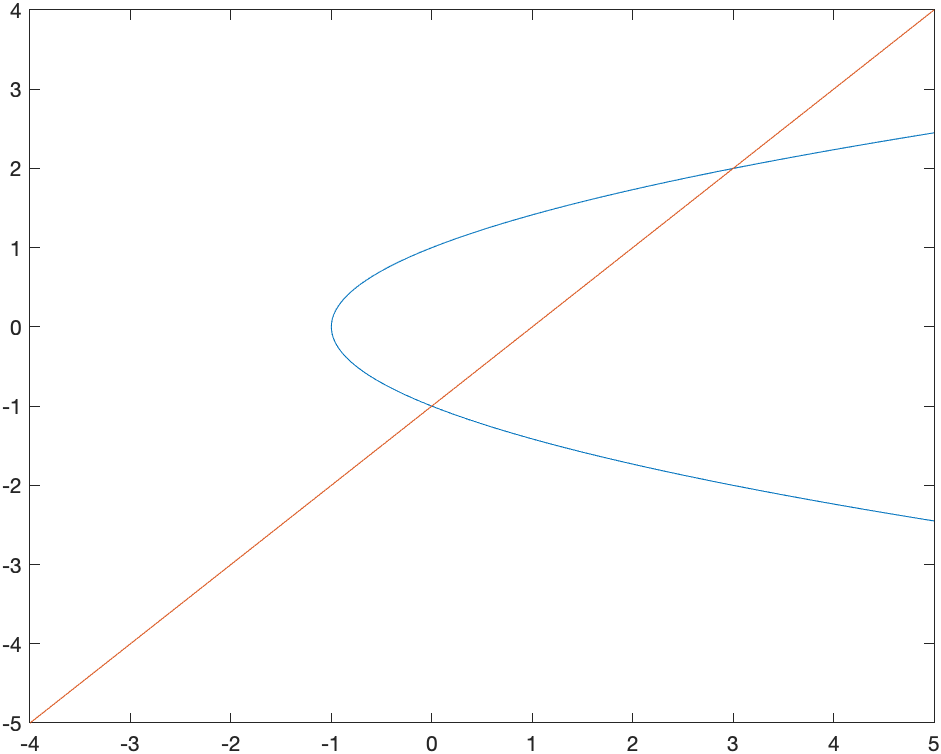
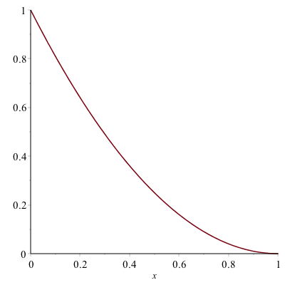

Chapter 10: Sequences and Series
===========

[Return to all notes](index.html)

Maple and other CAS programs are powerful and helpful tools when performing mathematics involving sequences and series.  


Sequences
------

Recall that a sequence is a function that is defined on the nonnegative integers.  For example if
$$a_n = \frac{(-1)^{n}}{n}$$

Then one can generate the first few terms of the sequence.  Doing this in Maple involves the `seq` command:
```
seq((-1)^n/n,n=1..10)
```

shows the first 10 terms and returns:
$$-1,\frac{1}{2},-\frac{1}{3},\frac{1}{4},-\frac{1}{5},\frac{1}{6},-\frac{1}{7},\frac{1}{8},-\frac{1}{9},\frac{1}{10}$$

We often are interested in finding the limit of this sequence, which is found by the command:
```
limit((-1)^n/n,n=infinity)
```

and returns 0.  (Note: doing this by hand requires the squeeze theorem.)

###Sequences using a Recursive Definition

It is common to define sequences recursively.  We could say $a_0=1$ and then $a_n=\frac{1}{a_{n-1}+1}$.

Doing this by hand, would result in
$$a_0=1$$
$$a_1=\frac{1}{1+1}=\frac{1}{2}$$
$$a_2=\frac{1}{1+\frac{1}{2}} = \frac{2}{3}$$
$$a_3=\frac{1}{1+\frac{2}{3}} = \frac{3}{5}$$

What would the limit of this be?  

Before getting to this, we can use Maple to generate these in the following way:
```
a:=n->1/(1+a(n-1))
a(0):=1
```

and it is very important that the order goes as above, that is the general formula is entered first and then the $a_0$ term is listed.    If then we use the `seq` command:
```
seq(a(n),n=1..10)
```

which generates:
$$1,\frac{1}{2},\frac{2}{3},\frac{3}{5},\frac{5}{8},{\frac {8}{13}},{\frac {13}{21}},{\frac {21}{34}},{\frac {34}{55}},{\frac {55}{89}},{\frac {89}{144}}$$

and the terms in the fraction may be recognizable as the Fibonacci numbers.   

To find the limit, however, if we type:
```
lim(a(n),n=infinity)
```

we get the error: `Error, (in f) too many levels of recursion` so Maple can't handle this instead, we need to do this as we would without a CAS in the following way.  Assume that the sequence has a limit, that is
$$L=\lim_{n \rightarrow \infty} a(n)$$

Then we take the limit of both sides of
$$a_n=\frac{1}{a\_{n-1}+1}$$
to get:
$$L=\frac{1}{L+1}$$
and we can let Maple solve this and it returns:
$$\frac{1}{2}\sqrt{5}-\frac{1}{2}, -\frac{1}{2}\sqrt{5}-\frac{1}{2}$$
and since the first term is positive and it is fairly clear that the limit should be positive, then
$$\lim_{n \rightarrow \infty} a_n = \frac{\sqrt{5}-1}{2}$$
(BTW: this is a very famous number called the golden ratio.  The [golden ratio wikipedia page](https://en.wikipedia.org/wiki/Golden_ratio) is a good source.)


Introduction to Series
------

A series is a sum of all terms in an infinite sequence. For example,

$$1+\frac{1}{2}+\frac{1}{4}+\frac{1}{8}+ \cdots$$

and is also written as
$$\sum\_{n=0}^{\infty} \frac{1}{2^{n}}$$
We won't cover all of the details of series here, but will look at some of the capabilities that Maple and other CAS software can lend to this.

Often, we'd love to be able to determine the value of a series.  For example, the series above is a geometric series with $a=1$ and $r=1/2$.  The sum is given by
$$S=\frac{a}{1-r}= \frac{1}{1-\frac{1}{2}} =2$$

Maple is capable of finding the value of some series.  For example,
```
sum(1/2^n, n=0..infinity)
```

will return 2.  (Note: to pretty up the sum, you can use the palette or hit ESC after the sum command.)

###Exercise

Try evaluating the following series:

1. $\displaystyle \sum_{n=1}^{\infty} \frac{1}{n}$
1. $\displaystyle\sum_{n=1}^{\infty} \frac{1}{n^{2}}$
1. $\displaystyle \sum_{n=1}^{\infty} \frac{1}{n^{3/2}}$
1. $\displaystyle \sum_{n=0}^{\infty} \frac{1}{n!}$

You'll notice that 3. returns a $\zeta$, which is the [Riemann Zeta Function](https://en.wikipedia.org/wiki/Riemann_zeta_function), a famous function that is defined as an infinite series.  

Determining Convergence of Series
------

Generally, it is very difficult to find the value of a series.  The ones listed above are special cases.  Generally, when trying to understand if a series converges or not, we need to use a convergence test.  We cover a few of those here.

Recall that if the value of the sum is finite, then we say that the series *converges*.  Otherwise, we say that the series *diverges*.


Integral Test
-----

Let $a$ be an integer and $f$ is a non-negative, decreasing function on $[a,\infty)$.  Then
$$\sum_{n=a}^{\infty} f(n)$$
converges if
$$\int_a^{\infty} f(x) \, dx$$ converges.  Conversely, if the integral diverges, then the series diverges.  

###Example

Determine if
$$\sum_{n=1}^{\infty} \frac{1}{3n+1}$$ converges or diverges.  

1. First, we note that $f(n)>0$ for on the interval.  We can let Maple help us by doing
    ```
    solve(f(n)>0)
    ```

    and getting the result $(-\frac{1}{3},\infty)$, so this means that the function is also positive on a subset like $(1,\infty)$.  

2. Next, we need to determine that the function is decreasing on the interval.
    ```
    solve(f'(n)< 0)
    ```

    and this shows everything except $n=-1/3$, so again, it is decreasing on the interval $[1,\infty)$

3. Lastly, evaluate the integral:
    $$\int_1^{\infty} f(x) \, dx$$

    results in $\infty$.  This means that the series diverges too.  


###Exercise

Determine if $\sum_{n=1}^{\infty} \frac{1}{n^{2}+1}$ converges or diverges by the integral test.    (Just for fun, see what Maple returns it as)

Ratio Test (RATFACE)
-----

Another important test for convergence is the Ratio Test for Absolute Convergence (affectionately known as RATFACE).  

First, recall that a series of the form:
$$\sum\_{n=1}^{\infty} a_n$$
converge absolutely if
$$\sum\_{n=1}^{\infty} |a_n|$$
converges.  

The Ratio Test is:  Let
$$L=\lim\_{n \rightarrow \infty} \left|\frac{a\_{n+1}}{a_n}\right|$$
The series $\sum_{n=1}^{\infty} a_n$ converges if $L\lt1$, it diverges if $L>1$ and is inconclusive if $L=1$.  


###Example

Use RATFACE to determine if $\sum_{n=0}^{\infty}\frac{1}{n!}$ converges or diverges.  

Let's define
```
a:=n->1/n!
```

And then we need the ratio:
```
simplify(a(n+1)/a(n))
```

which returns $\frac{1}{n+1}$

Taking the limit of the absolute value we get
```
limit(|1/(n+1)|,n=infinity)
```

returns 0.  Since this is less than 1, then series converges.  Above you found that this converges to $e$.  


###Exercise

Use RATFACE to determine if
$$\sum\_{n=0}^{\infty} \frac{(-1)^{n}}{(n+3)^{n}}$$

converges or diverges.  Does Maple find a value for this?  


Power and Taylor Series
-----

A power series is a series of the form:
$$\sum\_{n=0}^{\infty} c\_n (x-a)^{n}$$
for known values $c_n$ and the number $a$ is called the *center*.  For example,
$$\sum\_{n=0}^{\infty} \frac{(-1)^{n}}{n!}x^{n}$$
The first few terms of this power series:
$$1-x+\frac{x^{2}}{2!}-\frac{x^{3}}{3!}+\frac{x^{4}}{4!}-\frac{x^{5}}{5!}+\cdots$$
We can't plot a full power series because there are an infinite number of terms, but Maple allows us to plot 10, 20 or 100 terms quite easily. These are called the *partial sums* or *partial series*.  

To plot up to $n=10$, we can define
```
f:=sum((-1)^n*x^n/n!,n=0..10)
```

and then plot $f$.  The result is




###The Center of a series

If a series is written in the form:
$$\sum\_{n=0}^{\infty} c_n (x-a)^{n}$$

then the constant $a$ is said to be the center of the series.  For example, the series
$$\sum\_{n=0}^{\infty} \frac{3^{n}}{n}(x+2)^{n}$$
has a center of $a=-2$.  


###Interval and Radius of convergence

The *interval of convergence* is the set of all points on which a power series converges.  The center of the series will also be the center of the interval.  

The *radius of convergence* is half of the total length of the interval of convergence.  

###Example

Consider the series,
$$\sum\_{n=1}^{\infty} \frac{(-1)^{n}}{n2^{n}}(x-3)^{n}$$

Find the center, interval of convergence and radius of convergence.

First, the center is $a=3$, because of the form of the series.  To find the interval of convergence, we will use RATFACE:
```
c:=n->(-1)^n*(x-3)^n/(n*2^n)
```

and if we
```
simplify(c(n+1)/c(n))
```

the result is
$$-\frac{1}{2}\frac{n(x-3)}{n+1}$$
The rule for RATFACE is that if
$$L=\lim\_{n \rightarrow \infty} \left|\frac{c_{n+1}}{c\_n}\right|$$
is less than 1, then the series converges absolutely.  Therefore taking the limit of the absolute value of the above expression yields
$$\frac{1}{2}|x-3|$$

To check if the endpoints are in the interval as well, we need to check the endpoints or where $x=1$ and $x=5$.  First, the left one. Substitute $x=1$ into $c_n$ or
```
simplify(subs(x=1,c(n)))
```

returns $\dfrac{(-1)^{2n}}{n}$ or $\dfrac{1}{n}$.  Recall that this means that when $x=1$, we have the series:
$$\sum_{n=1}^{\infty} \frac{1}{n}$$
which diverges (it is the harmonic series).  

When $x=5$,
```
simplify(subs(x = 5, c(n)))
```

return $\dfrac{(-1)^{n}}{n}$ so this means when $x=5$, we have the series
$$\sum\_{n=1}^{\infty} \frac{(-1)^{n}}{n}$$
and this series converges by the alternating series remainder theorem.  So the series
$$\sum\_{n=1}^{\infty} \frac{(-1)^{n}}{n2^{n}}(x-3)^{n}$$
converges on the interval $(1,5]$.  

The radius of convergence of this series is half of the total length or half of $5-1=4$.  Thus $R=2$.  

###Exercise

Find the center, interval of convergence and radius of convergence of
$$\sum\_{n=1}^{\infty} \frac{(x+2)^{n}}{5^{n}\sqrt{n}}$$


###Taylor Series

A function $f(x)$ has a power series defined at $a$. It can be represented by
$$f(x) = \sum\_{n=0}^{\infty} \frac{f^{(n)}(a)}{n!}(x-a)^{n}$$

###Example

Find the first 5 terms (up to $n=4$)  of the Taylor Series of $f(x)=\sqrt{x}$ using the center $a=1$.  

In Maple, we can do higher level derivatives, with a strange notation.  The third derivative of $\sqrt{x}$ can be
```
diff(sqrt(x),x$3)
```

and this returns:
$$\frac{3}{8x^{5/2}}$$


So to do the first few terms of the Taylor series,
```
sum(subs(x=1, diff(f(x), x$n))*(x-1)^n/n!, n=0..4)
```

and this returns:
$$\frac{1}{2}+\frac{x}{2}-\frac{1}{8}\, \left( x-1 \right) ^{2}+\frac{1}{16}\, \left( x-1 \right) ^{3}-{
\frac {5\, \left( x-1 \right) ^{4}}{128}}
$$


However, Maple also has this as a built-in command called `series`.  Typing
```
s:=series(f(x), x = 1, 5)
```

where $x=1$, means the center is at $a=1$ and we have 5 terms.  

The command returns
$$\frac{1}{2}+\frac{x}{2}-\frac{1}{8}\, \left( x-1 \right) ^{2}+\frac{1}{16}\, \left( x-1 \right) ^{3}-{
\frac {5\, \left( x-1 \right) ^{4}}{128}} + O((x-1)^{5})
$$

which is nearly identical to that above, except the final term, which means that the next larger power has the form $(x-1)^{5}$.  

###Plotting a Taylor Series

If you try to plot the series (result from the `series` command), you will get the following error:

`Warning, unable to evaluate the function to numeric values in the region; see the plotting command's help page to ensure the calling sequence is correct`

This is because of the last term.  You can remove it using
```
convert(s,polynom)
```

which converts this to a polynomial (or just removes the last term) and then plotting this and the original function is




If we repeat the steps however use 50 terms, and replot, here are the results:




You can see the interval of convergence from the plot in that the two functions are nearly identical on the interval $(0,2)$ and then the two functions are not equal beyond that.  In addition, the radius of convergence is 1.  
