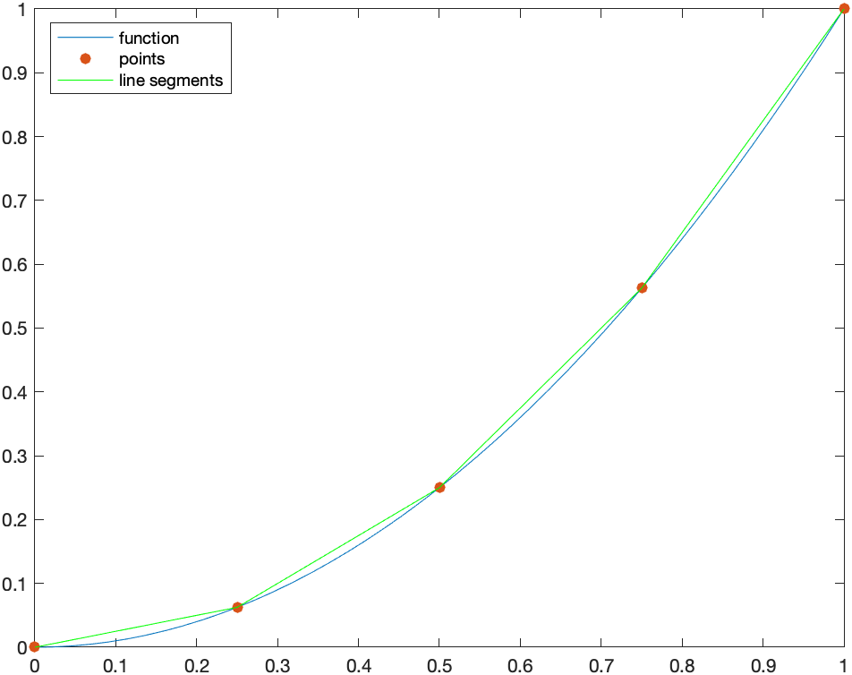

[Previous Chapter](ch-09.html) | [Return to all notes](index.html) | [Next chapter](ch-11.html)

## Putting functions in an external file.

We are going to use a few other functions to handle some visualization in this chapter.  First, download  and unzip to a folder and put in a directory where you usually work. 

Then you can use all of the functions in that folder by including
```
addpath('ext_functions/')
```
as long as the folder `ext_functions` is in the same folder.  We will see these functions below.

## Area between curves

Find the area bounded by the curves $y=x^{2}$ and $y=4-x^{2}$.

First, a plot of these two curves is helpful.  Here's the following plot:


To help find the appropriate integral to use we can solve for the intersection points:
```
solve(f(x)==g(x))
```

which returns $\sqrt{2},-\sqrt{2}$. So the area is the top curve in this interval ($4-x^{2}$) minus the other one on this interval:
$$\int_{-\sqrt{2}}^{\sqrt{2}} (4-x^{2}-x^{2}) \, dx$$
and Matlab returns
$$\frac{16}{3}\sqrt{2}$$
and if we use `double(ans)` to find the decimal approximation of about 7.54, which looks about right from the plot.  

### Another Example

Find the area bounded by the curves $x=y^{2}−1$ and $x=y+1$.

Notice in this case these need to be plotted implicitly and you get the following plot:


Even though it seems clear from the plot of the intersection points, let's make sure
```
s = solve([x==y^2-1,x==y+1])
s.x
s.y
```

returns the points $(0,-1)$ and $(3,2)$.  

If we slice in the vertical direction, it would be require that we write the integral in a couple of pieces.  Let $A_1$ be the area above that is bound by the curve $x=y^{2}-1$ and $x=0$.  Solving for $y$, we get $y=\pm\sqrt{x+1}$ and the area would be
$$A_1 = 2 \int_{-1}^0 \sqrt{x+1} \, dx$$
which is $4/3$

and then the rest of the sought after area is
$$A_2 = \int_0^{3} (\sqrt{x+1} - (x-1)) \,dx$$
which is $19/6$.  The total area that we&#8217;re looking for is
$$A_1 +A_2 = \frac{9}{2}$$


An alternative way to tackle this is to slice this horizontally.  The area can then be written:
$$\int_{-1}^{2} (y+1)-(y^{2}-1))\,dx$$
and the result is $9/2$, just as above and easier to do.  

#### Exercises

* The area between the curves $y=x^{3}+7x^{2}+2x-37$ and $y=-2x^{2}-4x+19$
* The area between the line $x=1$, the curve $y={\rm e}^{-x}$ and the $x$-axis.

### Volumes of Revolution

Another standard application of integration is finding volumes.  This will be a big topic in Multivariate Calculus, but in single variable Calculus, we can find volumes by revolving a curve $y=f(x)$ about an axis of revolution. 

#### Rotating about the $x$-axis (Disk Method)

First, we'll consider rotating a function about the $x$-axis.   How about the function $y=\sqrt{x}$ between $x=0$ and $x=4$.   Make sure you have downloaded the external files and done the `addpath` as explained at the top of this page.  Then,

```
VolumeOfRevolution(@(x) sqrt(x),0,4)
```
will produce

and if you click the little button with a circular arrow, you can rotated the plot to view it.


In the case of rotating the function $f(x)>0$ around the $x$-axis from $x=a$ to $x=b$, the volume is
$$ V = \int_a^b \pi f(x)^2 \, dx$$

In this case, we can use Matlab to find the integral as
```
int(pi*(sqrt(x))^2,0,4)
```

resulting in $8\pi$. 

#### Rotating about the $x$-axis (Washer Method)

If instead we have a bounded region bounded and then rotated, we get the washer method.  If the region can be written:
$$ \{ (x,y) \, | \, f(x) \leq y \leq g(x), a \leq x \leq b\}$$

Consider the functions $g(x) = \sqrt{x}$ and $f(x) = x^2$ and $0 \leq x \leq 1$, then in the $xy$-plane.  A plot of the region is


```
VolumeOfRevolution(@(x) sqrt(x),0,1,'inner',@(x) x.^2)
```
and rotating around results in 


In general a volume with this region is
$$
V  = \int_a^b \pi (g(x)^2-f(x)^2)\, dx
$$
and then for this example:
```
int(pi*((sqrt(x))^2-(x^2)^2),0,1)
```
results in $\frac{3\pi}{10}$

#### Exercise

Find the volume formed by rotated the region bound by $y=(x-1)^{2}$, the $x$-axis and the $y$-axis,  and rotating the region around the $x$-axis.  


### Example that uses cylinders

Find the volume of the solid of revolution that by rotating the region bounded by $y=1-x$, $y=1-x^{2}$ in the first quadrant around the $y$-axis.  A plot in the $xy$-plane of the region is:


This example is a cylinder method problem, with the height of each cylinder $h=(1-x^{2})-(1-x)=x-x^{2}$ and radius $r=x$.  The volume is
$$V=\int_a^{b} 2\pi r h \, dx=\int_0^{1} 2\pi x (x-x^{2}) \,dx$$
which is $\pi/6$.  

We can visualize this with the following command
```
VolumeOfRevolution(@(x) 1-x^2+1,0,1,'inner',@(x) 1-x,'axis','vertical')
```

where both functions have been put in and the option `'axis','vertical'` is added because the function is rotated around the $y$-axis (which is the vertical axis).  The result is:


#### Exercise

Find the volume of the region bounded by the curve $y=x$, $y=10-x^2$ and the $y$-axis, then rotated around the $y$-axis.  

Differential Equations
-------

Recall that a differential equation is an equation containing derivatives.  A simple example is
$$\frac{dy}{dx} = y$$

The field of differential equations is extremely important and differential equations appears in all areas of mathematics as well as nearly every science and technology field.  

To solve the differential equation above we typically use the technique of *separation of variables* in that we write all of the $y$ terms on the left and the $x$ terms on the right.  We can rearrange the one above to the following:
$$\frac{1}{y} \, dy = dx \qquad \qquad (1)$$

and then we integrate.  Doing this (perhaps with Matlabs's help), we get
$$\ln(y) = x$$
and then often we want to solve for $y$, which (again with Matlab's help) we get:
$$y = {\rm e}^x$$

and this makes sense because this function is its own derivative.  (which is how you can interpret $y'=y$).

Now, we're missing some functions because we ignored the integration constant above.  To do a little better job, if we include the integration constant when integrating equation (1) above, then
$$\int \frac{1}{y} \, dy = \int dx$$

will give
$$\ln(y) + C_1 = x + C_2$$
(again, we need to put in the constants since Matlab won't do this for us).  We can combine the two constants on the right side and call these $C$ or
$$\ln(y) = x + C$$
and solving for $y$ result in
$$y= {\rm e}^{x+C}$$

We can do this all in one shot in Matlab, by entering
```
syms y C
solve(int(1/y,y)==int(1,x)+C,y)
```

### Solving a differential equation using `dsolve`

Lastly, we can let Matlab solve the differential equation itself.  If we type
```
dsolve(y'(x)=y(x))
```

then Matlab returns
$$C_1 \,{\mathrm{e}}^x$$

which is the same as above because ${\rm e}^{x+C}={\rm e}^x {\rm e}^C$ and then Matlab using the constant $ C_1={\rm e}^C$.  

Note: when entering a differential equation, you need to explicitly put in the dependent variable.  So instead of writing $y'=y$, you need to say $y'(x)=y(x)$.

### Differential Equation with an initial conditions

Often a point will be given with a differential equation.  This point is called an _initial condition_.  Here we will solve
$$ y' = \frac{y^{2}}{x}, \qquad y(1)=1$$

#### Using separation of variables

Write the differential equation above as
$$ \frac{dy}{y^{2}} = \frac{dx}{x}$$
and let Matlab integrate each side.  The result is:
$$-\frac{1}{y}  = \ln x + C$$
remembering to add the $+C$.  Solve for $y$ to get
$$ y  = -\frac{1}{\ln x + C} $$

Now using the initial conditions
```
solve(subs([x=1,y=1],(#)),C)
```

where (#) is the line number above, the result should be $C=-1$ so the result is
$$ y = -\frac{1}{\ln x -1}$$

#### Using the built-in command `dsolve`

We can let Matlab do all this work for us via the `dsolve` command.

```
syms y(x)
dsolve(diff(y(x),x)==y(x)^2/x,y(1)==1)
```

spits out the result right away.  


#### Exercise

Solve the following differential equation
$$y'=-\frac{x}{y}$$

1. First, by using separation of variables and going through all of the steps.  Make sure that you include the integration constant.

2. Using `dsolve`.

3. Next find the function that satisfies the differential equation with $y(3)=4$.  

Arc Length
----

It's quite nice to use a CAS to find arc length.  Most integrals that arise from arc length are difficult to do.  Even a relative simple function like $y=x^{2}$ results in an integral with a difficult antiderivative.  But that's okay--let Matlab do the hard work.

Consider that if we have a function $y=f(x)$ on the interval $a \leq x \leq b$, then we can consider that we find a few points on the curve, like the following plot:

where we show $f(x)=x^2$ for example. 

We can estimate the length of the curve above by finding the length of the line segments or the following plot where we have used $N=4$ line segments:



An approximation to the arc length is the sum of the distances between these points. 

### Derivative of Arc Length Formula

The length of one of the line segments (say from $x_i$ to $x_{i+1}$) is

$$L_i = \sqrt{(x_{i+1}-x_i)^{2}+(f(x_{i+1})-f(x_i))^{2}}$$

where the distance formula has been used.  We can factor out $(x_{i+1}-x_i)^{2}$

$$L_i = \sqrt{\left(1 +\frac{(f(x_{i+1})-f(x_i))^{2}}{(x_{i+1}-x_i)^{2}}\right)(x_{i+1}-x_i)^{2}}$$
and pulling the $(x_{i+1}-x_i)^{2}$ term out of the square root, one gets:
$$L_i = \sqrt{1 +\frac{(f(x_{i+1})-f(x_i))^{2}}{(x_{i+1}-x_i)^{2}}}(x_{i+1}-x_i)$$
or
$$L_i = \sqrt{1 +\left(\frac{f(x_{i+1})-f(x_i)}{x_{i+1}-x_i}\right)^{2}}(x_{i+1}-x_i)$$


Next, we sum up $N$ of these line segments and take the limit as $N \rightarrow \infty$
$$L = \lim_{N \rightarrow \infty}\sum_{i=1}^N L_i$$
or
$$L=\lim_{N \rightarrow \infty}\sum_{i=1}^N \sqrt{1 +\left(\frac{f(x_{i+1})-f(x_i)}{x_{i+1}-x_i}\right)^{2}}(x_{i+1}-x_i)$$
and as $N \rightarrow \infty$, then $x_{i+1}-x_i \rightarrow 0$, so the square term inside square root becomes $f'(x)$, so this can be written:
$$L=\int_a^{b}\sqrt{1+(f'(x))^{2}}\, dx$$

#### Example

Find the arc length of $y=x^{2}$ on the interval $[0,1]$.  

This is
$$L=\int_0^{1} \sqrt{1+(2x)^{2}} \, dx$$

and lettting Matlab do this:
$$L=\frac{\mathrm{log}\left(\sqrt{5}+2\right)}{4}+\frac{\sqrt{5}}{2}$$

(and note that doing this antiderivative by hand requires trig substitution).


then Matlab will return the same result as above.  

#### Exercise

Find the circumference of a circle of radius 4 by 1) find the equation of the circle, 2) writing it as a function and 3) using the arc length formula to find the result.


[Previous Chapter](ch-09.html) | [Return to all notes](index.html) | [Next chapter](ch-11.html)
