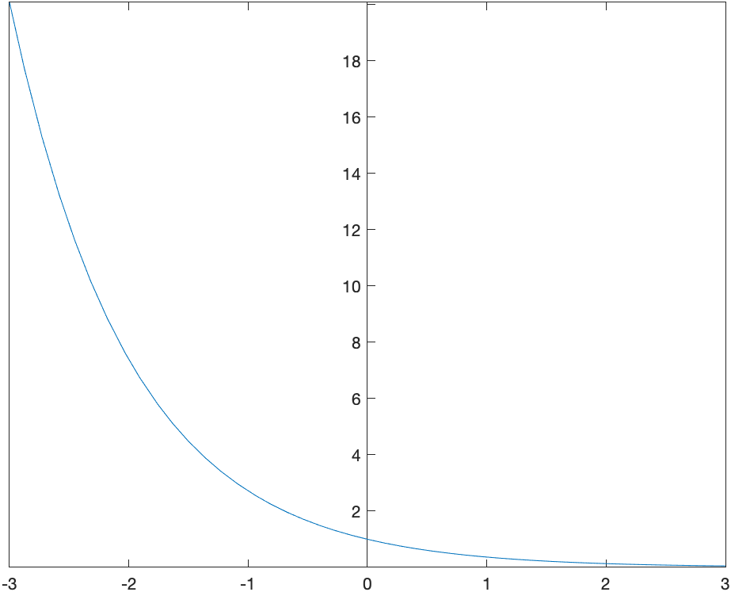
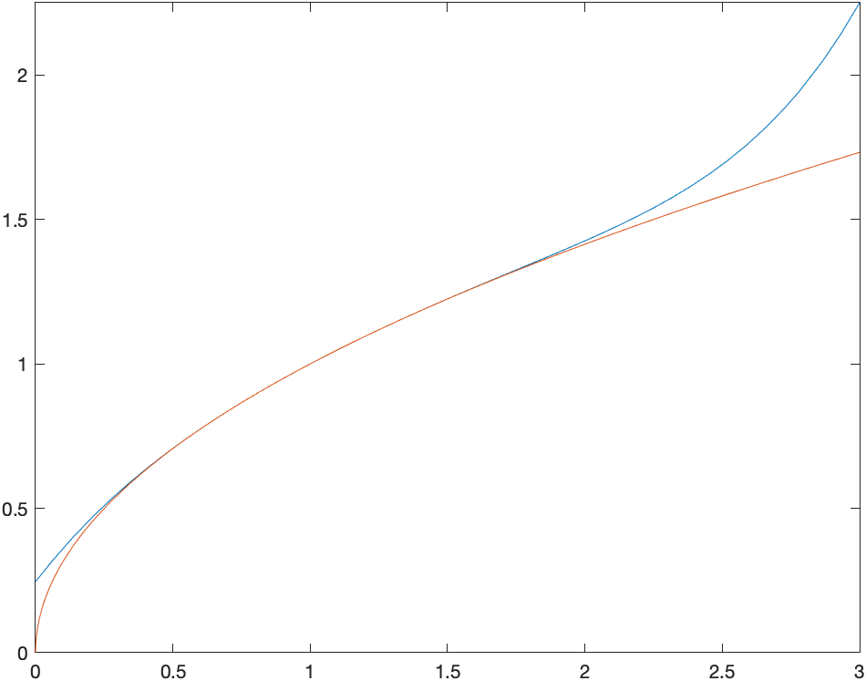
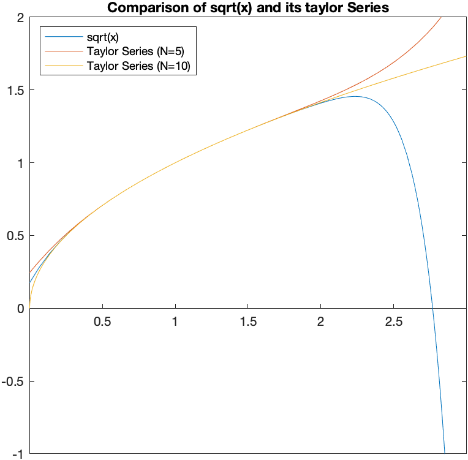
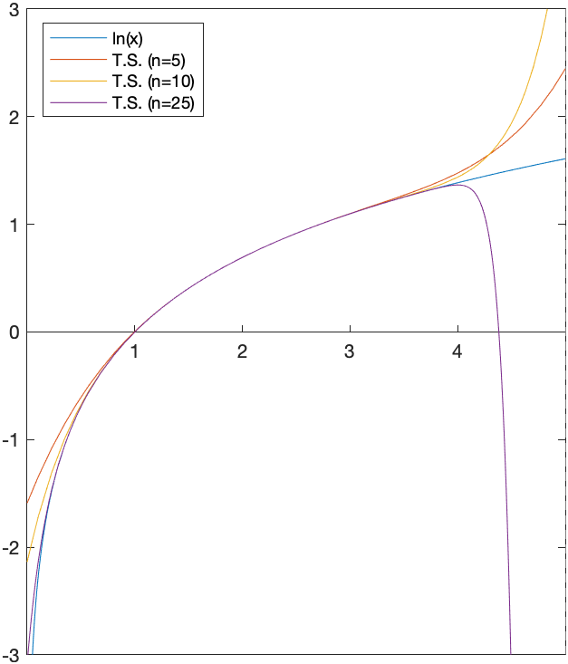

[Previous Chapter](ch-10.html) | [Return to all notes](index.html) | [Next chapter](ch-12.html)

Matlab and other CAS programs are powerful and helpful tools when performing mathematics involving sequences and series.

## Sequences

Recall that a sequence is a function that is defined on the nonnegative integers.  For example if
$$a_n = \frac{(-1)^{n}}{n}$$

Then one can generate the first few terms of the sequence.  We can do this in Matlab by first defining $n$ and then applying the formula:

```matlab
n=sym(1:10)
((-1).^n)./n
```

where we need to tell Matlab to do things element by element with a . in front of the power and division.

shows the first 10 terms and returns:
$$-1,\frac{1}{2},-\frac{1}{3},\frac{1}{4},-\frac{1}{5},\frac{1}{6},-\frac{1}{7},\frac{1}{8},-\frac{1}{9},\frac{1}{10}$$

We often are interested in finding the limit of this sequence, which is found by the command:

```matlab
syms n
limit((-1)^n/n,n,inf)
```

and returns 0.  (Note: doing this by hand requires the squeeze theorem.)

### Sequences using a Recursive Definition

It is common to define sequences recursively.  We could say $a_0=1$ and then $a_n=\frac{1}{a_{n-1}+1}$.

Doing this by hand, would result in
$$a_0=1$$
$$a_1=\frac{1}{1+1}=\frac{1}{2}$$
$$a_2=\frac{1}{1+\frac{1}{2}} = \frac{2}{3}$$
$$a_3=\frac{1}{1+\frac{2}{3}} = \frac{3}{5}$$

What would the limit of this be?

Before getting to this, we can use Matlab to generate these in the following way:

```matlab
a = zeros(10,1,"sym");
a(1)=1;
for n=2:10
    a(n)=1/(a(n-1)+1);
end
a
```

* The first line generates a vector of zeros.
* The second line starts the sequence as given
* The for loop generates the other terms based on the term before it.

which generates:
$$1,\frac{1}{2},\frac{2}{3},\frac{3}{5},\frac{5}{8},{\frac {8}{13}},{\frac {13}{21}},{\frac {21}{34}},{\frac {34}{55}},{\frac {55}{89}},{\frac {89}{144}}$$

and the terms in the fraction may be recognizable as the Fibonacci numbers.

However, since there is no formula for `a(n)`, we can't find the limit using the built-in function.  Here's a method instead:

Assume that the sequence has a limit, that is
$$L=\lim_{n \rightarrow \infty} a(n)$$

Then we take the limit of both sides of
$$a_n=\frac{1}{a_{n-1}+1}$$
to get:
$$L=\frac{1}{L+1}$$
and we can let Matlab solve this for us and it returns:
$$\frac{1}{2}\sqrt{5}-\frac{1}{2}, -\frac{1}{2}\sqrt{5}-\frac{1}{2}$$
and since the first term is positive and it is fairly clear that the limit should be positive, then
$$\lim_{n \rightarrow \infty} a_n = \frac{\sqrt{5}-1}{2}$$
(BTW: this is a very famous number called the golden ratio.  The [golden ratio wikipedia page](https://en.wikipedia.org/wiki/Golden_ratio) is a good source.)

## Introduction to Series

A series is a sum of all terms in an infinite sequence. For example,

$$1+\frac{1}{2}+\frac{1}{4}+\frac{1}{8}+ \cdots$$

and is also written as
$$\sum_{n=0}^{\infty} \frac{1}{2^{n}}$$
We won't cover all of the details of series here, but will look at some of the capabilities that Matlab and other CAS software can lend to this.

First, let's look at a plot of this situation for a few values of $n$.

```matlab
n=0:10
plot(cumsum(1./2.^n),'*-')
```

the `cumsum` makes the cumulative sum of the terms `1./2.^n` which is how $\dfrac{1}{2^n}$ needs to be written using vectors.  The result plot is


Often, we'd love to be able to determine the value of a series.  For example, the series above is a geometric series with $a=1$ and $r=1/2$.  The sum is given by
$$S=\frac{a}{1-r}= \frac{1}{1-\frac{1}{2}} =2$$

Matlab is capable of finding the value of some series.  For example,

```matlab
syms n
symsum(1/2^n,n,0,inf)
```

will return 2.

### Exercise: Infinite Sums

Use `symsum` to evaluate the following series:

1. $\displaystyle \sum_{n=1}^{\infty} \frac{1}{n}$
1. $\displaystyle\sum_{n=1}^{\infty} \frac{1}{n^{2}}$
1. $\displaystyle \sum_{n=1}^{\infty} \frac{1}{n^{3/2}}$
1. $\displaystyle \sum_{n=0}^{\infty} \frac{1}{n!}$

You'll notice that 3. returns a $\zeta$, which is the [Riemann Zeta Function](https://en.wikipedia.org/wiki/Riemann_zeta_function), a famous function that is defined as an infinite series.

## Determining Convergence of Series

Generally, it is very difficult to find the value of a series.  The ones listed above are special cases.  Generally, when trying to understand if a series converges or not, we need to use a convergence test.  We cover a few of those here.

Recall that if the value of the sum is finite, then we say that the series *converges*.  Otherwise, we say that the series *diverges*.

## Integral Test

Let $a$ be an integer and $f$ is a non-negative, decreasing function on $[a,\infty)$.  Then
$$\sum_{n=a}^{\infty} f(n)$$
converges if
$$\int_a^{\infty} f(x) \, dx$$ converges.  Conversely, if the integral diverges, then the series diverges.

### Example: Integral Test

Determine if
$$\sum_{n=1}^{\infty} \frac{1}{3n+1}$$ converges or diverges.

1. First, we note that $f(n)>0$ for on the interval.  We can let Matlab help us by doing

    ```matlab
    syms x
    f(x) = 1/(3*x+1)
    S = solve(f(x)>0,'ReturnConditions',true)
    S.conditions
    ```

    and getting the result $(-\frac{1}{3},\infty)$, so this means that the function is also positive on a subset like $(1,\infty)$.

2. Next, we need to determine that the function is decreasing on the interval.

    ```matlab
    df(x) = diff(f(x),x)
    S = solve(df(x)<0,'ReturnConditions',true)
    S.conditions
    ```

    and this shows everything except $x=-1/3$, so again, it is decreasing on the interval $[1,\infty)$

3. Lastly, evaluate the integral:

    ```matlab
    int(f(x),x,1,inf)
    ```

    results in $\infty$.  Since the integral diverges, by the integral test, the series diverges too.

#### Exercise

Determine if $$\sum_{n=1}^{\infty} \frac{1}{n^{2}+1}$$ converges or diverges by the integral test.    Also, see if Matlab can evaluate it with the `symsum` function.

## Ratio Test (RATFACE)

Another important test for convergence is the Ratio Test for Absolute Convergence (affectionately known as RATFACE).

First, recall that a series of the form:
$$\sum_{n=1}^{\infty} a_n$$
converge absolutely if
$$\sum_{n=1}^{\infty} |a_n|$$
converges.

The Ratio Test is:  Let
$$L=\lim_{n \rightarrow \infty} \left|\frac{a_{n+1}}{a_n}\right|$$
The series $\sum_{n=1}^{\infty} a_n$ converges absolutely if $L<1$, it diverges if $L>1$ and is inconclusive if $L=1$.

### Example

Use RATFACE to determine if $$\sum_{n=0}^{\infty}\frac{1}{n!}$$ converges or diverges.

Let's define

```matlab
syms n
a(n) = 1/factorial(n)
```

And then taking the limit of the absolute value of the ratio, or

```matlab
limit(abs(a(n+1)/a(n)),n,inf)
```

returns 0.  Since this is less than 1, then series converges.

#### Exercise: Ratio Test

Use RATFACE to determine if
$$\sum_{n=0}^{\infty} \frac{(-1)^{n}}{(n+3)^{n}}$$

converges or diverges.  Can Matlab find a value for this?

## Power Series

A power series is a series of the form:
$$\sum_{n=0}^{\infty} c_n (x-a)^{n}$$
for known values $c_n$ and the number $a$ is called the *center*.  For example,
$$\sum_{n=0}^{\infty} \frac{(-1)^{n}}{n!}x^{n}$$
The first few terms of this power series:
$$1-x+\frac{x^{2}}{2!}-\frac{x^{3}}{3!}+\frac{x^{4}}{4!}-\frac{x^{5}}{5!}+\cdots$$
We can't plot a full power series because there are an infinite number of terms, but Matlab allows us to plot 10, 20 or 100 terms quite easily. These are called the *partial sums* or *partial series*.

To plot up to $n=10$, we can define

```matlab
syms x
pow_series10 = symsum((-1)^n*x^n/factorial(n),n,0,10)
```

which returns:
$$
\frac{x^{10} }{3628800}-\frac{x^9 }{362880}+\frac{x^8 }{40320}-\frac{x^7 }{5040}+\frac{x^6 }{720}-\frac{x^5 }{120}+\frac{x^4 }{24}-\frac{x^3 }{6}+\frac{x^2 }{2}-x+1
$$
and then plot the series.  The result is



### Changing the output preference

```matlab
sympref('PolynomialDisplayStyle','ascend');
```

will instruct Matlab to order the polynomial from smallest power to largest power.

### The Center of a series

If a series is written in the form:
$$\sum_{n=0}^{\infty} c_n (x-a)^{n}$$

then the constant $a$ is said to be the center of the series.  For example, the series
$$\sum_{n=0}^{\infty} \frac{3^{n}}{n}(x+2)^{n}$$
has a center of $a=-2$.

### Interval and Radius of convergence

The *interval of convergence* is the set of all points on which a power series converges.  The center of the series will also be the center of the interval.

The *radius of convergence* is half of the total length of the interval of convergence.

### Example: Interval and Radius of Convergence

Consider the series,
$$\sum_{n=1}^{\infty} \frac{(-1)^{n}}{n2^{n}}(x-3)^{n}$$

Find the center, interval of convergence and radius of convergence.

First, the center is $a=3$, because of the form of the series.  To find the interval of convergence, we will use RATFACE:

```matlab
syms n x
c(n) = (-1)^n/(n*2^n)*(x-3)^n
```

and then take the limit of the absolute value or

```matlab
r = limit(abs(c(n+1)/c(n)),n,inf)
```

the result is
$$\frac{\left|x-3\right|}{2}$$.

The rule for RATFACE is that if
$$L=\lim_{n \rightarrow \infty} \left|\frac{c_{n+1}}{c_n}\right|$$
is less than 1, then the series converges absolutely.  So let's solve for that:

```matlab
S = solve(r<1,x,'ReturnConditions',true,'Real',true)
S.conditions
```

and this returns the interval $(1,5)$.

To check if the endpoints are in the interval as well, we need to check the endpoints or where $x=1$ and $x=5$.  First, the left one. Substitute $x=1$ into $c_n$ or

```matlab
simplify(subs(c(n),x,1))
```

returns $\dfrac{(-1)^{2n}}{n}$ or $\dfrac{1}{n}$.  Recall that this means that when $x=1$, we have the series:
$$\sum_{n=1}^{\infty} \frac{1}{n}$$
which diverges (it is the harmonic series).

When $x=5$,

```matlab
simplify(subs(c(n),x,5))
```

return $\dfrac{(-1)^{n}}{n}$ so this means when $x=5$, we have the series
$$\sum_{n=1}^{\infty} \frac{(-1)^{n}}{n}$$
and this series converges by the alternating series remainder theorem.  So the series
$$\sum_{n=1}^{\infty} \frac{(-1)^{n}}{n2^{n}}(x-3)^{n}$$
converges on the interval $(1,5]$.

The radius of convergence of this series is half of the total length or half of $5-1=4$.  Thus $R=2$.

#### Exercise: Interval and Radius of Convergence

Find the center, interval of convergence and radius of convergence of
$$\sum_{n=1}^{\infty} \frac{(x+2)^{n}}{5^{n}\sqrt{n}}$$

## Taylor Series

A function $f(x)$ has a power series defined at $a$. It can be represented by
$$f(x) = \sum_{n=0}^{\infty} \frac{f^{(n)}(a)}{n!}(x-a)^{n}$$

### Example: Taylor Series

Find the first 5 terms (up to $n=4$)  of the Taylor Series of $f(x)=\sqrt{x}$ using the center $a=1$.

In Matlab, remember how to take higher order derivatives.  Recall that the 3rd derivative of $\sqrt{x}$ can be

```matlab
diff(sqrt(x),x,3)
```

and this returns:
$$\frac{3}{8x^{5/2}}$$

So to do the first few terms of the Taylor series, we'll first find the coefficients $f^{(n)}(a)$

```matlab
syms x n
a=1
f(x) = sqrt(x)
coeffs5 = arrayfun(@(n) subs(diff(f(x),x,n),x,a),0:5)
```

and this returns an array of the coeffients or:
$$\left(\begin{array}{cccccc}
1 & \dfrac{1}{2} & -\dfrac{1}{4} & \dfrac{3}{8} & -\dfrac{15}{16} & \dfrac{105}{32}
\end{array}\right)$$

and the to do the sum, it appears that `symsum` doesn't work well with arrays like this, so we'll resort to `sum` via:

```matlab
ts5 = sum(coeffs5.*(x-1).^(0:5)./factorial(0:5))
```

and note that the . above are important to do element-by-element operations.  The result is
$$
\frac{1}{2}+\frac{x}{2}-\frac{\left(x-1\right)^2}{8}+\frac{\left(x-1\right)^3 }{16}-\frac{5\left(x-1\right)^4 }{128}+\frac{7\left(x-1\right)^5}{256}
$$

### Plotting a Taylor Series

One of the important parts of Taylor Series is that for the interval of convergence as the number of terms taken increases, the taylor series approaches the function.  (Discuss the Taylor Remainder Theorem).

Let's take a look at the plot of the Taylor Series and the function above with

```matlab
fplot([ts sqrt(x)],[0 3])
```

and the resulting plot is


Let's see what happens if we take more terms. Repeating the steps for $T_{10}(x)$, meaning the highest term is a 10th degree.

```matlab
coeffs10 = arrayfun(@(n) subs(diff(f(x),x,n),x,a),0:10)
ts10 = sum(coeffs10.*(x-1).^(0:10)./factorial(0:10))
```

results in
$$
\frac{x}{2}-\frac{\left(x-1\right)^2 }{8}+\frac{\left(x-1\right)^3 }{16}-\frac{5\left(x-1\right)^4 }{128}+\frac{7\left(x-1\right)^5 }{256}-\frac{21\left(x-1\right)^6 }{1024}+\frac{33\left(x-1\right)^7 }{2048}-\frac{429\left(x-1\right)^8 }{32768}+\frac{715\left(x-1\right)^9 }{65536}-\frac{2431\left(x-1\right)^{10} }{262144}+\frac{1}{2}
$$

and a plot of the function $\sqrt{x}$ along with the two Taylor Series that we found is:


### Using the built-in Taylor Series command

The `taylor` function will do all of these steps for you.  For example:

```matlab
taylor(exp(x))
```

returns the Taylor Series for $e^x$ using the default $a=0$ as the center and $n=5$ as the degree of the polynomial.  It returns:
$$
1+x+\frac{x^2 }{2}+\frac{x^3 }{6}+\frac{x^4 }{24}+\frac{x^5 }{120}
$$

If we want to change this to a degree $N=10$ polynomials, we can enter

```matlab
taylor(exp(x),'Order',10)
```

#### Changing the Center of the taylor expansion

We can also change the center of the expansion using the option `ExpansionPoint`.  The following finds the 5th degree Taylor Polynomial for $\sqrt{x}$ at $a=1$.

```matlab
taylor(sqrt(x),'ExpansionPoint',1)
```

#### Estimating the Radius of Convergence of a Taylor Series Visually

We can determing the radius of convergence visually by plotting taylor series with higher values of $N$. Consider taylor series of $f(x) = \ln x$ with center $a=2$.  We can produce these easier for various orders, consider $n=5,10,25$ using:

```matlab
ts5=taylor(log(x),x,2)
ts10=taylor(log(x),x,2,'Order',10)
ts25=taylor(log(x),x,2,'Order',25)
fplot([log(x),ts5,ts10,ts25],[0,5])
```

and you should see


You can see that as the $n$ is larger is is closer to the function $f(x)$ until right around 4.  From the plot, the best guess for the radius of convergence would be from 2 to 4 or a radius of 2.  Also, it appears that the taylor series is a good fit between 0 and 2.

#### Exercise: Plotting Taylor Series

Let $f(x)=\dfrac{1}{x+3}$.  Find $T_5(x),T_{10}(x),T_{100}(x)$ if $a=0$ and plot $f(x), T_5(x),T_{10}(x),T_{100}(x)$.

[Previous Chapter](ch-10.html) | [Return to all notes](index.html) | [Next chapter](ch-12.html)
