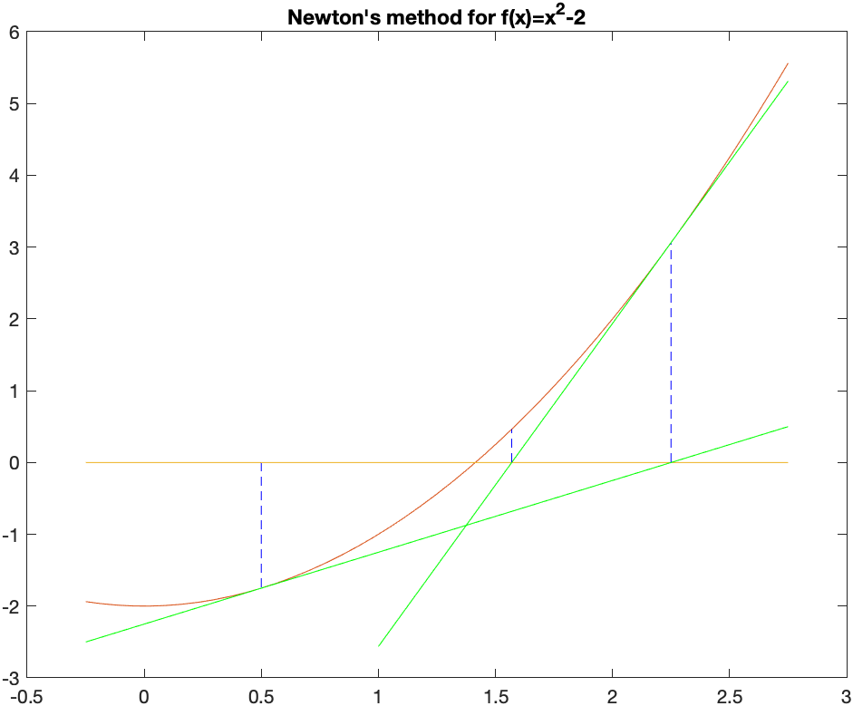
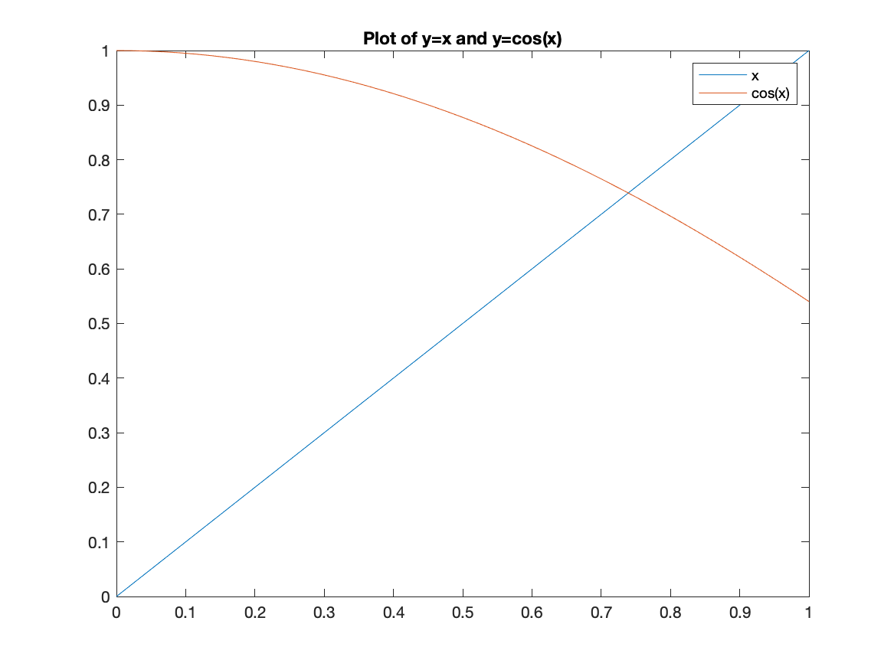
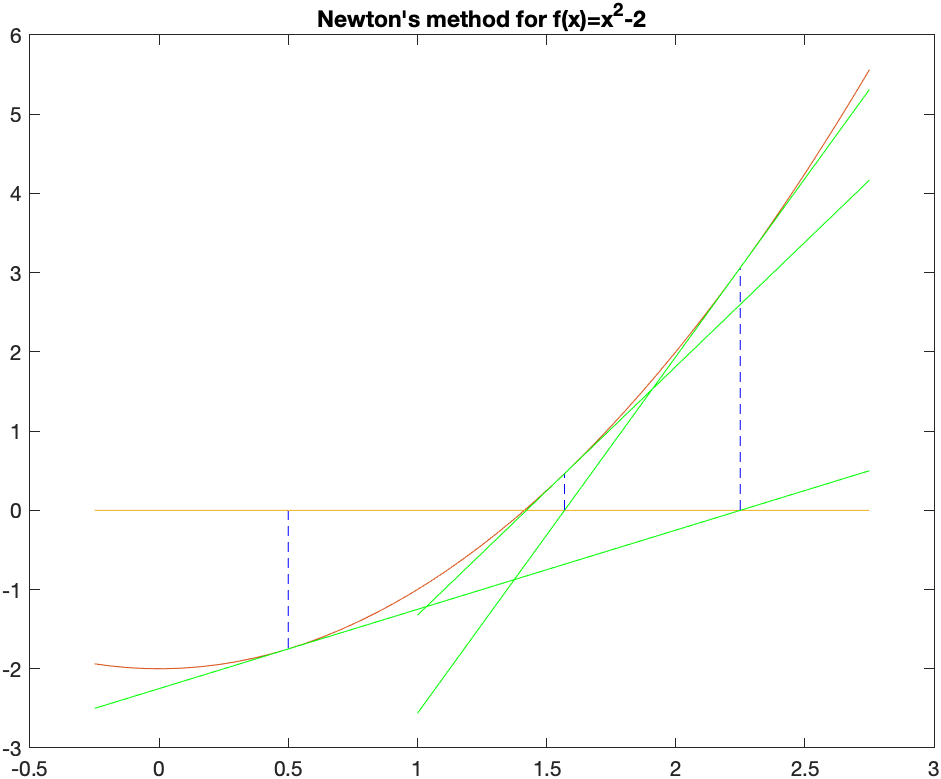

[Previous Chapter](ch-12.html) | [Return to all notes](index.html) | [Next chapter](ch-14.html)

Before continuing with this chapter, we look at a way to find the zeros (or roots) of a function.  Although Matlab (and most CASs) have this built-in, we examine the details here.

Consider the function $f(x)=x^{2}-2$, which is plotted below:



It has two roots $x=\sqrt{2}$ and $x=-\sqrt{2}$.  We will use this example to find a numerical approximation of this.

If we evaluate the function at $x=0$ and $x=2$, note that $f(0)=-2$ and $f(2)=2$.  The fact that these values have opposite signs is important.  Recall the intermediate Value Theorem:

 _Intermediate Value Theorem_ If a function $f$ is continuous on an interval $[a,b]$, then $f$ takes on all values ($y$-values or heights) between $f(a)$ and $f(b)$. Specifically if $d$ is between $f(a)$ and $f(b)$, then there exists at least one value $c$ such that $f( c )=d$.

 See [this page](http://www.mathsisfun.com/algebra/intermediate-value-theorem.html) for more information.

In the example of $f(x)=x^2-2$ on $[0,2]$, $f$ is continuous, so $f$ takes on all values between $f(0)=-2$ and $f(2)=2$, including 0.  That is, there is a number $c$ such that $f( c )=0$.  The value of $c$ is the root we seek.

## Bisection Method

The bisection method exploits the Intermediate Value Theorem to make sure that we always have a interval that contains a root.  First, we will walk through the bisection method for the example and then write it down in general.

Let $\tilde{a}$ be the midpoint between $a$ and $b$ or $x=0$ and $x=2$ in our case.  That is
$$\tilde{a} = \frac{a+b}{2} = \frac{0+2}{2}=1$$
There are three choices for $f(\tilde{a})$.  Either it is 0, then you have found the root or it is less than zero or greater than zero.

In this example, $f(1)=-1$, then it is less than zero.  Because our left endpoint was less than zero, we replace the interval $[0,2]$ with $[1,2]$.  The new interval $[1,2]$ satisfies the condition that the function values are opposite signs.

And then we repeat.  The midpoint of this interval is 1.5 and $f(1.5)=1.5^{2}-2=0.25$ and since this is positive, we replace the 2 with 1.5 and our new interval is $[1,1.5]$.

### Exercise

Find the next 3 intervals using this technique.  Recall that you always need to have the function value of one side be less than and the other be greater than 0.

### Stop this crazy thing

Since you are wise, you notice that you can continue this process forever and you just don't have that much time.  For example, on the tenth iteration, you should have the interval

```matlab
[1.41406250,1.416015625]
```

and as long as the condition that the function values of two endpoints are opposite signs, then there is a guarantee of a root inside this interval.

Again, we can go on forever, but a good place to stop (often called a halting condition) is when the length of the interval shrinks to a particular size.  Let&#8217;s say that we stop when the length is $10^{-4}$ and then we should return our best guess at the root, which may be the midpoint of the final interval.   If we stop when the interval is less than $10^{-4}$ and take this midpoint, the answer will be 1.414215088.

### Creating a Function to do this

This section will slowly build up a procedure that does this.  The goal of this section is to learn how to take an algorithm (explained above) and make a function that does this.  Make a new Script (not a live script)

1. _Start with a template_

    We want to take a function and an interval (that is two numbers) in and return an approximate root.

    ```matlab
    function result = bisect(f,a,b)

    end
    ```

    This will just do that.

    Save the script as `bisect.m` in the directory where you have added other scripts for this class. Earlier we put them in a directory called `ext_functions`.  This isn't required, but if the name is different, make sure you adapt. Then try to run the function:

    ```matlab
    addpath("ext_functions/")
    bisect(@(x) x^2-2,0,2)
    ```

    and if all goes well, there won't be errors.  If you get errors, double check that the function name is correct and the directory is correct.

2. _Add in some checking on the arguments_

    Matlab has some nice ways to make sure that the inputs are correct.  Here's how to do that:

    ```matlab
    function result = bisect(f,a,b)
      arguments
        f function_handle
        a (1,1) {mustBeReal}
        b (1,1) {mustBeReal}
      end
    end
    ```

    where all of the arugments are listed in the `arguments` block and
    * `f` is checked to make sure it is a function handle
    * `a` and `b` are numbers (or in Matlab-speak 1 by 1 matrices)  the `mustBeReal` in the braces ensure you are not putting in things like complex numbers.

    Let's check to make sure this is okay.
    If we result the function:

    ```matlab
    bisect(@(x) x^2-2,0,2)
    ```

    you shouldn't see any errors.  However,

    ```matlab
    syms x
    bisect(x^2-2,0,2)
    ```

    returns an error that is like:

    ```matlab
    Error using bisect
      Invalid argument at position 1. Value must be of type function_handle or be convertible to function_handle.
    ```

3. _Define the midpoint and return it_

    Next, let's do something super simple and define the midpoint and then return it.  Add the lines:

    ```matlab
      c = 0.5*(a+b); % calculate the midpoint of [a,b]
      result = c;
    ```

    after the `end` that ends the arguments block of code (or between the two `end`s).

    Try running this block of code.  Make sure there are no errors.

    ```matlab
    bisect(@(x) x^2-2,0,2)
    ```

    and you should get the answer 1.  Note: if you don't see any output, double-check that you included the `result=c` line.  To get a function to return a value, you must assign output variable (on the top line of the function) to a value.

4. _Create a new interval_

    Now, let's assign the `result` variable to an interval instead.   Recall that you want to make sure that the endpoints of the new interval are opposite signs.  The easiest way to check this is to determine if the product of the function values is negative and we'll make and `if` block like:

    ```matlab
    function result = bisect(f,a,b)
      arguments
        f function_handle
        a (1,1) {mustBeReal}
        b (1,1) {mustBeReal}
      end
      c = 0.5*(a+b); % calculate the midpoint of [a,b]
      if (f(c)*f(a)<0)
        result = [a c]; %bisect(f,a,c,'eps',options.eps);
      else
        result = [c b];%bisect(f,c,b,'eps',options.eps);
      end
    end
    ```

    If we test this with `bisect(@(x) x^2-2,0,2)` we get

    ```matlab
    [1  2]
    ```

    which means that the root is in the interval [1,2].

5. _Use recursion to do a number of steps_  We will call the bisect function inside `if` block instead.  Consider

    ```matlab
    function result = bisect(f,a,b)
      arguments
        f function_handle
        a (1,1) {mustBeReal}
        b (1,1) {mustBeReal}
      end
      c = 0.5*(a+b); % calculate the midpoint of [a,b]
      if (f(c)*f(a)<0)
        result = bisect(f,a,c);
      else
        result = bisect(f,c,b);
      end
    end
    ```

    and notice that in the `if` block we call bisect again (this makes it resursive) on the interval either $[a,c]$ or $[c,b]$.    **Don't run this yet**

    If you do, you'll get an error (about a limit of the number of recursive calls, which isn't the end of the work).  This is because remember that with a recursive function you always need a way to stop the recursion.  What we'll do is if the interval is small enough, we'll stop and return the root.

    ```matlab
    function result = bisect(f,a,b)
      arguments
        f function_handle
        a (1,1) {mustBeReal}
        b (1,1) {mustBeReal}
      end
      c = 0.5*(a+b); % calculate the midpoint of [a,b]
      if (b-a)<0.0001 % if the interval is small enough, stop and return the midpoint
        result = c;
      elseif (f(c)*f(a)<0)
        result = bisect(f,a,c);
      else
        result = bisect(f,c,b);
      end
    end
    ```

    Let's give this one a go: `bisect(@(x) x^2-2,0,2)` and the answer is returned 1.4142

6. _Allow more robust cutoff values_

    In the example above, the bisection method stops when the interval length reaches 0.0001, but what if we want it more precise.  We can add an optional argument in the following way:

    ```matlab
    function result = bisect(f,a,b, options)
      arguments
        f function_handle
        a (1,1) {mustBeReal}
        b (1,1) {mustBeReal}
        options.eps (1,1) {mustBePositive} = 1e-4
      end
      c = 0.5*(a+b); % calculate the midpoint of [a,b]
      options.eps
      if b-a< options.eps
          result = c;
      elseif (f(c)*f(a)<0)
        result = bisect(f,a,c,'eps',options.eps);
      else
        result = bisect(f,c,b,'eps',options.eps);
      end
    end
    ```

    and notice that it is important that we send the options to the function recursively in the `if` block.

    If we run the function again, it will be exactly the same, but we will see below that we optionally throw in a way to get more accurate numbers.

    First, if we change the output format to

    ```matlab
    format long
    ```

    and rerun the same command above, we'll get 1.414215087890625.  How accurate is this?

    In this case, we know the exact answer is $\sqrt{2}$, so we can do

    ```matlab
    x0 = bisect(f,0,2)
    abs(x0-sqrt(2))
    ```

    which returns 1.525517529854525e-06, meaning that it is about 6 digits accurate.

    If we run:

    ```matlab
    x0 = bisect(@(x) x^2-2,0,2,'eps',1e-10)
    abs(x0-sqrt(2))
    ```

    we get 1.795119608516416e-11, which is nearly 11 digits of accuracy.

### Exercise: Bisection Method

Find the solution to $\cos x = x$ using the bisection method.  Hint: use algebra to get all terms to one side.  You may need to plot the function to get an idea where the solution is.

## Recursive Iterations

Earlier, we have seen a few cases of iteration, in particular recursive iteration.  For example, the sequence:
$$a_{n} = \frac{1}{a_{n-1}+1}$$
with $a_1=1$ generates a sequence.  In [Chapter 10](ch-10.html) we found the first few terms and then found the limit of this.  Recall that if we define:

```matlab
a=zeros(10,1,'sym');

a(1) = sym(1);
for i=2:10
    a(i) = 1/(a(i-1)+1);
end
a
```

generates the first 10 terms or
$$1,\frac{1}{2},\frac{2}{3},\frac{3}{5},\frac{5}{8},{\frac {8}{13}},{\frac {13}{21}},{\frac {21}{34}},{\frac {34}{55}},{\frac {55}{89}},{\frac {89}{144}}$$

and as we discovered above, this sequence converges to the golden mean (or golden ratio)
$$\frac{1+\sqrt{5}}{2}$$

## Finding $\sqrt{a}$

Another useful iterative sequence is the following:
$$x_{n+1} = \frac{x_n^{2}+a}{2x_n}\qquad x_0=a$$

for a positive number $a$.  We will show that this converges to $\sqrt{a}$.  For example, if $a=2$, then

```matlab
xval = zeros(10,1,"sym")  % make an array of zeros
xval(1)=1
for i=2:10
  xval(i) = (xval(i-1)^2+2)/(2*xval(i-1))
end
xval
```

The first few terms of this we get:
$$1,\frac{3}{2},\frac{17}{12},\frac{577}{408},\frac{665857}{470832},\frac{886731088897}{627013566048},\ldots$$

and then the fraction gets quite large because we declared a symbolic array, so everything is rational.  If instead, we use numeric array, like:

```matlab
format long
xval = zeros(6,1);  % make an array of zeros
xval(1)=2;
for i=2:length(xval)
  xval(i) = (xval(i-1)^2+2)/(2*xval(i-1));
end
xval
```

the result is

$$2.0,1.500000000,1.416666666,1.414215686,1.414213562,
\ldots$$

### Exercise: Using iteration to find square roots

Use the above to find $\sqrt{5}$.

## Newton's Method

The above formula is a specific case of Newton's method for finding roots.  Here's a geometric view of Newton's method.

We intend to find the point $x^{\star}$ such that $f(x)=0$.  We don't know how to find $x^{\star}$, but have an approximate solution, call it $x_0$.  Draw the tangent line to the curve $y=f(x)$ at $x_0$.  The following plot is an example with $f(x)=x^{2}-2$ and $x_0=0.5$:



The point on the left is $x_0=0.5$ and the green line is the tangent line there.  Instead of using the function, we use the tangent line, which is easy to solve.  That value is $x_1=2.25$.  At this point (no pun intended), we find the tangent line at $x_1$ and find where it crosses the $x$-axis.

The tangent here is $y=\frac{9}{2} (x-2.25)+(2.25)^2$ and then it is added to the above plot to get:


Then the tangent above is solved for $x$ to get $x_2 = \frac{113}{72}$.  We'll show one more step to include the tangent line at this point:


and visually it looks like it is very close to the root.  It's not exact and we can keep iterating until we get as close as we'd like.

### Why this works

Recall that the tangent line to the curve $y=f(x)$ at $x=a$ is
$$y=f'(a)(x-a)+f(a)$$
and if we set $y=0$ in the tangent line because we are seeking the root (where the function is 0)
$$0=f'(a)(x-a)+f(a)$$
and then we solve for $x$.  (Either by hand or let Matlab do it).
$$x=a+\frac{f(a)}{f'(a)}$$

Next, if we let $a=x_0$, our initial point and $x$ be $x_1$, the next point:
$$x_1=x_0+\frac{f(x_0)}{f'(x_0)}$$

or in general:
$$x_{n+1}=x_n+\frac{f(x_n)}{f'(x_n)}$$

and this last equation is called *Newton's rootfinding method* (or just *Newton's method*)

#### Example

Use Newton's method to find the solution to $\cos x = x$.

If we let $f(x)=x-\cos x$ and perform Newton's method.  Since, $f'(x)=1+\sin x$, this means that
$$x_{n+1} = x_n - \frac{x_n-\cos x_n}{1+\sin x_n}$$
and let's use $x_0=0$ as an initial guess.

If we enter:

```matlab
xval = zeros(6,1);  % make an array of zeros
xval(1)=0;
for i=2:length(xval)
  xval(i) = xval(i-1) -(xval(i-1)-cos(xval(i-1)))/(1+sin(xval(i-1)));
end
xval
```

the results are
$$0., 1.000000000, 0.7503638679, 0.7391128909, 0.7390851334, 0.7390851332$$

As you can see from the sequence, the last two numbers are the same for the first 9 digits.

And looking at a plot of $x$ and $\cos x$,


The solution looks like about 0.73.

#### Exercise: Using Newton's Method

There are two $x$ values such that $1-x^{2}=\sin x$.  Find the solution that satisfies $x\lt 0$.  Plot the two function to see if your answer is reasonable.

### Creating a Newton's Method function

The following function:

```matlab
function result = newton(f,x0,options)
  arguments
    f function_handle
    x0 (1,1) {mustBeReal}
    options.eps (1,1) {mustBePositive} = 1e-6
  end

  syms x
  df(x) = diff(f(x),x)
  x1=x0;

  dx=1; % this will be a step, just initialized to 1 to get the while loop started
  while abs(dx)>options.eps
    dx=f(x1)/df(x1);
    x1 = x1-dx;
  end
  result = x1;
end
```

can be used to solve Newton's method for a given function $f$, its derivative $df$ and an initial point $x0$.

We can now use this function to find roots.  Here's the solution to $x^2-2=0$:

```matlab
syms x
f(x) = x^2-2;
df(x) = diff(f(x),x)
root = newton(@(x) f(x),@(x) df(x),1)
double(root)
```

#### Exercise: Using Newton's Method to find solutions to equations

1. Use the newton function above to find the solution to $\cos(x) = x$.
2. Use the newton function above to find both solutions to $\sin(x) = 1-x^2$.  Hint: you'll have to use different initial conditions to find both roots.

## A few more steps to get the Bisection Function a bit better

Although it seems like the bisection function above was fantastic, there's a few other things to make it more robust in that it can handle any situations.

1. _Ensuring that the intial interval has a root_

    To use the bisection method, there needs to be a root.  Recall above, we invoked the intermediate value theorem to do this.  A condition was that the function values at $a$ and $b$ had different signs.  The following will check this.  Put this just after the `arguments` block of code.

      ```matlab
      if f(a)*f(b)>0
        error("A root is not guaranteed on the given interval.")
      end
      ```

    An example where this won't work is the function $f(x)=x^2+2$. It has not real root because it is always positive.

    Calling the function with `bisect(@(x) x^2+2,0,2)` results in the error above.

2. _Adding some help_

    It's often helpful to add a description to the function, so here's the latest

    ```matlab
    function result = bisect(f,a,b, options)
    % BISECT  Finds the root of the function on the interval [a,b] using the
    % bisection method.

    % root = bisect(f,a,b)
    %
    % Example: bisect(@(x) x^2-2,0,2) finds the root of x^2-2 on the interval
    % [0,2] which returns an approximation to the square root of 2.
    %
    % Optional Arguments:
    %   eps: a positive real number.  This is the stopping condition.  Defaults
    %   to 1e-4

      arguments
        f function_handle
        a (1,1) {mustBeReal}
        b (1,1) {mustBeReal}
        options.eps (1,1) {mustBePositive} = 1e-4
      end
      if f(a)*f(b)>0
        error("A root is not guaranteed on the given interval.")
      end
      c = 0.5*(a+b); % calculate the midpoint of [a,b]

      if b-a< options.eps
          result = c;
      elseif (f(c)*f(a)<0)
        result = bisect(f,a,c,'eps',options.eps);
      else
        result = bisect(f,c,b,'eps',options.eps);
      end
    end
    ```

    Where all of the help is written in comments at the top of the funciton. If you type:

    ```matlab
    help bisect
    ```

    you will see the help text shown.

## Using the built-in Matlab methods

Finding roots of functions or solutions of equations can be done with `solve` or `vpasolve`.  First, consider solving $\cos(x) = x$ that we saw above.  If we use the `solve` command with

```matlab
solve(cos(x)==x)
```

Then first Matlab returns a warning:

```matlab
Warning: Unable to solve symbolically. Returning a numeric solution using vpasolve.
```

and then retuns:

```matlab
0.73908513321516064165531208767387
```

which appears to give about 30 decimals places.

And recall that for example with polynomials, Matlab often gives an unhelpful result:

```matlab
solve(x^5-100*x+1)
```

returns an array of `root(z^5-100z+1,z,1)` whereas

```matlab
vpasolve(x^5-100*x+1)
```

returns
$$
\left(\begin{array}{c}
-3.1647727346753370902009096534805\\
0.01000000000100000000050000000035\\
3.1597727034248370797270268345331\\
-0.0024999843752499947633085905264823-3.1622826011677773505491959715959\,\mathrm{i}\\
-0.0024999843752499947633085905264823+3.1622826011677773505491959715959\,\mathrm{i}
\end{array}\right)
$$
where the last two are complex solution.

[Previous Chapter](ch-12.html) | [Return to all notes](index.html) | [Next chapter](ch-14.html)
