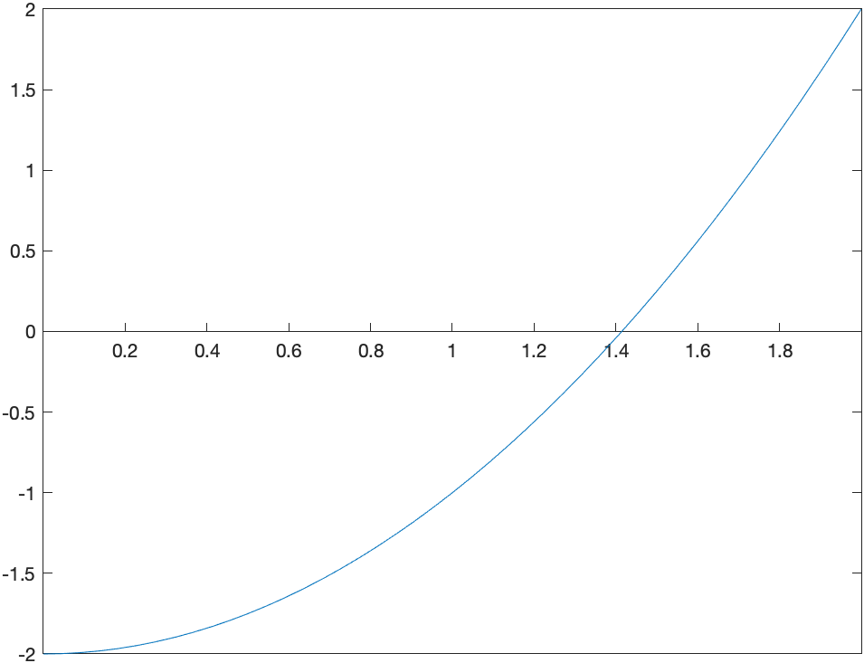

[Return to all notes](index.html)

Before continuing with this chapter, we look at a way to find the zeros (or roots) of a function.  Although Maple (and most CASs) have this built-in, we examine the details here.  

Consider the function $f(x)=x^{2}-2$, which is plotted below:


It has two roots $x=\sqrt{2}$ and $x=-\sqrt{2}$.  We will use this example to find a numerical approximation of this.  

If we evaluate the function at $x=0$ and $x=2$, note that $f(0)=-2$ and $f(2)=2$.   The intermediate value theorem states that if a function $f$ is continuous on an interval $[a,b]$, then $f$ takes on all values ($y$-values or heights) between $f(a)$ and $f(b)$. Specifically if $d$ is between $f(a)$ and $f(b)$, then there exists at least one value $c$ such that $f( c )=d$.  See [this page](http://www.mathsisfun.com/algebra/intermediate-value-theorem.html) for more information.  

For this example, $f$ is continuous, so $f$ takes on all values between $f(0)=-2$ and $f(2)=2$, including 0.  That is, there is a number $c$ such that $f( c )=0$.  The value of $c$ is the root we seek.


Bisection Method
----

The bisection method exploits the intermediate value theorem to make sure that we always have a interval that contains a root.  First, we will walk through the bisection method for the example and then write it down in general.  

Let $\tilde{a}$ be the midpoint between $a$ and $b$ or $x=0$ and $x=2$ in our case.  That is
$$\tilde{a} = \frac{a+b}{2} = \frac{0+2}{2}=1$$
There are three choices for $\tilde{a}$.  Either it is 0, then you have found the root or it is less than zero or greater than zero.  Since $f(1)=-1$, then it is less than zero.  Because our left endpoint was less than zero, we replace it with zero.  That is our interval goes from $[0,2]$ to $[1,2]$.  

And then we repeat.  The midpoint of this interval is 1.5 and $f(1.5)=1.5^{2}-2=0.25$ and since this is positive, we replace the 2 with 1.5 and our new interval is $[1,1.5]$.

###Exercise

Find the next 3 intervals using this technique.  Recall that you always need to have the function value of one side be less than and the other be greater than 0.  

###Stop this crazy thing!!!

Since you are wise, you notice that you can continue this process forever and you just don&apos;t have that much time.  For example, on the tenth iteration, you should have the interval
```
[1.41406250,1.416015625]
```
and as long as the condition that the function values of two endpoints are opposite signs, then there is a guarantee of a root inside this interval.  

Again, we can go on forever, but a good place to stop (often called a halting condition) is when the length of the interval shrinks to a particular size.  Let&#8217;s say that we stop when the length is $10^{-4}$ and then we should return our best guess at the root, which may be the midpoint of the final interval.   If we stop when the interval is less than $10^{-4}$ and take this midpoint, the answer will be 1.414215088.

###Creating a Procedure to do this

This section will slowly build up a procedure that does this.  The goal of this section is to learn how to take an algorithm (explained above) and make a procedure that does this.


1. Shell of a procedure.  Let&#8217;s start with the declaration of the procedure.  We want to take a function and an interval in and return an approximate root.  

    ```
    bisect:=proc(f::procedure,interval::range)::numeric;

    end proc:
    ```

    This will just do that.  Note that a function type is called a `procedure` and an interval is called a `range`.  The return type will be a number, so `numeric`.  It&#8217;s a good idea to just run this at this point.  

2. Define the midpoint and return it.

    Next, let&#8217;s do something super simple and define the midpoint and then return it.  To get the endpoints of an interval or range, use `lhs` and `rhs`, which stands for left hand side and right hand side respectively.  

    ```
    bisect:=proc(f::procedure,interval::range)::numeric;
       local mid:=0.5*(lhs(interval)+rhs(interval)):
        return mid:
    end proc:
    ```

    and then execute this block of code.  Make sure there are no errors.  Then you can test it using the example above by typing
    ```
    bisect(x->x^2,0..2)
    ```
    and you should get the answer 1.0.

3. Create a new interval

    Now, let's also create a variable called `inter` that is the new interval.  Recall that you want to make sure that the endpoints of the new interval are opposite signs.  The easiest way to check this is to determine if the product of the function values is negative.

    ```
    bisect:=proc(f::procedure,interval::range)::numeric;
       local mid:=0.5*(lhs(interval)+rhs(interval)):
       local inter:=interval:
       if f(lhs(inter))*f(mid) < 0 then
           inter := lhs(inter) .. mid
       else
          inter := mid .. rhs(inter)
       end if:
       return inter:
    end proc:
    ```
    If we test this with `bisect(x->x^2-2,0..2)` we get
    ```
    1.0 .. 2
    ```

    which means that the root is in the interval [1.0,2.0].

4. Put in a loop to run a few times.

    Next, we will run this a few times using a `for` loop to test the procedure.  

    ```
    bisect:=proc(f::procedure,interval::range)::numeric;
       local mid:=0.5*(lhs(interval)+rhs(interval)):
       local inter:=interval:
       local i:

       for i to 4 do
         if f(lhs(inter))*f(mid) < 0 then
           inter := lhs(inter) .. mid
         else
           inter := mid .. rhs(inter)
         end if:
         mid := .5*(lhs(inter)+rhs(inter)):
         print(inter):
        end do;
      return mid
    end proc:
    ```

    This will print out the interval to make sure it is working.  You should see the interval printed 4 times and then the midpoint returned (and then printed):
    ```
    1.0 .. 2
    1.0 .. 1.50
    1.250 .. 1.50
    1.3750 .. 1.50
    1.43750
    ```

    so this appears that the root is 1.43750 and is guaranteed to be in the interval [1.375,1.5]

5. Replace the for loop with a while loop

    We don't want to run this a fixed number of times, but instead, run this until the halting condition.

    We will execute the loop while the length of the interval is greater than $10^{-4}$.  

    ```
    bisect := proc (f::procedure, interval::range)::numeric;
      local mid := .5*(lhs(interval)+rhs(interval));
      local inter := interval;
      while rhs(inter)-lhs(inter) > 10^(-4) do
        if f(lhs(inter))*f(mid) < 0 then
          inter := lhs(inter) .. mid
        else
          inter := mid .. rhs(inter)
        end if;
        mid := .5*(lhs(inter)+rhs(inter));
        print(inter):
      end do;
      return mid:
    end proc:
    ```

    If we test the procedure by typing: `bisect(x->x^2-2,0..2)`, you will get 1.414215088.  Note that we can determine the number of digits of accuracy for $\sqrt{2}$ by typing
    ```
    evalf(|sqrt(2)-1.414215088|)
    ```
    will result in 0.000001526 or 5 digits of accuracy.  

6. Adding a parameter for the halting condition.

    If we want the halting condition to be smaller than $10^{-4}$, we will make it a parameter.  Here&#8217;s how that works.

    ```
    bisect := proc (f::procedure, interval::range,{eps:=10^(-4)})::numeric;
      local mid := .5*(lhs(interval)+rhs(interval));
      local inter := interval;
      while rhs(inter)-lhs(inter) > eps do
        if f(lhs(inter))*f(mid) < 0 then
          inter := lhs(inter) .. mid
        else
          inter := mid .. rhs(inter)
        end if;
        mid := .5*(lhs(inter)+rhs(inter));
      end do;
      return mid:
    end proc:
    ```
    and we have removed the print statement because all seems to be working well.  Now if we call this procedure as above,
    ```
    bisect(x->x^2-2,0..2)
    ```
    then we get the same result as above.

    But this allows us to get more precision.  Type
    ```
    bisect(x->x^2-2,0..2,eps=10^(-7))
    ```

    gives this time 8 digits of accuracy.  

7. Adding some help and error checking to this

    It's often helpful to add a description to the function, so here's the final result:

    ```
    bisect := proc (f::procedure, interval::range,{eps:=10^(-4)})::numeric;
      description "This procedure performs the bisection method on the function f with given range.  The parameter eps will determine  the halting condition."
      local mid := .5*(lhs(interval)+rhs(interval));
      local inter := interval;
      if f(rhs(inter))*f(lhs(inter))>0 then
         error "A root is not guaranteed to be in this interval.":
      end if:
      while rhs(inter)-lhs(inter) > eps do
        if f(lhs(inter))*f(mid) < 0 then
          inter := lhs(inter) .. mid
        else
          inter := mid .. rhs(inter)
        end if;
        mid := .5*(lhs(inter)+rhs(inter));
      end do;
      return mid:
    end proc:
    ```

    The description is helpful to remember what the function does.  If you type:
    ```
    Describe(bisect)
    ```
    You will see
    ```
    # This procedure performs the bisection method on the function f with given
    # range.
    # The parameter eps will determine the halting condition.
    # The procedure returns the root of the function f within the given interval
    # such that the
    # interval is no wider than eps.
    bisect( f::procedure, interval::range,
        { eps := .1e-3 } ) :: numeric
    ```

    and give a brief description of the function.

    Also, we now have error checking built it.  


We will use this procedure in a homework problem.


## Rootfinding and the Bisection method

Recall that we encountered the Bisection method in [Chapter 5](ch05.html).  This was another way to do rootfinding.  If we reenter the bisection procedure:
```
function result = bisect(f,a,b,options)
  arguments
    f function_handle
    a (1,1) {mustBeReal}
    b (1,1) {mustBeReal}
    options.eps (1,1) {mustBePositive} = 1e-6 
  end
   c = 0.5*(a+b); % calculate the midpoint of [a,b]
  if(b-a < options.eps)  % the interval is small enough
      result = 0.5*(a+b);
  elseif (f(c)*f(a)<0)
    result = bisect(f,a,c,'eps',options.eps);
  else
    result = bisect(f,c,b,'eps',options.eps);
  end
end
```

We can find roots, like $\sqrt{2}$ using this instead.  

```
bisect(@(x) x^2-2,0,2,1e-6)
```

### Exercise

Find the solution to $\cos x = x$ using the bisection method.  Hint: use algebra to get all terms to one side and define that 


## Recursive Iterations


Earlier, we have seen a few cases of iteration, in particular recursive iteration.  For example, the sequence:
$$a_{n} = \frac{1}{a_{n-1}+1}$$
with $a_1=1$ generates a sequence.  In [Chapter 10](ch-10.html) we found the first few terms and then found the limit of this.  Recall that if we define:
```
a=zeros(10,1,'sym');

a(1) = sym(1);
for i=2:10
    a(i) = 1/(a(i-1)+1);
end
a
```
generates the first 10 terms or
$$1,\frac{1}{2},\frac{2}{3},\frac{3}{5},\frac{5}{8},{\frac {8}{13}},{\frac {13}{21}},{\frac {21}{34}},{\frac {34}{55}},{\frac {55}{89}},{\frac {89}{144}}$$

and as we discovered above, this sequence converges to the golden mean (or golden ratio)
$$\frac{1+\sqrt{5}}{2}$$


Finding $\sqrt{a}$
------

Another useful iterative sequence is the following:
$$x_{n+1} = \frac{x_n^{2}+a}{2x_n}\qquad x_0=a$$

for a positive number $a$.  We will show that this converges to $\sqrt{a}$.  For example, if $a=2$, then

```
xval = zeros(10,1,"sym")  % make a zero 
xval(1)=1
for i=2:10
  xval(i) = (xval(i-1)^2+2)/(2*xval(i-1))
end
xval
```
The first few terms of this we get:
$$1,\frac{3}{2},\frac{17}{12},\frac{577}{408},\frac{665857}{470832},\frac{886731088897}{627013566048},\ldots$$

and then the fraction gets quite large because we declared a symbolic array, so everything is rational.  If instead, we use numeric array, like: 

```
format long
xval = zeros(6,1);  % make a zero 
xval(1)=2;
for i=2:length(xval)
  xval(i) = (xval(i-1)^2+2)/(2*xval(i-1));
end
xval
```
the result is 

$$2.0,1.500000000,1.416666666,1.414215686,1.414213562,
\ldots$$


#### Exercise.  

Use the above to find $\sqrt{5}$.  


Newton's Method
-------

(First, before trying any of these, you'll probably want to `unassign('x')` to get everything to work correctly.)


The above formula is a specific case of Newton's method for finding roots.  Here's a geometric view of Newton's method.  

We intend to find the point $x^{\star}$ such that $f(x)=0$.  We don't know how to find $x^{\star}$, but have an approximate solution, call it $x_0$.  Draw the tangent line to the curve $y=f(x)$ at $x_0$.  The following plot is an example with $f(x)=x^{2}-2$ and $x_0=0.4$:



The point on the left is $x_0=0.5$ and the green line is the tangent line there.  Instead of using the function, we use the tangent line, which is easy to solve.  That value is $x_1=2.25$.  At this point (no pun intended), we find the tangent line at $x_1$ and find where it crosses the $x$-axis.  

This process continues indefinitely and (for this example), it converges to $\sqrt{2}$.  

### Why this works

Recall that the tangent line to the curve $y=f(x)$ at $x=a$ is
$$y=f'(a)(x-a)+f(a)$$
and if we set $y=0$ in the tangent line because we are seeking the root (where the function is 0)
$$0=f'(a)(x-a)+f(a)$$
and then we solve for $x$.  (Either by hand or let Maple do it).
$$x=a+\frac{f(a)}{f'(a)}$$

Next, if we let $a=x_0$, our initial point and $x$ be $x_1$, the next point:
$$x_1=x_0+\frac{f(x_0)}{f'(x_0)}$$

or in general:
$$x_{n+1}=x_n+\frac{f(x_n)}{f'(x_n)}$$

and this last equation is called *Newton's rootfinding method* (or just *Newton's method*)


###Example

Use Newton's method to find the solution to $\cos x = x$.

If we let $f(x)=x-\cos x$ and perform Newton's method.  Since, $f'(x)=1+\sin x$, this means that
$$x_{n+1} = x_n - \frac{x_n-\cos x_n}{1+\sin x_n}$$
and let's use $x_0=0$ as an initial guess.  

If we enter:
```
xval = zeros(6,1);  % make an array of zeros
xval(1)=0;
for i=2:length(xval)
  xval(i) = xval(i-1) -(xval(i-1)-cos(xval(i-1)))/(1+sin(xval(i-1)));
end
xval
```

the results are
$$0., 1.000000000, 0.7503638679, 0.7391128909, 0.7390851334, 0.7390851332$$

As you can see from the sequence, the last two numbers are the same for the first 9 digits.  

And looking at a plot of $x$ and $\cos x$,


The solution looks like about 0.73.  

#### Exercise

There are two $x$ values such that $1-x^{2}=\sin x$.  Find the solution that satisfies $x\lt 0$.  Plot the two function to see if your answer is reasonable.  

### Creating a Newton's Method function

The following function:
```
function result = newton(f,df,x0,options)
  arguments
    f function_handle
    df function_handle
    x0 (1,1) {mustBeReal}
    options.eps (1,1) {mustBePositive} = 1e-6 
  end

  x1=x0;
  
  dx=1; % this will be a step, just initialized to 1 to get the while loop started
  while(abs(dx)>options.eps)
    dx=f(x1)/df(x1);
    x1 = x1-dx;
  end
  result = x1;
end
```
can be used to solve Newton's method for a given function $f$, its derivative $df$ and an initial point $x0$.  

