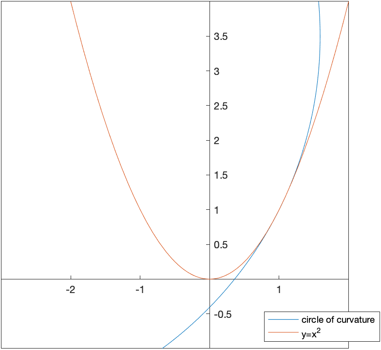

Data in Maple
=======

[Return to all notes](index.html)

Although there is much better software to use for Data Analysis than Maple, here are some things to know.  

DataFrames
------

In many cases, dealing with data mean dealing with variables of different types.  Because of this, matrices or arrays are not the best storage types.

A `DataFrame` is a common type of data structure across many languages which are designed for use with data. A data frame is a rectangular data structure in which each column has a different type.

Consider the following list of people:


| First Name | Last Name | Gender | Age |
| ------ | ---- | ---- | ----- |
| Homer | Simpson | Male | 35 |
| Marge | Simpson | Female | 34 |
| Bart | Simpson | Male | 10 |
| Lisa | Simpson | Female | 8 |
| Margaret | Simpson | Female | 1 |


The age variable should be a number (or perhaps an integer) and the others should be strings.  

We can create a `DataFrame` in the following manner.  

```
firsts:=<"Homer","Marge","Bart","Lisa","Margaret">
lasts:=<"Simpson","Simpson","Simpson","Simpson","Simpson">
genders:=<"Male","Female","Male","Female","Female">
ages:=<35,34,10,8,1>
```

and then
```
DF := DataFrame(<firsts| lasts | genders | ages>);
```

which produce a structure that looks like:

$$
\left[ \begin{array}{cccc}
 & 1 & 2 &3 & 4 \newline
1 & "Homer" & "Simpson" & "Male" & 35 \newline
2 &  Marge &  Simpson &  Female &  34 \newline
3 &  Bart &  Simpson &  Male &  10 \newline
4 &  Lisa &  Simpson &  Female &  8 \newline
5 &  Margaret &  Simpson &  Female &  1 \newline
\end{array}
\right]$$

where the numbers on the top and left sides are the column and row numbers respectively.  This is nice, however, since the columns represent variables, it would be nice to have that included in the dataframe. In addition, the datatypes can be specified.

```
DF := DataFrame(<firsts, lasts, genders, ages>, columns = <LastName, FirstName, Gender, Age>, datatypes = [string, string, string, integer])
```

The result is:

$$
\left[ \begin{array}{cccc}
 & FirstName & LastName & Gender & Age \newline
1 & "Homer" & "Simpson" & "Male" & 35 \newline
2 &  Marge &  Simpson &  Female &  34 \newline
3 &  Bart &  Simpson &  Male &  10 \newline
4 &  Lisa &  Simpson &  Female &  8 \newline
5 &  Margaret &  Simpson &  Female &  1 \newline
\end{array}
\right]$$


If you want to specify the rows as well (instead of by a number, that can be done with the `rows` option to the `DataFrame`).

If you want to access part of the data frame it is similar to that of an array.  We can access the 2nd row, 4th column, by
```
DF[2,4]
```

or
```
DF[2,Age]
```

We can select the enter row by
```
DF[2,..]
```

And an entire column:
```
DF[..,FirstName]
```

and each of these return a `DataSeries` type.  

Importing Data
---------

Typically data comes from other files or databases.  Here we will import data from a CSV file.  If you have data in an excel file, typically export it from excel to CSV.  

Download [iris.csv](iris.csv) and save it to a directory on your computer. Next, select the working directory by clicking the working directory at the bottom of the Maple screen.  The working directory below is "/Users/pstaab/code/github.io/sym-comp/notes"


You will see a directory chooser pop up.  Select the directory that contains the file that you downloaded above.  

Importing the data is formed by
```
data:=Import("iris.csv")
```

which (as of Maple 2016) will create a DataFrame automatically.  You will probably have to do
```
df:=DataFrame(data,columns=<SepalLength,SepalWidth,PetalLength,PetalWidth,Species>)
```

if you don't have a dataframe.  
### Using the `with` statement and DataFrames

If we type

```
with(data);
```

then we can use the columns of the data frame data without the `data[..,name]` format.  For example,

```
SepalWidth
```

will return a `DataSeries` with just the `SepalWidth` variable.  


The Statistics package
------

Load the Statistics package using `with(Statistics):` to give easier access to many standard statistics features.  

The `Mean` and `StandardDeviation` commands will find the mean and standard deviation.  For example
```
Mean(SepalWidth)
```

which returns 5.843  and
```
StandardDeviation(PetalWidth)
```

returns 0.7622


### Scatter Plots

The `ScatterPlot` command in Maple will allow you to perform a scatter plot of data from DataFrames.  Although this can be done using the `pointplot` command of the `plots` package, it's not simple.  Plot SepalWidth versus SepalLength by entering

```
ScatterPlot(SepalWidth, SepalLength,symbol=solidcircle)
```

results in


Since there are three different species of iris here, we can color code the different species with
```
ScatterPlot(SepalWidth, SepalLength, symbol=solidcircle,  colorscheme = ["valuesplit", Species])
```

and the result is


### Subsetting Data

If we look at the scatter plot about, there is the red points in the lower part of the plot.  This is the `setosa` species and perhaps we are interested in studying that.

We can pull out only these data using:
```
setosa := data[Species=~ "setosa"];
```

This matches only the rows of the data where the Species is `setosa`.

Just to make sure this looks right, plot it:
```
setosaPlot:=ScatterPlot(setosa[..,2],setosa[..,1],symbol=solidcircle)
```

where the 2nd and 1st columns are plotted.  (I had trouble pulling out the data using the column names) The result is:


The subsetting can be more complex.  If we are looking for all points such that the "distance" of the petal info from 1 in width and 2 in length, consider:
```
data[(PetalWidth-~1)*~(PetalWidth-~1)+~(PetalLength-~2)*(PetalLength-2)<~1]
```

where the standard operations needs to be followed by a tilde ~ for these operators.  


Fitting a Line to Data
--------

To make the following a bit easier, let's swap the main data out and put the setosa data in.  

```
unwith(data)
with(setosa)
```

We can find the best fit line (regression line) using the following:
```
Fit(b*t+a, convert(SepalWidth, Vector), convert(SepalLength, Vector), t)
```

where (unfortunately), we first need to convert the DataSeries in the columns to Vectors.  The result is

$$-7.68666666666667+5.36285714285714t$$

and `Fit` is quite nice in that nearly any function can be put in.  If we plot the line:

```
line:=plot((#),t=2..5)
```

where (#) is the line number of the line above and then
```
plots[display](line,setosaPlot)
```

returns:


and visually this looks good.  
