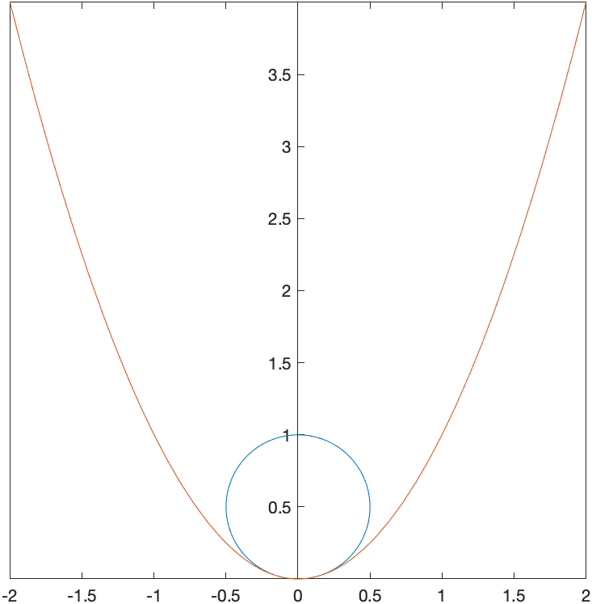
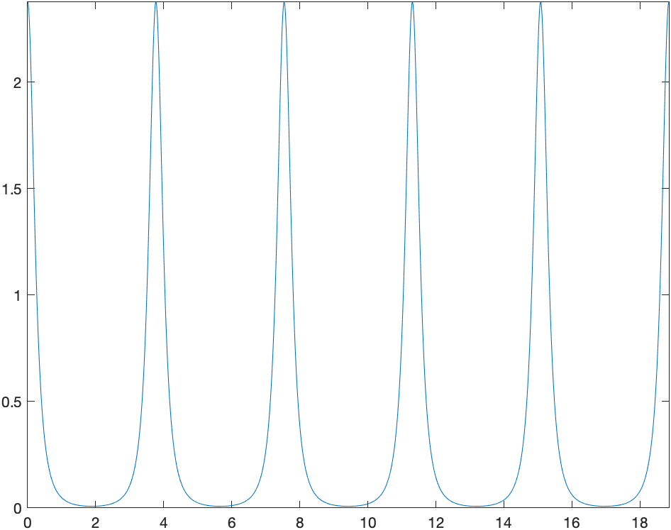

[Previous Chapter](ch-13.html) | [Return to all notes](index.html) | [Next chapter](ch-15.html)


An interesting topic related to derivatives is that of the curvature of a curve at a point, called $\kappa$, the greek letter kappa, which is
$$
\kappa = \frac{|f^{\prime\prime}(a)|}{(1+f'(a)^{2})^{3/2}}
$$

Geometrically, the curvature is
$$ \kappa = \frac{1}{R}$$
where $R$ is the radius of the circle that is tangent to the curve at the point $(a,f(a))$

As an example, let's take $f(x)=x^{2}$ and find the curvature at $x=0$.  Evaluating $\kappa$, we get: $\kappa = 2$.  Thus the radius of the circle that is tangent to this is $R=1/2$ and since $x=0$, then the circle is $x^{2}+(y-1/2)^{2} =(1/2)^{2}$.  A plot of this is



### Example

Find the tangent circle to the curve $y=x^{2}$ at $x=1$.  Plot the curve and the circle.  

```
syms x a
f(x) = x^2
df(x) = diff(f(x),x)
d2f(x) = diff(f(x),x,2)
kappa(a) = abs(d2f(a))/nthroot((1+df(a)^2)^3,2)
simplify(kappa(1))
```


The curvature in this case is $\kappa = 2\sqrt{5}/25$.  To find the circle, it is a bit more challenging since it is not clear where the center of the circle is. The center of the circle will be on the line that is perpendicular to the curve at the point.  Since $f'(a)=2a$, the perpendicular line is
$$ y=-\frac{1}{2}(x-1)+1 $$

To find the center of the circle, we seek the intersection of the this line and the circle $(x-1)^{2}+(y-1)^{2} = (25/(2\sqrt{5})^{2}$, since the distance along the line is $1/\kappa$.  If we let $a=1$, then
```
S = solve([y==-1/df(1)*(x-1)+f(1),(x-1)^2+(y-1)^2==1/(kappa(1)^2)])
S.x
S.y
```

results in the two points $(6,-3/2)$ and $(-4,7/2)$. Because of the way the graph is curving, we seek the point above and left of the point.  Plotting the curve $y=x^{2}$ and the circle with the center $(-4,7/2)$ is


### Exercise

Find the curvature of $y=\cos x$ at $x=0$.  Find the tangent circle and plot both the function and the circle.  

Repeat for $x=\pi/4$.  

<!-- ### A very cool animation of curvature

We can try this for a bunch of values and create an animation:


Note: to create this, a procedure was written to find the equation of the circle for a given function and point.  Then the animate function of the plots package was used.  The exact code isn't presented, because that would overly simplify the homework. -->

## Curvature of Parametric Curves

If we have a parametric curve of the form $(x(t),y(t))$, then the curvature at the value $t$ is
$$\kappa = \frac{|x'(t)y''(t)-x''(t)y'(t)|}{(x'(t)^2+y'(t)^2)^{3/2}}$$

Consider
$$x(t) = 2\cos t + 5 \cos\biggl(\frac{2t}{3}\biggr) \qquad
y(t) = 2\sin t + 5 \sin\biggl(\frac{2t}{3}\biggr)$$
and a plot of this on the interval $[0,2\pi]$ is


We can find the curvature in the following way:
```
syms t
x(t) = 2*cos(t)+5*cos(2*t/3)
y(t) = 2*sin(t)-5*sin(2*t/3)

dx(t) = diff(x(t),t);
dy(t) = diff(y(t),t);
d2x(t) = diff(x(t),t,2);
d2y(t) = diff(y(t),t,2);
kappa(t) = abs(dx(t)*d2y(t)-d2x(t)*dy(t))/sqrt((dx(t)^2+dy(t)^2)^3)
```
and for example the curvature when $t=0$ (which is the point $(7,0)$) is
```
kappa(0)
```
which returns $\dfrac{19}{8}$, so a tangent circle at this point would have a radius of $\dfrac{8}{19}$. 

It looks from the plot that the curve is nearly linear.  We can see how close it is to linear using the curvature.  Looking at a plot of the curvature on $[0,6\pi]$ is given with
```
fplot(kappa(t),[0 6*pi])
```
which is


and looking near $t=2$ (and 4 other places) it looks to be nearly flat.  Let's find the value of $t$ that is minimum there. 

First we need the derivative:
```
dk(t) = diff(kappa(t),t)
```

and this returns:
$$
\begin{array}{l}
\frac{\mathrm{sign}\left(\sigma_1 \right)\,{\left(\sigma_6 \,{\left(\frac{40\,\sigma_7 }{27}+2\,\mathrm{sin}\left(t\right)\right)}-{\left(\frac{40\,\sigma_8 }{27}-2\,\mathrm{cos}\left(t\right)\right)}\,\sigma_5 \right)}} {\sqrt{ {\sigma_2 }^3 } }+\frac{3\,\left|\sigma_1 \right|\,{\left(2\,\sigma_6 \,\sigma_3 -2\,\sigma_4 \,\sigma_5 \right)}\,{\sigma_2 }^2 }{2\,{ {\left({\sigma_2 }^3 \right)} }^{3/2} }\\
\mathrm{}\\
\textrm{where}\\
\mathrm{}\\
\;\;\sigma_1 =-\sigma_6 \,\sigma_4 -\sigma_5 \,\sigma_3 \\
\mathrm{}\\
\;\;\sigma_2 ={\sigma_6 }^2 +{\sigma_5 }^2 \\
\mathrm{}\\
\;\;\sigma_3 =\frac{20\,\sigma_7 }{9}-2\,\mathrm{sin}\left(t\right)\\
\mathrm{}\\
\;\;\sigma_4 =\frac{20\,\sigma_8 }{9}+2\,\mathrm{cos}\left(t\right)\\
\mathrm{}\\
\;\;\sigma_5 =\frac{10\,\sigma_7 }{3}+2\,\mathrm{sin}\left(t\right)\\
\mathrm{}\\
\;\;\sigma_6 =\frac{10\,\sigma_8 }{3}-2\,\mathrm{cos}\left(t\right)\\
\mathrm{}\\
\;\;\sigma_7 =\mathrm{sin}\left(\frac{2\,t}{3}\right)\\
\mathrm{}\\
\;\;\sigma_8 =\mathrm{cos}\left(\frac{2\,t}{3}\right)
\end{array}
$$
which is quite complicated and Matlab probably can't solve it. However, let's get an approximation using Newton's method. 
```
t0 = newton(@(t) dk(t),2)
```
which returns 1.8850 and then evaluating the curvature there with `kappa(t0)` is 0.0078, so nearly linear, but not.  The radius of the tangent would be the reciprocal of this or 128, a fairly large circle relative to the size of this figure.  
