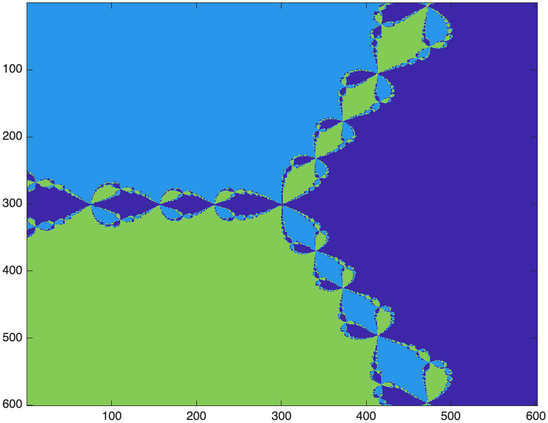

Chapter 15: Complex Numbers
=======

[Return to all notes](index.html)

Recall that the imaginary unit $i$ is defined as the number such that $i^{2}=-1$.  In Maple, this is a built-the constant $I$.   Just for kicks, try it:
```
I^2
```

and you get $-1$.  

The Complex Plane
-----

The complex plane is just like the $xy$-plane in which the horizontal axis is the real axis and the vertical one is the imaginary axis.  
We can plot any point $x\_1+i y\_1$ as the point $(x\_1,y\_1)$ on the standard $xy$-plane.

(add a plot)

The real an imaginary parts of a complex number
-----

If $x$ and $y$ are real numbers and we define $z=x+iy$, then there are functions that return the real and imaginary parts of $z$.  Mathematically, we use $\Re(z)$ and $\Im(z)$ to represent these and they are defined as

$$\Re(z)=x \qquad \Im(z)=y$$

and note that the imaginary part of a complex number is a real number.

In Maple, we use the commands `Re` and `Im`.  If we define
```
z:=3+4I
```

Then `Re(z)` returns 3 and `Im(z)` returns 4.  


The Polar Form of a complex number
----

Another important form of a complex number is called the *polar form*.  If we find $r$, the distance from the origin to the point $(x,y)$ and $\theta$, the counterclockwise angle between the positive $x$ axis and the line segment as shown


The distance $r$ is defined as $r=\sqrt{x^{2}+y^{2}}$ and $\theta = \tan^{-1} (y/x)$ (and it might need to be shifted depending on the quadrant of the point.)  

In addition, the distance $r$ is often denoted as $|z|$, where the standard absolute value symbol is used.  

Maple uses the absolute value symbol for the distance and the `argument` command for the angle.  For example, if
```
z:=3+4*I
```

then `|z|` returns 5 and `argument(z)` returns $\arctan(4/3)$.   The argument of $2+2I$ is $\pi/4$.   


(complex exponential form)


Complex Conjugate
-----

If $z=x+iy$, then the complex conjugate of $z$, denoted $\overline{z}$ is $x-iy$.  In short, it switches the sign of the imaginary term.  

In Maple, the command `conjugate` will return the complex conjugate.
```
conjugate(z)
```

returns $3-4i$.  

You can enter the conjugate by typing the first of `conjugate`, hitting ESC and selecting $\overline{x}$.  

Note that it is common that a complex number is mutiplied by its conjugate, so
$$\begin{array}{rl} z \overline{z} & = (x+iy)(x-iy)  \\
& = x^{2} +ixy-ixy-i^{2}y^{2} = x^{2}+y^{2}\end{array}$$

which is $|z|^2$.

### Complex Exponential form

Using the distance and angle of a complex number, we can write a number $z$ as
$$ z = r e^{i \theta}$$
because
$$e^{i \theta} = \cos \theta + i \sin \theta$$
so,
$$
\begin{array}{rl}
z & = r (\cos \theta + i \sin \theta) \newline
& = r \cos \theta + i r \sin \theta \newline
& = x + i y
\end{array} $$


Arithmetic with complex numbers.
-----

Maple can handle standard arithmetic operations with complex nubmers. Just to recall if
$$z_1=x\_1+i y\_1 \qquad z_2 = x\_2 + i y\_2$$

then
$$\begin{array}{rl}
z\_1 + z\_2 & = (x\_1+x\_2) + i(y\_1+y\_2)\newline
z\_1 - z\_2 & = (x\_1-x\_2) + i(y\_1-y\_2) \newline
z\_1 z\_2 & = (x\_1+iy\_1)(x\_2+iy\_2) \newline
& = (x\_1x\_2+iy\_1x\_2+ix\_1y\_2+i^\{2}y\_1y\_2)\newline
& = (x\_1x\_2-y\_1y\_2)+i(x\_1y\_2+x\_2y\_1)
\end{array}$$

Also, if we have $1/z_1$, then we can write this as
$$\begin{array}{rl}
\dfrac{1}{z\_1} & = \dfrac{1}{x\_1+iy\_1} \end{array}$$
mulitply top and bottom by $\overline{z_1}$
$$\begin{array}{rl}
\dfrac{1}{z_1} = \dfrac{1}{z_1}\dfrac{\overline{z_1}}{\overline{z_1}} & = \dfrac{1}{x\_1+iy\_1} \dfrac{x\_1-iy\_1}{x\_1-iy\_1} \\
&= \dfrac{x\_1-iy\_1}{x\_1^{2}+y\_1^{2}}
\end{array}$$
and in a similar manner:
$$\begin{array}{rl}
\dfrac{z_1}{z_2} & = \dfrac{x\_1+iy\_1}{x\_2+iy\_2} \\
& = \dfrac{x\_1+iy\_1}{x\_2+iy\_2} \dfrac{x\_2-iy\_2}{x\_2-iy\_2} \\
& = \dfrac{x\_1x\_2+y\_1y\_2+i(y\_1x\_2-y\_2x\_1)}{x\_2^{2}+y\_2^{2}}
\end{array}$$


An integer power of a number is found by successive multiplications. For example,
$$
z^{2} = (x+iy)(x+iy)=x^{2}-y^{2}+2xy i
$$

Maple can do all of these operations naturally.  For example, if
```
z1:=3+4i
z2:=2-2i
```

Then `z1+z2` returns $5+2I$, `z1-x2` returns $1+6I$, `z1*z2` returns $14+2I$ and `z1/z2` returns
$$-\frac{1}{4}+\frac{7}{4}I$$

`z1^2` returns $-7+24I$.  

### Multiplication and Powers of Complex Numbers in Polar Form

If we write
$$ z\_1 = r\_1 e^{i \theta\_1} \qquad
z\_2 = r\_2 e^{i \theta\_2}$$

then
$$
\begin{array}{rl}
z\_1 z\_2 & = r\_1 e^{i \theta\_1} r\_2 e^{i \theta\_2} \newline
& = r_1 r_2 e^{i(\theta\_1+\theta\_2)}
\end{array}
$$
or in other words, the product of two complex numbers is found by multiplying the distances and the angle is the sum.  

We can find the product of $z_1 = 1+i$ and $z\_2 = 2i$ using the above method, or write
$$
z\_1 = \sqrt{2} e^{i\pi/4}
\qquad z\_2 = 2 e^{i\pi/2}
$$

and
$$
\begin{array}{rl}
z\_1z\_2 & = r_1 r_2 e^{i(\theta\_1+\theta\_2)} \newline
& = 2\sqrt{2} e^{i 3\pi/4}
\end{array}
$$

A plot of this is:


The two numbers on the right side of the plot are multiplied.  The sum of the angle is $3\pi/4$, which is the angle of the resultant.  The distance of the resultant is the product of the two $\sqrt{2}$ and $2$.  

The powers of a complex number also have an interesting geometry.  If $z=1+i=\sqrt{2}e^{i\pi/4}$, then powers of $z$ can be written as
$$z^{n} = (\sqrt{2})^{n} e^{i n \pi/4}$$

This can be interpreted as raising the distance to the $n$th power and rotating the angle $n$ times around.  For example, the plot about actually shows the number and its 2nd and 3rd power.  

If the power is a fraction, we can interpret the same way.  For example, the square root of $z$ can be written:
$$
\sqrt{z}  = \sqrt{r e^{i\theta}} = \sqrt{r} e^{i\theta/2}
$$

What this means is that to find the square root of a complex number, you take the square root of the distance and then return the number with angle half of the input.

#### Example

Find the square root of $z=-1+\sqrt{3}i$.  Note that $|z|=\sqrt{1^{2}+(-\sqrt{3})^{2}}= \sqrt{4}=2$ and that the angle (argument) is $2\pi/3$.  The resultant would have distance $\sqrt{2}$ and the angle would be $\pi/3$ so
$$
\sqrt{z} = \sqrt{2}e^{i\pi/3}$$

Newton's Method in the Complex Plane
----

In [Chapter 13](ch13.html), we met Newton's method.  It works with complex numbers as well.  For example, consider the function
$$ f(x)=x^{2}+4$$
which does not have a root in the reals.  If we use
```
NewtonsMethod(x^2+4, x = 1)
```

 in Maple with this function, we get: `1.683061201` which is clearly not right. If instead we plot it:
 ```
 NewtonsMethod(x^2+4, x = 1,output=plot)
 ```

 we get the plot:
 

And if you follow the plot starting at $x=1$, it ends up at $x=1.68$ and will never converge.  

If we return to an alternative way of writing Newton's method for this,
$$ x_{n+1} = x_n - \frac{f(x_n)}{f'(x_n)}$$

and in Maple, we can do
```
x(n):=x(n-1)-(x(n-1)^2+4)/(2x(n-1))
x(1):=1.0
```

and then
```
seq(x(n),n=0..5)
```

we get:
```
1.0, -1.500000000, .583333333, -3.136904764, -.930881225, 1.683061201
```

which is the same result as above.  If instead, we start with a complex number,
```
x(0)=1.0I
```

and then
```
seq(x(n),n=0..5)
```

results in
```
1.0I, 2.500000000I, 2.050000000I, 2.000609756I, 2.000000093I, 2.000000000I
```

We can find the other root $-2i$ if we let `x(0):=-1.0I`

and note that $2i$ is the root of the function.   

### A Procedure to do Newton's method

Before continuing on, we will write a procedure to do Newton's method.

```
newton := proc (f::procedure, x0::complex, { eps::numeric := 10^(-4), maxsteps::posint := 100 })
  local x1, x2, n;
  x1 := x0:
  for n to maxsteps do
    x2 := x1-f(x1)/f'(x1):
    if abs(x2-x1) < eps then
      return x2:
    end if:
    x1 := x2:
  end do;
  error "The maximum number of steps %1 reached without convergence", maxsteps :
end proc:
```

If we do
```
newton(x->x^2-2,1.0)
```

we get `1.414213562` and if we do `newton(x->x^2+4,1.0)` we get
```
Error, (in newton) The maximum number of steps 100 reached without convergence
```

However, we can also add a complex number to the initial point.

```
newton(x->x^2+4, 1.0*I)
```
and get `2.0000I`.

### Roots of Unity

An interesting function to study in complex numbers is $f(z)=z^{n}-1$ for positive integers $n$.  When $n=2$, we get the function $x^{2}-1$ which isn't that interesting, but not bad.  Note that the roots of this are $x=\pm 1$.  Let's look at the solution to $f(z)=z^{3}-1$.   

A good way to do this is to recall that we can write $z$ in its polar form or
$$z=re^{i\theta}$$
and then we want to solve
$$ z^{3}-1 = r^{3} e^{3i\theta}-1$$
Since we can write $1=1e^{0 i}$, then
$$
r^{3} e^{3i\theta} = e^{0i}$$
results in $r^{3}=1$ or $r=1$ and $\theta=0$.  This is the number $z_1=1$ and we know that $1^{3}-1=0$.  What else?  

We can also write $1=e^{2\pi i}$ so
$$3i \theta = 2\pi i$$
or $\theta=2\pi/3$, so another root of $f$ is
$$z_2=e^{2\pi/3 i}$$

and lastly, we can also write $1=e^{4\pi i}$ so another root when
$\theta=4\pi/3$ or the number
$$z_3= e^{4 \pi i/3}$$.

If we plot these three points, we get:


These points are on the unit circle and equally spaced with $z=1$ a root.  This is true in general for functions of the form $f(z)=z^{n}-1$, which will have the roots on the unit circle equally spaced $2\pi/n$ radians apart from each other.  

### Return to Newton's method

We're going to apply Newton's method to find roots of $f(z)=z^{3}-1$.

#### Exercise  

Apply Newton's method on this function for the following initial points:

* $z=0.1$
* $z=-i$
* $z=i$
* $z=-1$
* $z=0.5 i + 0.5$

Each of these will go to one of the 3 roots.  To get a nice representation of this, we are going to do this for many points in the complex plane and color code the results.  For example, the first and fourth point can be red, the 2nd and 5th points blue and the 3rd point green.  

We now want to do this for many points in the complex plane.  First, let's defined a matrix to store a number of points:
```
Z := Matrix(9, 9,(i,j)-> (-2+2*I)+.5*(j-1)+(-1)*.5*(i-1)*I)
```

will produce the following matrix:
```
-2.0-2. I,-1.5-2. I,-1.0-2. I,-0.5-2. I,0.-2. I,0.5-2. I,1.0-2. I,1.5-2. I,2.0-2. I
-2.0-1.5 I,-1.5-1.5 I,-1.0-1.5 I,-0.5-1.5 I,0.-1.5 I,0.5-1.5 I,1.0-1.5 I,1.5-1.5 I,2.0-1.5 I
-2.0-1.0 I,-1.5-1.0 I,-1.0-1.0 I,-0.5-1.0 I,0.-1.0 I,0.5-1.0 I,1.0-1.0 I,1.5-1.0 I,2.0-1.0 I
-2.0-0.5 I,-1.5-0.5 I,-1.0-0.5 I,-0.5-0.5 I,0.-0.5 I,0.5-0.5 I,1.0-0.5 I,1.5-0.5 I,2.0-0.5 I
-2.0+0. I,-1.5+0. I,-1.0+0. I,-0.5+0. I,0.+0. I,0.5+0. I,1.0+0. I,1.5+0. I,2.0+0. I
-2.0+0.5 I,-1.5+0.5 I,-1.0+0.5 I,-0.5+0.5 I,0.+0.5 I,0.5+0.5 I,1.0+0.5 I,1.5+0.5 I,2.0+0.5 I
-2.0+1.0 I,-1.5+1.0 I,-1.0+1.0 I,-0.5+1.0 I,0.+1.0 I,0.5+1.0 I,1.0+1.0 I,1.5+1.0 I,2.0+1.0 I
-2.0+1.5 I,-1.5+1.5 I,-1.0+1.5 I,-0.5+1.5 I,0.+1.5 I,0.5+1.5 I,1.0+1.5 I,1.5+1.5 I,2.0+1.5 I
-2.0+2.0 I,-1.5+2.0 I,-1.0+2.0 I,-0.5+2.0 I,0.+2.0 I,0.5+2.0 I,1.0+2.0 I,1.5+2.0 I,2.0+2.0 I
```

which is a grid of points in the Complex plane.  We next want to apply Newton's method to every number in the Matrix.  If we do that, the point in the center will return an error, so we:
```
Z[5,5]:=0.0001+0.0001I
```
which is close to 0, but not exactly.  Then

```
roots:=map(a->newton(z->z^3-1, a), Z)
```

returns a Matrix of the root that every value in `Z` goes to.  To color code each of the points, we will first return the angle of each root:
```
angles:=map(argument,roots)
```

and now returns the angle (between $-\pi$ and $\pi$) of every root.  Lastly, we can now plot this using the `listdensityplot` command in the `plots` package:
```
with(plots):
listdensityplot(angles,range=-Pi..Pi,colorstyle=HUE)
```

which returns in


Let's create a procedure that does this. First, the following will create the matrix of inital values:
```
complexGrid := proc (xRange::range, yRange::range, nx::posint, ny::posint)::Matrix;
  local dx, dy;
  dx := (rhs(xRange)-lhs(xRange))/(nx-1);
  dy := (rhs(yRange)-lhs(yRange))/(ny-1); LinearAlgebra[Transpose](Matrix(nx, ny, (i, j)->  lhs(xRange)+dx*(i-1)+I*rhs(yRange)-I*dy*(j-1)));
end proc:
```

and as before, we have a problem with the middle entry (where the 0 +0I is) and the following will help locate it:

```
closest := proc (A::Matrix, value)
    rtable_scanblock(A, [rtable_dims(A)], (val, ind, res) -> ifelse(abs(val-value) < abs(res[2]-value), [ind, val], res) , [[1, 1], A[1, 1]])
end proc
```

Finally, the following will build up everything needed for the plot:

```
NewtonPlot := proc (xRange::range, yRange::range, nx::posint, ny::posint)
  local Z, zeros, roots, angles;
  Z := complexGrid(xRange, yRange, nx, ny);
  zeros := closest(Z, 0+0*I);
  Z[op(zeros[1])] := 0.1e-4*I+0.1e-4;
  roots := map(a->newton(z->z^3-1, a), Z);
  angles := map(argument, roots);
  plots[listdensityplot](angles, range = -Pi .. Pi, colorstyle = HUE, style = patchnogrid, axes = none, smooth = true):
end proc
```

And if one enters:
```
NewtonPlot(-2.0 .. 2.0, -2.0 .. 2.0, 250, 250)
```

the result is


Mandlebrot Set
-------

This section explore a very interesting visual look at an iteration of complex numbers.   

We consider the iteration

$$z_{n+1}=z_n^{2} + C \qquad z_0 = 0$$
for some complex number $C$.  Let's examine a few examples.

If $C=i$, then using Maple, if we type
```
z:=n->z(n-1)^2+I
z(0):=0
```

and `seq(z(n),n=0..5)` returns $0, I, -1+I, -I, -1+I, -I$  and notice that the last two term will continue under repetition.  

If $C=1+I$, then  the first 6 terms is:
$$0, 1+I, 1+3I, -7+7I, 1-97I, -9407-193I$$
and then the terms get further from the the origin.  

We say that the sequence when $C=I$ is bounded and when $C=1+I$, the sequence is unbounded.   The set $M=\{C \; | \; \lim_{n \rightarrow \infty} z_n\;\; \mbox{is bounded}\}$ is called the *Mandelbrot Set* and is the set of all values of $C$ such that the iteration of the iteration is bounded.  For example $I$ is in $M$, but $1+I$ is not.  

There is a theorem (that we won't prove) that states:  If $|z_n|>2$, then $|z\_{n+1}| \rightarrow \infty$ if $z\_{n+1} = z\_n^{2}+C$ for any value of $C$.

Basically, this means that if there is a complex number $z_n$ such that $|z_n|>2$, then the sequence will diverge and it is not in the mandelbrot set.  

It's helpful to have a procedure that determines the number of steps such that $|z_n|>2$.

```
mandelSteps := proc (C::complex,{maxsteps::posint:=50})::posint;
  local z:=0.0+0.0*I, i:=0;
  while |z| < 2 do
    i := i+1;
    z := z^2+C;
    if 25 < i then break end if
  end do;
  return i
end proc:
```

This function is the main way of understanding the mandelbrot set.  Let's test it:
```
mandelSteps(0+0*I)
```

return 26, which basically means the origin is in the mandelbrot set, however,
```
mandelSetps(1+I)
```
returns 3, which means it took 3 steps to leave $|z|>2$.  


Visualizing the Mandelbrot Set
----

The Mandelbrot Set is the set of all points $C$ such that the iteration
$$ z_{n+1} = z_n^{2}+C$$
is bounded.  

A nice way to visualize this is for a grid of points $C$, determine the number of steps to leave the set.  Then we will do a density plot like above.  

```
C:=complexGrid(-2.0..1.0,-1.5..1.5,300,300):
```

Then we perform the function `mandelSteps` on everyone point of the matrix:

```
numsteps := map(mandelSteps, C)
```

Then plot it like we did above:
```
listdensityplot(LinearAlgebra[Transpose](numsteps), range = 1 .. 50, colorstyle = HUE, axes = none, smooth = true, style = patchnogrid)
```

The result is


A 3D version of this is developed using the `matrixplot` command:
```
matrixplot(numsteps)
```

and the result is


### Putting it all together.

As above, we create a procedure to do the plot in one shot.  

```
mandelPlot := proc (xRange::range, yRange::range, nx::posint, ny::posint)
  local C := complexGrid(xRange, yRange, nx, ny);
  local numsteps := map(c->mandelSteps(c, 100), C);
  listdensityplot(ArrayTools[FlipDimension](LinearAlgebra[Transpose](numsteps), 2), range = 1 .. 100, colorstyle = HUE, axes = none, smooth = true, style = patchnogrid, scaling = constrained);
end proc
```


One can change the gradient colors by adding the option
```
colorscheme = ["Orange", "DarkRed", "DarkGreen", "Blue", "Black"]
```

to the `listdensityplot` command.

### Exercise

Try zooming in on the Mandelbrot set by changing the plotting range.  There are interesting things around the edge of the set.  
