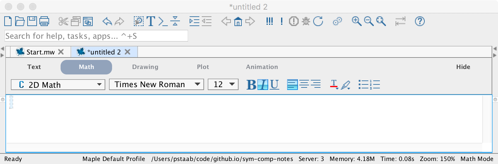
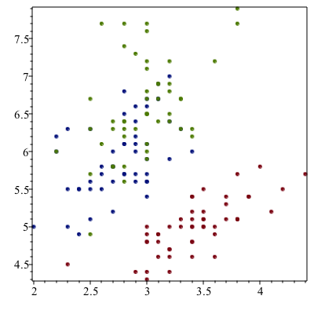
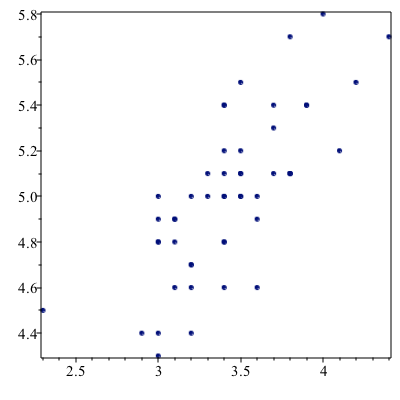
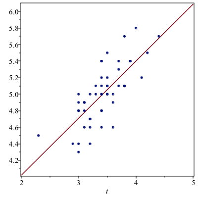

[Previous Chapter](ch-15.html) | [Return to all notes](index.html) | [Next chapter](ch-17.html)

Recall that the imaginary unit $i$ is defined as the number such that $i^{2}=-1$.  In Matlab, we create imaginary number with 
```
im = complex(0,1)
```
which returns `0.0000+1.000i`.  The `complex` function creates a complex number where the first argument is the real part and the second argument is the imagainary part.  If we square this with 

```
im^2
```

and you get $-1$.  

The Complex Plane
-----

The complex plane is just like the $xy$-plane in which the horizontal axis is the real axis and the vertical one is the imaginary axis.  
We can plot any point $x_1+i y_1$ as the point $(x_1,y_1)$ on the standard $xy$-plane.

(add a plot)

The real an imaginary parts of a complex number
-----

If $x$ and $y$ are real numbers and we define $z=x+iy$, then there are functions that return the real and imaginary parts of $z$.  Mathematically, we use $\Re(z)$ and $\Im(z)$ to represent these and they are defined as

$$\Re(z)=x \qquad \Im(z)=y$$

and note that the imaginary part of a complex number is a real number.

In Matlab, we use the commands `real` and `imag` return the real and imaginary parts of a complex number.  
```
z = complex(3,4)
```
then `real(z)` returns 3 and `imag(z)` returns 4. 

The Polar Form of a complex number
----

Another important form of a complex number is called the *polar form*.  If we find $r$, the distance from the origin to the point $(x,y)$ and $\theta$, the counterclockwise angle between the positive $x$ axis and the line segment as shown



The distance $r$ is defined as $r=\sqrt{x^{2}+y^{2}}$ and $\theta = \tan^{-1} (y/x)$ (and it might need to be shifted depending on the quadrant of the point.)  

In addition, the distance $r$ is often denoted as $|z|$, where the standard absolute value symbol is used.  

Matlab uses the absolute value function `abs` for the distance and the `angle` command for the angle.  For example, `abs(z)` returns 5 and `angle(z)` returns 0.9273, the angle (in radians). 

Complex Conjugate
-----

If $z=x+iy$, then the complex conjugate of $z$, denoted $\overline{z}$ is $x-iy$.  In short, it switches the sign of the imaginary term.  

In Matlab, the command `conj` will return the complex conjugate.
```
conj(z)
```

returns `3.0000 - 4.0000i` 


Note that it is common that a complex number is mutiplied by its conjugate, so
$$\begin{array}{rl} z \overline{z} & = (x+iy)(x-iy)  \\
& = x^{2} +ixy-ixy-i^{2}y^{2} = x^{2}+y^{2}\end{array}$$

which is $|z|^2$, the square of the distance.  

### Complex Exponential form

Using the distance and angle of a complex number, we can write a number $z$ as
$$ z = r e^{i \theta}$$
because
$$e^{i \theta} = \cos \theta + i \sin \theta$$
so,
$$
\begin{array}{rl}
z & = r (\cos \theta + i \sin \theta) \newline
& = r \cos \theta + i r \sin \theta \newline
& = x + i y
\end{array} $$


Arithmetic with complex numbers.
-----

Matlab can handle standard arithmetic operations with complex nubmers. Just to recall if
$$z_1=x_1+i y_1 \qquad z_2 = x_2 + i y_2$$

then
$$\begin{array}{rl}
z_1 + z_2 & = (x_1+x_2) + i(y_1+y_2)\newline
z_1 - z_2 & = (x_1-x_2) + i(y_1-y_2) \newline
z_1 z_2 & = (x_1+iy_1)(x_2+iy_2) \newline
& = (x_1x_2+iy_1x_2+ix_1y_2+i^{2}y_1y_2)\newline
& = (x_1x_2-y_1y_2)+i(x_1y_2+x_2y_1)
\end{array}$$

Also, if we have $1/z_1$, then we can write this as
$$\begin{array}{rl}
\dfrac{1}{z_1} & = \dfrac{1}{x_1+iy_1} \end{array}$$
mulitply top and bottom by $\overline{z_1}$
$$\begin{array}{rl}
\dfrac{1}{z_1} = \dfrac{1}{z_1}\dfrac{\overline{z_1}}{\overline{z_1}} & = \dfrac{1}{x_1+iy_1} \dfrac{x_1-iy_1}{x_1-iy_1} \\
&= \dfrac{x_1-iy_1}{x_1^{2}+y_1^{2}}
\end{array}$$
and in a similar manner:
$$\begin{array}{rl}
\dfrac{z_1}{z_2} & = \dfrac{x_1+iy_1}{x_2+iy_2} \\
& = \dfrac{x_1+iy_1}{x_2+iy_2} \dfrac{x_2-iy_2}{x_2-iy_2} \\
& = \dfrac{x_1x_2+y_1y_2+i(y_1x_2-y_2x_1)}{x_2^{2}+y_2^{2}}
\end{array}$$


An integer power of a number is found by successive multiplications. For example,
$$
z^{2} = (x+iy)(x+iy)=x^{2}-y^{2}+2xy i
$$

Matlab can do all of these operations naturally.  For example, if
```
z1=complex(3,4)
z2=complex(2,-2)
```

Then `z1+z2` returns `ans = 5.0000 + 2.0000i`, `z1-x2` returns `ans = 1.0000 + 6.0000i`, `z1*z2` returns `ans = 14.0000 + 2.0000i` and `z1/z2` returns
`ans = -0.2500 + 1.7500i`

`z1^2` returns `ans = -7.0000 + 24.0000i`

### Multiplication and Powers of Complex Numbers in Polar Form

If we write
$$ z_1 = r_1 e^{i \theta_1} \qquad
z_2 = r_2 e^{i \theta_2}$$

then
$$
\begin{array}{rl}
z_1 z_2 & = r_1 e^{i \theta_1} r_2 e^{i \theta_2} \newline
& = r_1 r_2 e^{i(\theta_1+\theta_2)}
\end{array}
$$
or in other words, the product of two complex numbers is found by multiplying the distances and the angle is the sum.  

We can find the product of $z_1 = 1+i$ and $z_2 = 2i$ using the above method, or write
$$
z_1 = \sqrt{2} e^{i\pi/4}
\qquad z_2 = 2 e^{i\pi/2}
$$

and
$$
\begin{array}{rl}
z_1z_2 & = r_1 r_2 e^{i(\theta_1+\theta_2)} \newline
& = 2\sqrt{2} e^{i 3\pi/4}
\end{array}
$$


The two numbers on the right side of the plot are multiplied.  The sum of the angle is $3\pi/4$, which is the angle of the resultant.  The distance of the resultant is the product of the two $\sqrt{2}$ and $2$.  

The powers of a complex number also have an interesting geometry.  If $z=1+i=\sqrt{2}e^{i\pi/4}$, then powers of $z$ can be written as
$$z^{n} = (\sqrt{2})^{n} e^{i n \pi/4}$$

This can be interpreted as raising the distance to the $n$th power and rotating the angle $n$ times around.  For example, the plot about actually shows the number and its 2nd and 3rd power.  

If the power is a fraction, we can interpret the same way.  For example, the square root of $z$ can be written:
$$
\sqrt{z}  = \sqrt{r e^{i\theta}} = \sqrt{r} e^{i\theta/2}
$$

What this means is that to find the square root of a complex number, you take the square root of the distance and then return the number with angle half of the input.

#### Example

Find the square root of $z=-1+\sqrt{3}i$.  Note that $|z|=\sqrt{1^{2}+(-\sqrt{3})^{2}}= \sqrt{4}=2$ and that the angle (argument) is $2\pi/3$.  The resultant would have distance $\sqrt{2}$ and the angle would be $\pi/3$ so
$$
\sqrt{z} = \sqrt{2}e^{i\pi/3}$$

Newton's Method in the Complex Plane
----

In [Chapter 13](ch13.html), we met Newton's method.  It works with complex numbers as well.  For example, consider the function
$$ f(x)=x^{2}+4$$
which does not have a root in the reals.  If we use
```
newton(x^2+4, 1)
```
we get the warning: The maximum number of steps have been reached and a result `-4.8018`.  

<!-- 
And if you follow the plot starting at $x=1$, it ends up at $x=1.68$ and will never converge.  

If we return to an alternative way of writing Newton's method for this,
$$ x_{n+1} = x_n - \frac{f(x_n)}{f'(x_n)}$$

and in Matlab, we can do
```
x(n):=x(n-1)-(x(n-1)^2+4)/(2x(n-1))
x(1):=1.0
```

and then
```
seq(x(n),n=0..5)
```

we get:
```
1.0, -1.500000000, .583333333, -3.136904764, -.930881225, 1.683061201
```

which is the same result as above.  If instead, we start with a complex number,
```
x(0)=1.0I
```

and then
```
seq(x(n),n=0..5)
```

results in
```
1.0I, 2.500000000I, 2.050000000I, 2.000609756I, 2.000000093I, 2.000000000I
```

We can find the other root $-2i$ if we let `x(0):=-1.0I`

and note that $2i$ is the root of the function.   -->

### Newton's method with Complex numbers

I have updated the Newton's method function as the following: 

```
function result = newton(f,x0,options)
  arguments
    f function_handle
    x0 (1,1) {mustBeNumeric}
    options.eps (1,1) {mustBePositive} = 1e-6 
    options.max_steps (1,1) {mustBePositive} = 10
  end
  syms x
  df(x) = diff(f(x),x);
  x1=x0;
  steps=0;
  
  dx=double(1); % this will be a step, just initialized to 1 to get the while loop started
  while abs(dx)>options.eps && steps < options.max_steps
    dx=double(f(x1)/df(x1));
    x1 = x1-dx;
    steps = steps + 1;
    if steps == options.max_steps
        warning("The maximum number of steps have been reached.");
    end
  end
  result = x1;
end
```
and again, it is preferable to save this as a `.m` file and if it is in a separate directory don't forget the `addpath` function. 

This updated version of newton's method allows us to use complex numbers so if we put in a complex number as an input then we will get a complex result. 

```
newton(@(x) x.^2+4,complex(0,1))
```
we now get `0.0000 + 2.0000i` as the result and this makes since because $(2i)^2+4 = -4+4=0$. 

### Roots of Unity

An interesting function to study in complex numbers is $f(z)=z^{n}-1$ for positive integers $n$.  When $n=2$, we get the function $x^{2}-1$ which isn't that interesting, but not bad.  Note that the roots of this are $x=\pm 1$.  Let's look at the solution to $f(z)=z^{3}-1$.   

A good way to do this is to recall that we can write $z$ in its polar form or
$$z=re^{i\theta}$$
and then we want to solve
$$ z^{3}-1 = r^{3} e^{3i\theta}-1$$
Since we can write $1=1e^{0 i}$, then
$$
r^{3} e^{3i\theta} = e^{0i}$$
results in $r^{3}=1$ or $r=1$ and $\theta=0$.  This is the number $z_1=1$ and we know that $1^{3}-1=0$.  What else?  

We can also write $1=e^{2\pi i}$ so
$$3i \theta = 2\pi i$$
or $\theta=2\pi/3$, so another root of $f$ is
$$z_2=e^{2\pi/3 i}$$

and lastly, we can also write $1=e^{4\pi i}$ so another root when
$\theta=4\pi/3$ or the number
$$z_3= e^{4 \pi i/3}$$.


These points are on the unit circle and equally spaced with $z=1$ a root.  This is true in general for functions of the form $f(z)=z^{n}-1$, which will have the roots on the unit circle equally spaced $2\pi/n$ radians apart from each other.  

### Return to Newton's method

We're going to apply Newton's method to find roots of $f(z)=z^{3}-1$.

#### Exercise  

Apply Newton's method on this function for the following initial points:

* $z=0.1$
* $z=-i$
* $z=i$
* $z=-1$
* $z=0.5 i + 0.5$

Each of these will go to one of the 3 roots.  To get a nice representation of this, we are going to do this for many points in the complex plane and color code the results.  For example, the first and fourth point can be red, the 2nd and 5th points blue and the 3rd point green.  

We now want to do this for many points in the complex plane.  There are some nice built-in functions in Matlab to allow us to do this easily. The following: 
```
[Y,X]=ndgrid(3:-0.5:-3,-3:0.5:3)
```
creates a grid of $x$ and $y$ values.  Note to get the grid setup in a way that is consistent with our understanding of the complex plane, the first argument go from 3 to -3 with steps of -0.5.  We can then create a grid of complex values with 
```
complex(X,Y)
```
which an 13 by 13 array with complex numbers arranged on a grid.  


  We next want to apply Newton's method to every number in the Matrix.  If we do that, the point in the center will return an error, so we:
```
Z(5,5) = complex(0.0001,0.0001)
```
which is close to 0, but not exactly.  Then run newton's method on all of the points in Z using
```
roots=arrayfun(@(z) newton(@(x) x.^3+1,z),Z)
```
and you'll notice that there are warning because we didn't get close, but changing this to
```
roots=arrayfun(@(z) newton(@(x) x.^3+1,z,'max_steps',30),Z)
```
minimizes the error, but slows down the calculation.  This took a couple of minutes on my machine.  

The array `roots` results in the root that newton's method has converged to for each starting point.  For example, the first row, first column $-3+3i$  converges to $-1$.  

A relatively simple way to determine the root each goes to is to find the angle using
```
arrayfun(@(r) angle(r),roots)
```
and notice that this is in radians.  We can switch to degrees with 
```
arrayfun(@(r) angle(r),roots)*180/pi
```
however there are repeated values like -180 and 180 and and others that are the same angle.  We can shift everything to 0 to 360 with 
```
mod(arrayfun(@(r) angle(r),roots)*180/pi,360)
```
Finally, we will plot each angle with a different color using:
```
image(angles,'CDataMapping','scaled')
```
which generates the plot:


All of the aquamarine squares go to the root at $-1$.  The dark blue go to the root at $\sqrt{3}/2 + i/2$ and the yellow go to $\sqrt{3}/2 + i/2$.


### Producing the same plot with a denser grid

```
[X,Y]=ndgrid(-3:0.01:3,-3:0.01:3);
Z=complex(X,Y);
Z((size(Z,1)-1)/2,(size(Z,2)-1)/2)=complex(0.0001,0.0001);  % make the center point just off of zero.
%roots=arrayfun(@(z) newton(@(x) x.^3+1,z,"max_steps",50),Z)
for i=1:10  % run newton's method 10 times.  
    Z = Z-(Z.^3+1)./(3*Z.^2);
end
Z
```
and we find the angle of each point with
```
angles = mod(arrayfun(@(r) angle(r),Z)*180/pi,360)
```

and finally plot the angles with

```
image(angles,'CDataMapping','scaled')
colorbar
```

The result is


and the following will improve the appearance of the plot:

```
xticks(0:100:600)
xticklabels(-3:3)
yticks(0:100:600)
yticklabels(3:-1:-3)
axis equal
```


the result is




An astute eye will pick up that near the cusps throughout the plot that things look blurry.  This is because Newton's method hasn't converged yet for these points.  If you rerun this with 50 iterations of newton's method (change the 10 in the for loop above to 50, you'll get)



This is an example of a fractal, which is a geometric figure that is self-similar at multiple scales.  This means that if you look at the image at various levels, it looks very similar.  Related, a fractal generally has infinite detail.  Typically, as you zoom in, you will continue to see more an more detail.

Although Matlab allows you to zoom in on this plot, we only generated 601 by 601 points and you'll notice that as you zoom you don't get more detail, however we can use the following function to do this:


Mandlebrot Set
-------

_Convert this to Matlab_

This section explore a very interesting visual look at an iteration of complex numbers.   

We consider the iteration

$$z_{n+1}=z_n^{2} + C \qquad z_0 = 0$$
for some complex number $C$.  Let's examine a few examples.

If $C=i$, then using Matlab, if we type
```
z:=n->z(n-1)^2+I
z(0):=0
```

and `seq(z(n),n=0..5)` returns $0, I, -1+I, -I, -1+I, -I$  and notice that the last two term will continue under repetition.  

If $C=1+I$, then  the first 6 terms is:
$$0, 1+I, 1+3I, -7+7I, 1-97I, -9407-193I$$
and then the terms get further from the the origin.  

We say that the sequence when $C=I$ is bounded and when $C=1+I$, the sequence is unbounded.   The set $M=\{C \; | \; \lim_{n \rightarrow \infty} z_n\;\; \text{is bounded}\}$ is called the *Mandelbrot Set* and is the set of all values of $C$ such that the iteration of the iteration is bounded.  For example $I$ is in $M$, but $1+I$ is not.  

There is a theorem (that we won't prove) that states:  If $|z_n|>2$, then $|z_{n+1}| \rightarrow \infty$ if $z_{n+1} = z_n^{2}+C$ for any value of $C$.

Basically, this means that if there is a complex number $z_n$ such that $|z_n|>2$, then the sequence will diverge and it is not in the mandelbrot set.  

It's helpful to have a procedure that determines the number of steps such that $|z_n|>2$.

```
mandelSteps := proc (c::complex, { maxsteps::posint := 50 })::posint;
  local i,z := 0.+0.*I;
  for i to maxsteps do
    z := z^2+c;
    if 2 < abs(z) then break end if
  end do;
  return i;
end proc:
```

This function is the main way of understanding the mandelbrot set.  Let's test it:
```
mandelSteps(0+0*I)
```

return 51, which basically means the origin is in the mandelbrot set, however,
```
mandelSetps(1+I)
```
returns 3, which means it took 3 steps to leave $|z|>2$ and it is not in the Mandelbrot set. 


Visualizing the Mandelbrot Set
----

The Mandelbrot Set is the set of all points $C$ such that the iteration
$$ z_{n+1} = z_n^{2}+C$$
is bounded.  

A nice way to visualize this is for a grid of points $C$, determine the number of steps to leave the set.  Then we will do a density plot like above.  

```
C:=complexGrid(-2.0..1.0,-1.5..1.5,300,300):
```

Then we perform the function `mandelSteps` on everyone point of the matrix:

```
numsteps := map(mandelSteps, C)
```

Then plot it like we did above:
```
listdensityplot(LinearAlgebra[Transpose](numsteps), range = 1 .. 50, colorstyle = HUE, axes = none, smooth = true, style = patchnogrid)
```

The result is


A 3D version of this is developed using the `matrixplot` command:
```
matrixplot(numsteps)
```

and the result is


### Putting it all together.

As above, we create a procedure to do the plot in one shot.  

```
mandelPlot := proc (xRange::range, yRange::range, nx::posint, ny::posint)
  local C := complexGrid(xRange, yRange, nx, ny);
  local numsteps := map(c->mandelSteps(c, 100), C);
  listdensityplot(ArrayTools[FlipDimension](LinearAlgebra[Transpose](numsteps), 2), range = 1 .. 100, colorstyle = HUE, axes = none, smooth = true, style = patchnogrid, scaling = constrained);
end proc
```


One can change the gradient colors by adding the option
```
colorscheme = ["Orange", "DarkRed", "DarkGreen", "Blue", "Black"]
```

to the `listdensityplot` command.

### Exercise

Try zooming in on the Mandelbrot set by changing the plotting range.  There are interesting things around the edge of the set.  
